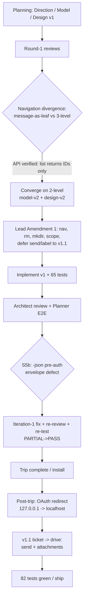

# Branch Story: work-20260620-200140

## 1. Overview

This branch creates **gmail-ftp** from nothing — an FTP-style interactive CLI shell over Gmail, the email sibling of `gdrive-ftp`. It was built by a three-agent **trip** (Planner / Architect / Constructor) that designed, implemented, reviewed, and QA'd a v1, then a follow-up `/ticket → /drive` iteration shipped **v1.1: email sending with attachments**. The result is a production-ready Go CLI with the same command vocabulary and project shape as `gdrive-ftp`, an agent skill so Claude Code can drive it, and a Gmail→filesystem mapping that stays honest where email lacks true hierarchy.

## 2. Highlights & Motivation

**Motivation:** `gdrive-ftp` proved an FTP-style shell over a Google API is useful for both humans and AI agents. This branch brings the same ergonomics to Gmail so an agent can read mail/attachments and send mail with files from the command line — directly enabling more efficient development of `../data-platform/packages/watchtower`.

**Highlights:**
- **Canonical 2-level navigation** (`root → label → message`, attachments as leaves), chosen over a 3-level hierarchy after verifying Gmail's `list` endpoints return IDs only (a third tier = a second N+1 round-trip for no quota gain).
- **Reversible-by-default safety:** `put`=draft, `rm`=single-message trash, least-privilege OAuth (`gmail.modify` + `gmail.compose`, never full-mail/hard-delete).
- **v1.1 send + attachments:** real `send` verb (`drafts.send`, no new scope), `compose --to/--subject`, and `put <file> <draft>` to attach — with a pure multipart-MIME builder. Sending is the only irreversible action and only via the explicit `send` verb.
- **Quality:** build/`vet`/`gofmt` clean; **82 unit tests**; trip E2E smoke 10/10.
- **Agent-ready:** the `gmail-ftp` skill documents one-shot read/attachment/compose/send usage.

## 3. Changes (Journey)

The trip ran the full Implosive Structure workflow: concurrent artifacts → one-turn reviews → respond/revise → lead moderation → coding → review & testing → iteration. Then real-world auth debugging surfaced a Google consent hang fixed by switching the loopback redirect to `http://localhost`, and a `/ticket → /drive` cycle added send-with-attachments.

## 4. Outcome

gmail-ftp ships with: `auth`; 2-level navigation; `ls/cd/pwd/find/search`; `get` (message `.eml`/`.txt`, attachment bytes); `rm` (reversible single-message trash; thread-trash only via explicit `id:thread:`); `mkdir` (create label); `put` (create draft from raw `.eml`, or attach a file to an existing draft); **`compose`** (draft with To/Subject/body); **`send`** (irreversible, audited); local `lcd/lls/lpwd`; audit logging; `-json` output; zsh completion. `label`/`unlabel` remain deferred. Build/`vet`/`gofmt` clean, **82 tests** passing, E2E smoke 10/10.

## 5. Historical Analysis

The defining decision was navigation depth. Constructor's design-v1 proposed `label → thread → message`; Architect's model-v1 argued `label → message` with thread opt-in. Constructor then **verified the Gmail API** (`threads.list`/`messages.list` return IDs only) and conceded his own design — every listing is an unavoidable N+1, so a third tier doubles the cost for no gain. The team converged on 2-level (`Ref.Kind ∈ {label, message}`), captured in Lead **Amendment 1**, which also locked `rm`/`mkdir` semantics, least-privilege scope, and deferred the irreversible `send`. **Amendment 2** kept `send`/`label`/`unlabel` as discoverable inert stubs. The v1.1 ticket then promoted `send` out of the deferred set and added attachment composition — reusing the `gmail.compose` scope already granted for exactly this.

## 6. Concerns (Carry-overs)

- **N+1 metadata fetch** is serial — no batched fetch / intra-command cache yet. Latency consideration on large labels; not a correctness issue. *(backlog)*
- **One-shot/pre-auth `-json` errors** are encoded raw while the REPL applies `friendlyErr`, so message *strings* (not the envelope shape) can differ by mode. *(backlog)*
- **Empty audit log** prints nothing in piped text mode (JSON mode correct). *(cosmetic backlog)*
- **`help` is auth-gated** (eager auth mirrors gdrive-ftp parity); new users can't see the command surface credential-free. *(documented-as-intended)*
- **`label`/`unlabel`** remain deferred stubs (not in this ticket's scope).

## 7. Successful Development Patterns

- **Adversarial review caught the real fault line:** round-1 reviews exposed that Model and Design told different navigation stories; one structural adjudication (grounded in verified API behavior) resolved both.
- **Evidence over preference:** Constructor abandoned his own 3-level design after verifying the API cost — fidelity to backend constraints won.
- **Single-source fixes:** the S5b defect was fixed via one reusable `exitErr` helper routed through every entry point, not per-path band-aids.
- **Lead-serialized commits** in a shared working tree kept agent-attributed history coherent across 23 commits.

## 8. Release Readiness

**Verdict: ready_with_caveats.** Across planning/design/implementation/operation the branch is shippable: a consensus-fixed plan, provably-honored safety bar (least-privilege scope test-enforced; `put`/`compose` never send; `rm` single-message trash; `send` the only irreversible path, audited), clean build and **82 green tests**, both trip QA gates approving. 

**Caveats / pre-release:**
- No **live OAuth** flow was exercised in-repo — run one manual `gmail-ftp auth` smoke on a real account to confirm the `http://localhost` redirect, a token cache, and a single `ls`/`get` round-trip.
- Spot-verify once live: `rm` lands a throwaway message in Trash (recoverable), `compose`+`put`-attach builds a draft, `send` delivers it, and the granted scope is exactly `gmail.modify`+`gmail.compose` (no `mail.google.com`).

**Post-release:** file remaining v1.1 backlog (batched metadata + cache; `-json` error string normalization; empty-audit cosmetic; `label`/`unlabel`); watch first real sessions for refresh-token rotation and N+1 quota pressure.

## 9. Notes

Built on `main` (initial empty commit). Go toolchain at `~/sdk/go/bin`. Binary installs to `~/.local/bin/gmail-ftp`; credentials/token under `~/.config/gmail-ftp/`. Sibling of `gdrive-ftp`; the two share the FTP-style experience and project shape.
