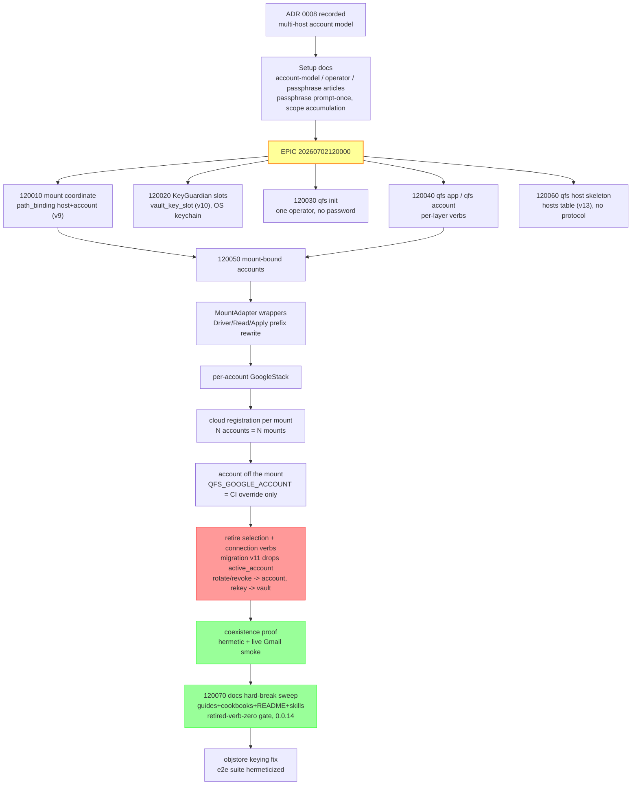

## 1. Overview

This 27-commit branch designed and fully implemented **ADR 0008 — the multi-host account model**, replacing qfs's process-global credential selection with **mount-bound accounts**: a cloud path exists only after `qfs connect <path> --driver <kind> --account <label>`, the mount itself carries the (host, driver, account) coordinate, and N accounts of one service coexist as N paths in one process. The grab-bag `qfs connection` verb namespace was retired outright in favor of per-layer verbs — `qfs init` (operator + vault), `qfs host` (skeleton), `qfs app` (OAuth app registrations), `qfs account` (service tokens + consent, now including rotate/revoke), `qfs connect` (mounts), and `qfs vault` (KeyGuardian slots, now including rekey). Every guide, all 10 cookbooks, the README, and both agent skills were swept onto the new verbs in the same change, and the version bumped 0.0.13 → 0.0.14.

**Highlights:**

1. ADR 0008 recorded and implemented end to end: 7 sub-tickets (mount coordinate, KeyGuardian slots, `qfs init`, app/account verbs, host skeleton, mount-bound accounts, docs sweep), each landed independently green under the epic quality gate
2. Mount-bound accounts (the core behavioral change, 6 green commits): a MountAdapter re-homes any driver under a connect-created path segment, all three runtime registries (plan/read/apply) key per mount, and the account resolves from the mount — selection state (`active_account`, `connection use`) is deleted (migration v11)
3. Two-account coexistence proven: a hermetic test registers `/mail` (work) and `/mail2` (home) gmail mounts in one registry, and a live smoke on this host ran init → app add → account add (stdin token import) → connect ×2 → real inbox reads through both mounts
4. KeyGuardian vault slots (LUKS-style): the store DEK wrapped once per guardian — passphrase slot enrolled by `qfs init`, OS-keychain slot via `qfs vault enroll keychain` (the "new tmux pane asks again" fix), `qfs vault rekey` re-wraps
5. Docs hard-break sweep with a retired-verb-zero gate: 100+ retired-verb references across guides/cookbooks/README/skills/threat-model rewritten to the new flow; the rewritten getting-started happy path executed verbatim reached a real `/mail/inbox` read (docs-are-true)
6. Found and fixed an objstore credential-keying inconsistency (secrets sealed under `objstore/<label>` but resolved under `s3`/`r2` — the CLI-sealed key could never resolve) and made the e2e CLI suite hermetic (fresh `XDG_CONFIG_HOME` per run)

## 2. Motivation

qfs replaced gmail-ftp/gdrive-ftp's per-tool credential files with a central store, but inherited a **selection** model: one active account per driver, switched by `qfs connection use`. That cannot express the owner's actual layout — work and personal Gmail simultaneously — and the `connection` namespace mixed four unrelated concerns (OAuth apps, service tokens, path mounts, vault key management) into one verb. ADR 0008 redesigned the account model around the mount: the path IS the account binding, so two mailboxes are just two paths, and each layer got its own verb. Being pre-release, the break is hard: retired verbs are parse errors, the selection table is dropped, and no migration shims exist.

## 3. Changes

The branch unfolds in three arcs:

**Design & foundations (commits 5f2991f–fa8c6f2):** ADR 0008 recorded with the owner; canonical setup articles (account model, operator identity, passphrase) written; passphrase UX fixed (prompt once per process, TTY prompts); then five foundation sub-tickets: the mount coordinate columns (migration v9), KeyGuardian vault slots (v10, pure-Rust zbus keychain), `qfs init` with the one-operator invariant (retiring `identity signup`), the `qfs app`/`qfs account` verbs, and the `qfs host` skeleton (v13, protocol deferred).

**Mount-bound accounts (commits be77d62–68b1903):** The core behavioral change as six independently-green commits. Three thin MountAdapter wrappers (for `Driver`, `ReadDriver`, `ApplyDriver`) rewrite the mount prefix and `CALL` qualifiers both directions, so a driver built for `/mail` answers for `/mail2` with its own account-bound client. Cloud registration now iterates the `path_binding` rows; the Google stack builds per mount; `resolve_account_email` and the whole selection layer died (migration v11 drops `active_account`; `connection` verbs are hard parse errors; rotate/revoke moved under `qfs account`, rekey under `qfs vault`). The finale is the coexistence proof — hermetic two-account registration plus a live smoke on this host through both `/mail` and `/mail2`.

**Docs hard break + hardening (commits 7ad5092–4b7802c):** Three parallel doc agents swept every guide, all 10 cookbooks, the README, the embedded and plugin agent skills, the threat model, and the roadmap onto init/app/account/connect/vault; ADR 0008 marked Implemented; version bumped to 0.0.14. The sweep's verification pass surfaced two real bugs fixed on the spot: objstore secrets were sealed under the `objstore` provider but resolved under `s3`/`r2` (now unified on `objstore`), and runtime hints printed a positional `qfs connect` form clap rejects (now the real flag form). The e2e CLI suite was made hermetic after it was caught depending on the host operator's real `~/.config/qfs`.

## 4. Outcome

- **10 tickets archived** (1 epic, 7 sub-tickets, 2 consumed resume checkpoints); the ADR 0008 epic is closed with its quality gate held at every boundary
- **Workspace green**: 1900+ tests across 141 suites, exit 0; clippy `-D warnings`, fmt, `gen-docs --check`, `gen-skills --check`, cookbook parse ratchet all clean
- **Live verification on this host**: the full first-run flow (init → app add google → account add via stdin token → connect → real inbox read) passed end to end, twice (once for the smoke, once verbatim from the rewritten getting-started page)
- **Retired-verb-zero**: repo-wide grep finds no `connection add/use/list/remove`/`identity signup` reference outside ticket archives and the ADR historical record
- **Version 0.0.14** ready to tag; the deliverable is the GitHub Release

## 5. Historical Analysis

This branch completes an arc that started three branches ago: v0.0.10 wired the binary so docs ran true; v0.0.12 closed FTP-parity gaps and shipped Agent Skills; this branch replaces the last inherited-from-gmail-ftp design — the single-active-account model — with the mount-bound model the cross-service product actually needs. The `connection` namespace it retires was itself introduced only two branches ago (t27/t43); killing it this fast is the experimental-stage policy working as intended: no deprecation period, no compatibility shims, the vocabulary converges on ADR 0008's per-layer verbs before any external user depends on the old one.

## 6. Concerns

Deferred concerns from the branch, judged at report time:

1. **RESOLVED — real-config contamination.** A docs-verification subagent ran `qfs init`/`account add`/`connect` against the owner's real `~/.config/qfs`, leaving a dummy identity, an unknown-passphrase vault slot, five dummy secrets, six consent rows, and four mounts. The mounts were removed via `qfs disconnect` in-session; the owner ran the recorded sqlite cleanup and all tables were verified empty. The config is a clean slate for first use.
2. **OPEN (low) — getting-started still teaches `QFS_SQL_*` env vars** for the offline SQL walkthrough. The env path still works (with a deprecation warning the doc doesn't show); moving that walkthrough to `CREATE CONNECTION` is a follow-up candidate, not a blocker.
3. **OPEN (tracked) — `/cf` live (203090)** remains queued and its plan must be recast onto the post-ADR-0008 connect model (it is written in the retired `CREATE CONNECTION … SECRET` vocabulary). It gates the FTP-replacement epic (203000), not this release.
4. **OPEN (info) — different-mailboxes live proof.** The live smoke proved two-mount coexistence against one real account; the two-different-mailboxes half is hermetic-only until a second Google account token exists. The owner using qfs as first user will exercise this naturally.
5. **BY DESIGN — remote host protocol deferred** (ADR 0008 §6): `qfs host login` records a host, no network I/O.
6. **OPEN (low) — objstore/attachment live verification.** The objstore keying fix and Gmail attachment-bytes fetch are hermetically tested; neither has a live round-trip yet.

None of these block shipping: the release-gating surfaces (Gmail/Drive flows, the new verb set, migrations) are live-verified or hermetically proven.

## 7. Successful Development Patterns

- **Six independently-green sub-commits for one behavioral change**: the 120050 design pre-split the work so the tree compiled and tested green at every commit — review-sized diffs for an epic-scale change
- **Self-contained resume checkpoint**: the carry ticket reproduced the confirmed design with file:line pointers and build-host notes, letting a fresh session start implementing within minutes of reading the queue
- **Docs sweep with a machine gate**: giving the sweep a retired-verb-zero grep as its acceptance test caught stragglers twice (including one the owner's question surfaced) and turned "is the doc updated?" into a yes/no command
- **Docs-are-true as an executable check**: running the rewritten happy path verbatim on the build host caught real bugs (objstore keying, positional-form hints) that no unit test would have
- **Hermeticity as a hard rule**: the e2e suite silently depending on the developer's real config was caught and fixed by injecting a scratch `XDG_CONFIG_HOME` — subprocess tests must never inherit host state

## 8. Release Preparation

- Patch bumped to **0.0.14** in `packages/qfs/crates/qfs/Cargo.toml` (+ lockfile); `qfs --version` verified
- Ship steps after merge: `git tag -a v0.0.14 -m "qfs v0.0.14" && git push origin v0.0.14`; `.github/workflows/release.yml` publishes the four native tarballs
- **Hard break note for the release**: `qfs connection *` and `qfs identity signup` no longer parse; `active_account` is dropped by migration v11; Google consents are keyed by account email — every existing install re-runs `qfs init` → `qfs app add google` → `qfs account add google` → `qfs connect`

## 9. Notes

The owner intends to use this release as qfs's first real user, replacing gmail-ftp/gdrive-ftp for daily work. Parity assessment at branch close: Gmail ≈95% (all daily operations; raw `.eml`/`.mbox` export is the remaining formal gap), Drive ≈90% (qfs exceeds gdrive-ftp with cp/mv/copy); the multi-account capability is net-new over both tools.
