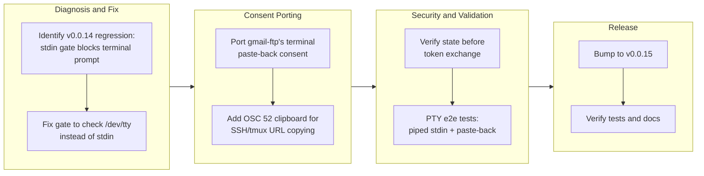

## 1. Overview

The branch fixed a v0.0.14 regression where the documented pipe-a-secret flow refused to prompt for the vault passphrase on a terminal, because the gate checked stdin rather than the controlling terminal. It also ported gmail-ftp's terminal paste-back consent pattern to `qfs account add google`, enabling SSH-only onboarding without a loopback listener and integrating OSC 52 clipboard support for the consent URL. Version bumped to 0.0.15.

**Highlights:**

1. Fixed the passphrase prompt gate to key on the controlling terminal (`/dev/tty`) instead of stdin, restoring the documented pipe-a-secret flow (`cat credentials.json | qfs app add google`) on a terminal
2. Ported gmail-ftp's proven terminal paste-back consent to `qfs account add google`, unblocking onboarding over plain SSH — no loopback listener, no port-forward
3. Integrated OSC 52 clipboard support (with tmux DCS passthrough) for copying the consent URL to the user's local machine across SSH
4. CSRF `state` is verified before any token exchange; a wrong or missing state in the pasted redirect is rejected outright
5. Added PTY-based e2e tests that drive the real binary for both flows under realistic terminal conditions

## 2. Motivation

The owner's v0.0.14 onboarding broke on first use: the documented pipe-a-secret flow (`cat credentials.json | qfs app add google`) refused to prompt for the vault passphrase on a terminal because the interactivity gate keyed on stdin, which already carried the credential by design. Additionally, SSH-based onboarding failed because the loopback-listener consent could never receive the browser redirect — the approving browser runs on the user's own machine, so its `http://localhost` redirect lands on their loopback, not the server's. This branch restores the pipe-a-secret flow by gating prompts on the controlling terminal (`/dev/tty`) rather than stdin, and ports the proven terminal paste-back consent pattern from gmail-ftp: qfs prints the consent URL (with OSC 52 copy that traverses SSH and tmux), the user approves in their local browser and pastes the redirect back, and the state-validated token exchange completes without any listener. The fix unblocks both pipe-credential and remote-only onboarding, giving the owner the full Gmail + Drive + Analytics scope union from one consent over plain SSH.

## 3. Changes

The branch diagnosed and fixed v0.0.14's passphrase-prompt regression by replacing the stdin-based gate with the controlling terminal, restoring the documented pipe-a-secret flow. It then ported gmail-ftp's terminal paste-back consent to enable SSH-only onboarding, integrating OSC 52 clipboard support across SSH and tmux, with CSRF state validated before any exchange. PTY e2e tests verify both piped-stdin prompting and the paste-back rejection path against the real binary. Version bumped to 0.0.15.

### 3-1. Passphrase prompt must use /dev/tty so piped-stdin commands can prompt ([9b04649](https://github.com/qmu/qfs/commit/9b04649))

Fixed the v0.0.14 first-run regression: every pipe-a-secret command (`app add`, `account add` token import, `account rotate`) now prompts for the vault passphrase on the controlling terminal (`/dev/tty`) even while stdin carries the piped credential — rpassword already read `/dev/tty`; only the interactivity gate keyed off the wrong stream. Red/green proven against the released 0.0.14 binary with a new PTY e2e test ([6be57c3](https://github.com/qmu/qfs/commit/6be57c3) archived the ticket).

### 3-2. Paste-back browser consent: port gmail-ftp's terminal OAuth flow to qfs account add google ([604321c](https://github.com/qmu/qfs/commit/604321c))

Replaced the loopback-listener consent (which can never receive the redirect over plain SSH) with gmail-ftp's paste-back flow as THE flow: `qfs account add google` prints the consent URL with `c` = OSC 52 copy and `o` = open-browser options, reads the pasted `http://localhost/?state=…&code=…` redirect (or bare code) from `/dev/tty`, verifies `state` before the exchange, and seals the union-scope refresh token under the profile email. The `redirect_uri` is the portless `http://localhost` — Google checks equality, not reachability. Docs (README, guides, Gmail cookbook, regenerated agent skill) describe the new steps.

## 4. Outcome

- Fixed the v0.0.14 regression: the passphrase prompt now reads `/dev/tty`, so piped-stdin secret commands (`app add`, `account add` token import, `account rotate`) prompt on a terminal without consuming the piped credential bytes
- Ported gmail-ftp's terminal paste-back OAuth flow to `qfs account add google`: consent URL with OSC 52 copy (works across SSH/tmux) and local browser open; pasted redirect URL or bare code read from `/dev/tty`; `state` verified before exchange; union-scope refresh token sealed
- Added PTY-based e2e tests for both flows; all workspace tests, clippy, fmt, gen-docs, gen-skills green
- Getting-started documentation clarifies when the `QFS_PASSPHRASE` export is actually needed (cron/CI/headless)

## 5. Historical Analysis

The passphrase-prompt work resolves a first-user regression discovered during the owner's v0.0.14 validation, where the documented pipe-a-secret flow failed at the interactivity gate because it keyed off stdin (which by design carries the credential). The paste-back consent implementation mirrors gmail-ftp's proven SSH-friendly flow — qfs itself started as gmail-ftp, and the replace-gmail-ftp epic (20260630203000) drives toward full parity — bringing the owner's preferred and already-verified terminal OAuth UX into qfs. Both this branch and PR #11 prioritize empirical validation on the owner's infrastructure over desktop-only paths, and the pattern of proving red/green against the released binary was again decisive for a gate-class bug.

## 6. Concerns

### (carried from PR #11) /cf live (203090) unimplemented; /cf and /rest are placeholder mounts

- **Severity:** low
- **Description:** `/cf` and `/rest` are reachable cred-free planning/describe mounts, but live credentialed read/commit and per-resource config (which D1/KV/queues; which REST resource maps) are follow-ups needing a richer connection declaration; `/cf` live verification needs the owner's CF token, so 203090 is deferred.
- **How to Fix:** Design a per-resource connection declaration beyond the current (driver, locator, secret) shape, then wire read/apply facets and live-verify with the owner's token; roadmap already reflects this as deferred.

### (carried from PR #11) Cloud reads panicked under runtime-within-runtime blocking

- **Severity:** moderate
- **Description:** Every cloud read facet's client drives the shared reqwest transport via its own `block_on`; called from inside the async read executor (itself a tokio worker) this panics with "Cannot start a runtime from within a runtime". Only objstore was guarded, so gmail/gdrive/ga/github/slack live reads crashed the process; the hermetic mock-client path never exercised it.
- **How to Fix:** Run any blocking transport call on a dedicated OS thread (`std::thread::scope`) with no tokio context, reducing a panic to a structured secret-free error. Apply the same treatment to every future blocking-transport integration.

### (carried from PR #11) Composable read pipeline (192440) terminal-side follow-ups

- **Severity:** moderate
- **Description:** The composable `array_agg(struct)` read pipeline landed, but the terminal `INSERT … FROM` does not yet materialise rows commit-side (a pre-existing runtime/interpreter gap), and the live Gmail send behind the irreversible gate needs the owner's Google account. So the Drive-to-Gmail attach-and-send payoff is demonstrable on the read leg but not yet end-to-end.
- **How to Fix:** Build commit-side row materialisation for `INSERT … FROM` a computed pipeline, then wire and live-verify the gated Gmail send; both are captured as scoped follow-ups in the roadmap.

### (carried from PR #11) EXTEND on the read path is now a real operation (behaviour change)

- **Severity:** moderate
- **Description:** EXTEND was previously a silent no-op on reads; it now actually computes per-row values. This is a correctness fix but a behaviour change — any pipeline that (accidentally) relied on the old no-op now behaves differently, and the array/struct literal forms became expression constructors (an experimental hard break).
- **How to Fix:** Audit cookbook/tests for EXTEND uses (suite is green, no regressions caught) and note the change prominently in the release note so downstream scripts expecting the old behaviour are updated.

### (carried from PR #11) /git @&lt;ref&gt; tree/blob reads and nested subtrees still limited

- **Severity:** low
- **Description:** Time-travel now works for commits/refs/tags and for `@<ref>` tree and single-blob reads, but blob reads resolve flat-tree (E0) only — nested subtree paths remain out of scope. The docs claim only what runs.
- **How to Fix:** Extend blobfs dispatch to resolve nested subtree paths; keep the structured `invalid_path` fail-closed for genuinely missing paths.

### (carried from PR #11) /local write materialization is narrow

- **Severity:** low
- **Description:** Local writes persist, and a positional single-column payload now maps onto the blob, but a multi-column payload with no `content` column still errors — the user must name the blob column. Earlier one-shot `upsert into /local/<file>` reported COMMITTED without writing, which the fallback addressed for the unambiguous case.
- **How to Fix:** Keep the single-column fallback strict (intentional); document that multi-column local writes must name the blob column. Watch the commit.rs → effect.rs content-blob threading for other write paths.

### (carried from PR #11) Markdown codec token and objstore consent-gate reconciliation

- **Severity:** low
- **Description:** The markdown codec now resolves as `md`; separately, the `CLOUD_DRIVERS` consent set lists `objstore` while the driver ids are `s3`/`r2`, so the bind gate is effectively off for s3/r2 — worth reconciling so the consent gate matches the real driver ids.
- **How to Fix:** Align the `CLOUD_DRIVERS` consent set with the actual `s3`/`r2` driver ids so the bind gate governs object-storage reads consistently.

### (carried from PR #11) Postgres/MySQL declarations for the declared-registry path are partial

- **Severity:** low
- **Description:** Live Postgres/MySQL `/sql` backends work when configured, but from the CREATE CONNECTION declared-registry path the binary's declared `/sql` was historically SQLite-only, and `sql`/`git` still ride the declared-connection seam rather than the new `path_binding` registry (documented CONNECT-epic follow-up). NUMERIC/TIMESTAMP/UUID/JSON column round-trips and `--` comments in `connections.qfs` are also not yet covered.
- **How to Fix:** Move `sql`/`git` onto `path_binding`, broaden column-type coverage, and add comment support to the connections parser.

### (carried from PR #11) project.db migration mismatch / store flakiness (203120)

- **Severity:** moderate
- **Description:** A pre-existing `~/.config/qfs/project.db` migration mismatch surfaced intermittently during live verification; the migration guide and live-verification tickets each worked around it with a fresh `XDG_CONFIG_HOME`. The forward-heal for Project v2's in-place edit fixed one known checksum, but the underlying issue was never confirmed-ticketed and remains open. The CONNECT epic's migration 8 raises the stakes since project.db is now the single source of truth for path bindings.
- **How to Fix:** File/confirm a ticket for 203120, reproduce deterministically, and audit the migration runner's isolation. Every future in-place-edit-that-ships must add its own `SUPERSEDED_BODIES` entry; consider consolidating the runner given qfs is not a long-lived server.

### Live Google consent round-trip and /drive read verification pending

- **Severity:** moderate
- **Description:** The live Google round-trip and the `/drive` read on the union-scope token still need owner-attended verification with a real browser (see [604321c](https://github.com/qmu/qfs/commit/604321c) in `packages/qfs/crates/google-auth/src/authorize.rs` and `packages/qfs/crates/qfs/src/account.rs`).
- **How to Fix:** Ship as v0.0.15 so the owner redoes `account add google` on the fixed binary with the actual Google OAuth flow and verifies that a subsequent `/drive` read returns real rows from the union-scope refresh token.

### Passphrase prompt once-per-invocation limitation on headless hosts

- **Severity:** low
- **Description:** The per-one-shot prompt asks once per invocation; on headless hosts without a secret service the export remains the practical path for long sessions (see [9b04649](https://github.com/qmu/qfs/commit/9b04649) in `packages/qfs/crates/qfs/src/tty.rs`).
- **How to Fix:** For long-running headless sessions (cron, CI, persistent daemons), recommend the `read -rs QFS_PASSPHRASE; export` pattern; getting-started now clarifies when this is needed versus terminal prompting.

## 7. Successful Development Patterns

- **Red/green against the released binary is decisive for gate bugs:** the passphrase-prompt regression was proved by running the identical PTY scenario against released 0.0.14 (fails) and the fix (passes) — more convincing than hermetic tests alone for stdin/TTY-state classes.
- **Study actual platform behavior before designing the UX:** the paste-back flow works because Google validates `redirect_uri` by exact equality, not reachability, so a portless `http://localhost` with no listener completes the exchange; OSC 52 wrapped in the tmux DCS passthrough is the one clipboard channel that reaches the local machine across SSH.
- **PTY-based e2e tests drive terminal interaction verification:** wrapping the real binary in util-linux `script` with stdin as a pipe and answers fed via the pty catches exactly the class of bug where interactivity gates interact with piped input — a scenario unit tests cannot exercise.
- **Mirror proven UX flows rather than reinvent:** porting gmail-ftp's battle-tested SSH-friendly consent (print URL, OSC 52 copy, paste-back, state check) delivered the owner's preferred workflow immediately and avoided iterating on an untested desktop-only listener design.

## 8. Release Preparation

**Verdict**: Ready for release

### 8-1. Concerns

- The live Google consent round-trip against Google's real OAuth endpoint has not been exercised end-to-end (owner-attended, pending by design). This is not a blocker: the paste-back machinery — auth-URL shape, pasted-redirect parsing, state validation, code exchange, OSC 52 clipboard escape, and the /dev/tty passphrase gate — is fully covered hermetically (scripted ConsentPrompt tests, OSC 52 shape tests, and two PTY e2e tests), and no green gate depends on the live round-trip.

### 8-2. Pre-release Instructions

- None - standard release process applies

### 8-3. Post-release Instructions

- Owner performs the live paste-back Google consent once on the released binary (`qfs account add google` over SSH): approve in the local browser, paste the `http://localhost/...` redirect back, and confirm the refresh token persists and a `/drive` read returns real rows on the union-scope token — the one interactive seam that cannot be tested hermetically.

## 9. Notes

This branch unblocks the owner's mid-flight first-use onboarding on the released binary: reinstall v0.0.15 via install.sh, continue with the existing vault (`qfs init` already done), `app add` now prompts correctly, and `account add google` paste-back consent yields the union-scope token serving both `/mail` and `/drive`. The follow-up owner-requested CREATE ACCOUNT language surface (20260703040000) remains in the todo queue pending design decisions.

## Deployment Evidence

- **When:** 2026-07-03T05:39:23+09:00
- **Target:** qfs GitHub Release (release-on-tag)
- **Method:** other (deploy-on-merge: pre-merge readiness proof)
- **Status:** pass
- **Observed:** Pre-merge readiness confirmed on the branch at code-identical tree: cargo test --workspace (all green incl. 2 PTY e2e), clippy --workspace --all-targets -D warnings, cargo fmt --all --check, gen-docs --check, gen-skills --check all pass; Cargo.toml version 0.0.15 ahead of main (0.0.14). Post-merge promotion check (gh release view v0.0.15 assets) follows the tag push.

## Deployment Evidence

- **When:** 2026-07-03T05:47:29+09:00
- **Target:** qfs GitHub Release (release-on-tag)
- **Method:** other (deploy-on-merge: post-merge promotion check)
- **Status:** pass
- **Observed:** gh release view v0.0.15: release published, isDraft false, all four native tarballs present (linux-musl + apple-darwin, aarch64 + x86_64) with sha256 sums; release.yml run completed/success on tag v0.0.15 at merge commit 92a5e30.
