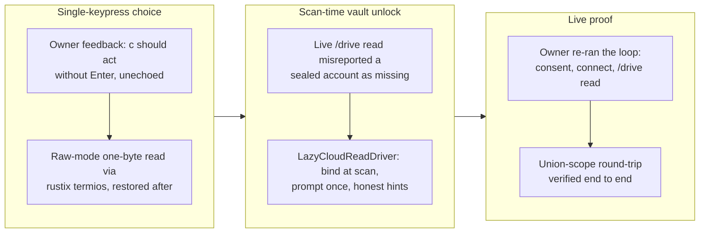

## 1. Overview

The two fixes the owner's live v0.0.16 onboarding loop surfaced: the consent prompt's copy/open choice is now a single unechoed keypress (no Enter), and a cloud read on a terminal now unlocks the vault at scan time with a one-time passphrase prompt instead of misreporting a sealed account as missing. With them, the owner completed the full live round-trip — paste-back consent, `/drive` mount, and a real `/drive` read on the union-scope token. Version bumped to 0.0.17.

**Highlights:**

1. Cloud reads unlock the vault at scan time: a terminal user is prompted for the passphrase exactly when a query reads a cloud mount, and a headless locked store gets an honest locked-store hint instead of the misleading "no usable Google account"
2. The consent `c`/`o` choice acts on a single keypress with no Enter and no stray echo on the prompt line (non-canonical, echo-off read of one byte via rustix's safe termios API)
3. Live-verified end to end by the owner: one paste-back consent serves both `/mail` and `/drive` — the union-scope proof the gmail-ftp/gdrive-ftp replacement epic required

## 2. Motivation

The owner ran the v0.0.16 consent loop live and hit two rough edges. First, the copy choice required pressing `c` **and Enter**, and the typed key lingered on the prompt line — gmail-ftp's single-keypress feel was the ask. Second and more serious: after a successful consent and `qfs connect /drive`, the very first `/drive` read failed with "this Drive mount has no usable Google account" — misleading, because the account existed, sealed behind a vault the read path refused to prompt for. The read-side mount bind deliberately opens the store only through quiet, never-prompting paths (the registry build runs for every `qfs run`, including credential-free previews), so a terminal session without `QFS_PASSPHRASE` could never complete a cloud read at all. The fix keeps the registry build prompt-free and moves the bind to scan time — the one moment the executing query provably needs the credential — where prompting a human at a terminal is exactly right.

## 3. Changes

Two owner-feedback fixes from the live loop, then the live proof: the consent choice became a true single keypress, the cloud-read bind moved to scan time with a one-time passphrase prompt, and the owner's re-run completed the full round-trip on the local build. Version bumped to 0.0.17.

### 3-1. Consent c/o choice should be a single keypress, unechoed ([109c5c4](https://github.com/qmu/qfs/commit/109c5c4))

The consent prompt's `c` (OSC 52 copy) and `o` (open browser) now act on one keypress: the controlling terminal enters non-canonical, echo-off mode for exactly one byte (rustix's safe termios API — the workspace forbids unsafe) and is restored immediately; Ctrl-C keeps working and non-tty callers fall back to the line read. The pressed key never appears on the prompt line.

### 3-2. Cloud reads must unlock the vault at scan time ([96c936a](https://github.com/qmu/qfs/commit/96c936a))

A cloud mount whose quiet bind fails at registry build now registers a `LazyCloudReadDriver` that retries at scan time: the store is unlocked there — quiet paths first, else a one-time `/dev/tty` prompt cached process-wide — and the live facet is built and delegated to. Only successful binds are cached, so a shell session can fix the cause and retry. A store that still cannot unlock (headless, no env var) surfaces an honest locked-store hint; the misleading connect hint fires only when the app/account is genuinely absent.

## 4. Outcome

- The owner's live loop now runs end to end: paste-back consent (single-keypress copy), `qfs connect /drive`, and a real `/drive` read that prompted for the passphrase once and returned live rows on the union-scope token — the first full proof that one consent serves both `/mail` and `/drive`
- Registry build stays prompt-free (previews and local reads never interrogate); the prompt fires only when a query actually reads a cloud mount
- Error honesty restored: locked vault and missing account are now distinct, actionable messages
- All workspace tests (141 suites), clippy `-D warnings`, fmt, gen-docs and gen-skills checks green

## 5. Historical Analysis

Third iteration of the owner's first-use feedback loop on this surface: v0.0.15 ported the paste-back consent (PR #13), v0.0.16 fixed the missing OIDC identity scopes the first live run exposed (PR #14), and this branch fixed what the second live run exposed — the keypress feel and the read-side vault access. The loop itself changed shape mid-stream at the owner's direction: fixes are now verified on the server's local build before a release is cut, rather than shipping a version per iteration. The scan-time unlock also resolves the tension created by the v0.0.14 passphrase-gate fix: prompting was fixed for credential-management commands but reads kept the never-prompt contract, which this branch reconciles by scoping the prompt to the moment of proven need.

## 6. Concerns

### (carried from PR #13) Passphrase prompt once-per-invocation limitation on headless hosts

- **Severity:** low
- **Description:** The scan-time unlock caches the passphrase per process, but each one-shot invocation still prompts once; on headless hosts without a secret service the export remains the practical path for long sessions.
- **How to Fix:** For long-running headless sessions, recommend the `read -rs QFS_PASSPHRASE; export` pattern; getting-started documents when it is needed.

### (carried from PR #11) /cf live (203090) unimplemented; /cf and /rest are placeholder mounts

- **Severity:** low
- **Description:** `/cf` and `/rest` are reachable cred-free planning/describe mounts, but live credentialed read/commit and per-resource config are follow-ups needing a richer connection declaration; `/cf` live verification needs the owner's CF token.
- **How to Fix:** Design a per-resource connection declaration, wire read/apply facets, live-verify with the owner's token.

### (carried from PR #11) Cloud reads panicked under runtime-within-runtime blocking

- **Severity:** moderate
- **Description:** Cloud read facets drive the shared reqwest transport via their own `block_on`; from inside the async read executor this panics. Only objstore was guarded; the class is easy to reintroduce (the new lazy bind deliberately runs off-runtime for this reason).
- **How to Fix:** Run blocking transport calls on a dedicated OS thread with no tokio context; apply to every future blocking-transport integration.

### (carried from PR #11) Composable read pipeline (192440) terminal-side follow-ups

- **Severity:** moderate
- **Description:** Terminal `INSERT … FROM` does not yet materialise rows commit-side, and the live gated Gmail send needs the owner's account; the Drive-to-Gmail payoff is read-leg only.
- **How to Fix:** Build commit-side row materialisation, then wire and live-verify the gated Gmail send — the owner's account is now authorized, so the send verification is newly unblocked.

### (carried from PR #11) EXTEND on the read path is now a real operation (behaviour change)

- **Severity:** moderate
- **Description:** EXTEND changed from silent no-op to computing per-row values; pipelines relying on the old behaviour now differ (experimental hard break).
- **How to Fix:** Audit cookbook/tests for EXTEND uses and note the change prominently in release notes.

### (carried from PR #11) /git @&lt;ref&gt; tree/blob reads and nested subtrees still limited

- **Severity:** low
- **Description:** `@<ref>` blob reads resolve flat-tree only; nested subtree paths remain out of scope.
- **How to Fix:** Extend blobfs dispatch to nested subtree paths, keeping `invalid_path` fail-closed.

### (carried from PR #11) /local write materialization is narrow

- **Severity:** low
- **Description:** A multi-column payload with no `content` column still errors; the user must name the blob column.
- **How to Fix:** Keep the single-column fallback strict; document the multi-column requirement; watch the content-blob threading on other write paths.

### (carried from PR #11) Markdown codec token and objstore consent-gate reconciliation

- **Severity:** low
- **Description:** The `CLOUD_DRIVERS` consent set lists `objstore` while the driver ids are `s3`/`r2`, so the bind gate is effectively off for object storage.
- **How to Fix:** Align the consent set with the real `s3`/`r2` driver ids.

### (carried from PR #11) Postgres/MySQL declarations for the declared-registry path are partial

- **Severity:** low
- **Description:** `sql`/`git` still ride the declared-connection seam rather than `path_binding`; column-type coverage and `--` comments in `connections.qfs` are open.
- **How to Fix:** Move `sql`/`git` onto `path_binding`, broaden column-type coverage, add comment support.

### (carried from PR #11) project.db migration mismatch / store flakiness (203120)

- **Severity:** moderate
- **Description:** A pre-existing `~/.config/qfs/project.db` migration mismatch surfaced intermittently during live verification and was never confirmed-ticketed; project.db is now the single source of truth for path bindings.
- **How to Fix:** File/confirm a ticket for 203120, reproduce deterministically, audit the migration runner's isolation.

### Commit-side apply registry still binds quietly

- **Severity:** low
- **Description:** The scan-time unlock covers READS; the commit-side apply registry still opens the store only through the quiet paths, so a terminal `--commit` against a cloud mount without `QFS_PASSPHRASE` can still fail its bind silently (see [96c936a](https://github.com/qmu/qfs/commit/96c936a) in `packages/qfs/crates/qfs/src/shell.rs`).
- **How to Fix:** Apply the same lazy, prompt-at-proven-need treatment to `commit.rs`'s cloud apply drivers.

## 7. Successful Development Patterns

- **Local-build feedback loop before releasing:** iterating on the server's `target/debug/qfs` with the owner testing live — and cutting a release only after confirmation — turned around two UX fixes in one sitting without burning version numbers (owner-directed change from the ship-per-fix pattern).
- **Prompt at the moment of proven need:** the registry build must stay quiet (it runs for every command), but the scan over a cloud mount is proof the credential is needed — deferring the bind to that moment resolves the prompt-vs-automation tension without weakening either contract.
- **Cache only successes in a lazy bind:** a failed bind cached forever would strand an interactive shell session; caching only the bound facet lets the user fix the cause and re-run.
- **PTY e2e as the acceptance harness for terminal UX:** both the single-keypress read and the scan-time prompt were locked by driving the real binary under util-linux `script`, asserting the exact transcript — the same harness that caught the v0.0.14 gate regression.

## 8. Release Preparation

**Verdict**: Ready for release

### 8-1. Concerns

- None - both changes are live-verified by the owner on this branch's build (consent single-keypress feel, scan-time prompt, real `/drive` rows), and all gates are green.

### 8-2. Pre-release Instructions

- None - standard release process applies

### 8-3. Post-release Instructions

- Owner may reinstall the released v0.0.17 (`install.sh`) to retire the debug-build alias; behavior is identical to the verified local build.

## 9. Notes

The live verification this branch completed closes the acceptance proof for the paste-back consent chain (PRs #13/#14): one consent now demonstrably serves `/mail` and `/drive` on the same account — the property the gmail-ftp/gdrive-ftp narrow tokens could never provide. The deferred concern "Live Google consent round-trip and /drive read verification pending" is resolved and archived by this branch.

## Deployment Evidence

- **When:** 2026-07-03T14:22:10+09:00
- **Target:** qfs GitHub Release (release-on-tag)
- **Method:** other (deploy-on-merge: pre-merge readiness proof)
- **Status:** pass
- **Observed:** Pre-merge readiness confirmed on the branch: cargo test --workspace all green (141 suites incl. the lazy-scan hint test and two PTY e2e transcripts), clippy -D warnings, fmt, gen-docs --check, gen-skills --check pass; Cargo.toml version 0.0.17 ahead of main (0.0.16). Owner additionally live-verified this branch's build: paste-back consent, connect /drive, and a real /drive read with the scan-time passphrase prompt.

## Deployment Evidence

- **When:** 2026-07-03T14:29:04+09:00
- **Target:** qfs GitHub Release (release-on-tag)
- **Method:** other (deploy-on-merge: post-merge promotion check)
- **Status:** pass
- **Observed:** gh release view v0.0.17: release published, isDraft false, all four native tarballs (linux-musl + apple-darwin, aarch64 + x86_64) with sha256 sums; release.yml run completed/success on tag v0.0.17 at merge commit 94dea14.
