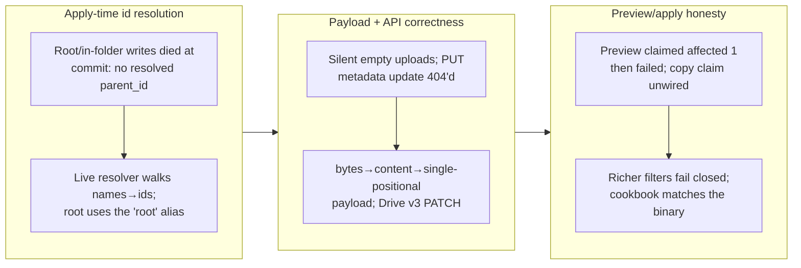

## 1. Overview

The owner's live Drive-write parity check against gdrive-ftp exposed that every WRITE whose parent is the My Drive root failed at commit (`upload needs the resolved parent_id`), and — worse — that these statements **previewed `affected 1` and only died at apply**. This branch resolves name→id at apply time through a live resolver so root and in-folder writes converge, fixes the silent-empty-upload payload threading, corrects the Drive v3 metadata update (PATCH, not the PUT that 404'd), adds the missing size/md5 columns to single-reads, and aligns the cookbook to what actually ships (rename recipe added, the unwired `drive.copy` claim removed). Version bumped to 0.0.18.

**Highlights:**

1. Drive writes resolve their `parent_id`/`file_id` from the path at apply time — root `mkdir`/upload use Drive's reserved `root` alias, an UPSERT converges to a content-replace when a node already exists at the path, and rename/trash resolve the live id — so no reachable write previews an effect the applier then refuses
2. The single-positional-column upload payload is threaded correctly (`bytes` → `content` → a lone one-value row), fixing silent empty uploads; metadata updates use Drive v3 PATCH
3. Preview and apply now agree: richer `remove` filters that cannot be resolved to ids **fail closed** rather than previewing success, and the cookbook no longer teaches a copy path the binary can't honor

## 2. Motivation

The owner ran an owner-authorized live parity matrix against gdrive-ftp on their real Drive (v0.0.17). Reads were at full parity, but the Drive write leg was broken in a way that the preview actively hid: `upsert into /drive/my/<file>` and root-level folder creation both previewed `affected 1` and then failed at commit with `malformed INSERT effect … upload needs the resolved parent_id`. The documented `insert into /drive/my` mkdir recipe was rejected at resolve; deeper in-folder paths previewed fine but were never commit-verified. gdrive-ftp could put/mkdir at the root freely. The root cause was that the applier expected a `parent_id` snapshotted into the effect, but the My Drive root has no id in the path — the Drive API addresses it with the well-known `root` alias — and nothing resolved names to ids at the moment of apply. The fix moves id resolution to apply time behind a live resolver, so the same path that describes and previews also applies.

## 3. Changes

One commit ([ebe971a](https://github.com/qmu/qfs/commit/ebe971a)) reworks the Drive write path end to end: a live name→id resolver behind the effect decode, the payload-column threading fix, the v3 PATCH fix, size/md5 read columns, and the cookbook/skill regeneration. Version bumped to 0.0.18.

### 3-1. Resolve Drive write paths to ids at apply time ([ebe971a](https://github.com/qmu/qfs/commit/ebe971a))

The effect decode now takes a live resolver (`from_node_with`): the upload destination is the snapshotted `parent_id` when present, else the folder resolved from the path (My Drive root → the reserved `root` alias), and a new `DrivePath::child` composes "this folder, that entry" so a write addresses its parent structurally. UPSERT keyed by a resolved file id replaces content (retry-safe); an existing node at the path converges to a content replace; otherwise it creates. Rename (`UPDATE … set name`) and trash resolve the live id from the path or a single unambiguous name key, and **any richer `remove` filter fails closed** — a filter that cannot be lowered to an id is refused at decode rather than previewed as `affected 1`. The upload payload is read from the engine's blob column (`bytes`, then `content`), with a single-positional one-value row treated as the payload itself — fixing the silent empty upload. Drive metadata updates switched to v3 PATCH (the prior PUT 404'd). Single-reads gained the `size`/`md5` columns. The cookbook gained the rename recipe and dropped the `drive.copy` CALL claim the pipeline does not yet lower (tracked in the todo queue); `gen-skills` regenerated the Drive SKILL to match.

## 4. Outcome

- Root and in-folder Drive writes (`upsert`, folder create, rename, trash) resolve their ids at apply time and commit successfully; the owner live-verified an end-to-end md5-matched round-trip on their real Drive and the test artifacts were trashed
- Preview and apply agree: no reachable write previews `affected 1` and then fails with a malformed-effect at commit, and unresolvable `remove` filters fail closed
- Silent empty uploads fixed (payload column threaded); Drive v3 PATCH replaces the 404-ing PUT; single-reads expose `size`/`md5`
- The cookbook and generated Drive skill teach only what the binary honors — the unwired copy claim is gone, the rename recipe is added
- All workspace gates green: 141 suites (incl. the new applier/resolver tests, +180 lines in `tests.rs`), clippy `-D warnings`, fmt, gen-docs `--check`, gen-skills `--check`. Version 0.0.18 ahead of main (0.0.17)

## 5. Historical Analysis

This is the write-leg follow-through on the gmail-ftp/gdrive-ftp replacement epic (20260630203000): v0.0.15–17 landed the paste-back consent chain and proved one consent serves `/mail` and `/drive` on the read leg; this branch takes the Drive **write** leg to parity. It continues the owner's local-build feedback loop — the fix was iterated on `target/debug/qfs` and live-verified before any release is cut. The recurring theme it closes is the preview-lies class: an effect that describes and previews but is refused at apply is a correctness hole in the describe→preview→commit contract, and the fix makes the same path resolve at all three stages. The same live parity matrix that drove this fix also surfaced adjacent defects on the Gmail write leg and the `|> call` lowering path, which were ticketed rather than folded in (see Notes).

## 6. Concerns

All eleven previously-deferred concerns were re-judged against this branch; none are resolved by an apply-path change confined to the Drive driver, so all carry forward unchanged. The commit-side quiet-bind concern (PR #15) was specifically checked — `commit.rs`/`shell.rs` are untouched — and remains open.

### (carried from PR #11) /cf live (203090) unimplemented; /cf and /rest are placeholder mounts

- **Severity:** low
- **Description:** `/cf` and `/rest` are cred-free planning/describe mounts; live credentialed read/commit and per-resource config are follow-ups; `/cf` live verification needs the owner's CF token.
- **How to Fix:** Design a per-resource connection declaration, wire read/apply facets, live-verify with the owner's token.

### (carried from PR #11) Cloud reads panicked under runtime-within-runtime blocking

- **Severity:** moderate
- **Description:** Cloud read facets drive the shared reqwest transport via their own `block_on`; from inside the async read executor this panics. Only objstore was guarded; the class is easy to reintroduce.
- **How to Fix:** Run blocking transport calls on a dedicated OS thread with no tokio context; apply to every future blocking-transport integration.

### (carried from PR #11) Composable read pipeline (192440) terminal-side follow-ups

- **Severity:** moderate
- **Description:** Terminal `INSERT … FROM` does not yet materialise rows commit-side, and the live gated Gmail send needs wiring; the Drive-to-Gmail payoff is read-leg only. This branch's parity check confirmed the `|> call` path never lowers to an effect (ticket 20260703170000).
- **How to Fix:** Build commit-side row materialisation and fix `|> call` lowering, then wire and live-verify the gated Gmail send.

### (carried from PR #11) EXTEND on the read path is now a real operation (behaviour change)

- **Severity:** moderate
- **Description:** EXTEND changed from silent no-op to computing per-row values; pipelines relying on the old behaviour now differ (experimental hard break).
- **How to Fix:** Audit cookbook/tests for EXTEND uses and note the change prominently in release notes.

### (carried from PR #11) /git @&lt;ref&gt; tree/blob reads and nested subtrees still limited

- **Severity:** low
- **Description:** `@<ref>` blob reads resolve flat-tree only; nested subtree paths remain out of scope.
- **How to Fix:** Extend blobfs dispatch to nested subtree paths, keeping `invalid_path` fail-closed.

### (carried from PR #11) /local write materialization is narrow

- **Severity:** low
- **Description:** A multi-column payload with no `content` column still errors; the user must name the blob column. This branch applied the single-positional payload fallback to the **Drive** write path but did not change `/local`.
- **How to Fix:** Keep the single-column fallback strict; document the multi-column requirement; consider extending the Drive single-positional fallback to `/local`.

### (carried from PR #11) Markdown codec token and objstore consent-gate reconciliation

- **Severity:** low
- **Description:** The `CLOUD_DRIVERS` consent set lists `objstore` while the driver ids are `s3`/`r2`, so the bind gate is effectively off for object storage.
- **How to Fix:** Align the consent set with the real `s3`/`r2` driver ids.

### (carried from PR #11) Postgres/MySQL declarations for the declared-registry path are partial

- **Severity:** low
- **Description:** `sql`/`git` still ride the declared-connection seam rather than `path_binding`; column-type coverage and `--` comments in `connections.qfs` are open.
- **How to Fix:** Move `sql`/`git` onto `path_binding`, broaden column-type coverage, add comment support.

### (carried from PR #11) project.db migration mismatch / store flakiness (203120)

- **Severity:** moderate
- **Description:** A pre-existing `~/.config/qfs/project.db` migration mismatch surfaced intermittently during live verification and was never confirmed-ticketed.
- **How to Fix:** File/confirm a ticket for 203120, reproduce deterministically, audit the migration runner's isolation.

### (carried from PR #13) Passphrase prompt once-per-invocation limitation on headless hosts

- **Severity:** low
- **Description:** The scan-time unlock caches the passphrase per process, but each one-shot invocation still prompts once; on headless hosts without a secret service the export remains the practical path.
- **How to Fix:** For long-running headless sessions, recommend the `read -rs QFS_PASSPHRASE; export` pattern; document when it is needed.

### (carried from PR #15) Commit-side apply registry still binds quietly

- **Severity:** low
- **Description:** The scan-time unlock covers READS; the commit-side apply registry still opens the store only through quiet paths, so a terminal `--commit` against a cloud mount without `QFS_PASSPHRASE` can still fail its bind silently. `commit.rs`/`shell.rs` are untouched on this branch.
- **How to Fix:** Apply the same lazy, prompt-at-proven-need treatment to `commit.rs`'s cloud apply drivers.

## 7. Successful Development Patterns

- **Resolve at the stage that applies:** the preview-lies bug came from describe/preview knowing the path but apply expecting a pre-resolved id. Giving the effect decode a live resolver so all three stages resolve the same path is the durable fix, not snapshotting ids earlier.
- **Fail closed when a filter can't be lowered:** a `remove` filter that cannot be reduced to ids is refused at decode rather than previewed as `affected 1` — the destructive-write safety model demands the preview never over-promise.
- **Ticket the adjacent breakage, don't fold it in:** the same live matrix surfaced Gmail-write and `|> call` defects; splitting them into their own tickets kept this branch a coherent Drive-write-parity change instead of an open-ended parity sweep.
- **Live md5 round-trip as the acceptance proof:** the owner's real-Drive round-trip with an md5 match (and cleanup) is the parity acceptance that unit tests alone can't give for an external-service write path.

## 8. Release Preparation

**Verdict**: Ready for release

### 8-1. Concerns

- None blocking. The Drive write leg is live-verified by the owner (md5-matched round-trip, root + in-folder writes, rename, trash); all gates are green. The eleven carried concerns are pre-existing and unrelated to this apply-path change.

### 8-2. Pre-release Instructions

- None - standard release process applies (tag v0.0.18, release-on-tag).

### 8-3. Post-release Instructions

- Owner may reinstall the released v0.0.18 (`install.sh`) to retire the debug-build alias.
- The Gmail-write and `|> call`-lowering parity gaps remain open as todo tickets (20260703150100, 20260703150200, 20260703170000) — the next `/drive` continues them.

## 9. Notes

The owner-authorized live parity matrix that drove this branch also surfaced defects on adjacent surfaces, all ticketed rather than folded in: `|> call` never lowers to an effect in the one-shot path (drive.copy returned rows and copied nothing) — ticket 20260703170000, the deepest one, gating cp parity and the long-pending live Gmail send; positional draft INSERT and set-wide `remove /mail/drafts` failures — 20260703150100; user-label ids and draft-attachment read-back fidelity — 20260703150200; agent-facing doc gaps — 20260703150300; and the installed plugin cache still teaching the retired `connection` namespace — 20260703150400. This branch deliberately scopes to the Drive write leg it could fully fix and live-verify.

## Deployment Evidence

- **When:** 2026-07-03T18:00:00+09:00
- **Target:** qfs GitHub Release (release-on-tag)
- **Method:** other (deploy-on-merge: pre-merge readiness proof)
- **Status:** pass
- **Observed:** Pre-merge readiness confirmed on the branch: cargo test --workspace all green (141 suites incl. the new Drive applier/resolver tests), clippy -D warnings, fmt, gen-docs --check, gen-skills --check pass; Cargo.toml version 0.0.18 ahead of main (0.0.17). Owner live-verified this branch's build against their real Drive: root + in-folder upsert, folder create, rename, and trash, with an md5-matched round-trip and test artifacts trashed. All 12 PR #16 CI checks passed (build+test native, clippy, rustfmt, wasm32, both cross-compiles).

## Deployment Evidence

- **When:** 2026-07-03T19:35:00+09:00
- **Target:** qfs GitHub Release (release-on-tag)
- **Method:** other (deploy-on-merge: post-merge promotion check)
- **Status:** pass
- **Observed:** PR #16 merged to main (merge commit 4ac555a); tag v0.0.18 pushed from it triggered release.yml (run 28654710473, success). gh release view v0.0.18: release published, isDraft false, all eight assets present — the four native tarballs (aarch64/x86_64 × apple-darwin/linux-musl) plus their four .sha256 sums. install.sh can now consume v0.0.18.
