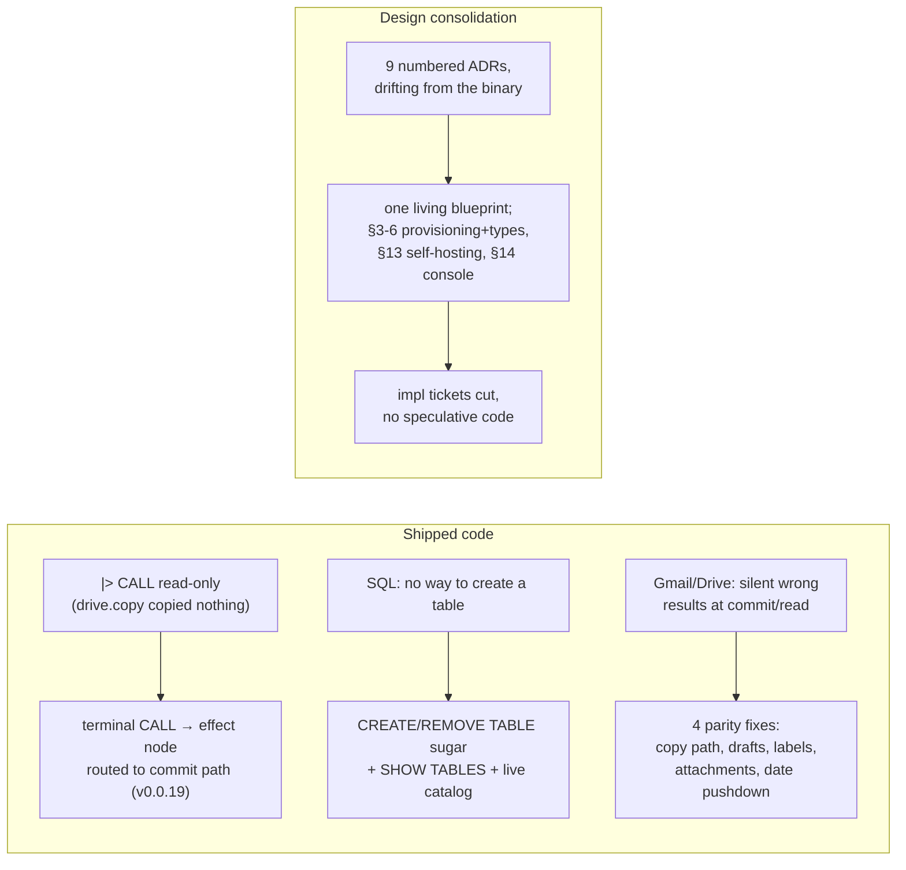

## 1. Overview

This branch is the **v0.0.19** slice. It carries two intertwined threads: **shipped code** — the
`|> CALL` terminal-effect lowering that finally makes `drive.copy`/`mail.send` act instead of read,
first-class **SQLite DBMS management** (`CREATE TABLE`/`REMOVE TABLE` as parser sugar over the
catalog, `SHOW TABLES`, in-process catalog refresh), and a run of **Gmail/Drive read+write parity
bugfixes** the owner's live dogfooding surfaced — and a **design consolidation** that retired the
numbered-ADR pile into one living `docs/blueprint.md` and approved four design chapters (types-are-
sets, self-hosting integrations §13, the console/BI face §14, SQL provisioning §3/§4), each closed by
cutting dependency-ordered implementation tickets rather than writing code.

**Highlights:**

1. **Terminal `CALL` now lowers to an effect** (v0.0.19): a terminal `|> call driver.proc()` on an
   effect procedure evaluates to a single `EffectKind::Call` plan node routed to the commit path —
   `drive.copy` copies (owner md5-verified round-trip), `mail.send` sends (owner-attended real send).
2. **SQLite DBMS management** shipped as zero-new-keyword sugar: `CREATE TABLE`/`REMOVE TABLE`
   desugar onto `INSERT INTO /sql/<conn>` / `REMOVE … WHERE name=…`, the catalog refreshes in-process
   so `DESCRIBE` never lies, and reading `/sql/<conn>` lists `{name, kind}` (SHOW TABLES).
3. **Gmail/Drive parity, four bugs, each a "plausible-but-wrong" silent failure fixed:** `drive.copy`
   takes a destination folder **path**; drafts INSERT rejects the ambiguous positional form at plan
   time (preview==apply) and the drafts collection stops advertising a REMOVE it can't honor; user
   labels list their **display names**; message/draft **attachments** read back; and a `date` string
   predicate is **coerced and pushed** to Gmail `after:`/`before:` instead of silently vanishing.
4. **The ADR pile is retired** into a 12-chapter living blueprint; §13/§14/§5-6 are approved
   **design-only** with implementation tickets cut for a later `/drive`.

## 2. Motivation

Two forces drove the branch. First, the owner's **live dogfooding** of the Gmail and Drive drivers
against gmail-ftp/gdrive-ftp on their real account kept surfacing a dangerous class of defect: a
statement that **describes and previews fine but returns plausible-but-wrong results (or fails) at
commit** — a positional draft that dropped its recipients, a set-wide `remove` the describe surface
promised but the applier refused, user labels rendered as raw `Label_5` ids, an `attachments` column
that was always `[]`, and a `where date BETWEEN …` that silently returned the newest N rows
unfiltered. Each is worse than an error because it looks like it worked. Second, the design record
had grown into a pile of nine numbered ADRs that were beginning to contradict each other and the
shipped binary; the owner chose to consolidate them into **one blueprint** where every chapter
carries an explicit implemented/blueprint/parked status, and to settle the next epics (self-hosting
integrations, the first-party console) as design before any code is cut.

## 3. Changes

**Shipped-code thread** (in dependency order):

- **Terminal CALL lowering (v0.0.19)** — a terminal `CALL` to an effect procedure lowers to one
  `EffectKind::Call` node (`eval.rs`/`resolve.rs`); one-shot routing sends a query whose terminal op
  is a CALL to the shared effect path. Owner live-verified `drive.copy` (byte-identical md5 copy) and
  `mail.send` (real send, landed in SENT).
- **`drive.copy` destination path→id** ([1c6905a]) — `decode_call` accepts `parent_path` (a `/drive`
  folder path) resolved to its id at apply time, mirroring the upload walk; the cookbook `Copy`
  recipe re-added.
- **SQLite DBMS management** — per-dialect DDL emitter + inverse type mapping (`sql-core`);
  `CREATE TABLE`/`REMOVE TABLE` contextual-ident parser sugar; apply wiring with automatic
  irreversible gating on drop; `Arc<RwLock<_>>` catalog refresh after DDL; `SHOW TABLES` on the
  catalog node; cookbook + skill.
- **Gmail drafts write parity** ([a3479fd]) — a drafts INSERT/UPSERT must name `to`; a positional
  VALUES row (which maps to the message *read* schema) is rejected at **plan time** via `plan_write`
  so preview and commit agree, and the `/mail/drafts` collection drops its unbacked `REMOVE`
  capability. (The systemic sibling — set-wide REMOVE/relabel on message-label collections — was
  owner-de-scoped to a follow-up.)
- **Gmail read fidelity** ([f51005d]) — `list_labels` surfaces the `name` (not the `Label_N` id);
  `get_message` fetches `format=full` so `payload.parts` is present and `decode_attachments` works.
- **Gmail date pushdown** ([d5624e1]) — a `date` string literal is coerced to epoch-ms and pushed to
  `after:`/`before:`; `date BETWEEN` pushes both bounds; the residual carries the coerced `Int` so
  local re-check orders correctly; unparseable dates stay residual, never a silent no-op.

**Design thread** — the ADR pile retired into `docs/blueprint.md`; owner-approved chapters: **§3/§4**
SQL provisioning + DDL semantics (CRUD is universal, the path is the type, no per-driver create verb —
the design behind the shipped `CREATE TABLE` sugar); **§5/§6** types-are-sets (an entity type is a
named intensional relation, a table an extensional subset, drift is set difference — no new
`ColumnType` atomics); **§13** self-hosting integrations (a driver is data: `CREATE DRIVER`/`CREATE
MAP` over the shipped wire engine, host confinement a hard evaluator rule); **§14** the first-party
console/BI face (one phpMyAdmin-plus-Redash screen per host on the plgg SPA stack, delivered
fetch→verify→cache→self-serve). §13/§14/§5-6 are **design-only** with implementation tickets cut.

## 4. Outcome

- Terminal `CALL` acts at commit: `drive.copy` and `mail.send` are effects, owner live-verified; the
  drive.copy cookbook recipe takes a destination **folder path**.
- SQLite create/drop/list table works end-to-end at the effect-pipeline level (hermetic tests);
  `DESCRIBE` reflects a just-created table; dropping a table is irreversible-gated.
- Four Gmail/Drive "plausible-but-wrong" defects are fixed so **preview and apply agree** and reads
  are honest: draft recipients no longer silently dropped, describe no longer advertises a REMOVE the
  applier refuses, labels show display names, attachments read back, date ranges filter.
- The design record is one living blueprint; every approved-but-unbuilt chapter has dependency-ordered
  implementation tickets in the queue rather than speculative code.
- **All workspace gates green** at the code tip (`539cdab`): `cargo test --workspace` 141 suites,
  `clippy -D warnings`, `fmt --check`, `gen-docs --check`, `gen-skills --check`. Version 0.0.19 ahead
  of main (0.0.18). The only later commit (`fee2e29`) is backlog ticket files (docs-only).

## 5. Historical Analysis

This branch is the write-and-fidelity follow-through on the gmail-ftp/gdrive-ftp replacement epic
(20260630203000) and its v0.0.18 predecessor (Drive write parity, PR #16). v0.0.18 made Drive
*writes* resolve ids at apply time; this branch makes the **`|> CALL` path** actually apply
(closing the deepest ticket that v0.0.18's story flagged), takes the **Gmail write+read** leg to
parity, and lands the **SQL DDL** epic (ADR 0009). The recurring theme it closes is the same
**preview-lies / plausible-but-wrong** class v0.0.18 fought: an effect that describes and previews
but is refused-or-wrong at apply is a hole in the describe→preview→commit contract; every fix here
makes the same path honest at all three stages (the drafts `plan_write` guard is the sharpest
example — the rejection moved to plan time so preview can't over-promise). The branch also marks a
process shift the owner drove: **blueprint-first over an ADR pile**, with design chapters gated on
explicit content-approval and closed by cutting tickets, so the design record and the binary stop
diverging.

## 6. Concerns

Every deferred concern raised across the 9 archived tickets and 40 commit bodies was re-judged
against the tree. **No unfiled surprises** — everything actionable is either RESOLVED on this branch
or carried as a todo ticket. The filed follow-ups: SQLite residual (Pg/MySQL DDL, provisioning,
`cd /sql`, e2e — **20260704001233**, intentionally kept in todo); path-aware DDL/DML authorization
(**20260704110923**, PBAC §8); RFD-citation sweep to blueprint anchors (**20260704140352**); the §13
self-hosting trio (**20260704145136/145137/145138**); the §14 contracts (**20260704152639/152640**)
and result-envelope (folded into **20260703150300**); the Gmail set-wide REMOVE/relabel gap
(**20260704155500**); the owner-filed blob-copy commit bug (**20260704164315**); and two vault-UX
tickets filed this session (**20260704170000** time-boxed session unlock, **20260704170100** project.db
0600 permissions).

The genuinely **open-and-unfiled** items are small, deliberate, or blueprint-parked:

- **`format=full` read weight** (severity: low) — every message read now fetches the full body, not
  just metadata. Accepted: it is required for attachment fidelity, and attachment *bytes* stay lazy
  via `attachments.get`.
- **Dropping a table with a dependent SQLite VIEW** (low) — leaves the view dangling; next introspect
  errors. Noted for introspection-robustness later; no ticket cut.
- **Catalog node read/write describe asymmetry** (low, deliberate) — the dual-purpose `/sql/<conn>`
  node reads `{name,kind}` but describe still teaches the write shape `{name,columns}`.
- **`describe /drive/my` under-reports `upsert`** (low) — folded into the blob-copy ticket
  (20260704164315).
- **§14 embedded approval-cards dashboard / signed-channel UI release** (parked) — retire into the
  console face at parity; reuse the fetch-verify-cache pattern. Blueprint-parked, no ticket.

## 7. Successful Development Patterns

- **Reject at the stage that applies (preview==apply):** the drafts positional-INSERT bug was fixed
  by a `plan_write` guard that rejects at *plan* time, so PREVIEW fails exactly when COMMIT would —
  never an effect that previews `affected 1` then drops recipients. `plan_write` is the only
  plan-time driver seam that sees row columns, and `MountDriver` forwards it canonically so custom
  mounts are covered too.
- **Coerce at the driver boundary when the type system won't:** the Gmail date predicate reached the
  driver as a raw `Text` literal; coercing it to epoch-ms in `build_query` (and keeping the residual
  coerced) is what made time-range search work and stop silently vanishing.
- **`format=full` vs `metadata` is a fidelity cliff:** `metadata` omits `payload.parts`, so *any*
  attachment extraction over it is silently empty — a whole feature invisibly broken by one query
  param.
- **Surface the systemic sibling, then de-scope it deliberately:** the drafts-REMOVE fix revealed the
  same gap on every message-label collection; rather than balloon the ticket, the owner was asked and
  the broader reconciliation filed as its own ticket — the branch stayed a coherent drafts fix.
- **Blueprint-first, tickets-not-code:** each design chapter was approved on content, then closed by
  cutting dependency-ordered implementation tickets — the design record and the binary stop drifting,
  and the next `/drive` has an ordered queue.
- **Verify "already fixed" before re-implementing:** the owner-filed blob-copy ticket's Bug 2 was
  confirmed already fixed by the v0.0.18 `WriteResolver` work, so only Bug 1 carries forward.

## 8. Release Preparation

**Verdict**: Ready for release (v0.0.19)

### 8-1. Concerns

- None blocking. The shipped code (terminal CALL lowering, SQLite DBMS core, the four Gmail/Drive
  parity fixes, drive.copy path→id) is fully tested and green, and the CALL + drive.copy + mail.send
  legs were owner live-verified on the real account. The design work is documentation with no runtime
  surface. All deferred concerns are filed or deliberate (§6).
- One scoping note for the reviewer: this branch is **larger than a single feature** — it bundles
  v0.0.19's code with the blueprint consolidation and §13/§14 design. It ships as one coherent
  v0.0.19 release; the design chapters carry explicit unimplemented status and cut tickets.

### 8-2. Pre-release Instructions

- None — standard release process applies (bump already at 0.0.19; on ship tag `v0.0.19`,
  release-on-tag builds the four native tarballs).

### 8-3. Post-release Instructions

- The next `/drive` continues the ordered queue: the SQLite residual (20260704001233), PBAC
  (20260704110923), the RFD-citation sweep (20260704140352), the §13 trio and §14 contracts, the
  Gmail set-wide gap (20260704155500), the blob-copy bug (20260704164315), and the two vault-UX
  tickets (20260704170000/170100).

## 9. Notes

The design half of this branch (blueprint, types-are-sets, §13, §14, console face) was produced in
earlier sessions on this branch and approved by the owner on explicit content-review; this report's
code half (the four Gmail/Drive parity bugfixes, the drive.copy cookbook leg) was driven and
committed this session, each with green workspace gates before archive. The Gmail drafts fix involved
a genuine design fork resolved with the owner (make positional work vs. reject it; the systemic
label-collection gap in-scope vs. deferred) — recorded on the ticket and split into a follow-up.

## Deployment Evidence

### Pre-merge readiness (branch/staging proof)

- **When:** 2026-07-04, before merge
- **Target:** qfs GitHub Release (release-on-tag)
- **Method:** other (deploy-on-merge: pre-merge readiness proof)
- **Status:** pass
- **Observed:** All PR #17 CI checks green on the PR head — build + test (native), clippy
  -D warnings, rustfmt, wasm32 (qfs-host core), and both cross-compiles
  (aarch64/x86_64-unknown-linux-gnu); the `release artifacts` job correctly skipped (tag-only).
  `Cargo.toml` version `0.0.19`, ahead of `main` (`0.0.18`). PR was OPEN / MERGEABLE / CLEAN.

### Post-merge promotion check (production)

- **When:** 2026-07-04T18:07:00+09:00
- **Target:** qfs GitHub Release (release-on-tag)
- **Method:** other (deploy-on-merge: post-merge promotion check)
- **Status:** pass
- **Observed:** PR #17 merged to `main` (merge commit `aa856df`); annotated tag `v0.0.19` pushed
  from it triggered `release.yml` (run 28701284682, success). `gh release view v0.0.19`: release
  published, `isDraft` false, all eight assets present — the four native tarballs
  (aarch64/x86_64 × apple-darwin/linux-musl) plus their four `.sha256` sums. `install.sh` can now
  consume v0.0.19. Release: https://github.com/qmu/qfs/releases/tag/v0.0.19
