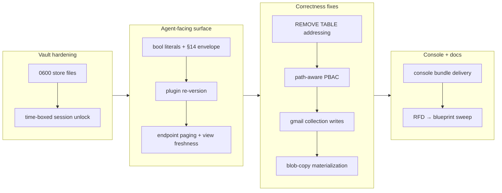

# Branch Story: work-20260704-181053

## 1. Overview

This branch (v0.0.20) is a two-phase push that first hardened the credential vault (owner-only `0600`
store files, a time-boxed session unlock) and then, in an overnight `/drive`, worked eleven queued
tickets to close a broad band of agent-facing correctness gaps and land three approved blueprint
designs — the §14 result envelope + endpoint paging, §8 path-aware capability grants, and §7
commit-boundary write materialization. Every change ships behind the full gate (workspace tests,
`clippy -D warnings`, `fmt`, and the anti-drift `gen-docs`/`gen-skills` checks).

**Highlights:**

1. **Three blueprint designs made real**: the §14 schema-carrying result envelope (one serializer for
   `--json`, HTTP, and MCP; base64 bytes) with `?limit`/`?offset` endpoint paging; §8 path-aware
   `CapabilitySet` grants (data-only vs read-only DDL/DML matrix); and §7 commit-boundary
   materialization that finally makes `… |> upsert into <dst>` blob copy actually commit.
2. **Real correctness bugs found by driving the binary, not just tests**: `REMOVE TABLE` was rejected
   in one-shot mode (the documented drop spelling never committed), and Gmail advertised collection
   writes it refused at commit — both fixed, with the honest-fail-closed contract restored.
3. **Vault hardening**: store DBs are created owner-only `0600` and re-verified on every open, and a
   time-boxed session unlock lets one passphrase entry skip re-prompts for 8h.

## 2. Motivation

The branch began as security hygiene: the Project/System DBs hold envelope-encrypted credentials but
were opened under the process umask (typically group/world-readable), and every one-shot re-prompted
for the passphrase on a headless host. Both are least-privilege gaps (RFD §10). The overnight `/drive`
then executed the settled-design queue recorded in the resume checkpoint: a Fable design session had
resolved the last forks blocking the next tickets (the result envelope shape, the paging dialect, and
the commit-materialization mechanism), leaving a pure implementation queue. Driving it also meant
running the **actual binary** against hermetic fixtures, which is how two "describe never lies" bugs
that the parse-only cookbook ratchet could never catch were surfaced and fixed.

## 3. Changes

The branch opened with two vault-hardening tickets, then the overnight `/drive` worked the settled
implementation queue: it started with the foundational result envelope + bool literals, propagated
the regenerated skills via a plugin re-version, verified the shipped SQLite DBMS surface (finding a
one-shot addressing bug), landed the two remaining security/console infra contracts, and finished
with two write-path correctness fixes. Eight of the nine queued tickets landed; the §13 declared-driver
trio was deferred to a focused session (§9).

### 3-1. Agent-facing gaps: boolean literals + the §14 result envelope ([9803b74](https://github.com/qmu/qfs/commit/9803b74))

Made lowercase `true`/`false`/`null` real literals (the lexer's `literal_word` was uppercase-only, so
`where flag == true` was rejected as a bare column) and implemented the stable schema-carrying result
envelope `{schema, rows, meta}` — one serializer behind `crates/exec/src/dto.rs` for `--json` and the
HTTP endpoint, with base64 bytes and epoch-ms timestamps documented.

### 3-2. Re-version the qfs plugin so installs pick up regenerated skills ([af87cbe](https://github.com/qmu/qfs/commit/af87cbe))

Bumped the plugin version `0.1.0 → 0.2.0` across all four manifest fields so a stale installed cache
(still teaching the retired connection namespace) refreshes, and recorded the rule in CLAUDE.md that a
shipped skill-affecting change re-versions the plugin in the same PR.

### 3-3. Fix REMOVE TABLE one-shot addressing and verify the sqlite DBMS surface ([f0e258f](https://github.com/qmu/qfs/commit/f0e258f))

Verifying the shipped SQLite DBMS surface against the built binary found that `REMOVE TABLE
/sql/<conn>/<table>` was rejected in one-shot mode — the addressing pre-validator read the `TABLE`
contextual noun as a relative path. Fixed the guard; the drop refusal/apply/SHOW-TABLES flow now works
end-to-end. Filed a follow-up for a deeper `/sql` connection-registry split-brain found while there.

### 3-4. Make runtime capability grants path-aware for the DDL/DML matrix ([89416b2](https://github.com/qmu/qfs/commit/89416b2))

Grew the runtime `CapabilitySet` grant tuple with an optional `PathScope` (segment-glob, `*`=one
segment / `**`=subtree), so a data-only policy admits `INSERT` on `/sql/<conn>/<table>` while denying
it on `/sql/<conn>` — the same verb told apart by path (blueprint §8). Additive: unscoped grants still
match any path; denials name the offending path.

### 3-5. Sweep RFD §-citations in crate docs to blueprint anchors, delete RFD-0001 ([bf411ce](https://github.com/qmu/qfs/commit/bf411ce))

Rewrote 1352 stale RFD citations across the crates to point at the living blueprint anchors and
deleted the retired RFD-0001, so the code's design references track the single source of truth.

### 3-6. Freshness as data + bounded endpoint paging (blueprint §14 contracts 2 & 3) ([5862866](https://github.com/qmu/qfs/commit/5862866))

Added `?limit`/`?offset` endpoint paging that reuses the envelope's `meta.{limit,offset,truncated}`
vocabulary (a post-slice composing with a pushed-down `LIMIT`; no cursor dialect), and surfaced a
materialized view's `last_run` as a nullable column on `/server/views` (honest `null` until a refresh
records it).

### 3-7. Console bundle delivery: fetch → verify → cache → self-serve ([1688ea4](https://github.com/qmu/qfs/commit/1688ea4))

Implemented the qfs-side console delivery machinery in `crate::console` (pinned coordinate, sha256
verify, atomic temp-then-rename cache, `QFS_UI_URL` override, same-origin CSP) behind an injectable
fetcher seam so it is network-free in tests. The pin is intentionally unset — the plgg console has not
published a paired bundle — so no console is served today (honest, non-fatal).

### 3-8. Reconcile gmail collection writes so describe never lies at commit ([83bf7d3](https://github.com/qmu/qfs/commit/83bf7d3))

Made `/mail/<label>` collection writes honest: an exact `where id == '<msgid>'` REMOVE now trashes that
one message (parity with UPDATE), a message node gained `Update` (single-message relabel), and a
set-wide predicate write is refused closed with a clear reason (Gmail's lossy search makes enumeration
a data-loss risk). Rewrote the cookbook trash/relabel recipes to committable forms.

### 3-9. Materialize a pipeline-sourced write at the commit boundary (blueprint §7) ([dde8503](https://github.com/qmu/qfs/commit/dde8503))

Fixed the blob copy that failed at commit with `ENOTDIR`: a `… |> upsert into <dst>` write now
re-executes its source through the read engine at commit and embeds the rows into the write effect's
args (the `VALUES` channel), dropping the consumed source `Read` node so it never reaches a driver as a
directory scan. A genuine driver read-effect (the REST `GET`-at-commit) is untouched. Verified Bug 2
(gdrive `parent_id`) and the `describe /drive/my` upsert report were already closed on v0.0.19.

### 3-10. Time-boxed cached vault unlock ([291f69e](https://github.com/qmu/qfs/commit/291f69e))

Added a session-unlock cache: after one interactive passphrase entry the store DEK is AEAD-wrapped to a
`0600` session file with an 8h default TTL (`QFS_SESSION_TTL`), so subsequent one-shots within the
window skip the prompt; `qfs vault lock` drops it and `qfs vault slots` shows its remaining TTL.

### 3-11. Credential store DB owner-only 0600 and reject loose perms ([7b61413](https://github.com/qmu/qfs/commit/7b61413))

Added a shared `fs_perms::ensure_owner_only` helper that creates the store DB at `0600` before open and
fails closed (with a `chmod 600` remedy) on any existing group/world-readable store; SQLite propagates
the mode to its wal/shm/journal sidecars.

## 4. Outcome

Eleven tickets landed on this branch (three vault/docs from the opening phase, eight from the overnight
drive), each gated green (final suite: 2014 tests). The branch closes two long-standing deferred
concerns from earlier PRs: the `INSERT … FROM` commit-side materialization gap (PR #11) is now
implemented (§3-9), and the "passphrase prompt once per invocation" limitation (PR #13) is lifted by
the session unlock (§3-10). Two real "describe never lies" bugs (§3-3 `REMOVE TABLE`, §3-8 Gmail) were
found only by driving the built binary against hermetic fixtures — a gap the parse-only cookbook
ratchet structurally cannot catch. The §13 declared-driver trio was deferred (§6/§9): it is a whole
self-hosting driver *language* whose middle ticket carries a security-critical host-confinement
boundary that a rushed end-of-night attempt would harm.

## 5. Historical Analysis

The branch composes several established precedents. The result envelope + paging (§3-1, §3-6) build on
the t29 `RowSet`/`Renderer` seam and the codec registry. Path-aware capabilities (§3-4) extend the
existing t34 policy engine's `ScopeGlob` semantics down into the runtime `CapabilitySet` re-check
(defense in depth). Commit-boundary materialization (§3-9) closes the exact gap named in archived
ticket 20260701192440 and PR #11's composable-read-pipeline concern. Gmail collection-write honesty
(§3-8) mirrors the drafts-parity fix (ticket 20260703150100), applying the same "don't advertise what
the applier can't do" discipline to labels. The console delivery model (§3-7) reuses the shipped
sha256 (`qfs-crypto-core`) and state-dir conventions.

## 6. Concerns

### /sql connection registries are split-brain (run vs describe)

- **Severity:** moderate
- **Description:** Verifying the SQLite DBMS surface found that `qfs run` builds the `sql` driver from
  env-var/`connections.qfs`, while `describe` reads persisted DB bindings — so no single connect
  mechanism makes both work (`describe /sql/...` always fails; a persisted `qfs connect` sqlite never
  reaches the runtime). Traced and filed as ticket `20260705000500` (see [f0e258f](https://github.com/qmu/qfs/commit/f0e258f) / `crates/qfs/src/{commit.rs,describe.rs}`).
- **How to Fix:** Unify the connection source of truth so any declared `/sql` connection feeds both the
  runtime driver build and a describe-time catalog mount; decide the one canonical local-connection
  mechanism.

### §13 declared-driver trio deferred (security-critical evaluator)

- **Severity:** moderate
- **Description:** The strict-serial declared-driver trio (`20260704145136/145137/145138`) was left for a
  focused session; its middle ticket carries a host-confinement boundary that must be structurally
  enforced (anti-exfiltration for LLM-generated scripts). A scoping note with the parser/desugar
  precedents was filed as `20260705013000` (see [1a16dca](https://github.com/qmu/qfs/commit/1a16dca)).
- **How to Fix:** Drive the trio as one focused block in order (surface → evaluator with host
  confinement → conformance + first Slack conversion), following blueprint §13.

### Console bundle pin unset; live serve + release stamp pending the plgg bundle

- **Severity:** low
- **Description:** The console delivery machinery is complete and tested, but `PINNED_BUNDLE` is empty
  (the plgg console has not published a paired bundle), so no console is served and the live `/console`
  route + real HTTP fetcher + release-time pairing stamp are not wired (see [1688ea4](https://github.com/qmu/qfs/commit/1688ea4) in `crates/qfs/src/console.rs`).
- **How to Fix:** When the plgg bundle publishes, stamp its URL+hash into `PINNED_BUNDLE`, wire the real
  `BundleFetcher`, and add the `/console` route.

### Materialized-view freshness recording is not wired

- **Severity:** low
- **Description:** `last_run` is a readable column on `/server/views` (honest `null`), but nothing yet
  *records* a materialized-view refresh time — the writer rides the parked daemon materialize path (see [5862866](https://github.com/qmu/qfs/commit/5862866) in `crates/server/src/state.rs`). Jobs already record their `last_run`.
- **How to Fix:** Have the materialize/refresh step stamp `last_run` into the view's config row (the same
  mechanism the job scheduler uses).

### 170000 Quality Gate #5 — owner live vault-unlock confirmation

- **Severity:** low
- **Description:** The session-unlock's live confirmation on the real headless host cannot be run by an
  agent (needs the real `~/.config/qfs`, a real credential, and interactive passphrase entry): enter the
  passphrase once, confirm a second `qfs run` within the 8h TTL does not re-prompt, and that `qfs vault
  lock`/TTL expiry do re-prompt (see [291f69e](https://github.com/qmu/qfs/commit/291f69e)).
- **How to Fix:** Owner runs the three-step live check post-merge.

### (carried from PR #11) Cloud reads panicked under runtime-within-runtime blocking

- **Severity:** moderate
- **Description:** Every cloud read facet drives the shared reqwest transport via its own `block_on`;
  called from inside the async read executor this panics with "Cannot start a runtime from within a
  runtime". Fixed on PR #11 but the class is easy to reintroduce.
- **How to Fix:** Run any blocking transport call on a dedicated OS thread with no tokio context,
  reducing a panic to a structured secret-free error; apply to every future blocking-transport integration.

### (carried from PR #11) EXTEND on the read path is now a real operation (behaviour change)

- **Severity:** moderate
- **Description:** EXTEND was a silent read no-op and now computes per-row values — a correctness fix but
  a behaviour change; array/struct literal forms became expression constructors (an experimental hard break).
- **How to Fix:** Audit cookbook/tests for EXTEND uses and note the change in the release note.

### (carried from PR #11) project.db migration mismatch / store flakiness (203120)

- **Severity:** moderate
- **Description:** A pre-existing `~/.config/qfs/project.db` migration mismatch surfaces intermittently
  during live verification; each ticket worked around it with a fresh `XDG_CONFIG_HOME`. The CONNECT
  epic raises the stakes since project.db is now the single source of truth for path bindings.
- **How to Fix:** File/confirm ticket 203120, reproduce deterministically, and audit the migration
  runner's isolation; every in-place-edit-that-ships adds its own `SUPERSEDED_BODIES` entry.

### (carried from PR #11) /cf live (203090) unimplemented; /cf and /rest are placeholder mounts

- **Severity:** low
- **Description:** `/cf` and `/rest` are cred-free planning/describe mounts, but live credentialed
  read/commit and per-resource config are follow-ups needing a richer connection declaration; `/cf`
  live-verify needs the owner's CF token.
- **How to Fix:** Design a per-resource connection declaration, wire read/apply facets, and live-verify.

### (carried from PR #11) /git @<ref> tree/blob reads limited to flat trees

- **Severity:** low
- **Description:** `@<ref>` tree and single-blob reads work, but blob reads resolve flat-tree (E0) only —
  nested subtree paths remain out of scope.
- **How to Fix:** Extend blobfs dispatch to resolve nested subtree paths; keep the structured fail-closed.

### (carried from PR #11) /local write materialization is narrow

- **Severity:** low
- **Description:** A positional single-column payload maps onto the blob, but a multi-column payload with
  no `content` column still errors — the user must name the blob column. (Distinct from §3-9, which is
  pipeline-source copy.)
- **How to Fix:** Keep the single-column fallback strict; document that multi-column local writes must
  name the blob column.

### (carried from PR #11) Markdown codec token and objstore consent-gate reconciliation

- **Severity:** low
- **Description:** The `CLOUD_DRIVERS` consent set lists `objstore` while the driver ids are `s3`/`r2`, so
  the bind gate is effectively off for s3/r2.
- **How to Fix:** Align the `CLOUD_DRIVERS` consent set with the actual `s3`/`r2` driver ids.

### (carried from PR #11) Postgres/MySQL declarations for the declared-registry path are partial

- **Severity:** low
- **Description:** Live Postgres/MySQL `/sql` backends work when configured, but `sql`/`git` still ride
  the declared-connection seam rather than the `path_binding` registry, and several column-type
  round-trips + `connections.qfs` comments are uncovered. (Related to this branch's §6 split-brain finding.)
- **How to Fix:** Move `sql`/`git` onto `path_binding`, broaden column-type coverage, add comment support.

### (carried from PR #15) Commit-side apply registry still binds quietly

- **Severity:** low
- **Description:** The session unlock (§3-10) wired `open_store_for_commit` to consult the cache, but the
  interactive prompt-at-proven-need for `commit.rs` cloud apply drivers is not confirmed added, so a
  cache-miss `--commit` against a cloud mount without `QFS_PASSPHRASE` can still fail its bind silently.
- **How to Fix:** Apply the lazy prompt-at-proven-need treatment to `commit.rs`'s cloud apply drivers.

## 7. Successful Development Patterns

- **Driving the built binary against hermetic fixtures caught bugs the parse-only ratchet cannot** — both
  the `REMOVE TABLE` one-shot addressing bug and the Gmail collection-write dishonesty preview cleanly and
  fail only at commit, a path the cookbook ratchet (which parse-checks recipes) never exercises. A
  binary e2e over a fresh `XDG_CONFIG_HOME` is the missing coverage layer.
- **Sharing scope-glob semantics across two enforcement layers** — the runtime `PathScope` deliberately
  mirrors the server policy engine's `ScopeGlob` (`*`=segment, `**`=subtree), so a scope means the same
  thing at both independent defense-in-depth layers.
- **Reusing the `VALUES` channel for materialized rows** — embedding a pipeline source's rows into the
  write effect's existing `args.rows` (rather than inventing a new row channel between effects) kept the
  interpreter/driver contract payload-free while fixing the copy.
- **Honest-narrowing over unsafe capability** — when Gmail's lossy search made set-wide writes a
  data-loss risk, refusing them closed with a clear reason (and keeping the exact-id form) beat
  advertising a capability the applier can't safely deliver.
- **Deferring a security-critical feature is a quality decision, not a failure** — scoping the §13 trio
  (with parser/desugar precedents recorded) rather than rushing its host-confinement boundary at the end
  of a long night preserved both the eight completed tickets and the boundary's integrity.

## 8. Release Preparation

**Verdict**: Ready for release

### 8-1. Concerns

- None blocking. The material concerns are forward-looking follow-ups (the /sql registry split-brain and
  the deferred §13 trio, both filed as tickets) or owner-only live verifications (§6). The shipped
  surface is gated green and additive; the base64-bytes envelope change is an approved experimental hard
  break with re-blessed goldens.

### 8-2. Pre-release Instructions

- None beyond the standard process. Version is already `0.0.20` (bumped in the first branch commit); do
  not re-bump. `/ship` generates the release note before merge.

### 8-3. Post-release Instructions

- **Owner live vault-unlock check (Quality Gate #5)**: enter the passphrase once via `qfs run`, confirm a
  second `qfs run` within the 8h TTL does not re-prompt, and that `qfs vault lock`/TTL expiry re-prompt.
- **Plugin cache refresh**: this host's `~/.claude/plugins/cache/qfs/qfs/0.1.0/` is stale; a plugin
  update/reinstall picks up `0.2.0` and the regenerated skills.

## 9. Notes

The overnight `/drive` completed 8 of 9 queued tickets. The one deferral — the §13 declared-driver trio
(`20260704145136 → 145137 → 145138`, strict serial) — is recorded with a warm-start scoping note
(`.workaholic/tickets/todo/a-qmu-jp/20260705013000-resume-declared-driver-trio-scoping.md`) capturing the
parser seam, the `/sys/drivers` desugar precedent, the `RestApiConfig` shapes to lift, and the
acceptance gate. The remaining held tickets are `20260703040000-create-account-language-surface`
(blocked on owner design decisions), `20260630203090-cf-live-d1-kv-queue` (icebox: needs the owner's CF
token), and the `20260630203000` gmail/gdrive epic (tracking). Two new follow-ups were filed this
session: `20260705000500` (the /sql registry split-brain) and `20260705013000` (the trio scoping).

## Deployment Evidence

- **When:** 2026-07-05T01:21:17+09:00
- **Target:** qfs GitHub Release (release-on-tag)
- **Method:** other (pre-merge readiness proof)
- **Status:** pass
- **Observed:** all 7 gate commands green on branch (2014 tests, clippy -D warnings, fmt, gen-docs, gen-skills) and all PR #18 CI checks pass on 2ffc81e; Cargo.toml version 0.0.20 ahead of main 0.0.19
