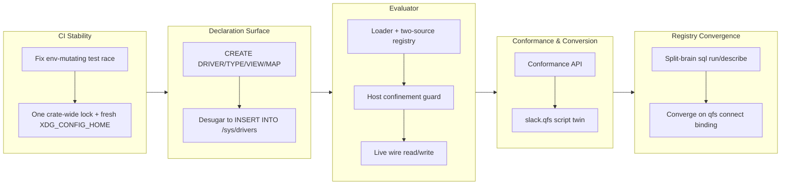

## 1. Overview

This branch first cleared a CI-blocking race in the env-mutating test suite, then delivered the entire blueprint §13 self-hosting-integrations feature end to end: a declaration surface for driver-as-script (`CREATE DRIVER/TYPE/VIEW/MAP` persisted to `/sys/drivers`), an evaluator that turns those rows into a live, host-confined wire mount, and a conformance check proven against the first compiled-to-script conversion (a `slack.qfs` twin of the compiled Slack driver). It closed by converging the long-standing split-brain `/sql` run/describe registries onto the canonical `qfs connect` binding, so a single connection mechanism now drives both.

**Highlights:**

1. Implemented the full blueprint §13 self-hosting-integrations feature as a strict-serial trio: the declaration surface (`CREATE DRIVER/TYPE/VIEW/MAP` desugaring to `INSERT INTO` the new `/sys/drivers` registry), the evaluator (compiled-wins two-source registry resolution, live wire read/write reconstructed from stored rows, and a three-layer host-confinement guard pinning each declared driver to its own host), and conformance (a public declared-type-vs-delivered-columns check) proven via the first compiled→script conversion, `slack.qfs`.
2. Converged the split-brain `/sql` run and describe registries onto the canonical `qfs connect` (`path_binding`) mechanism, so one connection now wires both the runtime driver and the describe mount instead of the two reading disjoint sources.
3. Landed a security-critical host-confinement boundary for declared drivers (`allowed_hosts` enforced at the single `send_one` dispatch chokepoint), ensuring an LLM-generated integration script cannot read one service and silently write to another.
4. Fixed a CI-blocking race in the env-mutating qfs-crate tests by serializing them on one non-poisoning crate-wide lock, each opening a fresh `XDG_CONFIG_HOME` tempdir instead of falling back to the shared `HOME` config store.

## 2. Motivation

The driving idea, per blueprint §13, is that an integration should be authored as an ordinary qfs script rather than a compiled Rust driver, so an LLM (or a human) can add a new external service without touching the closed core. Realizing that meant building three things in strict sequence: a way to declare a driver/type/view/map and persist it, a way to evaluate those declarations into a genuinely live, network-reachable mount without opening a security hole, and a way to check that what was declared matches what a live read actually delivers — validated once, honestly, against a real conversion of the existing Slack driver. Alongside that main arc, the branch also had to clear a flaky, CI-blocking test race before other work could land reliably, and to resolve a pre-existing split-brain in the `/sql` connection registries whose two halves silently read different sources, so that finishing §13 didn't leave a known inconsistency unaddressed.

## 3. Changes

The branch opened by stabilizing CI, isolating flaky env-mutating tests behind one lock and a fresh config home so the rest of the session's work could land on green. It then pursued blueprint §13 in strict sequence: first the declaration surface letting a script define a driver/type/view/map into `/sys/drivers`, then an evaluator turning those declarations into a live, host-confined wire mount, then a conformance check validated against converting the compiled Slack driver into its own script twin. It closed by fixing a pre-existing split-brain between the `/sql` run and describe registries, unifying both onto the canonical `qfs connect` binding.

### 3-1. Declared-driver declaration surface ([774869b](https://github.com/qmu/qfs/commit/774869b))

Added the §13 declaration grammar — `CREATE DRIVER` / `CREATE TYPE` / path-named `CREATE VIEW` / `CREATE MAP` — desugaring in-parser to `INSERT INTO /sys/drivers` rows (new `sys_drivers` table, migration 14), with zero new `Statement` variants or `EffectKind`. `AUTH` is credential-free by construction: no clause can carry a secret.

### 3-2. Declared-driver evaluator ([2ca3a04](https://github.com/qmu/qfs/commit/2ca3a04), foundation [66669aa](https://github.com/qmu/qfs/commit/66669aa))

Turned stored `/sys/drivers` rows into a live wire mount: a two-source registry resolves `CONNECT` against compiled ∪ declared drivers (compiled wins, shadow reported), a declared driver reads/writes live over the wire via a reconstructed `RestApiConfig`, and a three-layer host-confinement boundary (structural body check, `allowed_hosts` config, and the single `send_one` chokepoint) stops a generated script from exfiltrating to a foreign host. The `/rest/<api>/<resource>` path impedance was solved non-invasively via `MountRemap::new_prefixed`.

### 3-3. Conformance + first Slack conversion ([b59a408](https://github.com/qmu/qfs/commit/b59a408))

Added a public conformance API reconciling a declared view's `OF` type against delivered rows (§5's drift check aimed outward), and `slack.qfs` — the first script twin of a compiled driver — which parses, installs, and reads hermetically, with five parity gaps recorded as named §13 parks rather than hidden.

### 3-4. Converge the `/sql` split-brain ([f67ef53](https://github.com/qmu/qfs/commit/f67ef53))

Converged the runtime sql driver build and the describe mount onto the canonical `path_binding` source, so a `qfs connect /sql/<conn>` binding now wires both — `describe /sql/<conn>/<table>` finally works and reflects the live catalog after `CREATE TABLE`. Env-var/`connections.qfs` remain as read-only fallback shims.

### 3-5. Serialize env-mutating tests ([949f767](https://github.com/qmu/qfs/commit/949f767))

Fixed the CI-blocking env-test race: every env-mutating qfs-crate test now serializes on one non-poisoning crate-wide lock and opens a fresh `XDG_CONFIG_HOME` tempdir, with a `cfg(test)` guard that panics rather than ever falling back to the shared `HOME` config store.

## 4. Outcome

- Shipped blueprint §13 "self-hosting integrations" end-to-end — an LLM-authored qfs script becomes a live, credential-free driver:
  - **Declaration surface** (774869b): `CREATE DRIVER` / `CREATE TYPE` / path-named `CREATE VIEW` / `CREATE MAP` desugar in-parser to `/sys/drivers` rows (new `sys_drivers` table, migration 14); `AUTH` is credential-free by construction — no clause can carry a secret.
  - **Evaluator** (66669aa, 2ca3a04): a two-source registry resolves `CONNECT` against compiled ∪ declared drivers (compiled wins, shadow reported); a declared driver reads/writes live over the wire via a reconstructed `RestApiConfig`; three-layer host confinement (structural body check, `allowed_hosts` config, and the `send_one` chokepoint) stops an LLM-generated script from exfiltrating to a foreign host.
  - **Conformance + first conversion** (b59a408): a public conformance API reconciles a declared view's `OF` type against delivered rows (§5's drift check aimed outward); `slack.qfs` is the first script twin of a compiled driver, installed and read hermetically, with five parity gaps honestly recorded rather than hidden.
- **Converged the `/sql` connection split-brain** (f67ef53): `qfs connect` now wires both the runtime sql driver and the describe mount from one `path_binding` source, so `describe /sql/<conn>/<table>` finally works and reflects the live catalog after `CREATE TABLE`.
- **Fixed the env-mutating test race** that had started failing CI and blocking release (949f767): every env test now serializes on one non-poisoning lock and opens a fresh `XDG_CONFIG_HOME` tempdir, with a `cfg(test)` guard against ever falling back to the shared `HOME`.
- Test suite grew to 2044 passing tests across the branch's six substantive commits; clippy/fmt/gen-docs/gen-skills stayed green throughout; patch bumped 0.0.21 → 0.0.22.
- 5 tickets archived: declared-driver surface, declared-driver evaluator, conformance + Slack twin, sql split-brain, env-test hygiene.

## 5. Historical Analysis

- The env-test race was a known, previously-deferred follow-up (flagged in the SQLite DBMS ticket as "pass fully serialized") that graduated from a flaky note to an actual release blocker once it failed CI on PR #19 — a recurring pattern in this repo where a documented-but-unfixed follow-up eventually forces itself onto the critical path.
- The `/sql` split-brain is the second instance this branch of a "two independently-evolved registries reading different sources" defect class; PR #11's deferred concern about the `CLOUD_DRIVERS` consent set vs. the `s3`/`r2` driver ids is the same shape (a mismatch between the registry gating access and the registry actually serving requests) — worth watching whenever a new addressable resource gets more than one registration path (runtime driver build vs. describe mount vs. consent gate).
- Blueprint §13 (self-hosting integrations) was approved 2026-07-04 and implemented the same week across three dependent tickets (surface → evaluator → conformance), each landing as a strict-serial gated increment where the next ticket only started once the prior one's acceptance criteria were green — mirroring the CONNECT epic's own incremental-delivery style from earlier PRs.
- The `/rest/<api>/<resource>` path-impedance discovery (documented mid-branch, solved via `MountRemap::new_prefixed`) repeats a now-familiar resolution style in this codebase: when a new addressing shape collides with a shipped driver's hard-wired path assumption, the fix is a non-invasive mount-adapter change rather than touching the driver, keeping the compiled surface untouched.

## 6. Concerns

### (carried from PR #11) /cf live (203090) unimplemented; /cf and /rest are placeholder mounts

- **Severity:** low
- **Description:** `/cf` and `/rest` are reachable, cred-free planning/describe mounts, but live credentialed read/commit and per-resource config (which D1/KV/queues; which REST resource maps) remain a follow-up needing a richer connection declaration; `/cf` live verification needs the owner's Cloudflare token, so 203090 stays deferred (see [3c6f995]).
- **How to Fix:** Design a per-resource connection declaration beyond the current (driver, locator, secret) shape, then wire read/apply facets and live-verify with the owner's token.

### (carried from PR #11) Cloud reads panicked under runtime-within-runtime blocking

- **Severity:** moderate
- **Description:** Every cloud read facet's client drives the shared reqwest transport via its own `block_on`; called from inside the async read executor this panics with "Cannot start a runtime from within a runtime" ([613c1f5], [cf08355]). Only objstore was guarded on PR #11, so gmail/gdrive/ga/github/slack live reads could crash the process, and the class is easy to reintroduce because the hermetic mock-client path never exercises it.
- **How to Fix:** Run any blocking transport call on a dedicated OS thread (`std::thread::scope`) with no tokio context, turning a panic into a structured secret-free error, and apply the same treatment to every future blocking-transport integration — including this branch's declared-driver wire calls.

### (carried from PR #11) EXTEND on the read path is now a real operation (behaviour change)

- **Severity:** moderate
- **Description:** `EXTEND` was previously a silent no-op on reads; it now actually computes per-row values ([b5a4eec]) — a correctness fix but a behaviour change, since any pipeline that accidentally relied on the old no-op now behaves differently, and array/struct literal forms became expression constructors (an experimental hard break).
- **How to Fix:** Audit cookbook/tests for `EXTEND` uses and call the change out prominently in the release note so downstream scripts expecting the old no-op behaviour are updated.

### (carried from PR #11) /git @<ref> tree/blob reads and nested subtrees still limited

- **Severity:** low
- **Description:** Time-travel works for commits/refs/tags and for `@<ref>` tree and single-blob reads ([c5cfa89], [794d8f8], [8075c77]), but blob reads resolve flat-tree only — nested subtree paths remain out of scope.
- **How to Fix:** Extend blobfs dispatch to resolve nested subtree paths, keeping the structured `invalid_path` fail-closed for genuinely missing paths.

### (carried from PR #11) /local write materialization is narrow

- **Severity:** low
- **Description:** Local writes persist and a positional single-column payload maps onto the blob ([0373cd2]), but a multi-column payload with no `content` column still errors — the user must name the blob column explicitly.
- **How to Fix:** Keep the single-column fallback strict by design, document that multi-column local writes must name the blob column, and watch the `commit.rs` → `effect.rs` content-blob threading for other write paths that might need the same treatment.

### (carried from PR #11) Markdown codec token and objstore consent-gate reconciliation

- **Severity:** low
- **Description:** The markdown codec resolves as `md` ([69fd0c8]), but separately the `CLOUD_DRIVERS` consent set lists `objstore` while the actual driver ids are `s3`/`r2` ([cf08355]), so the bind-consent gate is effectively off for s3/r2.
- **How to Fix:** Align the `CLOUD_DRIVERS` consent set with the actual `s3`/`r2` driver ids so the bind gate governs object-storage reads consistently.

### (carried from PR #11) Postgres/MySQL declarations for the declared-registry path are partial

- **Severity:** low
- **Description:** Live Postgres/MySQL `/sql` backends work when configured ([ca67fb8]), but the `CREATE CONNECTION` declared-registry path was historically SQLite-only, and `sql`/`git` still ride the older declared-connection seam rather than the `path_binding` registry this branch's split-brain fix converged `sql` onto. NUMERIC/TIMESTAMP/UUID/JSON round-trips and `--` comments in `connections.qfs` remain uncovered.
- **How to Fix:** Move `git` onto `path_binding` the same way this branch moved `sql`, broaden column-type coverage for Postgres/MySQL, and add comment support to the connections parser.

### (carried from PR #11) project.db migration mismatch / store flakiness (203120)

- **Severity:** moderate
- **Description:** A pre-existing `~/.config/qfs/project.db` migration mismatch surfaces intermittently during live verification ([30e5ca7], [cd41ddb]); this branch's env-test fix (949f767) hardened test isolation around env-mutating tests, not the underlying migration-runner mismatch itself, which remains open and rises in stakes now that `project.db` is the single source of truth for path bindings.
- **How to Fix:** File/confirm a ticket for 203120, reproduce deterministically, and audit the migration runner's isolation; every future in-place-edit-that-ships should add its own `SUPERSEDED_BODIES` entry.

### (carried from PR #15) Commit-side apply registry still binds quietly

- **Severity:** low
- **Description:** The scan-time unlock covers reads; the commit-side apply registry still opens the credential store only through the quiet paths, so a terminal `--commit` against a cloud mount without `QFS_PASSPHRASE` can still fail its bind silently ([96c936a] in `packages/qfs/crates/qfs/src/shell.rs`). This branch's declared-driver evaluator adds a second instance of the same shape (see the new concern below).
- **How to Fix:** Apply the same lazy, prompt-at-proven-need treatment to `commit.rs`'s cloud apply drivers, and extend it to the declared-driver connect path once addressed.

### (carried from PR #18) 170000 Quality Gate #5 — owner live vault-unlock confirmation

- **Severity:** low
- **Description:** The session-unlock's live confirmation on the real headless host cannot be run by an agent — it needs the owner's hands on the actual machine, so this quality gate stays open pending manual verification.
- **How to Fix:** Owner runs the three-step live check post-merge.

### (carried from PR #18) Console bundle pin unset; live serve + release stamp pending the plgg bundle

- **Severity:** low
- **Description:** The console delivery machinery is complete and tested, but `PINNED_BUNDLE` is still empty — no bundle URL+hash has been stamped, so live serving of the console is not yet wired to a real release.
- **How to Fix:** When the plgg bundle publishes, stamp its URL+hash into `PINNED_BUNDLE` and wire the real live-serve path.

### (carried from PR #18) Materialized-view freshness recording is not wired

- **Severity:** low
- **Description:** `last_run` is a readable column on `/server/views` (honestly reporting `null`), but nothing yet stamps it — the refresh step does not record when a materialized view was last refreshed.
- **How to Fix:** Have the materialize/refresh step stamp `last_run` into the view's config row the same way other config writes land.

### §13 conversion parity: the Slack script twin diverges from the compiled driver on five named parks

- **Severity:** moderate
- **Description:** Converting the compiled Slack driver to a script twin (`slack.qfs`, ticket 145138, commit b59a408) proved the self-hosting ratchet but surfaced five honest parity gaps: (1) envelope unwrapping — Slack wraps results in `{ok, messages}` so a tier-1 declared view decodes one envelope row, not the message rows the compiled driver unwraps; (2) nested cursor — `response_metadata.next_cursor` is nested but the tier-1 cursor descriptor only reads a top-level field; (3) weak typing — the declared json-decode yields json-object columns where the compiled driver yields typed columns; (4) dotted mount segments — Slack's dotted methods (`conversations.history`) make the mount path read as `/slack/conversations.history` rather than hierarchically; (5) POST body shape — `chat.postMessage` needs a specific `{channel, text}` body but the tier-1 MAP just passes the row through. A related surface gap: blueprint §13's own map-body example (`VALUES (ENCODE json)`) does not parse because `ENCODE` is a pipe op, not a value expression, so the declared-driver surface ticket (145136) substituted the driver's default codec instead of extending the effect grammar.
- **How to Fix:** Feed all six gaps back into blueprint §13 as named parks (already recorded on the tickets); implement a post-decode pipe op (e.g. an expand/field-extract) for envelope unwrapping and nested-cursor extraction, apply the `OF` type to the raw decode, support dotted/hierarchical mount addressing, add a per-map body-shape mapping, and either declare a map codec clause or add one to the grammar — only then does the runtime declared-vs-compiled byte-for-byte comparison become meaningful.

### Tier-1 declared-driver scope stops short of view-body-expansion, per-map IRREVERSIBLE, and redirect confinement

- **Severity:** moderate
- **Description:** The evaluator (ticket 145137, commit 2ca3a04) deliberately ships tier-1 only: a declared read/write is a native RestDriver read/write with no view-body-expansion engine, so a post-decode pipe op beyond tier-1, honoring the per-map `IRREVERSIBLE` gate, and a reqwest redirect-policy layer scoped to the declared driver's confined host are all named parks rather than implemented behavior. Redirect confinement matters because reqwest follows 30x redirects internally (`client.rs:66`) and the `send_one` chokepoint guard does not see a redirect target before reqwest follows it.
- **How to Fix:** Scope a `redirect::Policy` (none, or host-checking) to the declared driver's transport so a 30x cannot leave the confined host, wire the per-map `IRREVERSIBLE` flag through the MAP apply path, and add the post-decode pipe-op layer once a concrete declared driver needs it beyond tier-1.

### Declared-driver live read/apply eagerly opens the credential store

- **Severity:** low
- **Description:** The evaluator's live read/apply wiring (`commit.rs::live_registry`, ticket 145137, commit 2ca3a04) eagerly opens the credential store whenever a declared driver is connected, rather than lazily binding it only when a request actually needs a secret — the same quiet-eager-bind shape already flagged for the commit-side cloud apply registry (carried concern above, PR #15).
- **How to Fix:** Apply the cloud facets' lazy-bind, prompt-at-proven-need pattern to the declared-driver connect path once it's implemented for `commit.rs`'s cloud apply drivers generally, so the two converge on one fix.

## 7. Successful Development Patterns

- **In-parser desugar reusing the CREATE TABLE/CONNECT precedent** (774869b): `CREATE DRIVER`/`TYPE`/`VIEW`/`MAP` all desugar to an ordinary `INSERT` effect with zero new `Statement` variants and zero new `EffectKind`, so the closed-core statement lock and the keyword-freeze lock both stayed untouched even though four new statement forms landed — proof the grammar's contextual-ident-plus-effect-desugar design scales to a whole new declaration surface without opening the core.
- **The MountRemap two-segment fix that avoided touching the shipped /rest driver** (66669aa/2ca3a04): rather than rewrite `RestDriver`'s hard-wired `/rest/<api>/<resource>` path assumption, `MountRemap::new_prefixed` accepts an explicit two-segment inner prefix, so a declared mount composes onto the stock driver with zero change to its addressing — a reusable pattern for the next path-shape collision between a new addressing scheme and an existing compiled driver.
- **Conformance as §5's drift check aimed outward** (b59a408): reusing the same set-difference machinery that already reconciles a SQL table's catalog drift, but pointed at a declared type vs. the rows a live service actually delivers, turned an internal correctness check into an external acceptance test an LLM (or a user) can run interactively after generating a script — one piece of machinery serving two audiences.
- **The send_one single-chokepoint confinement** (66669aa/2ca3a04): host confinement for LLM-generated scripts is enforced once, at the single `send_one` point every request (first page, cursor/link follow-ups, writes) funnels through, rather than scattered per-call-site checks — pagination and MAP writes automatically inherit the guarantee, and the three-layer defense (structural body check, `allowed_hosts` config, and the runtime chokepoint) means no single layer is load-bearing alone.
- **Running the whole trio strict-serial with continuous gating** (774869b → 66669aa → 2ca3a04 → b59a408 → f67ef53): each of the three dependent §13 tickets (surface, evaluator, conformance) only started once the prior one's acceptance criteria and full quality gate (`cargo test`/clippy/fmt/gen-docs/gen-skills) were green, and the sql split-brain fix landed as its own gated commit — a discovered blocker (the `/rest` path impedance) was documented in-ticket with two named solution approaches rather than papered over, so the next session picked one and shipped instead of re-discovering the problem.

## 8. Release Preparation

**Verdict**: Ready for release

### 8-1. Concerns

- None blocking. All quality gates are green: `cargo test --workspace` 2044 passed / 0 failed, `clippy --workspace --all-targets -D warnings` clean, `fmt --all --check` clean, `gen-docs --check` and `gen-skills --check` both in sync. The §13 tier-1 parks and the eager-credential-open item in section 6 are forward-looking follow-ups, not release blockers — the shipped surface is internally consistent and hermetically tested.

### 8-2. Pre-release Instructions

- None — the patch is already bumped (0.0.21 → 0.0.22, in the env-hygiene commit); standard release process applies.

### 8-3. Post-release Instructions

- Tag and push `v0.0.22` per CLAUDE.md Deploy (`git tag -a v0.0.22 -m "qfs v0.0.22" && git push origin v0.0.22`) so `release.yml` builds the four native tarballs.
- The carried owner Quality Gate #5 (live vault-unlock confirmation on the real host) is an owner-run check, not release-gating.
- No plugin re-version needed: no skill-mentioned CLI surface changed (the `/sql/<conn>` connect model lives in `docs/guide/cli.md`, not a skill; the cookbook already teaches `/sql/<conn>/<table>`).

## 9. Notes

This branch was produced by an overnight autonomous `/drive`. Every drivable ticket in the queue was finished (env-test hygiene + the full §13 trio + the split-brain fix); what remains in `todo/` is held on owner input (create-account's 4 design decisions, cf-live's Cloudflare token) or is a tracking epic. Two owner decisions were resolved mid-drive and baked into the tickets: the canonical local-connection mechanism is `qfs connect`, and the SQL path model is connect-at-`/sql/<conn>`.

## Deployment Evidence

- **When:** 2026-07-05T13:57:44+09:00
- **Target:** qfs GitHub Release (release-on-tag)
- **Method:** pre-merge readiness proof (7-gate + version)
- **Status:** pass
- **Observed:** build clean, cargo test --workspace 2044 passed 0 failed, clippy -D warnings clean, fmt --check clean, gen-docs --check in sync, gen-skills --check in sync, Cargo.toml version 0.0.22 ahead of main 0.0.21

## Deployment Evidence

- **When:** 2026-07-05T14:06:28+09:00
- **Target:** qfs GitHub Release (release-on-tag)
- **Method:** post-merge promotion check (gh release view v0.0.22)
- **Status:** pass
- **Observed:** Release v0.0.22 published, isDraft false, with all four native tarballs (qfs-aarch64-apple-darwin, qfs-x86_64-apple-darwin, qfs-aarch64-unknown-linux-musl, qfs-x86_64-unknown-linux-musl) plus their sha256 sums; https://github.com/qmu/qfs/releases/tag/v0.0.22
