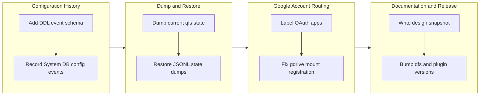

# Branch story - `work-20260707-025845` (qfs v0.0.27)

## 1. Overview

This branch turns qfs configuration state into an inspectable, replay-aware, secret-free operational
surface. It adds a System DB DDL/config event log, `qfs dump` and `qfs restore`, labeled Google OAuth
apps, a Google Drive mount alias fix, and a reorganized current-design documentation snapshot, then
bumps qfs to `0.0.27` and the qfs plugin to `0.3.1`.

**Highlights:**

1. qfs now records replayable, secret-redacted DDL/config events for System DB-backed configuration writes.
2. Operators can export and restore current qfs configuration state with `qfs dump` / `qfs restore`.
3. Google OAuth apps are labeled, so cross-organization Google accounts can use the right client credentials.
4. Google Drive mounts connected as `/gdrive` now resolve for describe and commit while preserving qfs routing.
5. The docs now include a current design snapshot and regenerated qfs skills teach the labeled app flow.

## 2. Motivation

The branch started from an operator design question: qfs should have event-sourcing style
configuration history, a current-state snapshot, and a dump/restore path without requiring
database-migration-style down scripts or raw SQLite backup semantics. While implementing that state
model, the branch also closed the Google account/app gap that blocked cross-organization Drive use
and corrected the docs so operators and agents see today's design as one coherent model instead of
a pile of incremental notes.

## 3. Changes

The work progressed from data foundations to operator workflows. First it created the event-log
schema and transactionally wired System DB configuration writes into that history. Then it exposed
the current state through a deterministic JSONL dump and preview-by-default restore. With state
management in place, the branch fixed Google app/account selection and Drive mount routing, then
reorganized docs and generated skills so the shipped surface is what operators and agents learn.

### 3-1. Add Replayable DDL Event Log Schema ([624caf8](https://github.com/qmu/qfs/commit/624caf8))

This ticket added the System DB `sys_ddl_events` schema and pure hash-chain model for replayable
configuration history. The event log stays separate from `/sys/audit`, preserving audit's bounded
metadata contract while giving qfs a durable payload-bearing history stream.

### 3-2. Record DDL Events When Config State Changes ([3385eb3](https://github.com/qmu/qfs/commit/3385eb3))

This ticket wired the new event log into System DB-backed configuration writes. Policies, settings,
billing rows, provider billing updates, and declared-driver inserts now append secret-redacted DDL
events in the same SQLite transaction as their current-state mutations.

### 3-3. Add Secret-Free qfs State Dump ([1e3da91](https://github.com/qmu/qfs/commit/1e3da91))

This ticket added `qfs dump --format jsonl [--include-events]` as a deterministic backup and review
surface. It exports current qfs configuration state without selecting credential values, and can add
DDL event rows as provenance after the current-state records.

### 3-4. Restore and Replay qfs State Dumps ([137d1ac](https://github.com/qmu/qfs/commit/137d1ac))

This ticket added `qfs restore <dump.jsonl> [--commit]`. Restore previews by default, validates the
dump format, applies supported current-state records only with `--commit`, skips historical event rows
as external provenance, and records fresh local audit/DDL events for System DB-backed restored writes.

### 3-5. Multiple OAuth apps per provider ([f1557fd](https://github.com/qmu/qfs/commit/f1557fd))

This ticket made Google OAuth apps labeled registrations instead of a single provider-wide slot.
`qfs app add google <label>`, `qfs account add google --app <label>`, `CONNECT ... APP`, `/sys`,
dump, restore, and the Google resolver now carry the app label so a cross-organization account does
not refresh through the wrong client credentials. Report-time release-gate work also updated the
CLI e2e tests and token-import help text to use the required app labels.

### 3-6. RESUME checkpoint - v0.0.26 shipped; owner-gated queue ([96829cf](https://github.com/qmu/qfs/commit/96829cf))

This archival step removed a stale carry checkpoint from the active queue after the next-action
decision was executed. It kept the backlog honest: the multi-OAuth path moved to implemented work,
while owner-live and design-gated tickets stayed queued as future work.

### 3-7. Fix GDrive Mount Registration ([d3d7888](https://github.com/qmu/qfs/commit/d3d7888))

This fix treats `gdrive` and `drive` as aliases at the cloud-mount boundary. A mount connected as
`/gdrive` keeps its outer qfs routing id while the Google Drive driver receives the inner Drive
namespace it expects, so describe and commit register under the correct mount id.

### 3-8. Reorganize qfs documentation as a current design snapshot ([e8c0d82](https://github.com/qmu/qfs/commit/e8c0d82))

This ticket added a canonical current-design snapshot and updated nearby guides, cookbooks, source
comments, runtime hints, and generated qfs skills. The docs now present defined paths, mount-bound
accounts, labeled OAuth apps, `/sys`, DDL history, dump/restore, automation, and operational gates as
one current design.

### 3-9. Bump version for qfs 0.0.27 ([20ae52c](https://github.com/qmu/qfs/commit/20ae52c))

The report preparation bumped the binary release version from `0.0.26` to `0.0.27`. Because the
branch changes generated skills and the account/setup surface they teach, the qfs plugin metadata was
also bumped from `0.3.0` to `0.3.1`.

### 3-10. Align Google account CLI tests with app labels ([03b6d6b](https://github.com/qmu/qfs/commit/03b6d6b))

The release gate exposed stale e2e setup commands that still used unlabeled Google app/account
syntax. This follow-up updated those tests and the token-import help examples to use `qfs app add
google <label>` and `qfs account add google ... --app <label>`.

### 3-11. Quiet release gate clippy findings ([bc00d62](https://github.com/qmu/qfs/commit/bc00d62))

The final ship gate surfaced lint-only issues around the expanded app-label binding helpers and a
JSON replay fallback. This follow-up keeps the existing row-shaped helper APIs explicit and applies
the mechanical eager-fallback fix so the workspace passes with `-D warnings`.

## 4. Outcome

- qfs gained a secret-free DDL/config history stream for System DB-backed current-state writes.
- qfs gained `dump` and `restore` CLI surfaces for deterministic JSONL backup, review, migration, and recovery of current configuration state.
- Google app/account selection now supports multiple labeled OAuth apps per provider and documents the cross-organization path.
- Google Drive mount routing now accepts `/gdrive` without losing the internal Drive namespace expected by the compiled driver.
- Operator documentation and generated qfs skills now describe the current model: defined paths, mount-bound accounts, labeled apps, `/sys`, DDL history, dump/restore, and automation gates.
- CLI e2e tests now exercise the required labeled Google app/account setup flow.
- The release gate is clean under workspace tests, clippy `-D warnings`, formatting, docs generation, and skill generation.
- qfs is prepared for release as `0.0.27`, with the qfs plugin prepared as `0.3.1`.

## 5. Historical Analysis

This branch extends several earlier design decisions rather than replacing them. The `CREATE ACCOUNT`
and `/sys/accounts` work established account consent as selectors-only state, which made it possible
to add an app label without moving secrets into statements. The existing `/sys/audit` hash-chain
model proved useful as discipline, but the branch deliberately kept replay payloads in a separate
`sys_ddl_events` log so audit remains metadata-only. The prior preference for replay through ordinary
qfs writes also shaped restore: the branch restores supported current-state records through qfs
backends instead of importing raw SQLite rows.

## 6. Concerns

### Project DB configuration events are not yet in the DDL event log

- **Severity:** moderate
- **Description:** System DB-backed writes append DDL events transactionally, but Project DB-backed path/account state cannot share that transaction boundary yet (see [3385eb3](https://github.com/qmu/qfs/commit/3385eb3) in `packages/qfs/crates/qfs/src/sys.rs`).
- **How to Fix:** Add a Project DB event writer for `path_binding` and account/app consent mutations, with the same secret-redaction and hash-chain discipline, or introduce a cross-store event envelope that makes the two stores' boundaries explicit.

### Live Google Drive upload was not re-run for the gdrive alias fix

- **Severity:** low
- **Description:** The `/gdrive` fix is covered by hermetic mount, describe, and lazy apply-registry tests, but no live Google Drive upload was performed in this branch (see [d3d7888](https://github.com/qmu/qfs/commit/d3d7888) in `packages/qfs/crates/qfs/src/commit.rs`).
- **How to Fix:** When owner credentials are available, run a live `/gdrive` upload and read-back smoke test against a disposable Drive file, then record the result in a follow-up ticket or release note.

### Live-only providers remain outside local proof

- **Severity:** low
- **Description:** The design snapshot intentionally documents live-only gates for external providers, but local tests still prove only parser, preview, registry, and hermetic mock behavior for those services (see [e8c0d82](https://github.com/qmu/qfs/commit/e8c0d82) in `docs/guide/design-snapshot.md`).
- **How to Fix:** Keep owner-live acceptance tickets for provider-specific paths such as Cloudflare, Postgres, and Google Drive, and record each credentialed verification separately from the hermetic release gate.

### (carried from PR #11) /cf live (203090) unimplemented; /cf and /rest are placeholder mounts

- **Severity:** low
- **Description:** `/cf` and `/rest` remain reachable, credential-free planning/describe mounts, but live credentialed read/commit and per-resource config still require richer connection declarations.
- **How to Fix:** Design per-resource connection declarations, wire read/apply facets, and live-verify with the owner's Cloudflare token.

### (carried from PR #11) Cloud reads panicked under runtime-within-runtime blocking

- **Severity:** moderate
- **Description:** The deferred concern says blocking transport calls can reintroduce tokio runtime-within-runtime panics in future cloud read integrations.
- **How to Fix:** Run blocking transport calls on dedicated OS threads and keep future blocking integrations covered by tests that execute from the async read executor.

### (carried from PR #11) EXTEND on the read path is now a real operation

- **Severity:** moderate
- **Description:** `EXTEND` now computes per-row values instead of being a silent no-op, so scripts that accidentally relied on the old behavior need release-note visibility.
- **How to Fix:** Keep cookbook/tests audited for `EXTEND` usage and call out the behavior in the release notes.

### (carried from PR #11) /local write materialization is narrow

- **Severity:** low
- **Description:** Single-column local write fallback is intentionally strict, while multi-column payloads still need a named blob/content column.
- **How to Fix:** Document the local-write shape and keep the commit/effect content-blob threading narrow.

### (carried from PR #11) Postgres/MySQL declarations for the declared-registry path are partial

- **Severity:** low
- **Description:** The remaining active sub-item is live Postgres value round-trips for NUMERIC, TIMESTAMP, UUID, and JSON.
- **How to Fix:** Complete the queued live Postgres value-round-trip ticket and retire this carried concern once that acceptance gate passes.

### (carried from PR #18) owner live vault-unlock confirmation

- **Severity:** low
- **Description:** The owner live vault-unlock confirmation on the real headless host still requires a credentialed owner run.
- **How to Fix:** Owner runs the documented live check and records the result.

### (carried from PR #18) Console bundle pin unset

- **Severity:** low
- **Description:** Console delivery machinery remains parked until the plgg bundle publishes and can be pinned with URL and hash.
- **How to Fix:** Stamp the published bundle URL/hash into the console pin and run the live serve/release verification.

### (carried from PR #18) Materialized-view freshness recording is not wired

- **Severity:** low
- **Description:** `last_run` is readable on `/server/views`, but refresh/materialization does not stamp it yet.
- **How to Fix:** Implement the queued materialized-view refresh ticket so refresh records `last_run` into the view config row.

### (carried from PR #0) CREATE ACCOUNT deferred edges

- **Severity:** low
- **Description:** `CREATE ACCOUNT` still omits a `SECRET` reference form, and Google email labels cannot be removed through path-addressed `REMOVE /sys/accounts/...` because `@` is path-coordinate syntax.
- **How to Fix:** Add account credential reference resolution before accepting a `SECRET` clause, and support filter-based `/sys/accounts` removal so Google emails ride in string literals.

## 7. Successful Development Patterns

- Keeping `/sys/audit` metadata-only and adding a separate DDL event log preserved the existing audit contract while enabling replayable configuration history.
- JSONL was the right first dump format: it retained structured fidelity and deterministic output without prematurely committing to statement-level restore semantics.
- Restore re-anchors current state by replaying supported rows through qfs backends, which keeps validation and audit/event hooks active and avoids raw SQLite imports.
- The Google app-label work succeeded because it threaded the selector through existing consent, mount, `/sys`, dump, and restore surfaces instead of inventing a second account model.
- Generated qfs skills are downstream of cookbook pages, so running `gen-skills` after setup-doc edits prevents agents from retaining stale command syntax.

## 8. Release Preparation

**Verdict**: Ready for release

### 8-1. Concerns

- None blocking. The concerns above are either known carried follow-ups or live-provider verification boundaries, not blockers for the `0.0.27` release.

### 8-2. Pre-release Instructions

- Run the standard release gate from `.workaholic/deployments/github-release.md`: `cargo build --workspace`, `cargo test --workspace`, `cargo clippy --workspace --all-targets -- -D warnings`, `cargo fmt --all --check`, `cargo run -p xtask -- gen-docs --check`, `cargo run -p xtask -- gen-skills --check`, and confirm `packages/qfs/crates/qfs/Cargo.toml` is `0.0.27`.

### 8-3. Post-release Instructions

- Tag the merge commit as `v0.0.27` and let `.github/workflows/release.yml` publish the native tarballs.
- Confirm the GitHub Release exists, is not a draft, and contains the four native artifacts.

## 9. Notes

The branch also corrected archived ticket `commit_hash` metadata in this story commit so historical
ticket links point at the final commits after amend-based archiving.

## Deployment Evidence

- **When:** 2026-07-07T04:27:57+09:00
- **Target:** qfs GitHub Release v0.0.27
- **Method:** GitHub release-on-tag
- **Status:** pass
- **Observed:** pass: cargo build --workspace; cargo test --workspace; cargo clippy --workspace --all-targets -- -D warnings; cargo fmt --all --check; xtask gen-docs --check; xtask gen-skills --check; branch version 0.0.27 ahead of main 0.0.26
