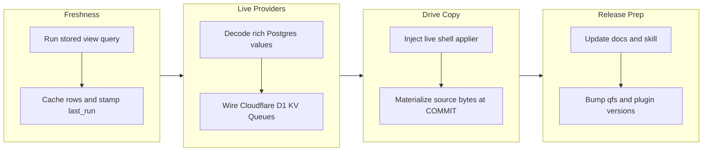

# Branch story - `work-20260707-045409` (qfs v0.0.28)

## 1. Overview

This branch closes four remaining runtime and live-provider gaps in qfs. It adds explicit
materialized-view refresh, broadens Postgres value decoding, wires environment-backed Cloudflare
D1/KV/Queues read and commit paths, fixes the interactive Drive upload commit path, and bumps qfs to
`0.0.28` with the qfs plugin at `0.3.2`.

**Highlights:**

1. Materialized views can now be refreshed explicitly, cache their rows, and stamp `last_run` only on success.
2. Postgres NUMERIC, DATE/TIMESTAMP/TIMESTAMPTZ, UUID, JSON, and JSONB values decode into qfs text values.
3. `/cf` can run live D1, KV, and Queue reads and commits when Cloudflare environment configuration is present.
4. The production REPL now routes `COMMIT` through the live applier and materializes local source bytes before Drive uploads.
5. Docs and qfs Drive skill guidance now teach the supported local-file-to-Drive upload path.

## 2. Motivation

The branch was driven by a cluster of honest-runtime gaps: qfs exposed freshness fields without a
refresh engine, claimed rich SQL type support that Postgres could not decode, kept `/cf` as a
describe-only placeholder, and let the interactive Drive copy path print a committed-looking result
without proving the live object was written. The implementation keeps preview pure and explicit,
then moves real work to confirmed commit or refresh boundaries where failures can be reported.

## 3. Changes

The work moved from server state into provider boundaries and then into operator-facing behavior.
First the server gained a refresh primitive that makes materialized-view freshness real. Then the
live provider layer caught up for Postgres and Cloudflare. Finally the Drive upload bug brought the
interactive shell back onto the same live commit path as one-shot execution, and the docs were
updated so agents stop using fragile giant string literals for file uploads.

### 3-1. `/cf` live — Cloudflare D1 / KV / Queues read+commit ([b9d2ad8](https://github.com/qmu/qfs/commit/b9d2ad8))

This ticket added an environment-backed Cloudflare composition layer. When `CF_ACCOUNT_ID`,
`CF_API_TOKEN`, and resource lists are set, qfs registers a live `/cf` driver, introspects D1
catalogs, serves D1/KV/Queue reads, and wires the same driver into commit; without that
configuration, `/cf` remains fail-closed rather than pretending to commit.

### 3-2. Materialized-view refresh: run the stored query and stamp last_run ([b9d2ad8](https://github.com/qmu/qfs/commit/b9d2ad8))

This ticket added a runtime refresh path and `qfs view refresh`. Refresh executes the saved query
through the normal read registry, serializes the returned `RowBatch` into server state, stamps
`last_run` only after success, and leaves the previous cache/freshness marker untouched on failure.

### 3-3. Postgres NUMERIC / TIMESTAMP / UUID / JSON value round-trips ([b9d2ad8](https://github.com/qmu/qfs/commit/b9d2ad8))

This ticket broadened `pg_value` so rich Postgres OIDs no longer fall through to a failing string
decode. NUMERIC is decoded from PostgreSQL's binary wire format into canonical text, while date/time,
UUID, and JSON values use the supported `postgres` feature adapters and map into qfs text values.

### 3-4. Fix Drive blob upload commit paths for local report copies ([b9d2ad8](https://github.com/qmu/qfs/commit/b9d2ad8))

This ticket fixed the production REPL commit path. The binary now injects the real world applier into
interactive shell sessions, and shell commits reuse the commit-boundary materialization helper before
calling that applier, so `cp /local/... /drive/...` sends materialized source bytes instead of
reporting success through the in-memory recorder.

### 3-5. Bump version for qfs 0.0.28 ([2cc6c4c](https://github.com/qmu/qfs/commit/2cc6c4c))

The report preparation bumped qfs from `0.0.27` to `0.0.28`. Because the branch changes qfs skill
guidance for Drive uploads, the qfs plugin metadata was also bumped from `0.3.1` to `0.3.2`.

### 3-6. CI hardening and architecture-test follow-up ([baff0e1](https://github.com/qmu/qfs/commit/baff0e1), [839d474](https://github.com/qmu/qfs/commit/839d474), [fc141d3](https://github.com/qmu/qfs/commit/fc141d3), [591027c](https://github.com/qmu/qfs/commit/591027c), [33d94b8](https://github.com/qmu/qfs/commit/33d94b8))

The follow-up commits resolved the GitHub Actions failures that surfaced after the first report.
They fixed rustfmt drift, gated a test-only shell helper, matched generated server docs, moved
materialized-view refresh booting behind the existing `qfs-host` seam so the binary no longer
depends directly on `qfs-server`, and relaxed a server refresh test to assert the real canonical
query contract.

## 4. Outcome

qfs now has an explicit materialized-view refresh command, richer Postgres value decoding, a live
Cloudflare path for D1/KV/Queues, and a Drive copy path that commits through the real applier. The
documentation and qfs Drive skill now describe those behaviors, while unavailable provider
configuration still fails closed. GitHub Actions run
[`28821011194`](https://github.com/qmu/qfs/actions/runs/28821011194) passed native build/test,
rustfmt, clippy, wasm, and x86_64/aarch64 cross-compiles on the final branch head.

## 5. Historical Analysis

This branch builds on the existing commit-boundary materialization design from earlier local-copy
work. That prior shape was correct for one-shot execution but had not been reused by the interactive
shell; applying it there closed the false-positive Drive upload behavior without making preview do
I/O. The Cloudflare work also follows the repository's established live-provider pattern: describe
can stay credential-free, while read/apply facets appear only when runtime configuration exists.

## 6. Concerns

### Local Rust verification remains unavailable in this container

- **Severity:** low
- **Description:** `cargo`, `rustfmt`, and `rustup` are still not installed in this container, so local Rust verification cannot be reproduced here. GitHub Actions run [`28821011194`](https://github.com/qmu/qfs/actions/runs/28821011194) passed the required release gates that are available in CI: `cargo build --workspace`, `cargo test --workspace`, `cargo fmt --all --check`, `cargo clippy --workspace --all-targets -- -D warnings`, `cargo build -p qfs-host --target wasm32-unknown-unknown`, and x86_64/aarch64 cross-compiles.
- **How to Fix:** Install the Rust toolchain in the agent container if local reproduction is required; otherwise use GitHub Actions as the release gate for this branch.

### Live provider acceptance still needs credentials

- **Severity:** moderate
- **Description:** Cloudflare, Postgres, and Google Drive behavior is wired but not live-verified in this container because the required provider credentials and live resources were not available (see [b9d2ad8](https://github.com/qmu/qfs/commit/b9d2ad8) in `packages/qfs/crates/qfs/src/cf.rs`, `packages/qfs/crates/qfs/src/sql_backends.rs`, and `packages/qfs/crates/exec/src/shell/session.rs`).
- **How to Fix:** Run the live Cloudflare D1/KV/Queue smoke tests with `CF_ACCOUNT_ID`/`CF_API_TOKEN`, a live Postgres `SELECT` over NUMERIC/timestamp/UUID/JSON columns, and a disposable Drive `cp /local/... /drive/...` upload/read-back check.

### Cloudflare declaration design remains partial

- **Severity:** low
- **Description:** This branch uses explicit environment resource lists because the current `CREATE CONNECTION` shape cannot carry D1 database, KV namespace, and Queue handles cleanly yet (see [b9d2ad8](https://github.com/qmu/qfs/commit/b9d2ad8) in `packages/qfs/crates/qfs/src/cf.rs`).
- **How to Fix:** Design a per-resource Cloudflare declaration format, then migrate the environment-backed composition into declared connection state without losing fail-closed behavior.

## 7. Successful Development Patterns

- Reusing one-shot commit-boundary materialization in the shell avoided inventing a Drive-specific upload shortcut and kept preview pure.
- Keeping Cloudflare live wiring behind environment detection preserved the existing describe-only surface while making configured reads and commits real.
- Decoding Postgres NUMERIC locally as canonical text avoided widening qfs's value model for one backend-specific representation.

## 8. Release Preparation

**Verdict**: Ready to ship with credential-gated live-provider smoke checks deferred

### 8-1. Concerns

- GitHub Actions run [`28821011194`](https://github.com/qmu/qfs/actions/runs/28821011194) passed native build/test, rustfmt, clippy, wasm, and x86_64/aarch64 cross-compiles on the final branch head.
- Live-provider acceptance for Cloudflare, Postgres, and Google Drive still requires credentials/resources outside this environment.

### 8-2. Pre-release Instructions

- Record the green GitHub Actions run as pre-merge release proof.
- Explicitly defer the Cloudflare, Postgres, and Drive live smoke checks unless credentials are made available before merge.

### 8-3. Post-release Instructions

- If live provider checks are deferred, keep follow-up concerns/tickets active and record owner-run evidence after credentials are available.

## 9. Notes

The archived ticket frontmatter contains the pre-final amend hash produced by the archive script;
the actual implementation commit on this branch is `b9d2ad8`.

## Deployment Evidence

- **When:** 2026-07-07T05:31:31+09:00
- **Target:** qfs GitHub Release (release-on-tag)
- **Method:** other
- **Status:** pass
- **Observed:** Pre-merge readiness proof passed on GitHub Actions run 28821011194 for head 33d94b8: cargo build --workspace, cargo test --workspace, cargo fmt --all --check, cargo clippy --workspace --all-targets -- -D warnings, qfs-host wasm32 builds, and x86_64/aarch64 cross-compiles all green; qfs version 0.0.28; plugin version 0.3.2.
