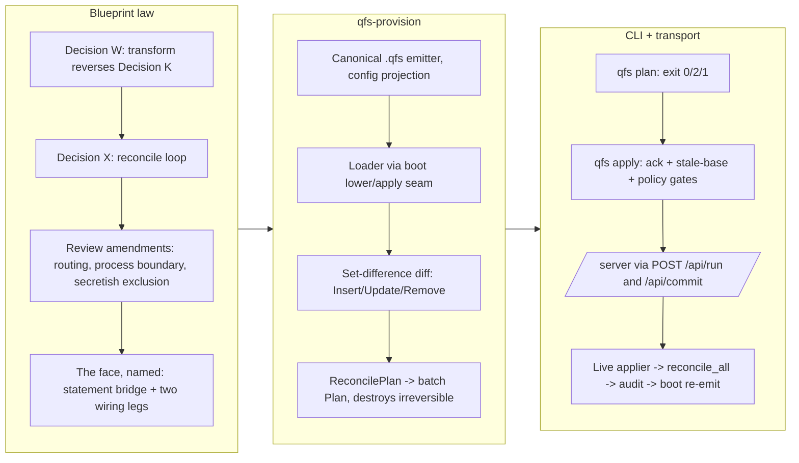

# Branch story - `work-20260707-180554` (qfs v0.0.32)

## 1. Overview

This branch gives qfs a Terraform-style declarative provisioning loop — `qfs plan` / `qfs apply`
over one canonical `.qfs` source-of-truth document — end-to-end for both configuration stores and
live-verified against a running daemon. It also lands the two design decisions the work rests on
as blueprint law: §16 "Provisioning — the reconcile loop" (Decision X), and §15 "transform — the
model-calling pipe stage" (Decision W), which reverses the shipped Decision K absolute that qfs
never calls an LLM. The `transform` grammar seam is landed (parse-only, execution refused with a
structured error); its executable half is the one ticket left open. qfs bumps to `0.0.32`, the
plugin to `0.5.0`.

**Highlights:**

1. `qfs plan` renders an honest add/change/destroy diff of the live configuration against a
   desired-state document (exit 0 no-changes / 2 changes-pending); `qfs apply` converges both the
   `/sys` system-DB store and the live daemon's `/server` bindings, idempotently.
2. Authoritative desired state: a row absent from the document is REMOVEd — behind the existing
   `--commit-irreversible` gate; a stale document base is refused without `--allow-stale-base`.
3. The `/server` half rides the daemon's existing public statement bridge (`POST /api/run|commit`)
   — no new API surface; commits execute inside the daemon so bindings reconcile live, and the
   boot config is atomically re-emitted so an applied reconcile survives restart.
4. Secretish settings are excluded from the document universe (never emitted, diffed, or
   destroyed), and the shipped `qfs restore` flaw that wrote literal `<redacted>` over live
   secretish settings is fixed.
5. Blueprint §15 (Decision W) reverses Decision K into a bounded thesis — qfs may make an
   authenticated outbound model call only through the declared, gated `transform` seam — and the
   contextual-identifier grammar seam is landed with the keyword set still frozen at 39.

## 2. Motivation

An AI coding agent reconfiguring qfs needs what Terraform gives an operator: fetch the whole
current configuration as one editable document, change it, and apply it back — with the diff
visible before anything happens and destruction explicitly acknowledged. qfs already had the
pieces (dump/restore, `ServerWriteOp`, canonical statement specs, preview/commit) but no reconcile:
restore only inserted-or-skipped, no unified fetch spanned both stores, and the server's live
state had no transport. Separately, the owner asked for a model-calling pipeline predicate
(`transform`), which required deciding — as blueprint law, not code-lore — whether qfs may call an
LLM at all. A mid-flight Fable review of the whole plan caught three implementation blockers
(the transform read-to-gate plumbing, the provisioning process boundary, secretish-settings
poisoning) and forced them to be ruled in the blueprint before implementation continued.

## 3. Changes

- **Blueprint** (`docs/blueprint.md`): §15 `transform` (Decision W) — declaration-as-data with
  INPUT/OUTPUT schemas on the entity type system, three cardinality modes derived totally from the
  input shape, exec-layer orchestration routing, irreversible gating with a model-free PREVIEW,
  and structural rejection of `transform` inside stored server bodies. §16 provisioning
  (Decision X) — authoritative desired state as set difference, the canonical document, the
  generation stamp, per-store policy keying, exclusion universe, the process-boundary and
  face rulings, and the `api` policy-resolution convention for the bridge's commit gate.
- **New crate `qfs-provision`**: canonical emitter (config projection only; runtime fields
  `last_run`/`cache_json` never emit and never drift), document loader reusing the boot
  lower/apply seam, per-collection set-difference diff with canonical-spec equality (cosmetic
  formatting is not drift), `build_plan`, and the store-routing `ReconcileApplier` (generic over
  `PlanApplier`; the binary injects the concrete sys applier, preserving leaf confinement).
- **Sys store completed**: shared secretish predicate moved to `qfs-core`; sys policy
  update/remove and setting/driver remove seams on `SystemDbBackend`, each auditing and appending
  a DDL event in the same transaction; `qfs restore` now skips secretish/`<redacted>` values.
- **CLI**: `Command::{Plan,Apply}` with injected launchers; Terraform-style exit codes; three
  distinct refusals (stale base / needs irreversible ack / host not serving).
- **`/server` transport**: a `ReadDriver` facet over the live `ServerState` mounted in the serve
  composition only; `ServerConfigWrite` routed into the live applier over the shared lock, then
  runtime audit + `reconcile_all()` + atomic boot-config re-emission; a non-loopback bind without
  bearer material refuses the commit bridge fail-closed; `apply_server_write` preserves runtime
  fields across replace-by-name.
- **`transform` grammar seam**: `PipeOp::Transform` as a contextual identifier (39 keywords
  unchanged; the closed-core governance lock deliberately moved 18 → 19), refused at lower/eval
  with structured `transform_not_executable` errors until the executable half ships.
- **Docs/skills/versions**: cookbook `automation.md` gains the plan/apply recipe (parse-checked);
  `qfs-automation` skill regenerated; plugin `→ 0.5.0` (all four version fields); qfs `→ 0.0.32`.

## 4. Outcome

Both stores reconcile end-to-end. Hermetic proof: the in-process daemon e2e
(`server_reconcile_end_to_end_through_the_statement_bridge`) drives plan counts, the ack refusal,
three bridge commits, byte-exact convergence on re-read, runtime-field preservation, boot re-emit
reload equality, and a no-op second apply; plus mixed-store reconcile, per-statement policy
refusal, the fail-closed non-loopback lock, and offline-engine non-mount. Live proof (recorded on
the archived ticket): a real `qfs serve` round — plan `1 add / 1 change / 1 destroy` exit 2,
ack-refused then ack-granted apply of 3 effects, an empty re-plan, the re-emitted boot config, and
a restart from that config still planning to no changes. The full workspace suite, clippy
`--all-targets -D warnings`, fmt, gen-docs/gen-skills/check-migrations all pass under a clean
config home. The `transform` executable half remains an open ticket with its grammar seam already
green on this branch.

## 5. Historical Analysis

This branch operationalizes three standing directions. First, "a driver is data" (§13) and
"server is a driver" (§10) date from t30/t42: server config has been data under `/server/*` since
then, and this branch completes the thesis by finally mounting the read facet and routing network
commits into the live applier — the §16 face ruling explicitly found there was no API to design,
only two wiring legs to finish. Second, dump/restore (PR #25) were built as fetch/backup
primitives; this branch promotes them into the reconcile loop they anticipated, and fixes the
`<redacted>` clobber latent in that round-trip since it shipped. Third, Decision K ("qfs NEVER
hosts or calls an LLM") stood since the /claude driver landed; §15 retires the absolute
deliberately — with the hosting half kept — rather than letting a feature erode it silently. The
mid-branch Fable review is itself historically notable: it caught the §7 payload-free-contract
collision and the in-memory-ServerState process boundary before any implementation hit them.

## 6. Concerns

**Resolved by this branch:** the shipped dump→restore round-trip's destructive redaction replay
(literal `<redacted>` written over live secretish settings) — fixed and tested
(`restore_skips_secretish_settings_never_clobbering_live_values`).

**New, deferred from this branch:**

- The `transform` executable half (declaration storage + migration, `ModelProvider` + injected
  applier, three modes, auth activation, the ten-file Decision-K comment sweep) is an open ticket;
  the grammar seam refuses execution honestly until it ships.
- The bridge's commit gate resolves the live `/server/policies` row named `api` — one gate for
  MCP, dashboard, and reconcile alike. Codified in §16, but worth owner awareness: granting the
  `api` policy grants all three clients.
- The live bearer-gated (non-loopback) reconcile round is exercised only by the fail-closed unit
  test; the recorded live verification ran under the loopback dev posture without the OAuth AS.
- Two pre-existing `job::tests` failures reproduce only when `$TMPDIR` contains `--` (the config
  comment-stripper truncates embedded temp paths); they are green under a clean TMPDIR and in CI.
  A path/quote-aware comment stripper is a candidate hardening.

**Pre-existing concerns:** all 22 active deferred concerns were re-judged against this branch;
none are affected by it (this branch touches provisioning, the blueprint, and the transform seam —
not EXTEND, cloud transports, Cloudflare, Postgres, console delivery, or account edges). The eight
`25-carried-*` files are literal duplicates of still-active originals created by a prior ship
extraction and are removed with this report.

## 7. Successful Development Patterns

- **Review before build, as a gate**: the owner-directed Fable review of the entire plan found
  three MUST-fix design holes (routing, process boundary, secretish poisoning) that would each
  have caused mid-implementation design reversals; fixing the blueprint first made five
  implementation increments land without re-deciding anything.
- **Increment cadence with honest stubs**: five green commits (pure core → sys store → CLI
  surface → named-gap stub → ruled face + wiring), each fully tested; the one genuine design
  decision surfaced as a precise `ServerFaceNotWired` refusal instead of an invented admin API.
- **Investigation dissolving a design decision**: what looked like "design a new daemon control
  surface" reduced, under evidence, to "bless the existing statement bridge and wire two legs" —
  §14's no-privileged-API law doing exactly its job.
- **The dep-direction guard caught a real violation** (provision → driver-sys leaf confinement)
  introduced two increments earlier; making the applier generic restored the spine without
  behavior change.

## 8. Release Preparation

- Version: qfs `0.0.32` (`packages/qfs/crates/qfs/Cargo.toml`), plugin `0.5.0` (all four fields; rebased over main's 0.0.31/0.4.2).
- Gates: workspace build/test/clippy/fmt green; `gen-docs --check`, `gen-skills --check`,
  `check-migrations` in sync (clean config home); cookbook recipe parse-checked.
- Tag after merge: `v0.0.32`.

## 9. Notes

The transform implementation ticket (`20260708002200`) remains in the todo queue by design — its
grammar seam ships here; its executable half is the next branch's work. The generated docs did not
change (the `/server` read mount is serve-composition-only, outside the compiled describe
registry).

## Deployment Evidence

- **PR**: [#30](https://github.com/qmu/qfs/pull/30) — merged into `main` as `e7e44ee` (merge commit)
  after a mid-flight `origin/main` merge (main had advanced to `0.0.31`/plugin `0.4.2` via PRs
  #27–#29; versions restacked to qfs `0.0.32` / plugin `0.5.0`).
- **CI**: all checks green on the final head `c698554` (build+test native, clippy `-D warnings`,
  rustfmt, wasm32, both cross-compiles).
- **Local**: full workspace suite 2143 passed / 0 failed (145 suites) under a clean TMPDIR;
  gen-docs / gen-skills / check-migrations in sync.
- **Release**: tag `v0.0.32` on `e7e44ee`; the `qfs release` workflow published
  [v0.0.32](https://github.com/qmu/qfs/releases/tag/v0.0.32) with all four native tarballs +
  sha256 checksums (linux-musl + apple-darwin, x86_64 + aarch64); release notes attached.
- **Live reconcile round** (recorded on the archived ticket): plan 1/1/1 exit 2 → ack-refused →
  ack-granted apply of 3 effects → empty re-plan → boot config re-emitted → restart converged.
