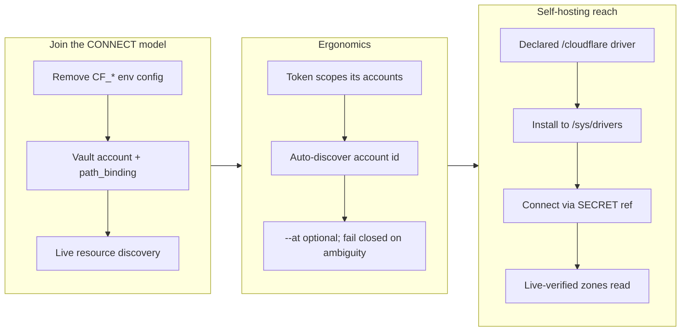

## 1. Overview

This branch brings Cloudflare fully into qfs's uniform connection model and then doubles its reach. It first migrates the compiled `/cf` driver off process-global `CF_*` environment variables onto the vault-backed `qfs account` / `qfs connect` state every other cloud kind uses, makes the Cloudflare account id auto-discoverable so `--at` is optional, and finally ships a **declared** (query-language) Cloudflare driver at `/cloudflare` that covers the broad plain-REST surface with no compiled Rust. The declared driver was live-verified end to end against a real account.

**Highlights:**

1. `/cf` moved to the account/connect model with live resource discovery — `CF_*` env configuration removed entirely.
2. `qfs connect /cf` auto-discovers the account id from the token, so `--at` is now optional (fails closed on a multi-account token).
3. A new declared `/cloudflare` driver (`cloudflare.qfs`) exposes zones, DNS records, and account-scoped KV/Queues/D1 listings — installable, host-confined, credential-free, and live-verified.

## 2. Motivation

Cloudflare was the last cloud integration configured out-of-band: `/cf` read its account id, token, and resource lists from `CF_*` process-global environment variables, out of step with the defined-paths CONNECT model that seals credentials in the vault and records mounts in the project DB. That inconsistency was both an operator wart and a security gap (a live token living in the environment). Once `/cf` joined the CONNECT model, the account id it required by hand was redundant — a token already scopes its accounts — so discovery closed that gap. The declared driver then answers a larger question: rather than write compiled Rust for every Cloudflare REST resource, express the plain-REST surface in qfs's own query language (blueprint §13), so coverage grows as data and users can extend it, while the compiled `/cf` keeps the one thing a declaration cannot express — D1's SQL planner.

## 3. Changes

The branch progresses from parity to ergonomics to reach: it first makes Cloudflare a first-class CONNECT-model citizen, then removes the last piece of required hand-configuration, then demonstrates that whole categories of Cloudflare surface can be added declaratively — proven by a live read of real zones over a host-confined wire.

### 3-1. Migrate Cloudflare live configuration to qfs account/connect state ([b9e1137](https://github.com/qmu/qfs/commit/b9e1137))

Replaced the `CF_ACCOUNT_ID` / `CF_API_TOKEN` / `CF_D1_DATABASES` / `CF_KV_NAMESPACES` / `CF_QUEUES` environment configuration with `qfs account add cf <label>` (token sealed in the vault) plus `qfs connect /cf`. D1 databases, KV namespaces, and Queues are now discovered live from the Cloudflare API at mount time and registered under their human names; `qfs connect --list` shows account and locator metadata with no token value anywhere.

### 3-2. Auto-discover the Cloudflare account id on `qfs connect` ([c7a71b7](https://github.com/qmu/qfs/commit/c7a71b7))

`qfs connect /cf --driver cf --account <label>` now resolves the Cloudflare account id from the stored token (via `GET /accounts`) and persists it, so `--at` is optional. A token that can see multiple accounts fails closed with the visible list rather than guessing; an explicit `--at` keeps the offline path unchanged.

### 3-3. Ship a query-based (declared) Cloudflare driver at `/cloudflare` ([be5cfbd](https://github.com/qmu/qfs/commit/be5cfbd))

Added `cloudflare.qfs`, a declared driver (blueprint §13) that expresses Cloudflare's plain-REST surface — zones, DNS records, and account-scoped KV/Queues/D1 listings — as `CREATE DRIVER`/`TYPE`/`VIEW`/`MAP` statements over the generic `/http` wire, with every body confined to `/http/cloudflare/…` and no token in the declaration. It installs to `/sys/drivers`, connects with a `SECRET 'vault:cf/<label>'` reference, coexists with the compiled `/cf` (compiled wins the name), ships a cookbook article + generated `qfs-cloudflare` skill, and was live-verified: `/cloudflare/zones` returned real zones shaped to the declared type.

## 4. Outcome

Cloudflare is now consistent with every other cloud integration: credentials are vault-sealed, mounts live in the project DB, and no `CF_*` environment state remains. The account id is derived, not hand-typed. And the surface is extensible in two complementary ways — the compiled `/cf` for D1 SQL, KV, and Queues, and the declared `/cloudflare` for the broad REST surface a user can grow without new Rust. The declared read path was exercised against a real account, closing the gap between "wired" and "works." See ticket 3-3 for the declared driver and 3-1/3-2 for the CONNECT-model foundation it builds on.

## 5. Historical Analysis

This branch continues two established lines. The CONNECT-model migration (3-1) applies the same defined-paths pattern earlier work brought to `sql` and `git` (moving them onto `path_binding`), extending it to the last env-configured cloud kind — and it resolves the prior "Cloudflare declaration design remains partial" deferred concern (PR #26) by replacing the explicit env resource lists with live discovery. The declared `/cloudflare` driver (3-3) is the second integration built on the chatwork declared-driver machinery (the loader, two-source registry, host confinement, and tier-2 view-body evaluation), reusing the shipped `qfs-driver-http` `RestApiConfig` as a lift rather than a new engine.

## 6. Concerns

### Empty-result declared views deliver the raw envelope schema

- **Severity:** low
- **Description:** An account-scoped `/cloudflare` view whose Cloudflare `result` array comes back empty delivers the raw envelope columns (`errors`, `messages`, `result`, `result_info`, `success`) with zero rows instead of the unwrapped element shape (see [be5cfbd](https://github.com/qmu/qfs/commit/be5cfbd) in `packages/qfs/crates/skill/assets/examples/cloudflare.qfs`). Non-empty results shape correctly (verified live on `/cloudflare/zones`); this is a cosmetic edge of `|> EXPAND result` when it has no element to infer columns from.
- **How to Fix:** Have `EXPAND` project to the declared `OF` type's columns even on an empty array, or document that an empty account-scoped listing surfaces the envelope shape.

### Declared /cloudflare list reads return only the first page

- **Severity:** low
- **Description:** `cloudflare.qfs` declares no pagination, so list views return Cloudflare's first page only (see [be5cfbd](https://github.com/qmu/qfs/commit/be5cfbd) in `packages/qfs/crates/skill/assets/examples/cloudflare.qfs`). Cloudflare uses page-number pagination (`?page=N`), which the declared `Cursor`/`LinkHeader` descriptors do not model, so a bounded first-page read is the honest behavior for now.
- **How to Fix:** Add a page-number pagination variant to the declared-driver descriptor set, or document the first-page bound and let callers narrow with `WHERE` where the API supports it.

### Full /cf KV/Queue live coverage is unconfirmed on this branch

- **Severity:** low
- **Description:** During verification, `/cf/kv` returned a Cloudflare `api_status` (a non-2xx) where an earlier probe read real keys, indicating the connected token's KV scope or KV availability changed (see [b9e1137](https://github.com/qmu/qfs/commit/b9e1137) in `packages/qfs/crates/qfs/src/cf.rs`). Only the declared `/cloudflare/zones` read was live-confirmed this branch; live `/cf` KV/Queue reads were not re-verified.
- **How to Fix:** Re-run the `/cf` KV/Queue live probe once the account token's KV scope is confirmed; keep the owner-live acceptance as a standing follow-up.

## 7. Successful Development Patterns

- Merging `origin/main` into the branch **before** implementing unblocked the work cleanly: it brought in the `DeclaredMount` + `CONNECT … SECRET` seam and the compiled-catalog gen-docs fix that the declared driver depends on, turning a "still landing" dependency into a present one.
- Resolving the `connection.rs` merge conflict by keeping **both** independently-added features (main's cloud-account guard and this branch's cf account-id auto-discovery, guard-first) and then updating the cf connect tests to plant a credential — the conflict became a chance to make the combined invariant explicit and tested, not a pick-one.
- Live-verifying the declared driver end to end (install → connect → read real zones) **before** finalizing docs proved the tier-2 model actually works against Cloudflare, so the cookbook article documents observed behavior rather than intended behavior.
- Expressing a whole vendor's REST surface as declarative data over the shipped `RestApiConfig`/`/http` machinery (a lift, not a new engine) delivered broad Cloudflare coverage with zero new compiled Rust and automatic host confinement.

## 8. Release Preparation

**Verdict**: Ready for release

### 8-1. Concerns

- None that block release. The three concerns in section 6 are low-severity follow-ups (a cosmetic empty-result shape, first-page pagination, and an owner-live `/cf` KV/Queue re-probe); the full hermetic gate is green and no regression was introduced. The declared read path is live-verified.

### 8-2. Pre-release Instructions

- None. The version was already bumped for this PR (qfs `0.0.30 → 0.0.31`, plugin `0.4.1 → 0.4.2` across all four fields); the taught surface (a new `qfs-cloudflare` skill) warranted the plugin bump.

### 8-3. Post-release Instructions

- Tag and push `v0.0.31` so the published release and `qfs --version` stay in sync (the deliverable is the GitHub Release).
- Optional cleanup: verification installed real `/sys/drivers` rows and a `/cloudflare` connect (`secret vault:cf/mycf`) in the operator's config home; leave them (useful, like `/chatwork`) or remove for a clean state.

## 9. Notes

- **Blocked sibling ticket left in `todo/`.** `20260708013532-cf-artifacts-repositories-as-a-resource.md` (Cloudflare Artifacts as `/cf/artifacts`) was **not** implemented: a pre-drive review found its locked "create returns the `remote_url` row" model collides with the count-only write path (`EffectOutput` has no RETURNING channel and a `CALL` procedure was forbidden), and its required create→clone→delete live gate depends on the deferred vault→git token handoff. The ticket now carries a full design brief (options A read-after-write / B RETURNING channel / C deterministic URL, plus a re-scoped live gate) awaiting the owner's decision.
- **Process note:** `archive.sh` staged the whole working tree into the declared-driver commit (`be5cfbd`), so the Artifacts ticket's design brief and the consumed RESUME checkpoint landed in that commit rather than separate ones. All content is correct and committed; the conflation is cosmetic.
- Two unrelated tickets (`slack-file-share-dm-linkage`, `drive-overwrite-safety-check`) sit in `todo/` — they arrived via the `origin/main` merge and belong to separate efforts, untouched here.
