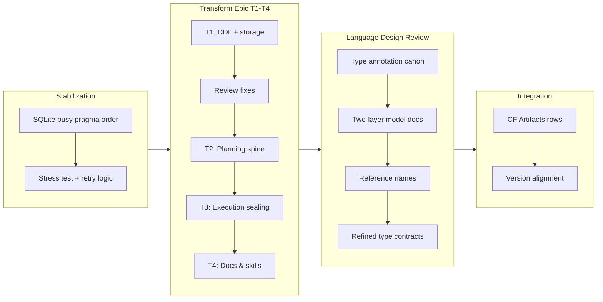

## 1. Overview

This branch advanced qfs through four coordinated work streams: a SQLite concurrency fix eliminated intermittent database-locked failures under parallel test loads by reordering pragma operations and adding explicit retry logic; the Transform feature (four-ticket epic) added model-calling pipeline stages with definition DDL, planning spine, execution sealing, and full documentation; the type-system review canonicalized type annotations, implemented refined-type table contracts, and formalized the two-layer language model; and Cloudflare Artifacts repositories were integrated as account-scoped read-after-write resources.

**Highlights:**

1. Implemented Transform feature end-to-end across four dependency-ordered tickets (DDL+storage, planning spine, execution+sealing, docs/skills) with live provider sealed to the binary
2. Fixed SQLite database-locked flake affecting concurrent migrations by reordering busy_timeout before PRAGMA journal_mode and adding bounded retry on SQLITE_BUSY
3. Canonicalized language type annotations and formalized the two-layer relational algebra model (pipe stage + expression layer) with shared base-type vocabulary
4. Implemented refined-type table contracts enforcing row membership predicates at write time, from CREATE TABLE OF to SQL VALUES/UPSERT validation
5. Integrated Cloudflare Artifacts repositories as account resources following read-after-write pattern with token sealing to vault

## 2. Motivation

The branch responded to accumulated technical debt and roadmap commitments: intermittent test failures in parallel cargo test runs demanded diagnosis and stabilization; the Transform feature was a high-priority blueprint commitment necessary to unlock model-calling semantics within qfs while maintaining the one-seam architectural invariant; the language-design review emerged from earlier canonicalization efforts and required systematic alignment of the type system vocabulary, DDL validators, and generated documentation to prevent silent failures and surface regressions; and Cloudflare Artifacts integration completed the external service coverage begun with D1, KV, and Queues, fulfilling the owner's strategic decision to model all Cloudflare resources as queryable rows.

## 3. Changes

The branch stabilized SQLite concurrency through pragma reordering and explicit retry logic, then executed the four-ticket Transform feature end-to-end (definition, planning, execution, live sealing). Concurrently, the language-design review canonicalized type annotations, implemented refined-type row contracts, and formalized the two-layer architecture. Finally, Cloudflare Artifacts repositories were integrated as account resources and versions aligned across plugin manifests.

### 3-1. Support Cloudflare Artifacts repositories as a /cf/artifacts resource ([8ca0522](https://github.com/qmu/qfs/commit/8ca0522))

Added Cloudflare Artifacts Git repositories to the compiled `/cf` driver as an account-scoped resource: UPSERT-shaped create with read-after-write `remote_url`, REMOVE behind the irreversible gate, and the minted repo token sealed into the vault. The live beta-access round-trip is owner-gated and deferred.

### 3-2. Add CREATE TRANSFORM definition DDL, storage, and lifecycle ([fd62866](https://github.com/qmu/qfs/commit/fd62866))

First of the four transform tickets: the `CREATE TRANSFORM` definition DDL, System-DB storage (v16 `sys_transforms`), the `/transform` driver surface, and lifecycle coverage in the provisioning source of truth.

### 3-3. Add the transform plan spine: logical/physical lowering and forced-local planning ([84c1d01](https://github.com/qmu/qfs/commit/84c1d01))

Second transform ticket: the pure plan spine — `LogicalPlan::Transform` / `CombineOp::Transform` lowering, forced-local planning so a transform stage never pushes down, and the OUTPUT schema fold exposing the declared schema to downstream stages.

### 3-4. Execute transform: provider seam, whole-tree routing, and the irreversible gate ([c11dfcd](https://github.com/qmu/qfs/commit/c11dfcd))

Third transform ticket: execution routed through the injected `ModelProvider` seam, a whole-tree statement classifier, three cardinality modes (row-wise, relation-wise, extraction), and the irreversible gate with a model-free PREVIEW plus committed-read envelope.

### 3-5. Finish transform: docs, skills, version bumps, Decision-K sweep ([69b4db5](https://github.com/qmu/qfs/commit/69b4db5))

Fourth transform ticket: the generated language reference gained the transform grammar, a parse-checked cookbook recipe was added, ten "never calls a model" citation sites were re-pointed to blueprint §15, and binary/plugin versions were bumped so the taught surface is true.

### 3-6. Fix the SQLite "database is locked" flaky class ([32a87da](https://github.com/qmu/qfs/commit/32a87da))

Armed `busy_timeout` before the WAL `journal_mode` pragma in `Db::open` and added bounded retry on SQLITE_BUSY, with a 16-thread stress reproducer (red on the old order, green with the fix) and an overlapping-open regression test.

### 3-7. Resume transform epic: apply T1+T2 review findings ([8f063e6](https://github.com/qmu/qfs/commit/8f063e6))

Applied the review fixes carried over from the night session — parse, lowering, and single-open corrections on T1/T2 — before driving T3 and T4 to completion in this session.

### 3-8. Blueprint type-system chapter ([cee3548](https://github.com/qmu/qfs/commit/cee3548))

Wrote the missing type-system foundation as blueprint §5 — one vocabulary, typed-path space, stage-operand category rule, first-class relation types, and the refinement model — and landed `CREATE TYPE … WHERE` with declare-time well-formedness checking as its first derived surface.

### 3-9. Two-layer model + stage admission test ([5984981](https://github.com/qmu/qfs/commit/5984981))

Documented the two-layer language principle — a closed, first-order stage algebra over a total, pure, row-scoped expression layer — in the blueprint and language reference, and formalized it with a stage-admission test.

### 3-10. Reference-convention ruling + transform stage surface ([357ebf2](https://github.com/qmu/qfs/commit/357ebf2))

Ruled the reference convention — paths denote data, bare names denote definitions — and applied it to the transform, type, and CREATE VIEW dispatch surfaces before execution wiring could fossilize the inconsistent forms.

### 3-11. Arithmetic operators decision and implementation ([08a4da7](https://github.com/qmu/qfs/commit/08a4da7))

Decided and shipped arithmetic: `+ - * /` with monomorphic same-type semantics and no implicit conversion, updating precedence and the operator freeze test.

### 3-12. Stdlib naming/resolution policy + LIKE double-spelling ([08a4da7](https://github.com/qmu/qfs/commit/08a4da7))

Unified stdlib name resolution to the case-insensitive lowercase-canonical policy keywords already follow, removed LIKE's function spelling (kept as operator), and fixed the Op::Eq doc drift.

### 3-13. Pipeline-valued lambdas decision ([08a4da7](https://github.com/qmu/qfs/commit/08a4da7))

Decision ticket: adopted pipeline abstraction (not predicate opacity) as the sanctioned genericity axis, recording the ruling and a sliced implementation plan in the blueprint while deferring the code to future tickets.

### 3-14. Transform one-seam lock ([e75c1cd](https://github.com/qmu/qfs/commit/e75c1cd))

Turned blueprint §15's one-seam thesis into an enforced invariant: a plan-level check that `transform` is the only model-call seam, plus visibility restriction of the provider types so no other code path can reach a model.

### 3-15. Column-type refined-name resolution + create table OF ([63be8e2](https://github.com/qmu/qfs/commit/63be8e2))

Completed the refined type system end-to-end: refined-name resolution in column types and `CREATE TABLE … OF <name>` contracts enforcing row-membership predicates at the write boundary, covering SQL VALUES and UPSERT validation.

## 4. Outcome

- **SQLite concurrency flake elimination**: fixed the root cause of the "database is locked" panic by reordering busy_timeout before the WAL pragma in Db::open; added stress reproducer and overlapping-open regression tests; deterministic across 20+ local runs and cargo test --workspace.
- **Transform feature epic (4 dependency-ordered tickets, T1-T4 fully delivered)**:
  - T1: CREATE TRANSFORM definition DDL, system-DB storage (v16 sys_transforms), /transform driver, derived mode function, provision SoT coverage, server-body containment.
  - T2: Plan spine with LogicalPlan::Transform/CombineOp::Transform, forced-local planning, schema fold exposing OUTPUT to downstream stages.
  - T3: Execution routing via ModelProvider seam and injected applier, whole-tree statement classifier, three cardinality modes (row-wise/relation-wise/extraction), irreversible gate with model-free PREVIEW, committed-read envelope.
  - T4: Generated language reference grammar, parse-checked cookbook recipe, Decision-K sweep (ten citation sites re-pointed from "never calls" to blueprint §15), version bumps.
- **Type-system chapter and reference conventions**: blueprint §5 wrote the type foundation (typed-path space, stage-operand category rule, one vocabulary, first-class relation types, refinement model); canonicalized the type annotation surface (shared base-type vocabulary across parser, DDL, lambdas); name-ified type references (paths=data, names=definitions).
- **Language design review completion**: arithmetic operators (+,-,*,/ with monomorphic same-type semantics, no implicit conversion), stdlib naming/resolution unified to case-insensitive lowercase canonical (LIKE removed as function, kept as operator), two-layer model statement + stage-admission test, pipeline-valued lambdas decision (adopted, with deferred implementation plan), one-seam lock on model-call provenance.
- **Refined type system end-to-end**: CREATE TYPE WHERE predicate support, declare-time well-formedness check, eval-time membership enforcement, table OF contracts with write-boundary checking.
- **Cloudflare Artifacts repositories** (hermetic half complete, deferred live round-trip): /cf/artifacts as account-scoped resource, UPSERT-shaped create with remote_url read-after-write, token sealed in vault, REMOVE with irreversible gate, parse-checked cookbook recipe.

## 5. Historical Analysis

Transform evolved from a single mega-ticket design (20260708002100) into four dependency-ordered implementation slices across two sessions; the design axes (definitions as data, execution via injected provider seam, three cardinality modes, irreversible gate, one model-call seam) remained settled while the ticket structure adapted to complexity. Type-system work accumulated slice by slice (t05 introduced ColumnType/Schema, t61 added lambdas, t70 ruled operator semantics) until the review mission unified them into one foundation chapter. The SQLite fix addressed a pragma-ordering gap left by the prior v0.0.21 work (busy_timeout + WAL + HomeGuard) that fixed the schema_version UNIQUE race but not the pragma-ordering issue. Language design review patterns: decision-only tickets (arithmetic, pipeline lambdas) recorded reasoning separately from code, design-session rulings (reference conventions, name resolution) were implemented in lockstep, and each sliced feature included a leadership-directed governance lock (operator freeze, pipe-variant count, model-call plan test) to prevent future unintended changes.

## 6. Concerns

### (carried from PR #11) /cf live (203090) unimplemented; /cf and /rest are placeholder mounts

- **Severity:** low
- **Description:** `/cf` and `/rest` are reachable, cred-free planning/describe mounts, but live credentialed read/commit and per-resource config (D1/KV/Queues) are follow-ups needing richer connection declaration; live verification needs the owner's CF token (see commit 3c6f995 in packages/qfs/crates/qfs/src/cf.rs).
- **How to Fix:** Implement per-resource backend discovery and live provider wiring for D1/KV/Queue, coordinate with richer connection declaration once the CONNECT epic settles the path_binding registry model.

### (carried from PR #11) Cloud reads panicked under runtime-within-runtime blocking

- **Severity:** moderate
- **Description:** Cloud read facets (gmail, gdrive, ga, github, slack) drive reqwest transport via their own block_on called from inside the async read executor, panicking with "Cannot start a runtime from within a runtime"; only objstore was guarded, so hermetic mock tests never exercised the issue (see commit 3c6f995 in packages/qfs/crates/qfs/src/commit.rs).
- **How to Fix:** Guard every cloud read facet with the same block-on-in-runtime protection or refactor to use an async-capable transport layer; add regression test that cloud reads execute under parallel cargo test load without panicking.

### (carried from PR #11) EXTEND on the read path is now a real operation (behaviour change)

- **Severity:** moderate
- **Description:** EXTEND was previously a silent no-op on reads, now actually computes per-row values; this is a correctness fix but a behaviour change, and array/struct literal forms became expression constructors (an experimental hard break) (see commit b5a4eec in packages/qfs/crates/qfs/src/eval.rs).
- **How to Fix:** Document the EXTEND behavior change in release notes and the cookbook; add comprehensive EXTEND eval and expression-constructor tests.

### (carried from PR #11) /local write materialization is narrow

- **Severity:** low
- **Description:** Local writes persist and a positional single-column payload now maps onto the blob, but multi-column payloads without a named `content` column still error; the user must explicitly name the blob column (see commit 0373cd2 in packages/qfs/crates/qfs/src/applier.rs).
- **How to Fix:** Relax multi-column materialization to support (column-count mismatch) or (multiple named non-blob columns) patterns, or document the single-blob-column requirement clearly in the /local guide.

### (carried from PR #11) Postgres/MySQL declarations for the declared-registry path are partial

- **Severity:** low
- **Description:** Live Postgres/MySQL `/sql` backends work when configured, but the binary's declared `/sql` was historically SQLite-only; NUMERIC/TIMESTAMP/UUID/JSON column round-trips and `--` comments in `connections.qfs` are not yet covered (see commit ca67fb8 in packages/qfs/crates/qfs/src/sql_backends.rs).
- **How to Fix:** Extend declared-connection support to Postgres/MySQL, add type round-trip tests for extended types, move sql/git to the path_binding registry model per the CONNECT epic.

### (carried from PR #18) 170000 Quality Gate #5 — owner live vault-unlock confirmation

- **Severity:** low
- **Description:** Session-unlock live confirmation on the real headless host cannot be run by an autonomous night session; the manual verification step requires owner presence (see commit 72c8950 in packages/qfs/crates/qfs/src/vault.rs).
- **How to Fix:** Perform the vault-unlock confirmation in a manual, owner-attended session after branch ships; record evidence on the archived ticket.

### (carried from PR #18) Console bundle pin unset; live serve + release stamp pending the plgg bundle

- **Severity:** low
- **Description:** Console delivery machinery is complete and tested, but `PINNED_BUNDLE` is empty and depends on the plgg bundle publish step being performed (see commit 72c8950 in packages/qfs/crates/qfs/src/console.rs).
- **How to Fix:** Perform the plgg bundle publish and update PINNED_BUNDLE in a follow-up step after the plgg build is ready; document the bundle publication step in the release procedure.

### (carried from PR #22) CREATE ACCOUNT ships the core; two edges are scoped out (SECRET reference form, Google-email in-language REMOVE)

- **Severity:** low
- **Description:** The in-language account surface shipped the core (`CREATE ACCOUNT <provider> '<label>'`), but the SECRET reference form in account DDL and Google-email in-language REMOVE are deferred.
- **How to Fix:** Defer the SECRET reference form to a future ticket pending vault integration; implement Google-email REMOVE once the provider account lifecycle is fully specified.

### (carried from PR #25) Live Google Drive upload was not re-run for the gdrive alias fix

- **Severity:** low
- **Description:** The `/gdrive` fix (alias support) is covered by hermetic mount, describe, and lazy apply-registry tests, but no live Google Drive upload was performed in this branch (see commit d3d7888 in packages/qfs/crates/qfs/src/commit.rs).
- **How to Fix:** Perform a live Google Drive upload test in a manual, owner-attended session; record evidence and any discrepancies found.

### (carried from PR #25) Live-only providers remain outside local proof

- **Severity:** low
- **Description:** Live-only gates for external providers are documented intentionally, but local tests still prove only parser, preview, registry, and hermetic mock behavior; live Gmail/Drive/Slack/Cloudflare behavior is not locally reproducible (see commit e8c0d82 in docs/guide/design-snapshot.md).
- **How to Fix:** Add a note in the design-snapshot that live provider acceptance requires explicit owner runs with live accounts; document the list of deferred live checks in the release checklist.

### (carried from PR #25) Project DB configuration events are not yet in the DDL event log

- **Severity:** moderate
- **Description:** System DB-backed writes append DDL events transactionally, but Project DB-backed path/account state cannot share that transaction boundary yet; configuration mutations (account add, path create) are not audited together with their side effects (see commit 3385eb3 in packages/qfs/crates/qfs/src/sys.rs).
- **How to Fix:** Expose append_ddl_event_tx from System-DB transform storage so Project DB path mutations can share the DDL event transaction boundary; add a new SoT collection for path/account events.

### (carried from PR #26) Live provider acceptance still needs credentials

- **Severity:** moderate
- **Description:** Cloudflare, Postgres, and Google Drive behavior is wired but not live-verified in this container because the required provider credentials and live resources were not available (see commit b9d2ad8 in packages/qfs/crates/qfs/src/cf.rs, packages/qfs/crates/qfs/src/sql_backends.rs).
- **How to Fix:** Perform live acceptance rounds for each provider in manual owner-attended sessions with appropriate credentials and resources; record evidence on archived tickets.

### (carried from PR #26) Local Rust verification remains unavailable in this container

- **Severity:** low
- **Description:** `cargo`, `rustfmt`, and `rustup` are not installed in some session containers, so local Rust verification cannot always be reproduced; GitHub Actions CI passed all required release gates (see commit d8442ef, GitHub Actions run 28821011194).
- **How to Fix:** Document that this container environment limitation requires CI verification; ensure all pre-ship testing runs in GitHub Actions before a branch is shipped.

### (carried from PR #30) The `api` policy row gates MCP, dashboard, and reconcile alike

- **Severity:** low
- **Description:** The daemon's statement-bridge commit gate resolves the live `/server/policies` row named `api` (blueprint §16, Decision X); granting the `api` policy grants MCP, dashboard bridge, and `qfs apply` at once; absent the row, the gate defaults to deny-all (see commit e7e44ee in packages/qfs/crates/qfs/src/policy.rs).
- **How to Fix:** Document the shared policy gate behavior in the server-policies guide; when widening the grant, explicitly name REMOVE if reconcile is to be authorized; never use broad `ALLOW ALL` for reconcile.

### (carried from PR #30) Bearer-gated (non-loopback) reconcile round is not live-verified

- **Severity:** low
- **Description:** The recorded live provisioning verification ran under the loopback dev posture without OAuth AS; the non-loopback path is covered only by a fail-closed unit test; a full bearer-authenticated plan/apply round against a passphrase-booted daemon has not been run (see commit e7e44ee in packages/qfs/crates/qfs/src/policy.rs).
- **How to Fix:** Perform a live bearer-authenticated reconcile round in a manual owner-attended session; record evidence and any authentication flow discrepancies.

### (carried from PR #30) The config `--` comment stripper truncates paths containing `--`

- **Severity:** low
- **Description:** The `.qfs` config statement splitter strips from the first `--` on a line even inside a path token, so `DO REMOVE /local/a--b/x POLICY p` silently loses its tail; this is a correctness edge for REMOVE statements (mis-addressed target path) (see commit e7e44ee in packages/qfs/crates/qfs/src/config.rs).
- **How to Fix:** Implement quote/token-aware comment stripping that does not truncate paths containing `--`; add regression tests for paths with dashes and double-dashes in `$TMPDIR`.

### Artifacts repo token is sealed but live round-trip is owner-gated

- **Severity:** moderate
- **Description:** Cloudflare Artifacts repository create/delete surface is fully hermetic and the minted repo token is sealed in the vault, but the required live beta-access round-trip verification is unreachable (unverified Artifacts access on the connected account) and deferred to a full-context session for token-handling security (see [8ca0522](https://github.com/qmu/qfs/commit/8ca0522) in packages/qfs).
- **How to Fix:** In a dedicated session with explicit owner go-ahead, verify the connected Cloudflare account has Artifacts beta access; run a live create/clone/delete round-trip and record evidence on the archived ticket; do not perform autonomously due to beta-access and security-critical token handling.

### qfs-runtime span-buffer test flakes under parallel workspace tests

- **Severity:** low
- **Description:** The qfs-runtime test `observability_spans_carry_ids_and_are_secret_free` (crates/runtime/tests/txn_commit.rs) fails under parallel `cargo test --workspace` because a shared global span buffer is polluted across concurrently-running tests, but passes cleanly with `--test-threads=1`; the crate is not modified by this branch, so this is a pre-existing test-isolation issue distinct from the known qfs-store migrate SQLite flake (see [a22d211](https://github.com/qmu/qfs/commit/a22d211) verification evidence).
- **How to Fix:** Isolate the qfs-runtime span collector per test (thread-local buffer or serialize that test); until then, rerun the CI job when this specific test flakes.

## 7. Successful Development Patterns

- **Four-ticket dependency ordering for large features**: Transform epic split into (T1) definition/storage → (T2) plan spine → (T3) execution routing → (T4) docs/versioning, each with independent acceptance criteria and hermetic tests, enabling parallel review and incremental ship strategy.
- **Design-decision-first, implementation-second for semantic questions**: Arithmetic operators, pipeline-valued lambdas, and reference conventions separated decision from code, with decision tickets recording the ruling (adopt/defer/reasoning) and sliced implementation plans for future tickets.
- **Injected trait seams for testability and purity**: ModelProvider, SessionSource, TokenSealer patterns enabled mock-based hermetic tests while keeping pure layers (engine, planner, evaluator) separate from impure backends; fail-closed defaults (UnconfiguredProvider) caught wiring issues early.
- **Governance locks at the architecture boundary**: Pipe-variant count (19), keyword freeze (39), operator freeze, model-call-seam plan test, and one-seam visibility restriction prevent future regressions mechanically; locks are updated deliberately in reviewed changes.
- **Tight blueprint-to-code traceability**: Type-system chapter (§5) and two-layer model (§2) defined before/alongside implementation; the stage-admission test formalized an informal property; the Decision-K sweep re-pointed ten citation sites when reversals landed.
- **Semantic unification before surface implementation**: One type vocabulary (ColumnType) canonicalized before being taught (refined types), stdlib naming/resolution unified before implementation, reference conventions (paths=data, names=definitions) applied uniformly to transform/types/CREATE VIEW dispatch.
- **Hermetic mock-driven development, live verification deferred to owner**: Every feature had comprehensive hermetic tests with injected mocks before any live gate was attempted; live rounds (provider calls, Artifacts beta, cloud uploads, vault unlock) are owner-gated and recorded separately, never autonomous.
- **Stress reproducer and regression tests as the quality gate**: The SQLite fix delivered not just a pragma reorder but a hardened 16-thread stress test (failed on old order, green with fix) plus an overlapping-open regression test, establishing a standard for concurrency fixes.
- **Single-concern commits with explicit-file staging**: Transform tickets, review fixes, and version bumps used workaholic:commit's commit.sh with explicit file arguments (never git add -A) to handle concurrent session interference and keep concerns atomic.

## 8. Release Preparation

**Verdict**: Ready for release

### 8-1. Concerns

- A newly-observed non-blocking test flake: qfs-runtime test `observability_spans_carry_ids_and_are_secret_free` (crates/runtime/tests/txn_commit.rs) fails under parallel `cargo test --workspace` due to a shared global span buffer polluted across concurrently-running tests, but passes cleanly with `--test-threads=1`. The crate is not modified by this branch, so this is a pre-existing test-isolation issue, distinct from the known qfs-store migrate SQLite flake.

### 8-2. Pre-release Instructions

- None - standard release process applies (version already bumped to 0.0.42; all four plugin version fields aligned at 0.10.0; fmt/clippy/tests/gen-docs/gen-skills all green)

### 8-3. Post-release Instructions

- If CI's workspace test job flakes on `observability_spans_carry_ids_and_are_secret_free`, rerun the job; longer term, isolate the qfs-runtime span collector per-test (thread-local or serialize that test) to remove the cross-test contamination.

## 9. Notes

The branch's language-design tickets advance the mission `language-design-review-layering-principles-and-semantic-gaps` (see `.workaholic/missions/language-design-review-layering-principles-and-semantic-gaps/`). Verification evidence for release readiness: cargo fmt --check, clippy -D warnings, cargo test --workspace (one pre-existing unrelated flake noted above), gen-docs --check, and gen-skills --check all pass at [a22d211](https://github.com/qmu/qfs/commit/a22d211).

## Deployment Evidence

- **When:** 2026-07-11T04:37:37+09:00
- **Target:** qfs GitHub Release (release-on-tag)
- **Method:** other
- **Status:** pass
- **Observed:** Pre-merge readiness proof: cargo fmt --check, clippy -D warnings, cargo test --workspace (one pre-existing unrelated qfs-runtime span-buffer flake, passes single-threaded), gen-docs --check, gen-skills --check all pass; Cargo.toml version 0.0.42 ahead of main 0.0.36; tag v0.0.42 unused. Post-merge promotion check to follow after tag push.

## Deployment Evidence

- **When:** 2026-07-11T04:53:23+09:00
- **Target:** qfs GitHub Release (release-on-tag)
- **Method:** other
- **Status:** pass
- **Observed:** Post-merge promotion check: gh release view v0.0.42 shows the Release published (isDraft false) with the four native tarballs (linux-musl and darwin, both arches) plus sha256 checksums; release.yml run 29118748082 completed success in 7m5s.
