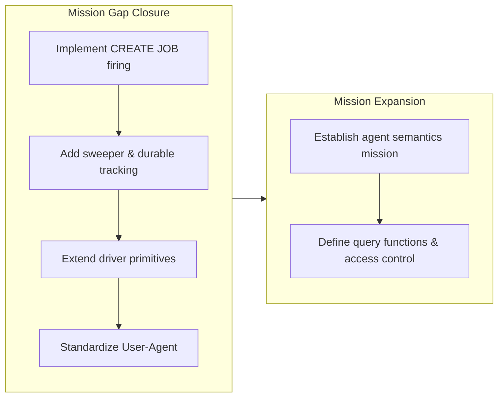

## 1. Overview

The branch closed the three implementation gaps that blocked the capability-tryout mission's acceptance, enabling the owner-attended live rounds to proceed. Changes included wiring CREATE JOB firing into `qfs serve` with a 30s real-clock sweeper and durable run tracking, extending declared drivers with FOLLOW and ENCODE multipart primitives for cross-host file operations, and stamping a versioned User-Agent on every declared request. Additionally, a new mission was established to make agents first-class qfs principals.

**Highlights:**

1. Implemented CREATE JOB firing with a 30s sweeper and durable `last_run` tracking across restarts, plus a read-only `/server/jobs/<name>/runs` collection for reliable scheduled execution
2. Extended declared drivers with FOLLOW (credential-free cross-host downloads) and ENCODE multipart (form-data uploads) primitives — `chatwork.qfs` now declares file download and upload
3. Standardized `User-Agent: qfs/<version>` headers on all declared requests to satisfy external service requirements (GitHub)
4. Established a new mission for CREATE AGENT semantics: agents as first-class principals with query functions, scheduled launch, and access control

## 2. Motivation

The mission acceptance was blocked by three implementation gaps that prevented owner-attended live verification rounds. The daemon recorded CREATE JOB definitions but never fired them, the declared driver model lacked primitives for cross-host file operations (downloads and multipart uploads), and declared requests carried no User-Agent, causing rejections from external services like GitHub. The owner directed covering all three gaps in this drive phase so that the planned owner-attended live rounds (T1–T10) could proceed. Beyond closing these gaps, a parallel mission was opened to expand the principal model, making agents first-class query participants with scheduled execution and access control.

## 3. Changes

The work systematically eliminated the three blocking implementation gaps. A 30-second sweeper now reliably fires jobs through the live committer with an auditable runs collection and durable `last_run` tracking; FOLLOW and ENCODE multipart primitives enabled Chatwork file operations without service-specific code; standardized User-Agent headers completed declared-request compliance. Alongside the gap closure, a parallel mission was opened to advance the principal model, making agents first-class participants with query functions, scheduled launch, and access control.

### 3-1. RESUME: mission close-out — three implementation gaps, then the owner-attended live rounds ([4de2f42](https://github.com/qmu/qfs/commit/4de2f42))

Implemented Phase 1 of the mission close-out: the daemon real-clock sweeper driving `fire_due` through the live committer (policy gate + irreversible guard + real applier) with the read-only `/server/jobs/<name>/runs` collection, the declared `FOLLOW <field>` and `ENCODE multipart` evaluator primitives (plus query-string wire paths) with `chatwork.qfs` declaring its blob view and multipart upload map, and the versioned `User-Agent` default header on every declared request. Cookbook articles and the qfs plugin (0.11.1 → 0.11.2) were regenerated; qfs version bumped to 0.0.59. The owner-attended live rounds remain queued as a follow-up resume ticket ([00b187c](https://github.com/qmu/qfs/commit/00b187c) additionally records the new CREATE AGENT semantics mission).

## 4. Outcome

- **Phase 1 implementation gaps closed:** All three blocking gaps resolved:
  1. Daemon real-clock sweeper: `crates/qfs/src/sweeper.rs` wires a `tokio::time` interval driving `fire_due` with the live Committer, durable `last_run`, run-ledger appends, and the read-only `/server/jobs/<name>/runs` collection (capped 50 runs, dies with the job row)
  2. Declared file transfer primitives: `PipeOp::Follow` (contextual identifier, variant lock 20→21) and `ENCODE multipart` between target and VALUES desugaring onto `EffectBody::Pipeline`; a generic `multipart/form-data` encoder in driver-http; `chatwork.qfs` declares the blob view + multipart upload map
  3. User-Agent header: every declared driver's request carries `User-Agent: qfs/<version>` as a default header (live + describe mounts)
- **Comprehensive testing:** 2432 workspace tests green; `cargo clippy -D warnings`, `fmt --check`, `gen-docs --check`, `gen-skills --check`, `check-migrations` all passing
- **Hermetic E2E verification:** a real local-FS scheduled fire through the live committer; the follow download proving no token leaves the declared host; the multipart POST through the full commit stack
- **Documentation and tooling updated:** Cookbook chatwork/automation updated; plugin versioned 0.11.1 → 0.11.2
- **New mission recorded:** CREATE AGENT semantics (agent as a first-class principal) is now a durable active mission

## 5. Historical Analysis

The mission acceptance requirement ("every capability verified live at least once") drove a two-phase approach: implementation gaps first (hermetic), then owner-attended live rounds. The T8 switch round established a proven operating pattern: the assistant runs PREVIEW (model-free) and read-back verification while the owner triggers all COMMIT operations from a real terminal (the relay has no TTY for live cloud writes). Model key via `secret 'env:ANTHROPIC_API_KEY'` + `read -rs` in the owner's terminal. Vault unlock (`qfs auth`, 8h) is shared. This pattern reduces accidental credential exposure while preserving full owner control of irreversible operations.

## 6. Concerns

### Redirect off a follow URL is refused by the confined transport

- **Severity:** low
- **Description:** A redirect off a FOLLOW download URL (cross-host download) is refused by the confined transport, fail-closed (see [4de2f42](https://github.com/qmu/qfs/commit/4de2f42) in `packages/qfs/crates/driver-http`). May need revisiting if a real service redirects downloads.
- **How to Fix:** Monitor live service redirect behaviors during the live rounds; revisit the transport policy if real services require redirect following.

### Policy-less or denied job re-fires every sweep

- **Severity:** low
- **Description:** A policy-less or denied job re-fires every sweep by the ruled not-stamped semantics — visible denied runs, history capped at 50 (see [4de2f42](https://github.com/qmu/qfs/commit/4de2f42) in `packages/qfs/crates/qfs/src/sweeper.rs`).
- **How to Fix:** Review the sweep retry semantics after live operation; consider a denied-job backoff if the visible denied-run churn proves noisy.

### (carried from PR #11) /cf live (203090) unimplemented; /cf and /rest are placeholder mounts

- **Severity:** low
- **Description:** `/cf` and `/rest` are reachable, cred-free planning/describe mounts, but live credentialed read/commit and per-resource config are follow-ups needing a richer connection declaration
- **How to Fix:** Design a per-resource connection declaration beyond the current (driver, locator, secret) shape, then wire read/apply facets and live-verify with the owner's token

### (carried from PR #11) EXTEND on the read path is now a real operation (behaviour change)

- **Severity:** moderate
- **Description:** EXTEND was previously a silent no-op on reads; it now actually computes per-row values. This is a correctness fix but a behaviour change — any pipeline that accidentally relied on the old no-op now behaves differently, and the array/struct literal forms became expression constructors (an experimental hard break)
- **How to Fix:** Audit cookbook/tests for EXTEND uses (suite is green, no regressions caught) and note the change prominently in the release note so downstream scripts expecting the old behaviour are updated

### (carried from PR #11) /local write materialization is narrow

- **Severity:** low
- **Description:** Local writes persist, and a positional single-column payload now maps onto the blob, but a multi-column payload with no `content` column still errors — the user must name the blob column
- **How to Fix:** Keep the single-column fallback strict (intentional); document that multi-column local writes must name the blob column. Watch the commit.rs → effect.rs content-blob threading for other write paths

### (carried from PR #11) Postgres/MySQL declarations for the declared-registry path are partial

- **Severity:** low
- **Description:** Live Postgres/MySQL `/sql` backends work when configured, but NUMERIC/TIMESTAMP/UUID/JSON column round-trips remain uncovered. `sql` and `git` have since converged onto `path_binding`; only the Postgres `pg_value` round-trips remain (live-PG-only acceptance, re-ticketed as 20260706183441)
- **How to Fix:** Run the live Postgres round-trip acceptance over NUMERIC/TIMESTAMP/UUID/JSON columns when a live PG is available

### (carried from PR #18) 170000 Quality Gate #5 — owner live vault-unlock confirmation

- **Severity:** low
- **Description:** The session-unlock's live confirmation on the real headless host cannot be run by an assistant
- **How to Fix:** Owner runs the three-step live check post-merge

### (carried from PR #18) Console bundle pin unset; live serve + release stamp pending the plgg bundle

- **Severity:** low
- **Description:** The console delivery machinery is complete and tested, but `PINNED_BUNDLE` is empty
- **How to Fix:** When the plgg bundle publishes, stamp its URL+hash into `PINNED_BUNDLE` and wire the real bundle path in the serve config

### (carried from PR #22) CREATE ACCOUNT ships the core; two edges are scoped out (SECRET reference form, Google-email in-language REMOVE)

- **Severity:** low
- **Description:** The in-language account surface shipped the owner-approved core: `CREATE ACCOUNT <provider> '<label>'`, the `/sys/accounts` selectors-only registry, and `REMOVE /sys/accounts/<provider>/<label>`. Two edges are deliberately deferred: (1) the `SECRET '<ref>'` clause for account bind-time resolution is not implemented (it would be a surface that cannot resolve at bind); (2) a Google account whose label is an email cannot be removed by a `REMOVE` path (`@` is a path version coordinate)
- **How to Fix:** (1) Wire bind-time resolution of an account credential from an `env:`/`vault:` reference, then accept the `SECRET` clause on `CREATE ACCOUNT`. (2) Support a filter-based remove on `/sys/accounts` (`REMOVE /sys/accounts WHERE account == '<email>'`) so the email rides safely in a string literal

### (carried from PR #25) Live Google Drive upload was not re-run for the gdrive alias fix

- **Severity:** low
- **Description:** The `/gdrive` fix is covered by hermetic mount, describe, and lazy apply-registry tests, but no live Google Drive upload was performed on this branch
- **How to Fix:** When owner credentials are available, run a live `/gdrive` upload and read-back smoke test against a disposable Drive file, then record the result

### (carried from PR #25) Live-only providers remain outside local proof

- **Severity:** low
- **Description:** The design snapshot intentionally documents live-only gates for external providers, but local tests still prove only parser, preview, registry, and hermetic mock behavior for those services
- **How to Fix:** Keep owner-live acceptance tickets for provider-specific paths such as Cloudflare, Postgres, and Google Drive, and record each credentialed verification separately from the hermetic release gate

### (carried from PR #25) Project DB configuration events are not yet in the DDL event log

- **Severity:** moderate
- **Description:** System DB-backed writes append DDL events transactionally, but Project DB-backed path/account state cannot share that transaction boundary yet
- **How to Fix:** Add a Project DB event writer for `path_binding` and account/app consent mutations, with the same secret-redaction and hash-chain discipline, or introduce a cross-store event envelope

### (carried from PR #26) Live provider acceptance still needs credentials

- **Severity:** moderate
- **Description:** Cloudflare, Postgres, and Google Drive behavior is wired but not live-verified because the required provider credentials and live resources were not available
- **How to Fix:** Run the live Cloudflare D1/KV/Queue smoke tests with `CF_ACCOUNT_ID`/`CF_API_TOKEN`, a live Postgres `SELECT` over NUMERIC/timestamp/UUID/JSON columns, and a disposable Drive `cp /local/... /drive/...` upload/read-back check

### (carried from PR #30) The `api` policy row gates MCP, dashboard, and reconcile alike

- **Severity:** low
- **Description:** The daemon's statement-bridge commit gate resolves the live `/server/policies` row named `api`. Because MCP, the dashboard bridge, and `qfs apply` share one executor, granting the `api` policy grants all three clients at once; absent the row the gate is the empty default-deny it always was
- **How to Fix:** If per-client grants are ever needed, split the gate's policy resolution by client identity (bearer subject) rather than one shared row; until then document the shared-grant behavior in the operator guide

### (carried from PR #30) Bearer-gated (non-loopback) reconcile round is not live-verified

- **Severity:** low
- **Description:** The recorded live provisioning verification ran under the loopback dev posture without the OAuth AS. The non-loopback path is covered only by the fail-closed unit test; a full bearer-authenticated plan/apply round against a passphrase-booted daemon has not been run
- **How to Fix:** Owner runs one bearer-gated round: boot with QFS_PASSPHRASE + System DB, obtain a token from the OAuth AS, and drive plan/apply against a non-loopback bind; record the result

### (carried from PR #30) The config `--` comment stripper truncates paths containing `--`

- **Severity:** low
- **Description:** The `.qfs` config statement splitter strips from the first `--` on a line even inside a path token, so a statement like `DO REMOVE /local/a--b/x POLICY p` silently loses its tail (path truncated, POLICY clause dropped). For a REMOVE this mis-addresses the target path, so it is a correctness edge
- **How to Fix:** Make the comment stripper quote/token-aware (a `--` inside a quoted string or path token is not a comment), or require whitespace before `--` to open a comment; add a regression test with a `--`-bearing path

### (carried from PR #32) Artifacts repo token is sealed but live round-trip is owner-gated

- **Severity:** moderate
- **Description:** Cloudflare Artifacts repository create/delete surface is fully hermetic and the minted repo token is sealed in the vault, but the required live beta-access round-trip verification is unreachable and deferred to a full-context session for token-handling security
- **How to Fix:** In a dedicated session with explicit owner go-ahead, verify the connected Cloudflare account has Artifacts beta access; run a live create/clone/delete round-trip and record evidence; do not perform autonomously due to beta-access and security-critical token handling

### (carried from PR #32) qfs-runtime span-buffer test flakes under parallel workspace tests

- **Severity:** low
- **Description:** The qfs-runtime test `observability_spans_carry_ids_and_are_secret_free` (crates/runtime/tests/txn_commit.rs) fails under parallel `cargo test --workspace` because a shared global span buffer is polluted across concurrently-running tests, but passes cleanly with `--test-threads=1`; a pre-existing test-isolation issue
- **How to Fix:** Isolate the qfs-runtime span collector per test (thread-local buffer or serialize that test); until then, rerun the CI job when this specific test flakes

### (carried from PR #33) Declared-model and scheduling follow-ups

- **Severity:** low
- **Description:** Partially resolved on this branch: sub-item (3) the daemon real-clock sweeper + `/server/jobs/<name>/runs` read-back landed in `crates/qfs/src/sweeper.rs`, and sub-item (1)'s FOLLOW/ENCODE multipart primitives landed. Still remaining: the live Chatwork POST encoding verification, the OAuth app plumbing into `declared_secrets` for `AUTH ACCOUNT 'google'`, and the Slack threaded file-reply surfaces
- **How to Fix:** Each remainder is a scoped follow-up ticket when prioritized: live-verify the Chatwork encoding, plumb the OAuth app into the declared-secrets adapter, extend the reply surfaces for Slack threading

### (carried from PR #33) Remaining owner-attended live rounds

- **Severity:** low
- **Description:** The switch live round ran and passed, but the owner-attended live rounds remain pending (now enumerated as rounds 1–10 on the todo resume ticket): Chatwork read/attach, the T8 switch re-run, Slack user-token post, Gmail cross-service reply, PDF × provider × Drive, transform chain, OpenAI + Google live generation, declared `/ghdecl` GitHub read, `qfs serve` JOB firing read-back, and Chatwork upload/download. This branch implemented their prerequisites (sweeper, FOLLOW/ENCODE, User-Agent)
- **How to Fix:** Owner runs each round attended and records evidence on the archived tickets, using the proven operating pattern: statement files in the scratchpad, assistant PREVIEW and read-back, every COMMIT triggered from the owner's real terminal, model key via `secret 'env:ANTHROPIC_API_KEY'`

### (carried from PR #33) Scope cuts and monitored items

- **Severity:** low
- **Description:** Recorded, deliberate cuts: the switch first slice requires `else` on every switch and defers all-pure switch; PDF inline byte caps are conservative and long-PDF chunking is out of scope; the exec-inventory `cfg(test)` stripper is heuristic; the dependency posture's removable-today is ≈ 0 with `async-trait` as the monitored exit; the multi-user Slack OAuth consent bootstrap is described but not scripted; the switch live round left residue in the owner's accounts
- **How to Fix:** Each switch cut lifts as its prerequisite lands; tune the PDF caps after the live round; tighten the stripper only if it misbehaves; drop `async-trait` when native async-in-trait covers its sites; residue cleanup is the owner's call; script the localhost-redirect OAuth bootstrap as a follow-up

### (carried from PR #34) Duplicate declaration rows still resolve oldest-first outside the type lookup

- **Severity:** low
- **Description:** Repeated `qfs run -f <driver>.qfs` installs append `sys_drivers` rows rather than replacing them. PR #34 switched only the `type` lookup to newest-wins. Duplicate `driver` and `view`/`map` rows still resolve oldest-first; a re-installed VIEW body does not win the way a re-installed TYPE now does
- **How to Fix:** Apply the same newest-wins ordering — or better, a replace-on-install semantic for same-name declaration rows — to the driver/view/map lookups in `declared_driver.rs::assemble` and the view template matching

## 7. Successful Development Patterns

- **Contextual identifier pipeline composition:** FOLLOW entered as the third contextual-identifier pipe stage (keyword freeze stays 39; the PipeOp variant lock moved 20→21 as a deliberate change-control event). This pattern isolates new identifier flows without multiplying the closed statement set.
- **Effect body desugaring for syntax extensibility:** ENCODE between target and VALUES desugars onto the existing `EffectBody::Pipeline` shape, so the closed statement set stays untouched. Surface expansion happens through evaluator desugaring rather than core language changes.
- **Structural read-only enforcement:** The runs collection deliberately stays OUTSIDE the closed ServerNode write coordinates. This architectural boundary makes the collection structurally read-only (no write path can address it) — a stronger guarantee than runtime policy checks alone.
- **Hermetic first, then live-round validation:** Two-phase validation — hermetic tests prove parser/preview/registry/effect machinery (2432 tests green; E2E fire/download/upload verified locally), then owner-attended live rounds verify provider-specific behavior separately. The hermetic gate keeps the release window small; the live rounds verify real service integration on the owner's schedule.

## 8. Release Preparation

**Verdict**: Ready for release

### 8-1. Concerns

- None - changes are safe for release

### 8-2. Pre-release Instructions

- None - standard release process applies

### 8-3. Post-release Instructions

- After the PR merges to main, tag and push v0.0.59 (`git tag -a v0.0.59 -m "qfs v0.0.59" && git push origin v0.0.59`) so the published release and `qfs --version` stay in sync, per CLAUDE.md Deploy

## 9. Notes

- The follow-up resume ticket `20260712050000-resume-owner-attended-live-rounds.md` stays in the todo queue: after this branch ships, only the owner-attended live rounds (1–10) remain to tick the mission acceptance.
- The new CREATE AGENT semantics mission (`support-create-agent-semantics-...`) recorded on this branch is a separate, newly opened mission — no tickets attach to it yet.
