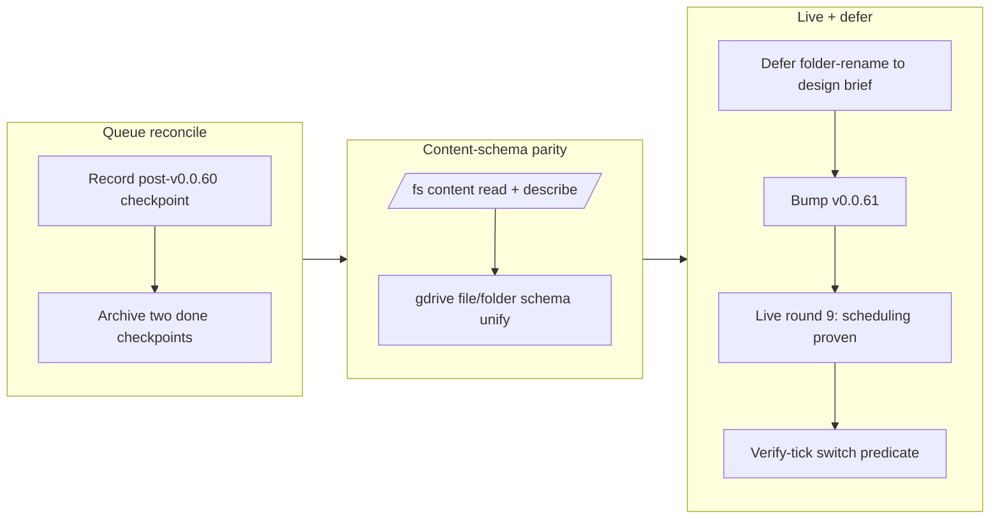

## 1. Overview

Post-v0.0.60, this branch cleared the two contained blob-driver content-schema follow-ups the
defect campaign surfaced, ran the outstanding owner-attended server-scheduling live round to
completion, and reconciled the mission and ticket queue. `/fs` and `/drive` single-file reads now
advertise and materialise a `content` column at plan time (mirroring the v0.0.60 `/local` fix), so
`… |> select content |> transform` type-checks against them; live round 9 proved the daemon
scheduler end-to-end; and the one remaining follow-up (a per-row Drive folder rename) was scoped as
a shared-representation design change and deferred to a design brief rather than rammed through.

**Highlights:**

1. `/fs` gained the single-file `content` read + `describe` parity `/local` got in v0.0.60.
2. The gdrive file-content and folder-listing schemas were unified so `/drive/<file> |> select content` type-checks at plan time.
3. Live round 9 (server scheduling) passed on `qfs serve` — the sweeper fired a 1m JOB, `affected 1`, and history survived a restart — ticking the mission's server-scheduling acceptance.
4. The deeper effect-selector-channel folder-rename follow-up was captured as a design-brief ticket and deliberately deferred (owner decision).

## 2. Motivation

The v0.0.60 defect campaign shipped eight fixes but consciously left three scoped follow-ups as
concerns: two were the same class of plan/runtime schema divergence the `/local` fix had just
solved (`driver-fs` and gdrive both still omitted `content` from their described schema, so the
cookbook extraction recipe was unrunnable against them), and one was a deeper representational gap
behind the safe-refusal of a Drive folder rename. In parallel, the mission's server-scheduling
acceptance had a hermetic proof but no live proof — round 9 had failed on the sweeper defect that
v0.0.60 fixed, so it was owed a re-run. This branch closes the two contained schema fixes, converts
the live proof, and applies proportionality to the third: a change to the shared `EffectNode`
representation is a design decision, not a mechanical drive, so it was ticketed for a brief.

## 3. Changes

The branch first cleared the queue of two completed resumption checkpoints, then mirrored the
v0.0.60 `/local` content-schema widen onto `/fs` and unified the divergent gdrive read schemas.
The one remaining code follow-up was assessed as a shared-representation design change and deferred
to a ticketed design brief. It then bumped to v0.0.61, ran live round 9 to prove the server
scheduler end-to-end, and verify-ticked the switch-predicate acceptance from existing round-2
evidence.

### 3-1. RESUME: mission close-out — the owner-attended live rounds ([d7e869d](https://github.com/qmu/qfs/commit/d7e869d))

Archived the completed live-round campaign checkpoint (rounds 1–8/10 and the v0.0.59 close-out
ship were done); round 9 was carried forward, so the checkpoint was retired to keep the queue clean.

### 3-2. CARRY: live rounds 9/10 done — ship and backlog ([db50285](https://github.com/qmu/qfs/commit/db50285))

Archived the completed carry: both its next-actions (ship the knowledge branch as PR #36, drive the
8-ticket defect backlog as v0.0.60 / PR #37) were done.

### 3-3. Give /fs the single-file content read + describe parity /local has ([433788f](https://github.com/qmu/qfs/commit/433788f))

`driver-fs` was templated on `driver-local` but scoped out of the v0.0.60 `/local` content-widen,
so it still had the pre-fix defect. Added `FsRow::content_schema()`, made `describe()` advertise the
nullable `content` column, and gave the scan a single-file content read (reusing `fs_core::read_blob`);
a directory listing now carries a null `content` so plan and runtime schemas agree.

### 3-4. Unify the gdrive file and folder read schemas so select content type-checks ([ef393b9](https://github.com/qmu/qfs/commit/ef393b9))

gdrive had two divergent read schemas — an 11-column folder listing and a separate 5-column
file-content read — and `describe()` reported the folder one. Converged both read paths on
`FileMeta::content_schema()` (listing columns + nullable `content`) so a `/drive/<file>` read reports
the same metadata columns its parent listing shows, plus the bytes, and `select content` type-checks
at plan time.

## 4. Outcome

Two of the three v0.0.60 content-schema follow-ups are resolved and hermetically locked
(`qfs-driver-fs` 33 lib + 3 e2e; `qfs-driver-gdrive` 51), with all anti-drift gates green
(`gen-docs`, `gen-skills`, clippy, fmt). The mission advanced from 7 to **9 of 13** acceptances: the
server-scheduling item was proven live (round 9 re-run: sweeper fired a 1m `/local` JOB in <1s,
`outcome=fired affected=1`, tick file written, durable `last_run` survived a restart with no
spurious re-fire, and the restarted daemon resumed the schedule), and the switch-predicate item was
verify-ticked from round-2 evidence. The binary is at v0.0.61 and PR-ready; the third follow-up is
deferred as a design ticket.

## 5. Historical Analysis

This branch is the direct successor to the v0.0.60 defect campaign (PR #37, `work-20260713-150833`),
which fixed `/local`'s identical content-omission (`d3289df`) and left `driver-fs`/gdrive as scoped
follow-ups. The `/local` fix was the worked template: `content_schema()` = listing columns + a
nullable `content`, `describe()` advertises the wider schema, single-file reads populate it, listings
null it. The server-scheduling live round traces back through the sweeper fix (`b76b799`, v0.0.60)
that unblocked it, and the switch-predicate proof to the round-2 T8 re-run
(`20260712005000-drive-multi-row-insert-silent-loss.md`).

## 6. Concerns

### (updated, carried from PR #37) Per-row Drive folder rename needs a predicate/selector channel

- **Severity:** low
- **Description:** `decode_move` refuses a name-path folder rename rather than renaming the matching child, because a same-column `SET name WHERE name` collapses in the flat effect row batch — `setwhere_row_batch` de-dups the WHERE key when it shares the SET column, so the selector is lost (see [4669ab8](https://github.com/qmu/qfs/commit/4669ab8) in `packages/qfs/crates/core/src/eval.rs`). This is a design-layer change to the shared `EffectNode` representation, not a contained driver fix, and carries a real multi-match semantics decision.
- **How to Fix:** Captured as ticket `20260713195008-effect-selector-channel-folder-rename.md` (`needs_design_brief: true`, owner-deferred 2026-07-13): give the effect node a predicate/selector channel distinct from the SET payload, then `decode_move` resolves the child-by-selector and renames it. Route through a design brief first.

### (carried, unchanged) The standing open concerns from PRs #11/#18/#22/#25/#26/#30/#32/#33/#34/#35

- **Severity:** low
- **Description:** Untouched by this branch: `/cf` live (203090), EXTEND read-path behaviour, `/local` multi-column write materialization, Postgres/MySQL declared-registry round-trips, the #18 live vault-unlock and console-bundle items, CREATE ACCOUNT scoped edges, the #25/#26 live-provider acceptances, the #30 api-policy-gate / bearer-reconcile / `--`-comment-stripper items, the #32 artifacts-token round-trip and span-buffer flake, the #33 declared-model/scheduling and remaining-live-rounds/scope-cut items, #34 duplicate-declaration ordering, and #35 follow-redirect-refused / denied-job-refire. Three of PR #37's four content concerns (`driver-fs` content, gdrive `select content`, server-scheduling live) are **resolved this branch**.
- **How to Fix:** Each lifts as its prerequisite lands or its owner-attended live round runs; they remain tracked in `.workaholic/concerns/`.

## 7. Successful Development Patterns

- Mirroring an existing, recently-shipped fix 1-for-1 onto a sibling driver (the `/local` → `/fs` content-schema widen) makes the change low-risk and self-documenting — a future parity audit can diff `driver-local/read.rs` against `driver-fs/read.rs` directly.
- Applying proportionality per follow-up rather than treating an authorized batch as uniform: two contained driver fixes were implemented and committed, while the third (a shared `EffectNode` representation change with a semantics decision) was deferred to a design brief — even under an experimental "hard breaks are fine" posture, a design-layer decision earns a brief, not a drive.
- Proving a scheduler live from the on-disk audit ledger + tick file when the HTTP `/api` port was already held by another session's daemon: the sweeper path is independent of the listener, so `outcome=fired affected=1` and the durable `last_run` restart-survival were observable without the HTTP read-back.
- Verify-and-tick from existing evidence (the switch-predicate acceptance) instead of re-running a live round when a prior round already demonstrated the capability — cheaper and avoids new account residue.

## 8. Release Preparation

**Verdict**: Ready for release

### 8-1. Concerns

- None blocking. The changes are additive (a nullable `content` column widen on two blob drivers) with all hermetic gates green; no secrets, TODOs, or incomplete work in the diff. The gdrive content row now reports canonical Drive metadata (source mime / stored size) instead of the former export-target mime / received size — a deliberate, test-unasserted behavior change noted in the ticket.

### 8-2. Pre-release Instructions

- None beyond the standard flow. Crate is already bumped to v0.0.61; the plugin stays at 0.11.3 (no cookbook/skill text changed — gen-skills in sync).

### 8-3. Post-release Instructions

- The two remaining live-cloud mission rounds (Slack file bytes, Gmail→Drive transfer) and two desk-task acceptances (dependency-reduction assessment, command-execution-risk lock) remain open on the mission for future owner-attended / implementation sessions. The deferred folder-rename design ticket awaits a brief.

## 9. Notes

Trip artifacts under `.workaholic/trips/` predate this branch (detected as `hybrid` context); this
branch is a pure drive — no trip design backs its tickets. Live round 9 wrote only to `/local`
(`/tmp/qfs-round9`, cleaned up) — no cloud writes were performed on this branch.

## Deployment Evidence

- **When:** 2026-07-13T20:54:58+09:00
- **Target:** qfs GitHub Release (release-on-tag)
- **Method:** deploy-on-merge pre-merge readiness proof
- **Status:** pass
- **Observed:** Gate suite green on branch: cargo build --workspace, cargo test --workspace (2444 passed, 0 failed), cargo clippy --workspace --all-targets -D warnings, cargo fmt --all --check, gen-docs --check, gen-skills --check all pass; Cargo.toml version 0.0.61 is ahead of main v0.0.60.
