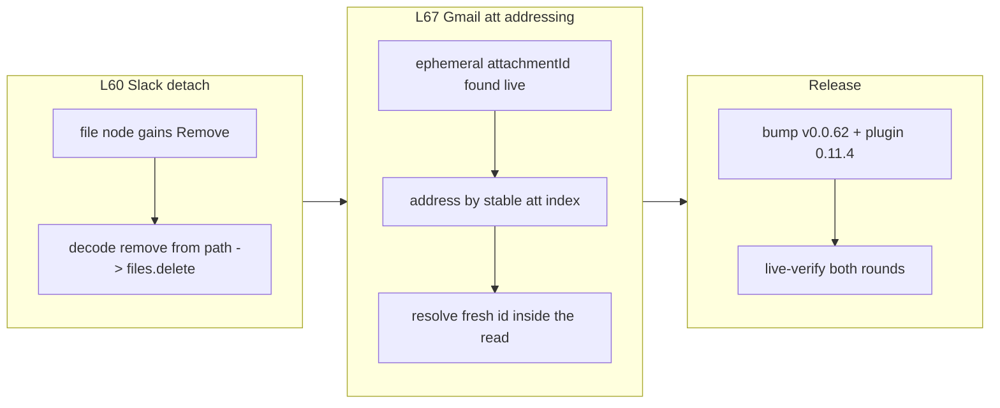

## 1. Overview

Two owner-attended live rounds — Slack file bytes and Gmail→Drive transfer — each exposed a defect
that the hermetic suite structurally could not catch, and this branch fixed both and re-proved them
live. Slack file **detach** was unreachable (a capability/verb mismatch rejected every delete);
Gmail's one-statement attachment→Drive transfer was impossible because Gmail's `attachmentId` is
**ephemeral**. Both mission acceptances now tick (file-handling attach/detach and Gmail→Drive
transfer), taking the mission to 11 of 13.

**Highlights:**

1. Slack file detach works: `remove /slack/<ws>/files/<id>` now decodes to `files.delete` (the file node gained `Remove`), completing the attach/detach loop — live-proven.
2. Gmail attachments are addressed by a stable index `att<N>`; the driver resolves Gmail's ephemeral id inside the read, so a one-statement Gmail→Drive transfer works byte-identical — live-proven.
3. Both live rounds passed against real accounts (a byte-exact Slack round-trip + delete; a 1579-byte `invite.ics` transferred byte-exact into Drive).

## 2. Motivation

The prior branch (v0.0.61) left the two remaining owner-attended file-handling rounds open. Running
them live surfaced two more "hermetic-passes / live-exposes-the-gap" defects — the same pattern that
drove the v0.0.60 campaign. Slack's Files namespace advertised `Verb::Rm` while its decoder and the
cookbook used `Verb::Remove`, so a declared capability had no invocable grammar and every file delete
was rejected. Gmail's attachment addressing assumed a stable `attachmentId`, but the live API
regenerates it per `messages.get` — a mock with a fixed id hid this for the whole feature's life. The
owner chose to fix both in-session and re-verify live, keeping the file-handling capability honest.

## 3. Changes

Each fix landed with a hermetic lock and was then re-proven against the owner's real Slack and Gmail
accounts. The Gmail fix pivoted mid-implementation: the first attempt (expose the raw `attachment_id`)
was abandoned once the live commit revealed the id is ephemeral, and replaced with stable-index
addressing.

### 3-1. Bump to qfs v0.0.62 and plugin 0.11.4 ([2c0a0a0](https://github.com/qmu/qfs/commit/2c0a0a0))

Version bump for the two fixes; the Gmail cookbook recipe (attachment addressing) changed, so all
four plugin version fields bump alongside the crate patch.

### 3-2. Fix Slack file detach: give the file node REMOVE and decode it from the path ([7c0763f](https://github.com/qmu/qfs/commit/7c0763f))

The Slack file node advertised only `Select`, so the taught `remove /slack/<ws>/files/<id>` was
capability-rejected before reaching the ready `DeleteFile` decoder. The file node now advertises
`Remove` and `decode_remove` resolves the id from the path into an irreversible `files.delete`.

### 3-3. Address a Gmail attachment by stable index att<N> ([9f7130d](https://github.com/qmu/qfs/commit/9f7130d))

Gmail's `attachmentId` is ephemeral (regenerated per `messages.get`), so a literal id can't cross
statements. An attachment is now addressed by its stable 0-based index `att<N>`; the driver resolves
the fresh id against the transfer's own message fetch, so the one-statement Gmail→Drive transfer
works.

## 4. Outcome

Both file-handling mission acceptances are live-proven and ticked (attach/detach across
Gmail/Slack/Drive; the one-statement Gmail→Drive transfer), taking the mission from 9 to **11 of 13**.
Two driver defects are fixed and hermetically locked (`qfs-driver-slack`, `qfs-driver-gmail`), with
the full workspace suite green (2446 tests) and all anti-drift gates in sync. Only two desk-task
acceptances remain (dependency-reduction assessment; command-execution-risk lock). Binary at v0.0.62.

## 5. Historical Analysis

This is the third defect-fix increment of the capability-tryout mission's live-round campaign
(v0.0.60 fixed eight, v0.0.61 fixed two content-schema follow-ups, v0.0.62 fixes these two). The
recurring lesson is structural: a hermetic mock that fixes an id/format the live service treats as
ephemeral or stricter will pass while the live path fails — the Slack `Rm`/`Remove` capability gap
and the Gmail ephemeral-`attachmentId` are both instances. Each was caught only by an owner-attended
live round, reinforcing the mission's hermetic-first-then-live-verify discipline.

## 6. Concerns

### Slack workspace-namespace still advertises Verb::Rm with no query grammar

- **Severity:** low
- **Description:** This branch fixed the file-node path-addressed delete, but the workspace `SlackNode::Files` namespace still advertises `Verb::Rm` (see [7c0763f](https://github.com/qmu/qfs/commit/7c0763f) in `packages/qfs/crates/driver-slack/src/lib.rs`), which `qfs run` has no grammar to invoke (only the interactive shell has `rm`). It is harmless (the `cp`/upload shorthands use it) but is a latent dead-capability of the same class this branch fixed.
- **How to Fix:** If a namespace-level bulk file delete is ever wanted from `qfs run`, either add a `remove /slack/<ws>/files where id == …` capability or drop the unused `Rm` from the namespace; otherwise leave it for the shell.

### (carried, unchanged) The standing open concerns from PRs #11/#18/#22/#25/#26/#30/#32/#33/#34/#35/#37

- **Severity:** low
- **Description:** Untouched by this branch: `/cf` live, EXTEND read-path, `/local` multi-column writes, Postgres/MySQL declared round-trips, the #18/#30 live-serve and bearer-reconcile items, CREATE ACCOUNT edges, the #25/#26 live-provider acceptances, the #32 artifacts/span-flake items, the #33/#34/#35 declared-driver and sweep items, and the #37 per-row Drive folder-rename (deferred to the effect-selector-channel design ticket `20260713195008`).
- **How to Fix:** Each lifts as its prerequisite lands or its owner-attended round runs; tracked in `.workaholic/concerns/`.

## 7. Successful Development Patterns

- Owner-attended live rounds keep catching a whole defect class the hermetic suite is blind to (a mock that pins an id/format the live service treats as ephemeral or stricter). Running the real round, not just the green suite, is what closed both gaps.
- Pivoting mid-implementation when live evidence contradicts the premise: the Gmail fix's first version (expose the raw id) was abandoned the moment the live commit proved the id ephemeral, and replaced with stable-index addressing — cheaper than shipping a plausible-but-wrong fix.
- For an ephemeral-handle resource, address by a stable property (index) and resolve the live handle inside the same read, never surfacing the handle as a user-carried value — the general rule the Gmail fix encodes.
- Asserting a capability is actually *invocable* end-to-end (a real `remove` statement decodes), not merely that `check_capability` returns ok — the Slack `Rm`/`Remove` mismatch passed the capability bit for two versions while every real delete failed.

## 8. Release Preparation

**Verdict**: Ready for release

### 8-1. Concerns

- None blocking. Both changes are additive driver fixes with hermetic locks and live proof; the full workspace suite (2446) is green and all anti-drift gates are in sync. The gmail cookbook recipe changed, so the plugin bumps to 0.11.4 alongside the crate (v0.0.62).

### 8-2. Pre-release Instructions

- None beyond the standard flow. Crate is at v0.0.62; all four plugin version fields are at 0.11.4.

### 8-3. Post-release Instructions

- The two desk-task mission acceptances (dependency-reduction assessment, command-execution-risk lock) remain for a future session, plus the deferred effect-selector-channel folder-rename design ticket.

## 9. Notes

Live-round residue in the owner's own accounts (self-visible; owner's call to clean): the transferred
`invite.ics` (1579 bytes) now sits in `/drive/my/qfs-extract-test`. The Slack test file was detached
as part of the round. Both live commits were triggered from the owner's terminal (the assistant's
shell is denied outward cloud writes); the assistant previewed and verified byte-exact round-trips.

## Deployment Evidence

- **When:** 2026-07-14T01:02:26+09:00
- **Target:** qfs GitHub Release (release-on-tag)
- **Method:** deploy-on-merge pre-merge readiness proof
- **Status:** pass
- **Observed:** Gate suite green on branch: cargo build/test --workspace (2446 passed, 0 failed), clippy --workspace --all-targets -D warnings, fmt --all --check, gen-docs --check, gen-skills --check, cookbook ratchet all pass; Cargo.toml version 0.0.62 is ahead of main v0.0.61. Both fixes live-proven byte-exact.
