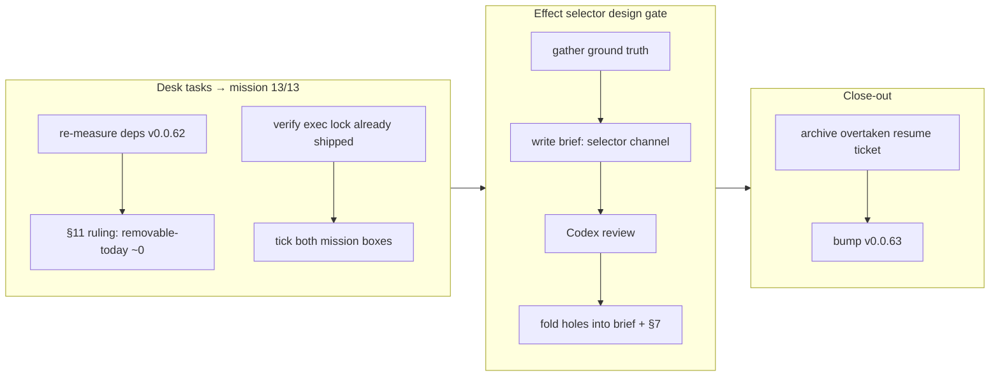

## 1. Overview

A close-out branch: it clears the capability-tryout mission's **last two open acceptance boxes**
(taking it to **13 of 13** — fully accepted) and writes the Fable-grade design brief the deferred
effect-selector-channel ticket was waiting on. No product code changed — the two desk tasks are a
recorded dependency ruling and a *verification* that the command-execution lock already shipped, and
the brief is a design deliverable. The design brief was **reviewed by Codex** before landing.

**Highlights:**

1. Dependency-reduction ruling recorded (blueprint §11, v0.0.62 re-measure): 50 members / 30 shipped
   direct deps — flat vs v0.0.54, zero new crates from the mission window — and a per-lever
   **removable-today ≈ 0** ruling.
2. Command-execution-risk assurance **verified already-landed** (commit `6b4b29f`): `exec_inventory`
   allowlist + no-shell lock (2/2) and `driver-git` argument-hygiene (3/3) green; blueprint §17 stands.
   The mission box had simply never been ticked.
3. Effect-selector-channel **design brief written and Codex-reviewed** — the deferred `EffectNode`
   representation decision is now implement-ready, with a checklist blast radius.
4. Mission reaches **13/13**; overtaken post-v0.0.60 resume checkpoint archived; crate at **v0.0.63**.

## 2. Motivation

The post-v0.0.60 resume checkpoint carried two "platform hardening and direction" desk tasks as
still-open, and a deferred design-layer ticket. Reconciling the checkpoint against later sessions
showed the command-execution work had actually already shipped (its mission box left unticked), the
dependency-reduction question just needed a dated ruling, and the folder-rename fix was correctly
routed through a design brief first (a shared-`EffectNode` representation decision, not a contained
driver fix). This branch closes the two acceptances honestly and clears the design gate on the third.

## 3. Changes

### 3-1. Record v0.0.62 dependency-posture re-measurement (§11) ([3f4485c](https://github.com/qmu/qfs/commit/3f4485c))

Blueprint §11 gains a dated 2026-07-14 / v0.0.62 snapshot: 50 workspace members and 30 shipped direct
third-party deps (both flat vs v0.0.54), tree re-baselined to a reproducible `cargo tree` method
(356/363), zero new crates attributed to the mission window, and a per-lever ruling — heavy roots
already feature-trimmed, `tracing-subscriber` defer-with-reasoning, `async-trait` monitored exit,
duplicate versions upstream-owned. No trim was executable without dropping a used capability.

### 3-2. Close both desk-task mission acceptance boxes ([ce81146](https://github.com/qmu/qfs/commit/ce81146))

Command-execution-risk assurance was verified already-enforced (`exec_inventory.rs` allowlist +
no-shell lock; `driver-git` `qualify_ref`/`Oid::parse` argument-hygiene; blueprint §17) — the work
shipped in `6b4b29f` but its mission box was never ticked. Both acceptance lines (dependency-reduction,
command-execution-risk) now tick; the mission changelog records both closures.

### 3-3. Bump qfs 0.0.62 → 0.0.63 ([ba2f4e5](https://github.com/qmu/qfs/commit/ba2f4e5))

Patch bump per the every-shipped-PR rule. No CLI surface the Agent Skills mention changed, so the
plugin version is untouched.

### 3-4. Archive the overtaken post-v0.0.60 resume checkpoint ([2a92e25](https://github.com/qmu/qfs/commit/2a92e25))

Its every "Next action" is resolved; leaving it in `todo` would re-surface stale actions. `todo` now
holds only the implement-ready effect-selector ticket.

### 3-5. Write the effect-selector-channel design brief ([bb024b8](https://github.com/qmu/qfs/commit/bb024b8))

The Fable-grade brief for giving `EffectNode` a `WHERE`-selector distinct from the SET payload:
`selector: Option<RowBatch>`, uniform `WHERE`→selector / `SET`→args lowering, a per-driver multi-match
policy (node-resolvers refuse `AmbiguousTarget`; relational updates the set), and the SQL PK-inference
retirement. Decision recorded in blueprint §7 as designed-not-yet-implemented. Fable's quota was
exhausted, so it was authored on Opus against file:line-verified ground truth.

### 3-6. Fold the Codex review into the brief ([ce685fd](https://github.com/qmu/qfs/commit/ce685fd))

Codex upheld all three design judgments and confirmed every ground-truth claim `MATCHES`, and
surfaced concrete holes now carried in the brief: the full blast radius (**CF D1 mirrors the SQL
PK-inference**; gmail/slack/transform/sys/cf-KV/sql-catalog also read a `WHERE` key from `args`),
preview surfacing is not free (`PreviewRow` omits `args`), `RowBatch` selector invariants must be
enforced, and gdrive child resolution must use `resolve_node`, not the collision-probe `child_id`.
Blueprint §17 was scoped to the shipped runtime (build.rs's build-time git spawn is out of scope).

## 4. Outcome

The capability-tryout mission is **fully accepted (13/13)** — the two remaining platform-hardening
desk tasks are closed (a dependency-reduction ruling and a verified command-execution lock). The
deferred per-row folder-rename is **implement-ready**: a Codex-reviewed design brief with a checklist
blast radius, no design work remaining. Crate at **v0.0.63**; full workspace suite green (2446 tests,
0 failed) and all anti-drift gates in sync. This branch changed no product code — it is a mission
close-out plus a design gate.

## 5. Historical Analysis

The capability-tryout mission ran a long live-round campaign (v0.0.60 fixed eight defects, v0.0.61
two, v0.0.62 two more) that ticked every file-handling and transformation acceptance; what remained
were the two desk tasks and the deferred design ticket. The recurring lesson this branch adds is a
process one: **a ticket archived without a Resolution and with its mission box unticked reads as
outstanding even when the code shipped** — the command-execution lock had been enforced since
`6b4b29f`, yet three sessions of resume checkpoints carried it as open. Verified-already-landed
closure is the fix. The design ticket also shows the value of routing a shared-representation change
through a brief-plus-adversarial-review before implementation: Codex turned an under-scoped blast
radius (gdrive + SQL) into the true one (six more appliers, including a CF D1 mirror) before a line
of implementation was written.

## 6. Concerns

### (advanced, still active) Per-row Drive folder rename needs a selector channel

- **Severity:** low
- **Description:** The deferred `EffectNode` selector-channel work (concern `per-row-drive-folder-rename-needs`,
  ticket `20260713195008`) had its **design gate cleared** this branch — a Codex-reviewed brief and a
  blueprint §7 decision — but the **implementation has not landed**, so the concern stays `active`. The
  v0.0.60 safe refusal remains the current behavior (a documented workaround exists).
- **How to Fix:** Implement from the brief (§3–§4): add `EffectNode.selector`, lower uniformly, and
  migrate the checklist of appliers (gdrive, SQL, CF D1, gmail, slack, transform, sys, cf-KV,
  sql-catalog). Tracked in `.workaholic/concerns/per-row-drive-folder-rename-needs.md`.

### (carried, unchanged) The standing open concerns from prior PRs (#11/#18/#22/#25/#26/#30/#32/#33/#34/#35/#37)

- **Severity:** low
- **Description:** Untouched by this doc/design branch: `/cf` live, EXTEND read-path, `/local`
  multi-column writes, Postgres/MySQL declared round-trips, the live-serve and bearer-reconcile items,
  CREATE ACCOUNT edges, the live-provider acceptances, the artifacts/span-flake items, and the
  declared-driver/sweep items. This branch changed no product code, so none is affected.
- **How to Fix:** Each lifts as its prerequisite lands or its owner-attended round runs; tracked in
  `.workaholic/concerns/`.

## 7. Successful Development Patterns

- **Reconcile a resume/checkpoint ticket against later sessions before driving it** — most of this
  checkpoint's actions were already done by intervening branches; blindly driving the literal list
  would have re-implemented shipped work. The reconciliation is what surfaced the true remaining two.
- **Verified-already-landed closure** — when a ticket's code already shipped but its acceptance was
  never recorded, re-verify the acceptance criteria against HEAD and close it honestly rather than
  re-implementing; own the earlier archive-without-Resolution gap plainly.
- **Brief-then-adversarial-review for a shared-representation change** — writing the design brief from
  file:line ground truth and then having Codex refute it caught an incomplete blast radius (a CF D1
  mirror + five more appliers) and two load-bearing implementation caveats before any code was written.
- **Record the honest zero** — the dependency ruling's answer was "removable-today ≈ 0"; recording that
  with numbers and per-lever reasons is the deliverable, not a forced trim.

## 8. Release Preparation

**Verdict**: Ready for release

### 8-1. Concerns

- None blocking. This branch changed no product code (a blueprint ruling, a verification, a design
  brief, an archive move, a version bump); the full workspace suite (2446) is green and all anti-drift
  gates are in sync. The one advanced concern (effect-selector implementation) is a tracked follow-up,
  not a regression.

### 8-2. Pre-release Instructions

- None beyond the standard flow. Crate is at v0.0.63; the plugin version is unchanged (no
  skill-mentioned CLI surface changed).

### 8-3. Post-release Instructions

- Implement the effect-selector channel from the Codex-reviewed brief (ticket `20260713195008`) in a
  follow-up `/drive`; the design gate is cleared and the blast radius is a checklist.

## 9. Notes

The capability-tryout mission is fully accepted (13/13) with this branch; a mission close-out
(`/mission close`) is the natural next housekeeping step once the effect-selector follow-up is scoped
(that ticket is a follow-up beyond the mission's acceptance set, not a gate on closing it).

## Deployment Evidence

- **When:** 2026-07-14T02:05:00+09:00
- **Target:** qfs GitHub Release (release-on-tag)
- **Method:** deploy-on-merge pre-merge readiness proof
- **Status:** pass
- **Observed:** Gate suite green on branch: cargo build/test --workspace (2446 passed, 0 failed),
  clippy --workspace --all-targets -D warnings, fmt --all --check, gen-docs --check, gen-skills
  --check, check-migrations all pass; Cargo.toml version 0.0.63 is ahead of main v0.0.62. No product
  code changed (doc/design/close-out branch).
