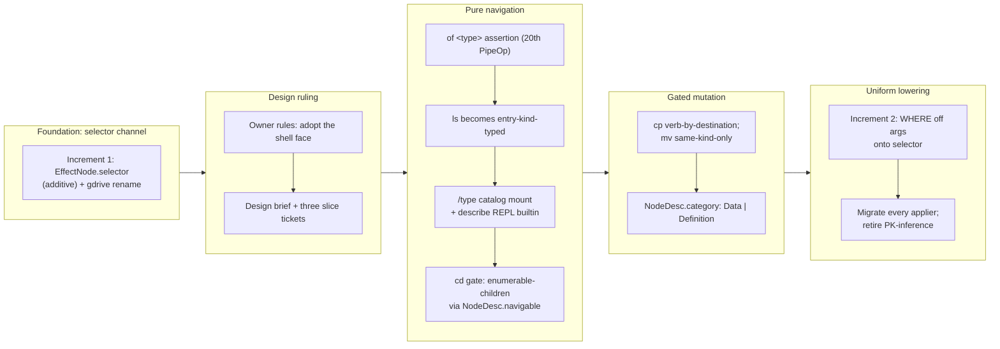

## 1. Overview

This branch completed the **shell face** of qfs's typed-path space and, beneath it, made the **effect-selector channel** uniform. It began from a design ruling (adopt the shell face) and ran through five implementation slices, ending with a migration that moved the `WHERE` clause off the effect payload entirely across every driver. The recurring theme: the blueprint and the shipped cookbook already *taught* a shell the binary could not execute — this branch made the taught surface true rather than dumbing the docs down.

**Highlights:**

1. `ls` became entry-kind-typed and `/type` mounted as a read-only catalog, so `ls /type` **is** SHOW TYPES in the binary — a claim `docs/blueprint.md` §5.4 and the databases cookbook had been making all along.
2. The `cd` gate became **enumerable-children**, stated per node by the driver (`NodeDesc.navigable`), so `cd /transform`, `cd /type`, `cd /sql/<conn>` and `cd /mail` work — while entering a row-set is still refused.
3. `cp`/`mv` gained per-entry-kind semantics, closing a real trap: `mv` on a mail path was copy+delete, which means **send a new message to a third party and trash the original**.
4. The effect-selector lowering became uniform — the `WHERE` now lives only on `selector`, retiring PK-inference for the match across ~9 driver crates, so a non-key `WHERE` is honoured and a same-column `SET x WHERE x` is expressible for the first time.
5. `describe` became a REPL builtin that can address the cwd — the one thing the absolute-path-only one-shot form cannot do.

## 2. Motivation

The blueprint and the shipped Agent Skills described a complete typed-path shell — `ls /type` shows types, `describe` works in the REPL, `cd` navigates catalogs — but the binary rejected the very statements the skills told agents to write. The owner ruled **adopt** on a code-grounded design brief rather than retracting the documentation, so the work was to make the claims true. A second thread was safety: `mv` on a mail path silently became copy+delete (send + trash), `cp` into an append log claimed an idempotent `UPSERT` with no key to match on, and a same-column `SET name WHERE name` had its filter silently de-duped away — the bug that had already forced the Drive folder-rename to refuse rather than guess. The shell-face slices and the selector channel closed both the capability gaps and the silent-failure traps together.

## 3. Changes

The branch arced from a contained driver fix (the Drive folder-rename) into the design-layer change it had exposed, then through the shell face proper: a design ruling, a type assertion, entry-kind-typed enumeration, a catalog mount, a navigability contract, and per-kind mutation semantics — before returning to finish the foundation it started on. Each slice landed behind the shipped preview→commit gate with the full gate green, and two of the eight tickets were re-scoped mid-implementation when the code contradicted the plan.

### 3-1. Give the effect node a predicate/selector channel so a per-row folder rename is representable ([45dd080](https://github.com/qmu/qfs/commit/45dd080))

Increment 1 of the selector channel: added `EffectNode.selector: Option<RowBatch>` **additively** — the `WHERE` was populated onto `selector` while `args` kept carrying it — so the Drive folder-rename was fixed with zero regression and no golden churn. The gdrive consumer now renames the matching child via the ambiguity-safe `resolve_node` instead of refusing.

### 3-2. Effect selector channel — increment 2: uniform lowering + migrate every applier off args-as-filter ([7b72cab](https://github.com/qmu/qfs/commit/7b72cab))

Retired the two-convention state: `args` became purely the payload and `selector` purely the match, so a `REMOVE` now carries genuinely empty `args`. Every applier migrated (SQL, Cloudflare D1 + KV, gmail, slack, transform, sys, gdrive, sql-catalog), PK-inference was retired **for the match** — the operator's real `WHERE` is now honoured — and `Driver::plan_write` gained a `selector` parameter. UPSERT's `conflict_keys` stay PK-based, since retry-safety is a separate concern from the filter.

### 3-3. General mid-pipe `of <type>` assertion — the use-site type contract as a first-class stage ([ba06534](https://github.com/qmu/qfs/commit/ba06534))

Added the 20th `PipeOp`: a plan-time structural assertion that checks a relation against a declared type at any seam and never coerces.

### 3-4. Shell face slice 1 — `ls`/`cat`/`describe` become path-typed; re-found blueprint §9 ([02c6a66](https://github.com/qmu/qfs/commit/02c6a66))

`ls` became entry-kind-typed: a blob namespace keeps the `name/size/is_dir/modified` projection, while every other entry kind's rows **are** its enumeration, so `ls` lowers to the bare read. This fixed `unknown column` failures on `/mail/inbox` and `/transform`, and re-founded blueprint §9 on the ruling.

### 3-5. Shell face — `/type` catalog mount + `describe` REPL builtin ([c20b6c4](https://github.com/qmu/qfs/commit/c20b6c4))

Mounted `/type` as a read-only catalog over the `kind='type'` declarations (a new `qfs-driver-type` crate mirroring `/transform`'s pure/injected split), making `ls /type` = SHOW TYPES true in the binary. `describe` became a REPL builtin rendering the same report as the one-shot path, plus cwd-relative addressing. Driving the real binary caught a defect here: the listing printed the stored **path** (`/type/chatwork/message`) — the one spelling the grammar rejects.

### 3-6. Shell face slice 2 — `cd` gate becomes "enumerable-children", not two archetypes ([fb664b5](https://github.com/qmu/qfs/commit/fb664b5))

Replaced the archetype-pair allowlist with a per-node `NodeDesc.navigable` fact the driver states, because a navigable catalog interior and a row leaf report the *same* archetype. Defaults derive from the archetype, so drivers that say nothing keep the old behaviour exactly; `/transform`, `/type`, `/sql/<conn>` and the gmail label tree opt in per path.

### 3-7. Shell face slice 3 — mutation verbs (`cp`/`mv`/`rm`) get their per-entry-kind ruling ([fc99572](https://github.com/qmu/qfs/commit/fc99572))

`cp` is keyed on the destination's entry kind (blob → `UPSERT`, else `INSERT`); `mv` is same-kind-only, and every other combination is a structured refusal that names the honest spelling — closing the mail send-trap. `NodeDesc.category` (`Data` | `Definition`) landed as the §5.5 signal, making a data-row `cp` into a definition catalog a `category_error`. Two def-catalog verbs from the plan proved **inexpressible** and refuse instead (see §6).

### 3-8. RESUME — shell-face slices 2/3 (+ /type mount) and reporting the current branch ([91f8d5c](https://github.com/qmu/qfs/commit/91f8d5c))

A `/carry` checkpoint, archived once every slice it tracked had landed. Its environment notes (cargo PATH, the `TMPDIR` redirect, the full gate list, the REPL driver) were used within hours.

## 4. Outcome

The shell face is complete and its foundation is uniform. Blueprint §9's adopted plan — entry-kind-typed `ls`, the `/type` catalog mount, a `describe` builtin, the enumerable-children `cd` gate, and the per-entry-kind mutation ruling — is now implemented end to end, and §7's selector channel is fully landed across both increments. The describe contract grew two facts the drivers state per node (`navigable`, `category`), which is what let navigation and the §5.5 data/definition line be enforced without shell-side heuristics.

Three concrete outcomes are worth naming. **The taught surface became true**: `ls /type` = SHOW TYPES was a claim in `docs/blueprint.md` §5.4 and in the shipped `qfs-databases` skill before it was a behaviour. **A silent data-loss trap closed**: `mv` on a mail path now refuses and names `UPDATE … SET labels`, where it previously lowered to copy+delete — sending a new message to a third party and trashing the original. **A design-layer bug was retired at the root**: the same-column `SET name WHERE name` that forced the Drive folder-rename to refuse is now representable, and the deferred concern that had been waiting on it (`per-row-drive-folder-rename-needs`, PR #37) is resolved by this branch.

Eight tickets landed across two missions, with the full gate green at each: 2497 tests, clippy `-D warnings`, fmt, gen-docs, gen-skills, and check-migrations all at exit 0. qfs went 0.0.63 → 0.0.70 and the plugin 0.11.4 → 0.11.7.

## 5. Historical Analysis

This branch is the third act of a story the repo has been telling since PR #37. That branch fixed a Drive folder-`UPDATE` by making it **refuse** a name-path rename, because the flat `args` `RowBatch` could not represent a same-column `SET name WHERE name` — and it filed the concern saying so. A later branch cleared the design gate (a Codex-reviewed brief, recorded in blueprint §7). This branch implemented it, and the pattern holds: a contained driver symptom, honestly refused rather than guessed at, surfaced a design-layer root cause that was then fixed once for every driver. The refusal was what preserved the information.

The shell face followed the same shape at a different altitude. Slice 1's `ls` defect (`unknown column` on `/mail/inbox`) looked like a desugar bug; the ruling reframed it as "verb semantics derive from the path's entry kind", which then generated slices 2 and 3 mechanically. Slice 2's ticket carried a scope finding recorded *before* implementation — that `describe /transform` and `describe /sys/drivers` report the same archetype — and that finding was exactly right, which is why the gate needed a new contract field rather than a wider allowlist.

The `qfs-capability-tryout` mission's presence here is a deliberate exception: it was closed 13/13 by another session, and its remaining ticket was driven only after the owner explicitly overruled the caveat. The mission relation on this story points at `language-design-review-…` accordingly, so a closed mission is not rolled back open.

## 6. Concerns

_22 concerns carried forward from earlier PRs (still active after judging against this branch), followed by 7 discovered here._

### (carried from PR #32) Artifacts repo token is sealed but live round-trip is owner-gated

- **Severity:** moderate
- **Description:** Cloudflare Artifacts repository create/delete surface is fully hermetic and the minted repo token is sealed in the vault, but the required live beta-access round-trip verification is unreachable (unverified Artifacts access on the connected account) and deferred to a full-context session for token-handling security (see [8ca0522](https://github.com/qmu/qfs/commit/8ca0522) in packages/qfs). (`artifacts-repo-token-is-sealed-but.md`, origin `22c61e4`)
- **How to Fix:** In a dedicated session with explicit owner go-ahead, verify the connected Cloudflare account has Artifacts beta access; run a live create/clone/delete round-trip and record evidence on the archived ticket; do not perform autonomously due to beta-access and security-critical token handling.

### (carried from PR #11) EXTEND on the read path is now a real operation (behaviour change)

- **Severity:** moderate
- **Description:** EXTEND was previously a silent no-op on reads; it now actually computes per-row values ([b5a4eec]). This is a correctness fix but a behaviour change — any pipeline that (accidentally) relied on the old no-op now behaves differently, and the array/struct literal forms became expression constructors (an experimental hard break). (`extend-on-the-read-path-is.md`, origin `3c6f995`)
- **How to Fix:** Audit cookbook/tests for EXTEND uses (suite is green, no regressions caught) and note the change prominently in the release note so downstream scripts expecting the old behaviour are updated.

### (carried from PR #26) Live provider acceptance still needs credentials

- **Severity:** moderate
- **Description:** Cloudflare, Postgres, and Google Drive behavior is wired but not live-verified in this container because the required provider credentials and live resources were not available (see [b9d2ad8](https://github.com/qmu/qfs/commit/b9d2ad8) in `packages/qfs/crates/qfs/src/cf.rs`, `packages/qfs/crates/qfs/src/sql_backends.rs`, and `packages/qfs/crates/exec/src/shell/session.rs`). (`live-provider-acceptance-still-needs-credentials.md`, origin `d8442ef`)
- **How to Fix:** Run the live Cloudflare D1/KV/Queue smoke tests with `CF_ACCOUNT_ID`/`CF_API_TOKEN`, a live Postgres `SELECT` over NUMERIC/timestamp/UUID/JSON columns, and a disposable Drive `cp /local/... /drive/...` upload/read-back check.

### (carried from PR #25) Project DB configuration events are not yet in the DDL event log

- **Severity:** moderate
- **Description:** System DB-backed writes append DDL events transactionally, but Project DB-backed path/account state cannot share that transaction boundary yet (see [3385eb3](https://github.com/qmu/qfs/commit/3385eb3) in `packages/qfs/crates/qfs/src/sys.rs`). (`project-db-configuration-events-are-not.md`, origin `37bb365`)
- **How to Fix:** Add a Project DB event writer for `path_binding` and account/app consent mutations, with the same secret-redaction and hash-chain discipline, or introduce a cross-store event envelope that makes the two stores' boundaries explicit.

### (carried from PR #18) 170000 Quality Gate #5 — owner live vault-unlock confirmation

- **Severity:** low
- **Description:** The session-unlock's live confirmation on the real headless host cannot be run by an (`170000-quality-gate-5-owner-live.md`, origin `72c8950`)
- **How to Fix:** Owner runs the three-step live check post-merge.

### (carried from PR #30) Bearer-gated (non-loopback) reconcile round is not live-verified

- **Severity:** low
- **Description:** The recorded live provisioning verification ran under the loopback dev posture without the OAuth AS. The non-loopback path is covered only by the fail-closed unit test (a non-loopback bind without bearer material refuses the commit bridge); a full bearer-authenticated plan/apply round against a passphrase-booted daemon has not been run. (`bearer-gated-non-loopback-reconcile-round.md`, origin `e7e44ee`)
- **How to Fix:** Owner runs one bearer-gated round: boot with QFS_PASSPHRASE + System DB, obtain a token from the OAuth AS, and drive plan/apply against a non-loopback bind; record the result.

### (carried from PR #11) /cf live (203090) unimplemented; /cf and /rest are placeholder mounts

- **Severity:** low
- **Description:** `/cf` and `/rest` are reachable, cred-free planning/describe mounts ([8cce093]), but live credentialed read/commit and per-resource config (which D1/KV/queues; which REST resource maps) are follow-ups needing a richer connection declaration; `/cf` live verification needs the owner's CF token, so 203090 is deferred. (`cf-live-203090-unimplemented-cf-and.md`, origin `3c6f995`)
- **How to Fix:** Design a per-resource connection declaration beyond the current (driver, locator, secret) shape, then wire read/apply facets and live-verify with the owner's token; roadmap already reflects this as deferred.

### (carried from PR #18) Console bundle pin unset; live serve + release stamp pending the plgg bundle

- **Severity:** low
- **Description:** The console delivery machinery is complete and tested, but `PINNED_BUNDLE` is empty (`console-bundle-pin-unset-live-serve.md`, origin `72c8950`)
- **How to Fix:** When the plgg bundle publishes, stamp its URL+hash into `PINNED_BUNDLE`, wire the real

### (carried) CREATE ACCOUNT ships the core; two edges are scoped out (SECRET reference form, Google-email in-language REMOVE)

- **Severity:** low
- **Description:** The in-language account surface (ticket 20260703040000) shipped the owner-approved core: `CREATE ACCOUNT <provider> '<label>'` records consent (gated on a signed-in operator, sharing the CLI `qfs account add` writer), `/sys/accounts` is a queryable selectors-only registry (no token column, Google's driver trio collapsed to one `google` row), and `REMOVE /sys/accounts/<provider>/<label>` deletes an… (`create-account-ships-the-core-two.md`, origin ``)
- **How to Fix:** 1. **SECRET reference for accounts**: wire bind-time resolution of an account credential from an `env:`/`vault:` reference (a new capability), then accept the `SECRET` clause on `CREATE ACCOUNT` and store the reference where the cloud bind reads it. 2. **Google-email REMOVE**: support a filter-based remove on `/sys/accounts` (`REMOVE /sys/accounts WHERE account == '<email>'`) — the email rides saf…

### (carried from PR #33) Declared-model and scheduling follow-ups

- **Severity:** low
- **Description:** Partially resolved by PR #35 (v0.0.59): sub-item (1)'s two generic declared-evaluator primitives (`FOLLOW <field>` for the cross-host download URL, `ENCODE multipart` for upload) landed, and sub-item (3)'s daemon real-clock sweeper + `/server/jobs/<name>/runs` read-back collection landed in `crates/qfs/src/sweeper.rs`. Still remaining: (1-live) verify live that Chatwork message POST tolerates the… (`declared-model-and-scheduling-follow-ups.md`, origin `f1a3d21`)
- **How to Fix:** Each remainder is a scoped follow-up ticket when prioritized: live-verify the Chatwork encoding (rounds 3/10 of the owner-attended live rounds); plumb the OAuth app into the declared-secrets adapter; extend the reply surfaces for Slack threading.

### (carried from PR #34) Duplicate declaration rows still resolve oldest-first outside the type lookup

- **Severity:** low
- **Description:** Repeated `qfs run -f <driver>.qfs` installs append `sys_drivers` rows rather than replacing them. PR #34 switched only the `type` lookup to newest-wins (`types_from_conn` orders `id DESC`, so a re-install heals a stale type row). Duplicate `driver` and `view`/`map` rows from re-installs still resolve oldest-first in their own lookups: `assemble` seeds one `DeclaredDriver` per `driver` row (duplica… (`duplicate-declaration-rows-still-resolve-oldest.md`, origin `497ff5e`)
- **How to Fix:** Apply the same newest-wins ordering — or better, a replace-on-install semantic for same-name declaration rows — to the driver/view/map lookups in `declared_driver.rs::assemble` and the view template matching, so a re-install consistently heals every row kind.

### (carried from PR #25) Live-only providers remain outside local proof

- **Severity:** low
- **Description:** The design snapshot intentionally documents live-only gates for external providers, but local tests still prove only parser, preview, registry, and hermetic mock behavior for those services (see [e8c0d82](https://github.com/qmu/qfs/commit/e8c0d82) in `docs/guide/design-snapshot.md`). (`live-only-providers-remain-outside-local.md`, origin `37bb365`)
- **How to Fix:** Keep owner-live acceptance tickets for provider-specific paths such as Cloudflare, Postgres, and Google Drive, and record each credentialed verification separately from the hermetic release gate.

### (carried from PR #11) /local write materialization is narrow

- **Severity:** low
- **Description:** Local writes persist, and a positional single-column payload now maps onto the blob ([0373cd2]), but a multi-column payload with no `content` column still errors — the user must name the blob column. Earlier in the branch one-shot `upsert into /local/<file>` reported COMMITTED without writing, which the fallback addressed for the unambiguous case. (`local-write-materialization-is-narrow.md`, origin `3c6f995`)
- **How to Fix:** Keep the single-column fallback strict (intentional); document that multi-column local writes must name the blob column. Watch the commit.rs → effect.rs content-blob threading for other write paths.

### (carried from PR #35) Policy-less or denied job re-fires every sweep

- **Severity:** low
- **Description:** A policy-less or denied job re-fires every sweep by the ruled not-stamped semantics — visible denied runs, history capped at 50 (see 4de2f42 in `packages/qfs/crates/qfs/src/sweeper.rs`). (`policy-less-or-denied-job-re.md`, origin `c30fa0a`)
- **How to Fix:** Review the sweep retry semantics after live operation; consider a denied-job backoff if the visible denied-run churn proves noisy.

### (carried from PR #11) Postgres/MySQL declarations for the declared-registry path are partial

- **Severity:** low
- **Description:** Live Postgres/MySQL `/sql` backends work when configured ([ca67fb8]), but from the CREATE CONNECTION declared-registry path the binary's declared `/sql` was historically SQLite-only, and `sql`/`git` still ride the declared-connection seam rather than the new `path_binding` registry (documented CONNECT-epic follow-up). NUMERIC/TIMESTAMP/UUID/JSON column round-trips and `--` comments in `connections… (`postgres-mysql-declarations-for-the-declared.md`, origin `3c6f995`)
- **How to Fix:** Move `sql`/`git` onto `path_binding`, broaden column-type coverage, and add comment support to the connections parser.

### (carried from PR #32) qfs-runtime span-buffer test flakes under parallel workspace tests

- **Severity:** low
- **Description:** The qfs-runtime test `observability_spans_carry_ids_and_are_secret_free` (crates/runtime/tests/txn_commit.rs) fails under parallel `cargo test --workspace` because a shared global span buffer is polluted across concurrently-running tests, but passes cleanly with `--test-threads=1`; the crate is not modified by this branch, so this is a pre-existing test-isolation issue distinct from the known qfs-… (`qfs-runtime-span-buffer-test-flakes.md`, origin `22c61e4`)
- **How to Fix:** Isolate the qfs-runtime span collector per test (thread-local buffer or serialize that test); until then, rerun the CI job when this specific test flakes.

### (carried from PR #35) Redirect off a follow URL is refused by the confined transport

- **Severity:** low
- **Description:** A redirect off a FOLLOW download URL (cross-host download) is refused by the confined transport, fail-closed (see 4de2f42 in `packages/qfs/crates/driver-http`). May need revisiting if a real service redirects downloads. (`redirect-off-a-follow-url-is.md`, origin `c30fa0a`)
- **How to Fix:** Monitor live service redirect behaviors during the live rounds; revisit the transport policy if real services require redirect following.

### (carried from PR #33) Remaining owner-attended live rounds

- **Severity:** low
- **Description:** The switch live round ran and passed (real Anthropic model, real Drive and Gmail-drafts writes, per-arm counts verified by read-back), but six live rounds remain owner-attended pending: the Slack user-token post (`/slack-me` preview+commit), a real Gmail cross-service reply into a live thread, a declared `/ghdecl` GitHub read via `AUTH ACCOUNT 'github'` (the live GitHub API needs a `User-Agent` he… (`remaining-owner-attended-live-rounds.md`, origin `f1a3d21`)
- **How to Fix:** Owner runs each round in a dedicated session and records evidence on the archived tickets. The archived resume ticket carries the worked operating pattern: statement files in the session scratchpad, PREVIEW and read-back by the assistant, every COMMIT triggered from the owner's real terminal, model key via `secret 'env:ANTHROPIC_API_KEY'`.

### (carried from PR #33) Scope cuts and monitored items

- **Severity:** low
- **Description:** Recorded, deliberate cuts and watches: the switch first slice (blueprint §18) requires `else` on every switch, defers all-pure switch, keeps arm vocabulary row-local, excludes UPDATE/REMOVE arm terminals, and lists fired arms only in the committed summary; the PDF inline byte caps are set conservatively and long-PDF chunking is out of scope; the exec-inventory `cfg(test)` stripper is heuristic (ri… (`scope-cuts-and-monitored-items.md`, origin `f1a3d21`)
- **How to Fix:** Each switch cut lifts as its prerequisite lands (notably refinement-carrying schemas for exhaustiveness without `else`); tune the PDF caps after the live round; tighten the stripper with a real syntax pass only if it misbehaves; drop `async-trait` when native async-in-trait covers its sites; residue cleanup is the owner's call (`remove transform triage` drops the definition); script the localhost-…

### (carried from PR #39) Slack workspace-namespace still advertises Verb::Rm with no query grammar

- **Severity:** low
- **Description:** This branch fixed the file-node path-addressed delete, but the workspace `SlackNode::Files` namespace still advertises `Verb::Rm` (see [7c0763f](https://github.com/qmu/qfs/commit/7c0763f) in `packages/qfs/crates/driver-slack/src/lib.rs`), which `qfs run` has no grammar to invoke (only the interactive shell has `rm`). It is harmless (the `cp`/upload shorthands use it) but is a latent dead-capabilit… (`slack-workspace-namespace-still-advertises-verb.md`, origin `3dae249`)
- **How to Fix:** If a namespace-level bulk file delete is ever wanted from `qfs run`, either add a `remove /slack/<ws>/files where id == …` capability or drop the unused `Rm` from the namespace; otherwise leave it for the shell.

### (carried from PR #30) The `api` policy row gates MCP, dashboard, and reconcile alike

- **Severity:** low
- **Description:** The daemon's statement-bridge commit gate resolves the live `/server/policies` row named `api` (blueprint §16, Decision X). Because MCP, the dashboard bridge, and `qfs apply` share one executor, granting the `api` policy grants all three clients at once; absent the row the gate is the empty default-deny it always was. Codified, but worth operator awareness when widening the grant (a reconcile-gran… (`the-api-policy-row-gates-mcp.md`, origin `e7e44ee`)
- **How to Fix:** If per-client grants are ever needed, split the gate's policy resolution by client identity (bearer subject) rather than one shared row; until then document the shared-grant behavior in the operator guide.

### (carried from PR #30) The config `--` comment stripper truncates paths containing `--`

- **Severity:** low
- **Description:** The `.qfs` config statement splitter strips from the first `--` on a line even inside a path token, so a statement like `DO REMOVE /local/a--b/x POLICY p` silently loses its tail (path truncated, POLICY clause dropped). Observed as two `qfs` job-test failures whenever `$TMPDIR` contains `--` (sandbox scratchpads do); green under a clean TMPDIR and in CI. For a REMOVE this mis-addresses the target… (`the-config-comment-stripper-truncates-paths.md`, origin `e7e44ee`)
- **How to Fix:** Make the comment stripper quote/token-aware (a `--` inside a quoted string or path token is not a comment), or require whitespace before `--` to open a comment; add a regression test with a `--`-bearing path.

### The interactive shell's `/local` reads from the cwd but writes to the filesystem root

- **Severity:** moderate
- **Description:** `shell.rs` roots the REPL's `/local` READ mount at `current_dir()`, while `commit.rs:246` roots the apply driver at `/`. A REPL `mv a.md b.md` therefore previews against `$CWD/a.md` and then commits into `/b.md` — observed as `PermissionDenied`, but it would **succeed as root**. Pre-existing and untouched by this branch (the blob→blob lowering is byte-identical), found only by driving a real COMMIT rather than trusting the preview (see [fc99572](https://github.com/qmu/qfs/commit/fc99572) in `packages/qfs/crates/qfs/src/shell.rs` and `commit.rs`).
- **How to Fix:** Root the commit-side local applier at the same directory the shell's read mount uses (or root both at `/` and make the shell's cwd purely a prompt-level convenience). It means no `cp`/`mv` COMMIT in the REPL has ever worked as the operator reads it, so it deserves its own ticket rather than a drive-by fix.

### The branch-safety scanner false-positives on Rust `Token::Variant`, hard-blocking `/ship`

- **Severity:** moderate
- **Description:** `scan-branch-safety.sh` returns `block` with 7 `secret`/`credential` findings on this branch, all false positives — five are **doc comments** (`/// \`Token::Path\` there fails`). The cause is in the workaholic plugin's `skills/release-scan/scripts/lib/secret-patterns.sh`: `_SP_KEY` (line 46) matches the bare word `token`, then `[:=]` binds to the *first* colon of Rust's `::` and `[^[:space:]]{6,}` swallows the variant name, so every `Token::Variant` in a parser reads as `token=<secret>`. Reproduced in isolation; the rule still matches real assignments, so it is a precision bug, not a broken rule (flagged lines rode in on [ba06534](https://github.com/qmu/qfs/commit/ba06534) in `packages/qfs/crates/parser/`).
- **How to Fix:** In the **workaholic plugin repo** (not qfs), subtract the scope-resolution operator in pass 2 — e.g. exclude `"${_SP_KEY}[[:space:]]*::"` — alongside the existing reference-shaped exclusions. Since the `secret` tier is non-overridable by design in `gate-decision.sh`, `/ship` will hard-block this branch until that lands.

### `/sys` and `/slack` do not describe their roots, so `cd` there fails before the gate

- **Severity:** low
- **Description:** `describe /sys` returns `unsupported_verb` and `/slack`'s root is not a node at all, so `cd /sys` fails at describe rather than at the enumerable-children gate. Slack additionally has no "channel tree" node — every addressable node is a leaf, and `files` is already navigable as a `BlobNamespace` (see [fb664b5](https://github.com/qmu/qfs/commit/fb664b5)).
- **How to Fix:** Decide whether `/sys` and `/slack` roots should become describable catalog nodes; that is new driver surface (a root node plus its schema), not a flag, which is why slice 2's quality gate named only the four reachable interiors.

### `cd` into a blob file is still admitted

- **Severity:** low
- **Description:** `cd README.md` moves the cwd into a file. `Driver::describe` is pure — no I/O — so `LocalFsDriver` cannot stat a path to tell a file from a directory and answers `BlobNamespace` for every path. Pre-existing and unchanged by this branch, which only tightened the row-set case (see [fb664b5](https://github.com/qmu/qfs/commit/fb664b5) in `packages/qfs/crates/driver-local/`).
- **How to Fix:** Either have describe report per-path kind from a cached listing, or accept it and document the limit in blueprint §9 — it is structurally unfixable at describe time without breaking the purity invariant.

### Definition-catalog `cp`=clone and `mv`=rename are refused, not implemented

- **Severity:** low
- **Description:** An owner-approved deviation from slice 3's settled design. A definition row **carries its own name**, so `cp /transform/a /transform/b` would re-insert `a` rather than clone it to `b`; and no in-place rename exists to lower onto (`/type` exposes no write verb at all, `/transform` has no `UPDATE`). Both refuse, naming re-declaration instead (see [fc99572](https://github.com/qmu/qfs/commit/fc99572) in `packages/qfs/crates/exec/src/shell/desugar.rs`).
- **How to Fix:** If def-rename is wanted, add a name-rewriting projection the shell can build; until then the refusal is the honest floor, since a silent copy+delete would leave every reference to the old name dangling.

### The `/type` catalog and the type resolver translate the stored key differently

- **Severity:** low
- **Description:** `sys_drivers` stores a declared type's key in **path** form (`/type/chatwork/message`), which is what `of` normalises a bare name into; the catalog listing strips that prefix back to the **reference name** so it can be pasted into `of`. The two representations now coexist deliberately, and the first cut of the catalog got it wrong — printing the one spelling the grammar rejects (see [c20b6c4](https://github.com/qmu/qfs/commit/c20b6c4) in `packages/qfs/crates/qfs/src/type_catalog.rs`).
- **How to Fix:** Any future user-facing surface reading `sys_drivers` `kind='type'` rows owes the same translation; the §5.5 "paths are data, names are definitions" rule is a live encoding boundary here, not just a concept.

### The carried `create-account-ships-the-core-two` concern is now half-stale

- **Severity:** low
- **Description:** Its sub-item 2 names "`EffectNode` carries no filter" as the blocker for a filter-addressed `REMOVE /sys/accounts WHERE account == '<email>'`. That blocker is **retired** — the selector channel exists and `driver-sys` resolves the filter off it, with a test covering the Google-email case that motivated it. Sub-item 1 (the `SECRET '<ref>'` clause on `CREATE ACCOUNT`) is untouched: `create_account_stmt` still parses only `CREATE ACCOUNT <provider> '<label>' [APP …]` (see [7b72cab](https://github.com/qmu/qfs/commit/7b72cab)).
- **How to Fix:** Re-scope that concern's body to the `SECRET` edge alone, so its stale blocker note stops misleading readers into thinking the filter work is still pending. It stays `active` because it is only partially resolved.

## 7. Successful Development Patterns

- **Driving the real binary caught two defects the green suite could not — and one of them was invisible precisely because the suite was green.** After the `WHERE` moved off `args`, all 2493 tests passed while `update /mail/<label> where id == '…'` was already broken: the tests hand-build `EffectNode`s with `with_args`, so they pin the applier's contract but prove nothing about what the evaluator produces. The migration had to be driven by auditing code, not by chasing red tests. The lesson generalises to any test that constructs the IR directly, and the fix that closes it is a governance test at the **producer**, not the consumer.
- **Archetype and navigability are orthogonal axes, and conflating them invites the wrong fix.** Slice 2's ticket read as "the gmail root is `AppendLog`, it should be a navigable label tree", which sounds like an archetype change — but slice 1 had made `ls` archetype-typed, so flipping it to `BlobNamespace` would have lowered `ls /mail` to the blob projection and broken it. The archetype was already right; only navigability was missing. Separating "what shape are this node's rows" from "are this node's children locations" settled the gate immediately.
- **Refuse rather than paper over, and the refusal preserves the information.** PR #37 refused the Drive rename instead of guessing, which is what surfaced the design-layer root cause this branch fixed. Slice 3 did the same for def-catalog clone/rename once they proved inexpressible. A silent copy+delete would have been the same class of harm as the mail trap it exists to close.
- **A scope finding recorded before implementation was worth more than the estimate it invalidated.** Slice 2's ticket carried a verified finding — `describe /transform` and `describe /sys/drivers` report the same archetype — captured against the running binary in a prior session. It re-estimated the slice from 2h to 4h and told the implementer to add a contract field rather than widen an allowlist. It was exactly right.
- **Per-(kind, column) reasoning for effects, never per-column alone.** A blanket find/replace rewriting `emoji`/`ts` from `args` to `selector` silently broke slack's `INSERT` (emoji **is** the reaction payload) and its `CALL pin`/`unpin` (ts **is** a literal argument) — five tests, caught only by re-auditing each site against its `EffectKind`. The selector/args split is per-(kind, column), and any future sweep must key on the effect kind.
- **Additive-then-uniform is a sound way to land a contract change.** Increment 1 shipped the selector field additively (zero golden churn, headline bug fixed); increment 2 retired the old convention in one PR, as its ticket insisted — a half-migrated state breaks every un-migrated applier the moment the lowering stops populating `args`. Splitting the risk that way let the urgent fix ship early without leaving two conventions forever.
- **Defaults that reproduce the old behaviour make a contract change safe to land.** Both new `NodeDesc` fields default from what the driver already said (`navigable` from the archetype, `category` to `Data`), so every existing call site and every silent driver behaves exactly as before, and new rules apply only where a driver actually opted in. Unknown/undescribable paths keep the shipped fallback rather than a guess.

## 8. Release Preparation

**Verdict**: Needs attention before release

The code is ready; the **tooling is not**. Every gate this repo defines passes at exit 0 — `cargo test --workspace` (2497 passed), `clippy --workspace --all-targets -D warnings`, `fmt --all --check`, `xtask gen-docs --check`, `gen-skills --check`, and `check-migrations` — and the version bumps are in place (qfs 0.0.63 → 0.0.70, plugin 0.11.4 → 0.11.7). The single blocker is a **false positive in the branch-safety scanner**, which lives in the workaholic plugin repo rather than in qfs.

### 8-1. Concerns

- The branch-safety scan returns `block` with 7 `secret`/`credential` findings — **all false positives**, and five of them are doc comments. Every flagged line is a Rust `Token::Variant` reference in `packages/qfs/crates/parser/` (`ast.rs:255`; `grammar.rs:1045,1052,1054,1055,1076`; `tests.rs:231`). No credential exists on this branch.
- Root cause is the scanner, not the branch: in `skills/release-scan/scripts/lib/secret-patterns.sh`, `_SP_KEY` (line 46) matches the bare word `token`, `[:=]` then binds to the first colon of Rust's `::`, and `[^[:space:]]{6,}` swallows the variant name. Reproduced in isolation; real assignments still match, so the rule's *recall* is fine and only its precision is wrong.
- Because the `secret` tier is non-overridable by design in `gate-decision.sh`, `/ship` will hard-block this branch until the scanner is corrected. This is a tooling blocker, not a code defect.

### 8-2. Pre-release Instructions

- Fix the false positive in the **workaholic plugin repo** (`plugins/workaholic/skills/release-scan/scripts/lib/secret-patterns.sh`): subtract the scope-resolution operator in pass 2 — e.g. exclude `"${_SP_KEY}[[:space:]]*::"` — alongside the existing reference-shaped exclusions. Deliberately **not** part of this qfs branch: it is a cross-repo change, and vendoring a scanner workaround into qfs would be the wrong fix.
- Re-run `bash ${CLAUDE_PLUGIN_ROOT}/skills/release-scan/scripts/scan-branch-safety.sh` and confirm the verdict flips to `pass` before invoking `/ship`.

### 8-3. Post-release Instructions

- None — no special post-release actions needed. The release itself is the published GitHub Release: tag `v0.0.70` and let `.github/workflows/release.yml` build the four native tarballs.

## 9. Notes

**On the two missions.** This branch's eight tickets span two: six carry `language-design-review-layering-principles-and-semantic-gaps` (the shell face) and two carry `qfs-capability-tryout-file-handling-transformation-and-platform-hardening` (the effect-selector increments). The story's `mission:` names the former — it is the branch's theme and the majority. The latter was **already closed 13/13 by another session**, and its remaining ticket was driven here only after the owner explicitly overruled that caveat; pointing the story's mission relation at it would roll a closed mission back open.

**On the `/local` split-brain.** Section 6 records that the REPL's `/local` reads from the cwd but writes to `/`. It is pre-existing and out of scope for every ticket on this branch, but it is the most consequential thing found this session and is not yet ticketed — it means no `cp`/`mv` COMMIT in the interactive shell has ever done what the operator reads it as doing.

**Two follow-ups worth filing** beyond that: `/sys` and `/slack` root describe nodes (which would make `cd /sys` work), and a re-scope of the `create-account-ships-the-core-two` concern down to its `SECRET` edge now that its recorded blocker is retired.

## Deployment Evidence

- **When:** 2026-07-15T16:33:23+09:00
- **Target:** qfs GitHub Release (release-on-tag)
- **Method:** other (pre-merge readiness proof per .workaholic/deployments contract)
- **Status:** pass
- **Observed:** All seven gates green at exit 0 on the reconciled branch: build; test (2497 passed, 0 failed); clippy --workspace --all-targets -D warnings; fmt --all --check; xtask gen-docs --check; gen-skills --check; check-migrations. Cargo.toml version is 0.0.70, ahead of main 0.0.63, and the v0.0.70 tag is unpublished. Branch-safety scan verdict pass, 0 findings.

## Deployment Evidence

- **When:** 2026-07-15T16:47:03+09:00
- **Target:** qfs GitHub Release (release-on-tag)
- **Method:** other (post-merge promotion check: gh release view v0.0.70)
- **Status:** pass
- **Observed:** Release v0.0.70 published and not a draft. release.yml run 29397820857 completed successfully and attached all four native tarballs plus sha256 checksums: qfs-aarch64-apple-darwin.tar.gz, qfs-x86_64-apple-darwin.tar.gz, qfs-aarch64-unknown-linux-musl.tar.gz, qfs-x86_64-unknown-linux-musl.tar.gz. install.sh consumes these. Merge commit 7752cb3 on main.
