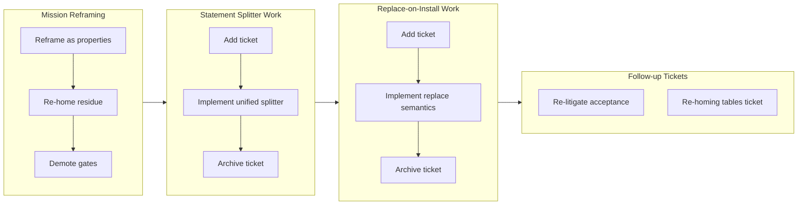

## 1. Overview

This branch unified the qfs statement splitter onto the lexer, eliminating hand-rolled scanners and fixing a parse bug where semicolons in paths merged adjacent statements. It implemented replace-on-install declaration semantics so re-installing a declaration heals registry state by replacing on (kind, name, verb) keys. It also reframed missions as standing product properties rather than work episodes, re-homing unfinished residue and eliminating orphaned concerns.

**Highlights:**

1. Unified statement splitter into `core/src/ddl/document.rs` using the real lexer, deleting both hand-rolled scanners from the server and connections readers and fixing a shipped parse bug where a bare path could swallow its terminating semicolon
2. Implemented replace-on-install semantics: `insert_driver` now deletes the same-(kind, name, verb) row inside the existing audited transaction before inserting, and reads resolve newest-per-key, so append-era duplicate registries heal without re-provisioning
3. Reframed missions as standing product properties rather than work episodes, enabling re-homing of unfinished residue before closure and eliminating orphaned concerns when activities complete
4. Demoted mission quality gates from live-deployment verification to documentation targets, reflecting the owner's ruling that the north star lives in `gate_assert` while verification lives in per-ticket gates

## 2. Motivation

The branch addressed three structural problems discovered during mission housekeeping. First, three components parsed qfs documents differently, none matching the lexer — a single semicolon omission in the path delimiter set caused the splitter to swallow terminators and merge statements, surfacing as parse errors only when temp directories contained dashes. Second, the operator's declaration registry carried duplicates because installations appended rather than replaced on key, leaving stale rows that contradicted the type contract's newest-wins semantics. Third, missions were named for activities rather than properties, so when activities ended their unfinished residue orphaned — caught in missions with closed acceptance or in no mission at all, blocking both the concern lifecycle and mission progress tracking. The owner's rulings reframed missions on lasting properties, consolidated the splitter parsers, and made re-installing a declaration heal state through replace-on-install semantics.

## 3. Changes

The branch sequenced mission reframing first to establish the property model and re-home unfinished concerns, then implemented two fixes: the unified statement splitter resolved a lexer-splitter disconnect that broke on bare paths with semicolons, and replace-on-install semantics fixed registry duplication by replacing on (kind, name, verb) keys within audited transactions. Demoting gates to documentation targets completed the mission reframing. A follow-up ticket was filed for re-homing the declarative tables into the System DB, explicitly to be driven on its own branch.

### 3-1. Resume development in the new public repo ([7bbb38d](https://github.com/qmu/qfs/commit/7bbb38d))

Post-publish handoff housekeeping: reframed the two active missions as standing product properties (not episodes of work), assigned both with declared quality gates, re-litigated the declared-drivers acceptance against the source (correcting items drafted from concern summaries rather than code), and demoted both mission gates per owner directive.

### 3-2. Unify the qfs statement splitter ([64f68a0](https://github.com/qmu/qfs/commit/64f68a0))

Replaced three disagreeing `.qfs` readers with one lexer-backed splitter in `core/src/ddl/document.rs` ([0afaf2b](https://github.com/qmu/qfs/commit/0afaf2b)); both hand-rolled scanners were deleted, and adding `;` to `is_path_delimiter` in `lex.rs` fixed the root cause — including a shipped bug where `transaction { … /path; … }` parse-errored. Hard break: a bare path can no longer carry a literal `;` (crate 0.0.72, plugin 0.11.9).

### 3-3. Re-install replaces a declaration ([48c7d10](https://github.com/qmu/qfs/commit/48c7d10))

Made `insert_driver` delete the same-(kind, name, verb) row inside its existing audited transaction before inserting ([3bc2710](https://github.com/qmu/qfs/commit/3bc2710)), and made reads resolve newest-per-key, so append-era duplicate registries heal without re-install. Both new tests were run against unfixed code first and failed as predicted.

## 4. Outcome

- Refactored the mission model from activity episodes to standing product properties, re-homing open concerns to correct missions or mission-free status
- Assigned both active missions (declared-drivers-are-the-normal-way-to-add-a-service, support-create-agent-semantics) with owners and documentation gates
- Fixed the statement splitter defect: unified three disagreeing `.qfs` readers onto the lexer-backed document splitter in qfs-core, resolving silent truncation in the server and provisioning loaders and the connections reader (hard break: bare paths can no longer carry `;`, consistent with `#` and `,` already in the delimiter set)
- Fixed declaration row semantics: installs now replace on (kind, name, verb) key instead of appending, with reads resolving newest-wins per key to match type lookup semantics, healing the operator's registry of 14 duplicate rows immediately without re-install
- Added a ticket for re-homing `path_binding` and `connection_consent` into the System DB, replacing the cross-store audit envelope with unified insert_driver-style ledger transactions (pending implementation, own branch)
- Verified both fixes bidirectionally: the splitter fix confirmed by running the TMPDIR tests with the fix stashed (fail) and restored (pass); the declaration-row fix by running the new tests against unfixed code first (fail as predicted)
- Patch version bumped 0.0.71 → 0.0.72; plugin versions bumped 0.11.8 → 0.11.9 for the hard break

## 5. Historical Analysis

- Mission reframing surfaced that when acceptance items are drafted from concern summaries rather than source code, systematic misstatement occurs (three items named the wrong file/component on first read); design judgment requires full prose briefs verified against source, not compressed summaries
- A hand-rolled statement-splitter scanner cannot mirror the lexer's rules without its full token stream; the lexer's path-start rule depends on the preceding token sequence and keyword table, making faithful replication structurally impossible — which is why unification, not patching, was the fix
- A single missing entry in lexer semantics (`;` absent from the path-delimiter set) cascaded into three separate `.qfs` readers each implementing conflicting truncation strategies to handle the resulting ambiguity
- The append-only premise that had delayed replace semantics was invalidated by reading the store source: delete operations (`remove_driver`, `remove_system_row`) already existed inside audited transactions, so replace-on-install introduced no new mutability class
- The connection-reader quote-aware fix (11b910f) was the stated template for this work, but deeper analysis showed it was incomplete (escape-blind, token-blind); the real authority was the lexer itself

## 6. Concerns

### (carried from PR #18) 170000 Quality Gate #5 — owner live vault-unlock confirmation

- **Severity:** low
- **Description:** Owner-attended live vault-unlock confirmation on the headless host; nothing on this branch runs or removes that gate
- **How to Fix:** Owner runs the three-step live check post-merge

### (carried from PR #32) Artifacts repo token is sealed but live round-trip is owner-gated

- **Severity:** moderate
- **Description:** Live Cloudflare Artifacts beta round-trip is still owner-gated and unrun; branch touched only the splitter and declaration-row areas
- **How to Fix:** In a dedicated session with explicit owner go-ahead, verify Artifacts beta access and run a live create/clone/delete round-trip

### (carried from PR #30) Bearer-gated non-loopback reconcile round is not live-verified

- **Severity:** low
- **Description:** The bearer-authenticated non-loopback plan/apply round remains unverified; no daemon/reconcile code changed on this branch
- **How to Fix:** Owner runs the bearer-gated non-loopback reconcile verification after merge

### (carried from PR #41) cd into a blob file is still admitted

- **Severity:** low
- **Description:** driver-local's pure describe still answers BlobNamespace for every path; the branch did not touch driver-local
- **How to Fix:** Add a describe-time gate to refuse namespace=BlobNamespace at cd time

### (carried from PR #11) /cf live (203090) unimplemented; /cf and /rest are placeholder mounts

- **Severity:** low
- **Description:** /cf and /rest remain placeholder mounts pending a richer connection declaration and owner CF token; untouched by this branch
- **How to Fix:** Implement /cf with a live Cloudflare account and a richer connection declaration grammar

### (carried from PR #18) Console bundle pin unset; live serve + release stamp pending the plgg bundle

- **Severity:** low
- **Description:** PINNED_BUNDLE is still unset pending the published plgg bundle; no console-delivery code changed here
- **How to Fix:** Set PINNED_BUNDLE once the plgg bundle is published

### (carried from an unrecorded PR) CREATE ACCOUNT's SECRET reference form is unimplemented

- **Severity:** low
- **Description:** The CREATE ACCOUNT SECRET '&lt;ref&gt;' clause is still unimplemented (needs bind-time account-credential resolution); the parser grammar was not touched on this branch
- **How to Fix:** Implement SECRET clause resolution at bind time during account creation

### (carried from PR #33) Declared-model and scheduling follow-ups

- **Severity:** low
- **Description:** Remaining live Chatwork-encoding verification, OAuth-app plumbing and Slack threading follow-ups are untouched; branch changed the declaration-row resolution, not these surfaces
- **How to Fix:** Complete live Chatwork-encoding verification, OAuth-app plumbing, and Slack threading

### (carried from PR #41) Definition-catalog cp=clone and mv=rename are refused, not implemented

- **Severity:** low
- **Description:** Definition-catalog cp=clone and mv=rename still refuse (owner-approved floor); desugar.rs was not modified on this branch
- **How to Fix:** Implement definition-catalog cp and mv when the floor is lifted

### (carried from PR #11) EXTEND on the read path is now a real operation (behaviour change)

- **Severity:** moderate
- **Description:** EXTEND's read-path behaviour change is a shipped hard break to note in the release narrative; a standing watch/documentation item, and this branch did not touch the exec/EXTEND path
- **How to Fix:** Document the EXTEND read-path behaviour change in release notes

### (carried from PR #25) Live-only providers remain outside local proof

- **Severity:** low
- **Description:** Live-only provider gates remain outside local proof by design; branch added no credentialed acceptance and touched no provider driver
- **How to Fix:** Implement local proof for live-only providers if the design choice changes

### (carried from PR #26) Live provider acceptance still needs credentials

- **Severity:** moderate
- **Description:** Cloudflare/Postgres/Drive live acceptance still needs owner credentials unavailable in-container; cf.rs/sql_backends.rs/session.rs unchanged on this branch
- **How to Fix:** Run the live provider acceptance rounds in an owner-attended session with credentials

### (carried from PR #11) /local write materialization is narrow

- **Severity:** low
- **Description:** Multi-column /local payloads without a named blob column still error (intentional narrow fallback); commit/effect content-blob threading not touched here
- **How to Fix:** Extend /local write materialization to support multi-column payloads without explicit blob columns

### (carried from PR #35) Policy-less or denied job re-fires every sweep

- **Severity:** low
- **Description:** Sweeper denied/policy-less re-fire semantics remain as-is pending live operation; sweeper.rs was not modified on this branch
- **How to Fix:** Review and adjust sweeper re-fire semantics based on live operational experience

### (carried from PR #11) Postgres/MySQL declarations for the declared-registry path are partial

- **Severity:** low
- **Description:** sql/git still ride the declared-connection seam rather than path_binding, and column-type/comment coverage is unchanged; branch did not touch the SQL backends or connections parser body
- **How to Fix:** Complete Postgres/MySQL declarations with full column-type and comment coverage (ruled to wait behind the re-homing ticket)

### (carried from PR #25) Project DB configuration events are not yet in the DDL event log

- **Severity:** moderate
- **Description:** Judged against the owner's choice-C ruling, not this concern's own How-to-Fix: the fix is now to re-home path_binding + connection_consent into the System DB (Project DB becomes the vault proper) so config writes share the insert_driver-style ledger transaction, superseding the cross-store-envelope suggestion. Ticket 20260716143641 is in todo/ and unimplemented — sys.rs path_binding/connection_consent writes still emit only a best-effort post-commit AuditEvent and no DdlEvent
- **How to Fix:** Implement ticket 20260716143641 (re-home the declarative tables into the System DB) on its own branch

### (carried from PR #32) qfs-runtime span-buffer test flakes under parallel workspace tests

- **Severity:** low
- **Description:** The qfs-runtime shared-span-buffer test-isolation flake is unaddressed; the runtime crate was not modified on this branch
- **How to Fix:** Add test isolation for the shared span buffer to prevent flakes in parallel test runs

### (carried from PR #35) Redirect off a FOLLOW URL is refused by the confined transport

- **Severity:** low
- **Description:** FOLLOW-URL redirect refusal by the confined transport is unchanged; driver-http was not touched on this branch
- **How to Fix:** Implement redirect handling for FOLLOW URLs if security review approves

### (carried from PR #33) Remaining owner-attended live rounds

- **Severity:** low
- **Description:** The six owner-attended live rounds (Slack post, Gmail reply, /ghdecl read, etc.) remain pending; branch runs no live rounds
- **How to Fix:** Complete the owner-attended live verification rounds as scheduled

### (carried from PR #33) Scope cuts and monitored items

- **Severity:** low
- **Description:** Deliberate switch/PDF/stripper scope cuts and watches persist as recorded; none of their prerequisites landed on this branch
- **How to Fix:** Revisit the scope cuts when their prerequisites are available

### (carried from PR #39) Slack workspace-namespace still advertises Verb::Rm with no query grammar

- **Severity:** low
- **Description:** The Slack Files namespace still advertises the grammar-less Verb::Rm; driver-slack was not touched on this branch
- **How to Fix:** Add query grammar for the Slack Files Verb::Rm or stop advertising it

### (carried from PR #41) /sys and /slack do not describe their roots, so cd there fails before the gate

- **Severity:** low
- **Description:** /sys and /slack roots still are not describable catalog nodes, so cd there fails at describe; that new driver surface was not added on this branch
- **How to Fix:** Implement root-level describe for the /sys and /slack catalog nodes

### (carried from PR #30) The api policy row gates MCP, dashboard, and reconcile alike

- **Severity:** low
- **Description:** The single 'api' policy row still grants MCP, dashboard and reconcile alike; no per-client gate split was made on this branch
- **How to Fix:** Split the api policy row into per-client gates if the access-control review requires it

### (carried from PR #41) The branch-safety scanner false-positives on Rust Token::Variant, hard-blocking /ship

- **Severity:** moderate
- **Description:** The precision bug is in the workaholic plugin's secret-patterns.sh (a different repo) and cannot be fixed from qfs; unaddressed and still hard-blocks /ship on Rust Token::Variant tokens — this branch adds lexer Token:: usages in document.rs that may trip it
- **How to Fix:** Fix the false-positive pattern in the workaholic plugin's secret-patterns.sh (ticket already filed in qmu/workaholic)

### (carried from PR #41) The interactive shell's /local reads from the cwd but writes to the filesystem root

- **Severity:** moderate
- **Description:** The REPL /local read mount (rooted at cwd) vs commit-side applier (rooted at /) mismatch is unfixed — a REPL cp/mv COMMIT still mis-targets and would write to the filesystem root as root; shell.rs/commit.rs were not touched on this branch
- **How to Fix:** Unify the /local root between REPL reads and applier writes

### (carried from PR #41) The /type catalog and the type resolver translate the stored key differently

- **Severity:** low
- **Description:** The path-form vs reference-name translation boundary for sys_drivers kind='type' rows still stands as a live encoding rule for any future surface; this branch only rewrote a stale comment in type_catalog.rs, it did not remove the divergence
- **How to Fix:** Unify path-form and reference-name translation for type catalog keys

### Hard break: bare paths can no longer carry a literal semicolon

- **Severity:** moderate
- **Description:** Commit [0afaf2b](https://github.com/qmu/qfs/commit/0afaf2b) added `;` to the lexer's path-delimiter set in `lex.rs` to fix the splitter's root cause. A bare path that previously absorbed a `;` now ends at it, consistent with `#` and `,` already in the set. Deliberate, versioned hard break (crate 0.0.72, plugin 0.11.9); the prior behavior was a silent shipped bug
- **How to Fix:** Any `.qfs` file that relies on a literal `;` inside an unquoted path must quote the locator; nothing else to do — the break is intended

### Append-era duplicate rows persist on disk but resolve correctly

- **Severity:** low
- **Description:** After [3bc2710](https://github.com/qmu/qfs/commit/3bc2710), newest-per-key reads heal the operator's 14 append-era duplicate rows without re-install, but the rows remain physically on disk. Compacting them needs an uninstall surface (a deliberate non-goal of this branch)
- **How to Fix:** Implement a bundle-aware uninstall surface that removes superseded rows

### Live /chatwork behavior change awaits owner-attended verification

- **Severity:** low
- **Description:** After [3bc2710](https://github.com/qmu/qfs/commit/3bc2710), /chatwork on this box resolves the newer view body (previously the oldest row won). Correct per the fix, but the live confirmation is owner-attended
- **How to Fix:** Owner runs a live /chatwork read post-merge and confirms the newer view contract is in effect

## 7. Successful Development Patterns

- **Bidirectional verification proves the fix and the defect:** with the fix stashed and TMPDIR containing `--`, exactly the two job tests the concern named fail; with the fix restored, the suite passes under the same TMPDIR. Both new replace-on-install tests were first run against unfixed code and failed as predicted. One-directional testing would miss a test that passes vacuously
- **Reusing the existing transactional pattern keeps the audit story coherent:** the declaration-row fix reuses insert_driver's audit + ddl_event ledger transaction rather than inventing a new envelope, so the delete leg is audited identically to every other mutation
- **Source reading during implementation corrects inherited misstatement:** every ticket claim was re-verified against source (component locations, file paths, precedent accuracy, live registry measurements), catching three wrong mission acceptance items and two false premises (append-only design; the incompleteness of the cited 11b910f template)
- **Experimental products ship hard breaks without compatibility paths:** the `;` delimiter break is correct in v0.0.x — a compatibility mode would add complexity to every parser invocation for no benefit
- **Fix the root cause in the authority, not the symptom in the copies:** when three splitters disagree with the lexer, the fix is one lexer-backed splitter, not three patched scanners

## 8. Release Preparation

**Verdict**: Ready for release

### 8-1. Concerns

- None — branch-safety scan passes, no doc drift, `cargo fmt --all --check` clean, versions consistent (crate 0.0.72, all four plugin fields 0.11.9). The `;` path-delimiter break is a deliberate, versioned hard break

### 8-2. Pre-release Instructions

- None — standard release process applies

### 8-3. Post-release Instructions

- After the PR merges to main, tag and push per CLAUDE.md ## Deploy: `git tag -a v0.0.72 -m "qfs v0.0.72" && git push origin v0.0.72` — release.yml builds the four native tarballs and publishes the GitHub Release that install.sh consumes
- Owner-attended live verification: confirm `/chatwork` on this box now resolves the newer view body (the replace-on-install behavior change) — a self-visible live read; owner triggers

## 9. Notes

- This report completes the `/carry` handoff from the implementing session (RESUME ticket 20260716144816); the concern verdicts it pre-supplied were re-verified against source by the deferred-concern judge and applied unchanged
- The active concern corpus stands at 26 after this report — above the triage threshold of 20. The judge proposed no compounds. Triage (merge/close/keep) is a developer decision deferred to the next attended `/report`
- Ticket 20260716143641 (re-home the declarative tables into the System DB) is deliberately NOT on this branch; the owner's item-6 ruling wants it on a fresh branch after this one ships, and mission items 1 and 3 are ruled to wait behind it
