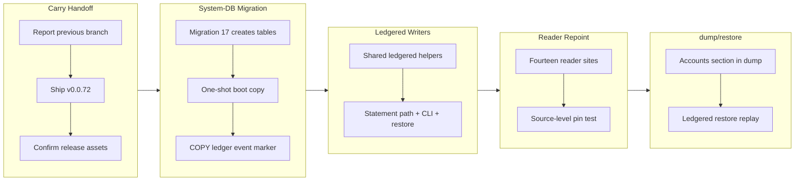

## 1. Overview

This branch implemented one owner-ruled boundary correction: the two declarative config tables (`path_binding`, `connection_consent`) moved from the Project DB — the credential vault — into the System DB, beside the audit chain and the `sys_ddl_events` WORM ledger. Every configuration write (CONNECT/DISCONNECT, account declare/remove, restore replay) now lands its row, its audit event, and its replayable DDL event in one transaction, making blueprint §16's WORM promise true for config writes. The branch also closed out the previous branch's carry handoff after v0.0.72 shipped.

**Highlights:**

1. System-DB migration #17 creates both tables in their current shape; a one-shot boot copy heals existing installs, recording itself as a COPY ledger event that doubles as the idempotency marker
2. All config writers converge on two shared ledgered helpers (`ledgered_paths_write_tx`, `ledgered_accounts_write_tx`) — the `insert_driver` transactional pattern generalized to the statement path, the CLI, and restore alike
3. Every registry reader (fourteen sites) repointed to the System DB, pinned by a source-level test that no registry reader opens the Project DB
4. `qfs dump` gains the previously-missing accounts/consent section, and `qfs restore --commit` of binding and consent records now lands local audit + DDL events natively
5. The Project DB becomes the vault proper: one file holds secret material; the other holds everything declarative, plus the ledger that observes it

## 2. Motivation

Blueprint §16 promises that every applied effect lands in the hash-chained `sys_ddl_events` WORM tail. That was false for the two config writes living in the Project DB: `CONNECT`/`DISCONNECT` and account declare/remove emitted only a best-effort `AuditEvent` after their write committed, and never a `DdlEvent` — two WAL-mode SQLite files share no transaction, so the ledger structurally could not observe them atomically. A crash between the write and the audit left a binding with no trace at all. Rather than bridge the gap (a second hash chain forks the history; a cross-store envelope builds reconciliation machinery), the owner ruled to re-draw the store boundary: the declarative registry moves beside the ledger that observes it, and the problem class dissolves. Sequencing was the point — mission items 1 (cloud account declarations) and 3 (sql/git onto path_binding) both add write traffic to these tables, and landing this first makes every future config write ledger-transactional by construction.

## 3. Changes

The branch began by completing the previous branch's carry handoff (report, ship, and release confirmation of v0.0.72), then implemented the re-homing in one coherent commit: the migration and boot copy first, the writers converging on shared ledgered helpers, all readers repointed, and dump/restore following the move. Both-directions proof closed the loop: with the ledger legs disabled, the new tests fail at zero events; restored, they pass.

### 3-1. Re-home the declarative tables into the System DB ([3c9c985](https://github.com/qmu/qfs/commit/3c9c985))

Implemented the owner's choice-C ruling ([ada28be](https://github.com/qmu/qfs/commit/ada28be)): System-DB migration #17, the marker-guarded one-shot boot copy, ledger-transactional config writers, fourteen reader repoints, the new dump accounts section, and ledgered restore replay. The dead Project-DB tables stay un-dropped as data-safety sequencing.

### 3-2. RESUME: report and ship work-20260715-205333 ([1bf06bb](https://github.com/qmu/qfs/commit/1bf06bb))

Completed the carry handoff exactly as scripted: the previous branch became PR #1, merged after all seven pre-merge gates passed, tag v0.0.72 published the four native tarballs (confirmed via the GitHub API), and the pre-supplied concern verdicts were re-verified and applied.

## 4. Outcome

- `path_binding` and `connection_consent` live in the System DB; every config write lands row + audit event + `DdlEvent` in one transaction, fulfilling blueprint §16's WORM promise for configuration
- System-DB migration #17 folds the originals' ALTER history (mount coordinate, app) into fresh CREATEs; the frozen Project-DB migration chain is untouched
- The one-shot boot copy moves legacy rows exactly once — its COPY event in the WORM tail is the idempotency marker, so a disconnect-all can never resurrect dead Project-DB rows; a fresh install copies nothing and records no marker
- All fourteen reader sites take the System DB, pinned by behavioral tests plus a source-level assertion that no registry reader opens the Project DB
- `qfs dump` emits path_bindings and the new accounts/consent section from the System DB (secret-free); `qfs restore --commit` of binding/consent records produces local audit + DDL events through the rewired seam
- Both-directions proof: with the ledger legs disabled, the new sys/account tests fail at exactly zero events; restored, 150 workspace test suites pass with clippy, fmt, gen-docs, gen-skills, and check-migrations green
- The carry handoff completed: v0.0.72 shipped as PR #1 and its release published with four native tarballs; patch bumped to 0.0.73 for this branch

## 5. Historical Analysis

- Prior work bridged the Project-DB/System-DB split with best-effort post-commit audit helpers; this branch retired that class by re-drawing the boundary — the durable principle now in the blueprint: one file holds secret material, the other holds everything declarative plus the ledger that observes it
- The `insert_driver` transactional pattern (row + audit + event in one transaction), introduced for declared drivers, proved general: it factored into two shared helpers consumed by the statement path, the CLI, and restore, so every config writer lands the same ledger shape
- Using the ledger's own event as the idempotency marker (rather than table emptiness) follows from the WORM property: the marker can never disappear, so the guard is immune to state that mutates
- The pattern of writing quality-gate tests against unfixed code first (both-directions proof) continued from the previous branch's splitter and replace-on-install work
- The carry-handoff RESUME ticket made the fresh session productive immediately by scripting a deterministic first action and pre-supplying the judgment inputs the session could not cheaply reconstruct

## 6. Concerns

### (carried from PR #18) 170000 Quality Gate #5 — owner live vault-unlock confirmation

- **Severity:** low
- **Description:** Owner-attended live vault-unlock confirmation on the headless host; nothing on this branch runs or removes that gate
- **How to Fix:** Owner runs the three-step live check post-merge

### (carried from PR #1) Append-era duplicate rows persist on disk but resolve correctly

- **Severity:** low
- **Description:** After [3bc2710](https://github.com/qmu/qfs/commit/3bc2710), newest-per-key reads heal the operator's 14 append-era duplicate rows without re-install, but the rows remain physically on disk. Compacting them needs an uninstall surface (a deliberate non-goal of this branch)
- **How to Fix:** Implement a bundle-aware uninstall surface that removes superseded rows

### (carried from PR #32) Artifacts repo token is sealed but live round-trip is owner-gated

- **Severity:** moderate
- **Description:** Live Cloudflare Artifacts beta round-trip is still owner-gated and unrun; branch touched only the splitter and declaration-row areas
- **How to Fix:** In a dedicated session with explicit owner go-ahead, verify Artifacts beta access and run a live create/clone/delete round-trip

### (carried from PR #30) Bearer-gated (non-loopback) reconcile round is not live-verified

- **Severity:** low
- **Description:** The bearer-authenticated non-loopback plan/apply round remains unverified; no daemon/reconcile code changed on this branch
- **How to Fix:** Owner runs the bearer-gated non-loopback reconcile verification after merge

### (carried from PR #41) `cd` into a blob file is still admitted

- **Severity:** low
- **Description:** driver-local's pure describe still answers BlobNamespace for every path; the branch did not touch driver-local
- **How to Fix:** Add a describe-time gate to refuse namespace=BlobNamespace at cd time

### (carried from PR #11) /cf live (203090) unimplemented; /cf and /rest are placeholder mounts

- **Severity:** low
- **Description:** /cf and /rest remain placeholder mounts pending a richer connection declaration and owner CF token; untouched by this branch
- **How to Fix:** Implement /cf with a live Cloudflare account and a richer connection declaration grammar

### (carried from PR #18) Console bundle pin unset; live serve + release stamp pending the plgg bundle

- **Severity:** low
- **Description:** PINNED_BUNDLE is still unset pending the published plgg bundle; no console-delivery code changed here
- **How to Fix:** Set PINNED_BUNDLE once the plgg bundle is published

### (carried from an unrecorded PR) CREATE ACCOUNT's SECRET reference form is unimplemented (no bind-time account credential resolution)

- **Severity:** low
- **Description:** > **Rescoped 2026-07-15** by the missions/tickets reframing, per the `the-carried-create-account-ships-the` > concern's recorded fix ("re-scope that concern's body to the `SECRET` edge alone, so its stale > blocker note stops misleading readers"). That carried concern is now resolved and archived; this > one stays `active` because the `SECRET` edge is genuinely untouched. The original body scoped out > **two** edges — the second is retired, see below. The in-language account surface (ticket 20260703040000) shipped the owner-approved core: `CREATE ACCOUNT <provider> '<label>'` records consent (gated on a signed-in operator, sharing the CLI `qfs account add` writer), `/sys/accounts` is a queryable selectors-only registry (no token column, Google's driver trio collapsed to one `google` row), and `REMOVE /sys/accounts/<provider>/<label>` deletes an account (token + consent). One edge from the ticket sketch remains deferred: **The `SECRET '<ref>'` clause is not implemented.** The sketch showed `CREATE ACCOUNT github 'work' SECRET 'vault:github/work'`. A service account resolves its credential from the vault (sealed out-of-band); there is **no bind-time external-reference (`env:`/`vault:`) resolution for accounts** today (unlike a mount's `CONNECT … SECRET`). Adding a parse-only clause would be a surface that cannot resolve at bind — against "docs true / no fake success" — so it is omitted. Verified still true against the **v0.0.71** binary on 2026-07-15: `create account github 'work' secret 'vault:github/work'` returns `parse_error` / `UNEXPECTED_TOKEN`, and `create_account_stmt` (`parser/src/grammar.rs:2364`) reads only provider + label + an optional `APP` clause. ### Retired edge (recorded, not silently dropped) The original sub-item 2 — *"a Google account whose label is an email cannot be removed by a `REMOVE` path"*, blocked on `EffectNode` carrying no filter — is **retired**. The effect-selector channel shipped and `driver-sys` resolves the filter off it. Verified against v0.0.71 on 2026-07-15: `remove /sys/accounts where account == '<an email>'` previews with `selector: ["account"]` and stops only at the standard destructive-set-wide commit gate, not at a capability error. `rotate`/`revoke` stay CLI-only by rule (they need a new secret value).
- **How to Fix:** **SECRET reference for accounts**: wire bind-time resolution of an account credential from an `env:`/`vault:` reference (a new capability), then accept the `SECRET` clause on `CREATE ACCOUNT` and store the reference where the cloud bind reads it. This is now an acceptance item of the `declared-drivers-are-the-normal-way-to-add-a-service` mission — it is the account half of the roadmap's 🧭 cloud-account-declaration gap, and the reason it is a *mission* item rather than a lone fix is that the missing capability (bind-time reference resolution for accounts) is the same one cloud account declarations need.

### (carried from PR #33) Declared-model and scheduling follow-ups

- **Severity:** low
- **Description:** Remaining live Chatwork-encoding verification, OAuth-app plumbing and Slack threading follow-ups are untouched; branch changed the declaration-row resolution, not these surfaces
- **How to Fix:** Complete live Chatwork-encoding verification, OAuth-app plumbing, and Slack threading

### (carried from PR #41) Definition-catalog `cp`=clone and `mv`=rename are refused, not implemented

- **Severity:** low
- **Description:** Definition-catalog cp=clone and mv=rename still refuse (owner-approved floor); desugar.rs was not modified on this branch
- **How to Fix:** Implement definition-catalog cp and mv when the floor is lifted

### (carried from PR #11) EXTEND on the read path is now a real operation (behaviour change)

- **Severity:** moderate
- **Description:** EXTEND's read-path behaviour change is a shipped hard break to note in the release narrative; a standing watch/documentation item, and this branch did not touch the exec/EXTEND path
- **How to Fix:** Document the EXTEND read-path behaviour change in release notes

### (carried from PR #1) Hard break: bare paths can no longer carry a literal semicolon

- **Severity:** moderate
- **Description:** Commit [0afaf2b](https://github.com/qmu/qfs/commit/0afaf2b) added `;` to the lexer's path-delimiter set in `lex.rs` to fix the splitter's root cause. A bare path that previously absorbed a `;` now ends at it, consistent with `#` and `,` already in the set. Deliberate, versioned hard break (crate 0.0.72, plugin 0.11.9); the prior behavior was a silent shipped bug
- **How to Fix:** Any `.qfs` file that relies on a literal `;` inside an unquoted path must quote the locator; nothing else to do — the break is intended

### (carried from PR #1) Live /chatwork behavior change awaits owner-attended verification

- **Severity:** low
- **Description:** After [3bc2710](https://github.com/qmu/qfs/commit/3bc2710), /chatwork on this box resolves the newer view body (previously the oldest row won). Correct per the fix, but the live confirmation is owner-attended
- **How to Fix:** Owner runs a live /chatwork read post-merge and confirms the newer view contract is in effect

### (carried from PR #25) Live-only providers remain outside local proof

- **Severity:** low
- **Description:** Live-only provider gates remain outside local proof by design; branch added no credentialed acceptance and touched no provider driver
- **How to Fix:** Implement local proof for live-only providers if the design choice changes

### (carried from PR #26) Live provider acceptance still needs credentials

- **Severity:** moderate
- **Description:** Cloudflare/Postgres/Drive live acceptance still needs owner credentials unavailable in-container; cf.rs/sql_backends.rs/session.rs unchanged on this branch
- **How to Fix:** Run the live provider acceptance rounds in an owner-attended session with credentials

### (carried from PR #11) /local write materialization is narrow

- **Severity:** low
- **Description:** Multi-column /local payloads without a named blob column still error (intentional narrow fallback); commit/effect content-blob threading not touched here
- **How to Fix:** Extend /local write materialization to support multi-column payloads without explicit blob columns

### (carried from PR #35) Policy-less or denied job re-fires every sweep

- **Severity:** low
- **Description:** Sweeper denied/policy-less re-fire semantics remain as-is pending live operation; sweeper.rs was not modified on this branch
- **How to Fix:** Review and adjust sweeper re-fire semantics based on live operational experience

### (carried from PR #11) Postgres/MySQL declarations for the declared-registry path are partial

- **Severity:** low
- **Description:** sql/git still ride the declared-connection seam rather than path_binding, and column-type/comment coverage is unchanged; branch did not touch the SQL backends or connections parser body
- **How to Fix:** Complete Postgres/MySQL declarations with full column-type and comment coverage (ruled to wait behind the re-homing ticket)

### (carried from PR #32) qfs-runtime span-buffer test flakes under parallel workspace tests

- **Severity:** low
- **Description:** The qfs-runtime shared-span-buffer test-isolation flake is unaddressed; the runtime crate was not modified on this branch
- **How to Fix:** Add test isolation for the shared span buffer to prevent flakes in parallel test runs

### (carried from PR #35) Redirect off a follow URL is refused by the confined transport

- **Severity:** low
- **Description:** FOLLOW-URL redirect refusal by the confined transport is unchanged; driver-http was not touched on this branch
- **How to Fix:** Implement redirect handling for FOLLOW URLs if security review approves

### (carried from PR #33) Remaining owner-attended live rounds

- **Severity:** low
- **Description:** The six owner-attended live rounds (Slack post, Gmail reply, /ghdecl read, etc.) remain pending; branch runs no live rounds
- **How to Fix:** Complete the owner-attended live verification rounds as scheduled

### (carried from PR #33) Scope cuts and monitored items

- **Severity:** low
- **Description:** Deliberate switch/PDF/stripper scope cuts and watches persist as recorded; none of their prerequisites landed on this branch
- **How to Fix:** Revisit the scope cuts when their prerequisites are available

### (carried from PR #39) Slack workspace-namespace still advertises Verb::Rm with no query grammar

- **Severity:** low
- **Description:** The Slack Files namespace still advertises the grammar-less Verb::Rm; driver-slack was not touched on this branch
- **How to Fix:** Add query grammar for the Slack Files Verb::Rm or stop advertising it

### (carried from PR #41) `/sys` and `/slack` do not describe their roots, so `cd` there fails before the gate

- **Severity:** low
- **Description:** /sys and /slack roots still are not describable catalog nodes, so cd there fails at describe; that new driver surface was not added on this branch
- **How to Fix:** Implement root-level describe for the /sys and /slack catalog nodes

### (carried from PR #30) The `api` policy row gates MCP, dashboard, and reconcile alike

- **Severity:** low
- **Description:** The single 'api' policy row still grants MCP, dashboard and reconcile alike; no per-client gate split was made on this branch
- **How to Fix:** Split the api policy row into per-client gates if the access-control review requires it

### (carried from PR #41) The branch-safety scanner false-positives on Rust `Token::Variant`, hard-blocking `/ship`

- **Severity:** moderate
- **Description:** The precision bug is in the workaholic plugin's secret-patterns.sh (a different repo) and cannot be fixed from qfs; unaddressed and still hard-blocks /ship on Rust Token::Variant tokens — this branch adds lexer Token:: usages in document.rs that may trip it
- **How to Fix:** Fix the false-positive pattern in the workaholic plugin's secret-patterns.sh (ticket already filed in qmu/workaholic)

### (carried from PR #41) The interactive shell's `/local` reads from the cwd but writes to the filesystem root

- **Severity:** moderate
- **Description:** The REPL /local read mount (rooted at cwd) vs commit-side applier (rooted at /) mismatch is unfixed — a REPL cp/mv COMMIT still mis-targets and would write to the filesystem root as root; shell.rs/commit.rs were not touched on this branch
- **How to Fix:** Unify the /local root between REPL reads and applier writes

### (carried from PR #41) The `/type` catalog and the type resolver translate the stored key differently

- **Severity:** low
- **Description:** The path-form vs reference-name translation boundary for sys_drivers kind='type' rows still stands as a live encoding rule for any future surface; this branch only rewrote a stale comment in type_catalog.rs, it did not remove the divergence
- **How to Fix:** Unify path-form and reference-name translation for type catalog keys

### The dead Project-DB config tables await their drop migration

- **Severity:** low
- **Description:** `path_binding` and `connection_consent` remain physically present (but dead) in the Project DB after [ada28be](https://github.com/qmu/qfs/commit/ada28be) — deliberately: the drop is a later Project-DB migration that must not be able to run before a release containing the boot copy has shipped (data-safety sequencing, not a compatibility period)
- **How to Fix:** After this release ships and the operator's live box has booted the copy, file the Project-DB migration that drops both dead tables

### shared_connection and broker_connection homing is the same question, deferred

- **Severity:** low
- **Description:** The team-ownership registries (`shared_connection`, `broker_connection`) still live in the Project DB and are declarative by the same principle the re-homing established; the ticket records them as out of scope (M9 territory, own decision later) (see [ada28be](https://github.com/qmu/qfs/commit/ada28be))
- **How to Fix:** Decide their homing when the Managed Team work returns to them; the same migration + one-shot copy + reader-repoint pattern applies

### The operator's live box runs the one-shot copy on first post-upgrade boot

- **Severity:** low
- **Description:** The live registry (real bindings and consents) sits in the legacy `project.db` on the operator's box; the first boot of a binary containing [ada28be](https://github.com/qmu/qfs/commit/ada28be) performs the copy into the System DB. The copy fails the DB open loudly if it cannot complete, so a silently-empty registry cannot slip through — but the confirmation read is owner-attended
- **How to Fix:** After upgrading, the owner runs `qfs connect --list` (or a /chatwork read) and confirms the live mounts carried across; the COPY event is visible in the DDL event log

## 7. Successful Development Patterns

- **WORM-tail events as idempotency markers:** the boot copy records itself as a COPY event in `sys_ddl_events` and later boots check the ledger, not table state — the marker is immune to disconnect-all because the ledger can never lose it
- **Generalize the transactional pattern before adding writers:** factoring `insert_driver`'s row+audit+event shape into two shared helpers before mission items 1 and 3 add write traffic means every future config write is ledger-transactional by construction
- **Source-level tests as structural pins:** the assertion that no registry reader opens the Project DB turns the fourteen-site reader inventory — the ticket's named main risk — into a build-time invariant instead of review diligence
- **Both-directions proof scales to seams:** disabling just the ledger legs (not the whole change) reproduced the pre-move behavior precisely, so the new tests demonstrably fail for the right reason
- **Carry tickets with deterministic first actions:** the RESUME ticket scripted report → ship → drive with the judgment inputs written down; the resuming session lost no time re-deriving state, and the ticket archived with the cycle it described

## 8. Release Preparation

**Verdict**: Ready for release

### 8-1. Concerns

- None — branch-safety scan passes, no doc drift (blueprint updated deliberately in the same commit), fmt clean, versions consistent (crate 0.0.73; plugin versions correctly unbumped — no taught CLI surface changed)

### 8-2. Pre-release Instructions

- None — standard release process applies

### 8-3. Post-release Instructions

- After the PR merges to main, tag and push per CLAUDE.md ## Deploy: `git tag -a v0.0.73 -m "qfs v0.0.73" && git push origin v0.0.73` — release.yml builds the four native tarballs and publishes the GitHub Release
- Owner-attended live-box sanity check: the first post-upgrade boot runs the one-shot config-registry copy; confirm `qfs connect --list` (or a /chatwork read) shows the live mounts, and that the COPY event appears in the DDL event log

## 9. Notes

- The active concern corpus stands at 28 after this report (one resolved by this branch, three new). It remains above the 20-item triage threshold; the judge proposed no compounds, and merge/close triage is a developer decision deferred to the next attended `/report`
- Mission items 1 (cloud account declarations) and 3 (sql/git onto path_binding) were ruled to wait behind this branch; both are now unblocked with a ledger-transactional `path_binding` in place
