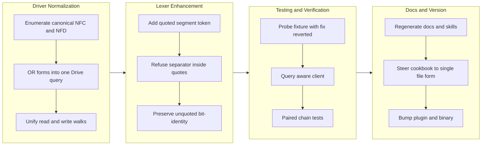

## 1. Overview

This branch fixes two ergonomic gaps in path addressing that forced the operator onto a dangerous detour during the 2026-07-17 Google Drive incident. The fixes make the safe, precise single-file path spelling both grammatically writable (quoted path segments for reserved characters) and semantically resolvable (absorbing Unicode NFC/NFD differences). Together they remove the motivating conditions that pushed usage away from the safer path toward the folder-level `remove … where name == '…'` that caused the incident.

**Highlights:**

1. **Quoted path segments** — a name containing a space, `?`, `#`, `&` or parentheses is now addressable as a single-token quoted segment (`/drive/my/'Q3 budget (final)?.xlsx'`), so the precise single-file spelling exists at all. Glob is off inside quotes by design.
2. **Unicode NFC/NFD absorption in gdrive path resolution** — `match_forms`/`name_term` OR the canonical spellings into ONE Drive `q` query, wired into both `resolve_node` (the read walk) and `ClientResolver::child_id` (the create-only INSERT probe), so a name a listing shows is a name you can address. The `where name == '…'` REMOVE/UPDATE selector rides the same walk and inherits the fix.
3. **Fail-closed preserved, not weakened** — the walk's `limit 2` ambiguity cap now naturally covers the NFC/NFD pair, so a folder holding both spellings refuses as `ambiguous_target` rather than resolving to a first hit. No broad listing scan was introduced.
4. **Additive to a frozen grammar, zero cost on the common path** — unquoted segments lex bit-identically (the golden corpus is untouched) and an ASCII name yields a single form, so the emitted query stays byte-identical and the walk still costs one round-trip per segment.
5. **The taught surface follows the fix** — EBNF gains `segment`/`quoted_segment` (gen-docs regenerated), and the gdrive cookbook now steers `remove` to the single-file spelling (the exact detour that caused the incident); qfs-gdrive skill regenerated. Plugin 0.12.0 → 0.12.1, binary 0.0.76 → 0.0.77.

## 2. Motivation

On 2026-07-17 a WHERE-filtered REMOVE trashed an entire Google Drive folder — roughly 30 files, recovered from trash. The root cause, the WHERE selector being dropped at the runtime `EffectInput` seam (which also degraded a filtered SQL REMOVE into a whole-table DELETE), was fixed separately in merged PR #8. But fixing the root cause left the question of why the operator was on that path at all, and the answer was ergonomic: the safer, more precise single-file spelling was *unwritable*. A Drive name containing a space or a `?` died in the lexer with `UNEXPECTED_CHAR` before parsing began, and even a writable name could be unaddressable when the listing rendered it in a different Unicode normalization form than the terminal produced. The safe path being impossible is what made the risky detour attractive. This branch closes both gaps on the principle that the safe, precise form should be the one that works — a fix aimed at the conditions that produce the incident rather than only at the failure itself.

## 3. Changes

The driver walk was taught Unicode normalization first, then the lexer was given a quoted-segment escape hatch so the precise path could be written at all. Testing proved the decisive step: probing the fixture by reverting the fix exposed that the original normalization tests were vacuous, forcing a query-aware client before the work could be trusted. Documentation and the taught cookbook recipe followed the code, and the patch versions were bumped for the shipped release.

### 3-1. gdrive path resolution: absorb Unicode NFD/NFC normalization differences ([005f06d](https://github.com/qmu/qfs/commit/005f06d))

Drive stores a file's name in whatever normalization form the uploading client sent (macOS uploads NFD) and matches `name = '…'` in a `q` search by exact bytes, while a name copied out of a listing arrives NFC from essentially every terminal — so the walk's exact-match lookup answered `not_found` for a file plainly visible in the listing. A new pure `name` module enumerates the canonical spellings a segment could be stored under and `name_term` ORs them into one Drive query, wired into both the read walk and the create-only INSERT probe so read and write agree on what "this name" reaches. Compatibility folding (NFKC/NFKD) is deliberately excluded — it would collapse `①`→`1` and full-width→half-width, folding names Drive treats as distinct onto one address.

### 3-2. Lexer: quoted path segments so names with `?` and spaces are addressable ([c5f712e](https://github.com/qmu/qfs/commit/c5f712e))

A segment opening with `'` immediately after `/` now lexes as a quoted segment whose content is wholly literal, with the SQL-style doubled quote (`''` → `'`) as the only escape so every name has exactly one spelling. `/` inside quotes is refused with the new `PATH_SEPARATOR_IN_QUOTED_SEGMENT` error, which is what keeps quoting purely lexical and leaves every driver's path parser untouched; a token glued to a closing quote (`/x/'a'b`) is refused rather than quietly misread. The language reference EBNF, the gdrive cookbook recipe (now steering `remove` to the single-file spelling) and the regenerated skill carry the change into the taught surface.

## 4. Outcome

Both ergonomic gaps from the 20260717102000 incident are closed. A Google Drive file whose name differs from the pasted path only in Unicode normalization form now resolves (005f06d), and a file whose name contains a space, `?`, `#`, `&` or parentheses is now writable as a single-file path at all (c5f712e). The safer spelling that the incident's operator could not express is now both expressible and resolvable, and the gdrive cookbook actively steers `remove` toward it.

Both fixes hold their architectural line: the frozen grammar is unchanged for unquoted segments (golden corpus untouched), every driver path parser is untouched by the quoting change, the ASCII query stays byte-identical, and the `limit 2` fail-closed ambiguity refusal is preserved rather than traded away. Verification from the committed tree, raw exit codes: `cargo test --workspace` 0 (2581 passed), `clippy --workspace --all-targets -D warnings` 0, `fmt --all --check` 0, `gen-docs --check` 0, `gen-skills --check` 0, `check-migrations` 0.

## 5. Historical Analysis

The direct antecedent is the 20260717102000 incident and its root-cause fix in merged **PR #8**: the WHERE selector was dropped at the runtime `EffectInput` seam, which turned a filtered Drive REMOVE into a whole-folder trash and would equally have degraded a filtered SQL REMOVE into a whole-table DELETE. PR #8 fixed the mechanism; these two tickets are the peripheral, ergonomic follow-ups from the same incident, addressing why the operator reached for `remove <folder> where name == '…'` instead of naming the one file.

The pattern this repeats is a familiar one in qfs's history: an addressing surface that is correct for the easy case and silently unusable at the edge. The `where name == '…'` selector riding `path.child()` into the same gdrive walk means the normalization fix reaches the selector for free — the same seam-sharing that made PR #8's bug reach two drivers at once now makes the fix reach them at once. The concern corpus records several sibling addressing divergences still open (the `/type` catalog's path-form vs reference-name translation, the REPL `/local` read-root vs applier write-root mismatch), suggesting addressing-boundary consistency is a recurring structural theme rather than an isolated defect.

## 6. Concerns

### Append-era duplicate rows persist on disk but resolve correctly (carried from PR #1)

- **Severity:** low
- **Description:** After normalization of read semantics, newest-per-key reads heal duplicate append-era rows without re-install, but the rows remain physically on disk (see [3bc2710](https://github.com/qmu/qfs/commit/3bc2710) in the Project DB)
- **How to Fix:** Implement a bundle-aware uninstall surface that removes superseded rows

### `cd` into a blob file is still admitted (carried from PR #41)

- **Severity:** low
- **Description:** driver-local's pure describe still answers BlobNamespace for every path; the branch did not touch driver-local (see [7752cb3](https://github.com/qmu/qfs/commit/7752cb3))
- **How to Fix:** Add a describe-time gate to refuse namespace=BlobNamespace at cd time

### /cf live (203090) unimplemented; /cf and /rest are placeholder mounts (carried from PR #11)

- **Severity:** low
- **Description:** /cf and /rest remain placeholder mounts pending a richer connection declaration and owner CF token; untouched by this branch (see [3c6f995](https://github.com/qmu/qfs/commit/3c6f995))
- **How to Fix:** Implement /cf with a live Cloudflare account and a richer connection declaration grammar

### Console bundle pin unset; live serve + release stamp pending the plgg bundle (carried from PR #18)

- **Severity:** low
- **Description:** PINNED_BUNDLE is still unset pending the published plgg bundle; no console-delivery code changed here (see [72c8950](https://github.com/qmu/qfs/commit/72c8950))
- **How to Fix:** Set PINNED_BUNDLE once the plgg bundle is published

### CREATE ACCOUNT's SECRET reference form is unimplemented (no bind-time account credential resolution) (carried from PR #1)

- **Severity:** low
- **Description:** The in-language account surface shipped the core (consent recording, registry, token deletion), but one edge — the `SECRET '<ref>'` clause for vault/env references — remains unimplemented because there is no bind-time external-reference resolution for accounts today (unlike a mount's CONNECT … SECRET); adding a parse-only clause would be a surface that cannot resolve at bind (see `packages/qfs/crates/parser/src/grammar.rs`)
- **How to Fix:** Wire bind-time resolution of an account credential from an `env:`/`vault:` reference (a new capability), then accept the `SECRET` clause on `CREATE ACCOUNT`

### Declared-model and scheduling follow-ups (carried from PR #33)

- **Severity:** low
- **Description:** Remaining live Chatwork-encoding verification, OAuth-app plumbing and Slack threading follow-ups are untouched; branch changed the declaration-row resolution, not these surfaces (see [f1a3d21](https://github.com/qmu/qfs/commit/f1a3d21))
- **How to Fix:** Complete live Chatwork-encoding verification, OAuth-app plumbing, and Slack threading

### /local write materialization is narrow (carried from PR #11)

- **Severity:** low
- **Description:** Multi-column /local payloads without a named blob column still error (intentional narrow fallback); commit/effect content-blob threading not touched here (see [3c6f995](https://github.com/qmu/qfs/commit/3c6f995))
- **How to Fix:** Extend /local write materialization to support multi-column payloads without explicit blob columns

### Owner-attended live verification backlog (carried from PR #18)

- **Severity:** moderate
- **Description:** The standing queue of live, owner-attended confirmations that hermetic tests cannot replace, gathered from eight concerns (2026-07-16 triage, owner-directed): the three-step vault-unlock check on the headless host; six live rounds (Slack post, Gmail reply, /ghdecl read, etc.); live /chatwork read confirming the newer view body after replace-on-install; post-upgrade sanity read confirming one-shot config-registry copy; bearer-gated non-loopback plan/apply round; Cloudflare Artifacts beta create/clone/delete round-trip; and live-only provider gates (see [72c8950](https://github.com/qmu/qfs/commit/72c8950))
- **How to Fix:** Run the rounds in owner-attended sessions, checking items off this backlog as evidence lands on the relevant archived tickets

### Policy-less or denied job re-fires every sweep (carried from PR #35)

- **Severity:** low
- **Description:** Sweeper denied/policy-less re-fire semantics remain as-is pending live operation; sweeper.rs was not modified on this branch (see [c30fa0a](https://github.com/qmu/qfs/commit/c30fa0a))
- **How to Fix:** Review and adjust sweeper re-fire semantics based on live operational experience

### Postgres/MySQL declarations for the declared-registry path are partial (carried from PR #11)

- **Severity:** low
- **Description:** sql/git still ride the declared-connection seam rather than path_binding, and column-type/comment coverage is unchanged; branch did not touch the SQL backends or connections parser body (see [3c6f995](https://github.com/qmu/qfs/commit/3c6f995))
- **How to Fix:** Complete Postgres/MySQL declarations with full column-type and comment coverage

### qfs-runtime span-buffer test flakes under parallel workspace tests (carried from PR #32)

- **Severity:** low
- **Description:** The qfs-runtime shared-span-buffer test-isolation flake is unaddressed; the runtime crate was not modified on this branch (see [22c61e4](https://github.com/qmu/qfs/commit/22c61e4))
- **How to Fix:** Add test isolation for the shared span buffer to prevent flakes in parallel test runs

### Scope cuts and monitored items (carried from PR #33)

- **Severity:** low
- **Description:** Deliberate switch/PDF/stripper scope cuts and watches persist as recorded; none of their prerequisites landed on this branch (see [f1a3d21](https://github.com/qmu/qfs/commit/f1a3d21))
- **How to Fix:** Revisit the scope cuts when their prerequisites are available

### shared_connection and broker_connection homing is the same question, deferred (carried from PR #2)

- **Severity:** low
- **Description:** The team-ownership registries (`shared_connection`, `broker_connection`) still live in the Project DB and are declarative by the same principle the re-homing established; deferred as M9 territory (own decision later) (see [ada28be](https://github.com/qmu/qfs/commit/ada28be))
- **How to Fix:** Decide their homing when the Managed Team work returns to them; the same migration + one-shot copy + reader-repoint pattern applies

### Slack workspace-namespace still advertises Verb::Rm with no query grammar (carried from PR #39)

- **Severity:** low
- **Description:** The Slack Files namespace still advertises the grammar-less Verb::Rm; driver-slack was not touched on this branch. The new quoted_segment is a path-spelling escape hatch and adds no REMOVE query grammar to Slack (see [3dae249](https://github.com/qmu/qfs/commit/3dae249))
- **How to Fix:** Add query grammar for the Slack Files Verb::Rm or stop advertising it

### `/sys` and `/slack` do not describe their roots, so `cd` there fails before the gate (carried from PR #41)

- **Severity:** low
- **Description:** /sys and /slack roots still are not describable catalog nodes, so cd there fails at describe; that new driver surface was not added on this branch (see [7752cb3](https://github.com/qmu/qfs/commit/7752cb3))
- **How to Fix:** Implement root-level describe for the /sys and /slack catalog nodes

### The `api` policy row gates MCP, dashboard, and reconcile alike (carried from PR #30)

- **Severity:** low
- **Description:** The single 'api' policy row still grants MCP, dashboard and reconcile alike; no per-client gate split was made on this branch (see [e7e44ee](https://github.com/qmu/qfs/commit/e7e44ee))
- **How to Fix:** Split the api policy row into per-client gates if the access-control review requires it

### The branch-safety scanner false-positives on Rust `Token::Variant`, hard-blocking `/ship` (carried from PR #41)

- **Severity:** moderate
- **Description:** The precision bug is in the workaholic plugin's secret-patterns.sh (a different repo) and cannot be fixed from qfs (see [7752cb3](https://github.com/qmu/qfs/commit/7752cb3)). **Update (this branch):** the scanner was run against the 11 `Token::` usages this branch adds in `crates/lang/src/lex.rs` and `crates/lang/tests/lex.rs` and returned `verdict: pass` with zero findings — upstream `secret-patterns.sh` has since been rewritten to an allowlist-of-guilt whose comments name this exact case. The concern is kept active pending a deliberate close, but the evidence suggests it is resolved upstream.
- **How to Fix:** Confirm the upstream fix in qmu/workaholic and close this concern at the next triage rather than carrying it further

### The dead Project-DB config tables await their drop migration (carried from PR #2)

- **Severity:** low
- **Description:** `path_binding` and `connection_consent` remain physically present (but dead) in the Project DB after [ada28be](https://github.com/qmu/qfs/commit/ada28be) — deliberately: the drop is a later Project-DB migration that must not run before a release containing the boot copy has shipped (data-safety sequencing)
- **How to Fix:** After this release ships and the operator's live box has booted the copy, file the Project-DB migration that drops both dead tables

### The interactive shell's `/local` reads from the cwd but writes to the filesystem root (carried from PR #41)

- **Severity:** moderate
- **Description:** The REPL /local read mount (rooted at cwd) vs commit-side applier (rooted at /) mismatch is unfixed — a REPL cp/mv COMMIT still mis-targets; shell.rs/commit.rs were not touched on this branch (see [7752cb3](https://github.com/qmu/qfs/commit/7752cb3))
- **How to Fix:** Unify the /local root between REPL reads and applier writes

### The `/type` catalog and the type resolver translate the stored key differently (carried from PR #41)

- **Severity:** low
- **Description:** The path-form vs reference-name translation boundary for sys_drivers kind='type' rows still stands as a live encoding rule for any future surface; this branch only rewrote a stale comment in type_catalog.rs, it did not remove the divergence (see [7752cb3](https://github.com/qmu/qfs/commit/7752cb3))
- **How to Fix:** Unify path-form and reference-name translation for type catalog keys

### Local clippy 1.96 vs CI 1.97 toolchain gap

- **Severity:** moderate
- **Description:** The CI clippy version (1.97) could not be verified offline; the local gate ran 1.96, code was written conservatively and one version-sensitive lint (`manual_contains`) was fixed — but a sibling qfs PR was caught today by exactly this gap, so the risk is live rather than theoretical (see [005f06d](https://github.com/qmu/qfs/commit/005f06d) and [c5f712e](https://github.com/qmu/qfs/commit/c5f712e) in `packages/qfs/crates/`)
- **How to Fix:** Pin or align the local toolchain to CI's clippy version so the local gate is authoritative, or treat a red CI clippy as a merge blocker on every PR until the versions converge. **Update (this branch):** CI clippy (1.97) ran green on PR #9, so this branch is clear — but the divergence itself is unfixed and will keep putting later branches at the same risk, so the concern stays active.

### Rendered path form does not re-quote segments

- **Severity:** low
- **Description:** The 20260717120200 ticket's "rendered form re-quotes segments" bullet was deliberately not implemented, because re-quoting the router path would break every driver path parser: all four renderers (`render_mount_path`, the two `render_path`, `path_string`) join RAW segments that drivers re-split on `/`. Consequence: a preview still displays `/drive/my/Q3 budget?.xlsx` unquoted, so copying it back into a statement needs manual re-quoting — a copied name with a space fails closed in the lexer, while one whose only reserved character is `?` would re-lex as a glob (bounded by the existing ambiguity refusal, and off the executed path) (see [c5f712e](https://github.com/qmu/qfs/commit/c5f712e) in `packages/qfs/crates/lang/src/`)
- **How to Fix:** Re-quote at the DISPLAY layer only — in previews and human-facing renderings — leaving the raw path handed to drivers untouched

## 7. Successful Development Patterns

- **Probe the fixture by reverting the fix, not just the code.** The first implementation's normalization tests were vacuous: the shared `MockDriveClient::list_files` replays seeded pages FIFO and ignores the `q` argument entirely, so a resolution test passes no matter what query the driver actually built. Reverting the fix and re-running exposed it — 3 of 4 normalization tests still passed against deliberately-broken code, including exactly the two the Quality Gate asked to prove. They were replaced with a query-aware `QueryingDriveClient` that interprets `q` and matches `name =` by exact bytes the way Drive does, plus a guard test pinning the fixture's own premise so it cannot silently go normalization-insensitive again. Re-probed with the fix removed: 5 of 5 fail. The transferable lesson is that a test which passes against known-broken code proves nothing, and that the fixture's premise deserves a pin of its own — "the tests pass" is only evidence if the tests can fail.
- **Additive discipline against a frozen grammar.** Only a quote directly after `/` opens the quoted form, so unquoted segments lex bit-identically and the golden corpus is untouched, while the existing `where name == '…'` string literal is unaffected. Constraining a new surface to a position the old grammar could not occupy is what let a language change ship without a compatibility story.
- **Refusing the hard case keeps the change local.** Declining `/` inside quotes (`PATH_SEPARATOR_IN_QUOTED_SEGMENT`) keeps quoting purely lexical: the AST carries the raw name, every renderer joins raw segments, and each driver re-splits on `/` as before — so no driver path parser had to change. A well-chosen refusal bought a one-crate blast radius, and the refused case (a `/` inside a name) is one no mainstream store allows anyway.
- **Pin both halves of a chain with paired tests.** The parser proves `remove /drive/my/'Q3 budget?.xlsx'` renders to the raw path `/drive/my/Q3 budget?.xlsx`, and the gdrive driver proves it then reads and trashes exactly that one file. Testing the seam from both sides catches the class of bug that PR #8 fixed, where each half was individually defensible and the handoff dropped the selector.
- **Fix the conditions, not only the failure.** PR #8 fixed the over-delete mechanism; this branch removed the reason the operator was on the dangerous path at all, and pointed the taught cookbook recipe at the safe spelling. An incident's root cause and its ergonomic cause are separate repairs, and only doing the first leaves the next operator on the same detour.

## 8. Release Preparation

**Verdict**: Ready for release

### 8-1. Concerns

- Local clippy is 1.96 while CI runs 1.97, and the CI toolchain could not be verified offline. The local gate (`cargo clippy --workspace --all-targets -- -D warnings`) passed at 1.96 and one version-sensitive lint (`manual_contains`) was already fixed, but a sibling qfs PR was caught today by exactly this version gap, so the risk was live rather than theoretical. **Discharged:** CI clippy (1.97) has since run green on PR #9 (50s and 54s across both workflow runs), so this branch is verified against the shipping toolchain. The local/CI version divergence remains as a standing process risk for future branches (section 6).
- The 20260717120200 ticket's acceptance bullet "the rendered/canonical form re-quotes segments that need it, so plans and previews round-trip" is deliberately not implemented: re-quoting the rendered router path would break every driver path parser, which re-splits the rendered path on `/` and expects raw names. Consequence: a preview still displays `/drive/my/Q3 budget?.xlsx` unquoted, so copying a previewed path back into a statement needs manual re-quoting. A copied name containing a space fails closed in the lexer (`UNEXPECTED_CHAR`); a copied name whose only reserved character is `?` would re-lex as a glob rather than the single file — bounded by the existing ambiguity refusal, and off the executed path (resolution itself is correct). Display-layer gap, outside this Quality Gate's seam.
- The `qfs-gdrive` SKILL.md and `docs/cookbook/gdrive.md` now steer operators toward quoted single-file addressing for irreversible verbs, which is the ergonomic half of the incident fix; the root cause itself was already fixed in merged PR #8. Nothing on this branch re-opens it.

### 8-2. Pre-release Instructions

- ~~Watch the CI clippy job (Rust 1.97) on the PR before merge — the local gate ran 1.96 and could not verify 1.97 offline.~~ **Done, green.** All PR #9 checks pass: clippy (-D warnings), build + test (native), cross-compile (x86_64 + aarch64), rustfmt, and wasm32, across both workflow runs. `release artifacts` is `skipping`, which is expected off a tag. No pre-release action remains.

### 8-3. Post-release Instructions

- Per CLAUDE.md `## Deploy`, after the PR merges to `main`: `git tag -a v0.0.77 -m "qfs v0.0.77" && git push origin v0.0.77`, then confirm `.github/workflows/release.yml` published the four native tarballs (Linux musl + macOS, both arches) to the GitHub Release — the release IS the deliverable. The version bump (qfs 0.0.77, plugin/marketplace 0.12.1) is already in the tree.
- File a follow-up ticket for the deferred display-layer gap: render/preview should re-quote segments that need it WITHOUT changing the raw path handed to drivers (a display-only rendering distinct from the router form), so a previewed path round-trips when copied back.

## 9. Notes

- **Branch safety scan**: `scan-branch-safety.sh` returned `verdict: pass` with zero findings of any tier. Notably it did **not** fire on the 11 `Token::` usages this branch adds — the known carried concern about that false positive appears to have been fixed upstream in the workaholic plugin's `secret-patterns.sh`. The concern is retained as active in section 6 (closing it is a deliberate triage decision, not this report's call) with the evidence recorded.
- **Documentation drift**: `doc-drift.sh main` reported no structural changes and no candidates. Docs were updated where it mattered — `docs/language.md` (EBNF `segment`/`quoted_segment`), `docs/cookbook/gdrive.md`, and the mirrored `plugins/qfs/skills/qfs-gdrive/SKILL.md` — with mirroring confirmed by `gen-docs --check` = 0.
- **Deferred concerns**: 20 active concerns were judged against this branch; all 20 remain `still_active` and none were resolved by it. No compounds were proposed, and neither triage trigger fired (`should_triage: false`).
- **CI verification**: after the story was pushed, every check on PR #9 ran green — clippy (-D warnings) at Rust 1.97 (50s / 54s), build + test (native) (3m1s / 3m20s), cross-compile x86_64 (1m1s / 1m2s) and aarch64 (1m23s / 1m33s), rustfmt (17s), wasm32 (27s / 33s). `gh pr checks 9 --watch` exited 0. This closes the only pre-release instruction this report raised.
- **Version bump**: the patch bump required by CLAUDE.md rode inside c5f712e rather than a separate "Bump version" commit, so `check-version-bump.sh` reports `already_bumped: false` as a false negative. The tree does carry qfs 0.0.76 → 0.0.77 and plugin/marketplace 0.12.0 → 0.12.1; no second bump was applied.
