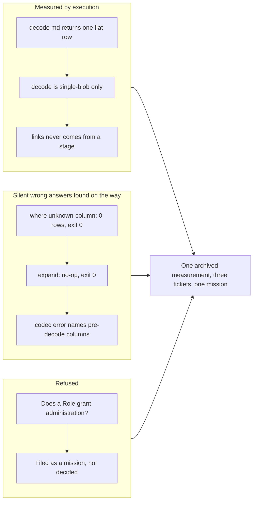

## 1. Overview

The branch answers one question, refuses another, and files what it found on the way.

**The question answered:** can `decode md` replace the `/markdown` driver? **No.** The grammar has the parts — `format` includes `md`, `expand` is a stage, `transform` is a stage — but the pipeline they suggest fails in several independent places, and the driver produces something no stage can: `links`, and `source_section_path` heading stacks across many documents in one query. The measurement is recorded; **the driver is untouched.**

**The question refused:** should a `Role` grant administration? That is an open product decision this repository has deliberately not made — `identity::Role` is a label on an *invite*, its own comments say "not a grant", `Admin` "has no privileges yet", and the classification is flagged `OPEN PRODUCT DECISION (t55 — not baked in)`. Answering it in passing, to unblock a menu, would convert a label the source calls not-a-grant into a grant. The ticket stopped and stays queued.

Measuring the second question found a deeper fact than the ticket assumed: **"who am I" is not reachable from a driver at all.** `ReadDriver::scan(&self, scan: &ScanNode)` carries no request, cookie, or principal; engine and registry are process-wide `Arc`s built at boot; `http/policy.rs:76` calls the back-compat `evaluate()`, which is `DecisionContext::anonymous()`. The t57 policy who-axis is complete and **no caller ever supplies it an actor**. The machinery exists; the input never arrives. That is a mission, not a ticket, and it is now filed as one.

**Highlights:**

1. Measured `decode md` against the driver by execution — verdict: it cannot replace it, and the gaps are named
2. Filed `where <unknown-column>` returning zero rows at exit 0 — a silent wrong answer, across every driver
3. Filed `expand` silently no-opping on Json and unknown columns at exit 0
4. Filed the codec source reporting pre-decode columns, masking every later failure in a pipeline
5. Filed a mission for the request-principal seam, with `Role`-is-not-a-grant written in as an invariant
6. Corrected two docs that described shipped work in the future tense

## 2. Motivation

The `/markdown` driver works and shipped (its mission is 7/7, and a consumer now reads its corpus). The suggestion that a generic `decode md` could replace it is attractive: one fewer builtin, and the same shape would then serve exif, csv, pdf. Attractive enough that it needed measuring rather than reasoning about — the source reading that motivated the ticket turned out to be right about the conclusion and wrong about three of its steps.

The second question came from a consumer's need: a viewer wants to derive its root menu from who is signed in. Answering it honestly meant finding out what this repository actually declares about identity, rather than inferring from names. What it declares is narrower than its type names suggest, and it says so out loud in its own comments.

## 3. Changes

No shipped code changed. Version bumped to 0.0.78 per the per-PR rule. Two doc corrections; one archived measurement ticket; three defect tickets; one mission.

## 4. Outcome

**`decode md` cannot replace the `/markdown` driver.** Confirmed by execution: `decode md` runs (exit 0) and returns a flat single row with schema `[author,status,tags,title,body]` — no `links`, no `front_matter`. `decode` is single-blob only (`exec/src/codec.rs:133` errors `decode_needs_single_blob` on two files). `links` never comes out of a stage. The driver, live, produces `source_section_path` heading stacks (`["Alpha Heading","Alpha Subsection"]`) across two documents in one query.

Three claims the motivating source reading got wrong, corrected by running them:

- **`transform` does not trip `codec_then_query`.** It never reaches the exec-side guard — it dies earlier, at lowering (`lower.rs:388`), with `transform_not_executable`. A control run reproduces the identical error **with no codec present**, which proves the codec is irrelevant to it. With a registered transform, the error is `transform_input_missing`, resolved against the **pre-decode** schema.
- **Narrowing to one row does not rescue the pipeline.** It fails with `decode_needs_blob` ("content column is not bytes") because a listing's `content` is null. Lifting the single-blob guard alone would buy nothing.
- **The verbatim pipeline's first failure is `unknown_column: front_matter`**, listing the blob source's columns — masking everything after it.

**The principal ticket is not implemented and stays queued.** Its blocking question is a product decision; its delivery is a core-trait signature change every driver implements. Both are recorded in the new mission, `a-request-resolves-to-a-principal-the-query-path-can-read`, filed unclaimed at 0/8.

## 5. Historical Analysis

The three filed defects are one family, and it is the family this repository already knows: a check that passes vacuously. `where <unknown-column>` returning zero rows at exit 0 is the same shape as a green test suite that asserts nothing — the answer is well-formed, and wrong.

The record claimed a safety net that does not exist. `typeck.rs:138` says *"projection is where an unknown column is a hard error (t05)"*. It is not: `|> select nosuchcol` returns an empty schema with rows preserved, at exit 0. The leniency in `where` was justified by a strictness in `select` that was never there. That is recorded as evidence inside the `where` ticket rather than filed as a fourth.

The root cause was not in the record at all: `typeck.rs:486-493` collapses *empty schema* and *absent column* into one `Unknown` answer, which passes the plan-time check, after which `engine/src/eval.rs:48-59` resolves to `None` and the predicate is simply false. Meanwhile `core/src/eval.rs:790-801` **claims the guarantee that is being violated** — "never reaches preview/commit".

## 6. Concerns

**Line references drift, and this branch proves it.** Every reference the motivating record supplied was checked before being written down, and several moved: `decode_needs_single_blob` is at `exec/src/codec.rs:133`, not `:128-139`. More seriously, `expand`'s cited swallow points (`types/src/schema.rs:322-349`, `core/src/eval.rs:838-846`) were the **wrong path entirely** — that `core` path propagates the error with `?` and is not on the read path at all. The executed path is `pushdown/src/lower.rs:326-329` → `engine/src/combine.rs:227` → `engine/src/eval.rs:480`, where `fn expand(...) -> RowBatch` (returning no `Result`) swallows at `:481-483`, `:485`, and `:498-499`.

**A third stale doc instance is still live and user-visible.** `cmd/src/lib.rs:702-706` renders into `qfs identity --help` and asserts both a **retired** sign-up and a **pending** t46. It is recorded in the mission and left unfixed — this branch changes no shipped code.

**"qfs has no sign-in" is true only of the CLI.** A password sign-in and session mint ship in the OAuth face (`oauth.rs:230,260-262,460-480`), where `authenticate()` is called. The gap is the seam, not the mechanism — which is exactly why the work misreads as "just wire it up", and why the mission spells it out.

## 7. Successful Development Patterns

**A control run separated the cause from the coincidence.** The claim that `transform` trips the codec guard looked confirmed — the error appears when a codec is present. Running the same statement with **no codec at all** produced the identical error, which relocated the failure from the exec-side guard to lowering, three layers earlier.

**Refusing to decide was the deliverable.** The ticket could have shipped a plausible `Admin ⇒ admin-menu`, or a fail-closed "administers: nothing". Both answer a question the source explicitly marks unanswered. The shape of the answer is not separable from the ruling, so the honest output was the blocker and the mission — not an implementation.

**Scratch fixtures, cleaned up.** The measurements ran against scratch `/markdown` bindings created and removed; `/sys/connections` was verified back to its baseline of 10 rows afterwards.
