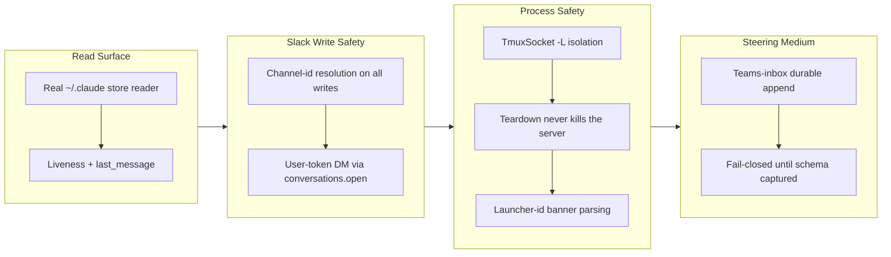

## 1. Overview

This branch ships the hermetic half of the Claude-sessions mission (5/7 — the steering live-drain and session-launch proofs are iceboxed pending an attended run): the readable `/hosts/local/claude` session surface over the real on-disk store, Slack driver write-path fixes (channel-id resolution on every ID-requiring call, user-token DMs via conversations.open), a TmuxSocket isolation primitive whose teardown can never kill the developer's server, the claude launcher-id banner-parsing fix, the schema-agnostic teams-inbox steering medium, and the isolated live-round container. Version bumped to 0.0.89.

**Highlights:**

1. Sessions queryable: `/hosts/local/claude/sessions` reads the real ~/.claude store with liveness detection and truthful `last_message` from transcript tails
2. Slack write-path fixed: channel-name→id resolution applied to all ID-requiring calls (delete, update, reactions, pins, upload), and user-token DMs resolved via `conversations.open`
3. Tmux safe by construction: every command carries an explicit `-L` socket, teardown targets only that socket, and an empty socket name is refused at the type boundary
4. Claude launcher-id capture fixed to parse the real 2.1.217 banner (`backgrounded · <id>` line), restoring the launch→capture→steer composition
5. Teams-inbox steering medium: schema-agnostic durable JSON append per recipient, fail-closed until the message schema is captured live
6. Isolated container for process-touching proofs — no host ~/.claude, no sockets, minimal credential

## 2. Motivation

The mission's claim — "anything you can do at a Claude Code session, you can do with a qfs query" — needs sessions to be queryable and steerable as ordinary paths. This branch completes the hermetic read surface and closes the driver defects blocking production Slack writes, while establishing safe-by-construction teardown for tmux-based session management. Steering and launch spawn/kill processes, which crashes sibling sessions on this shared host, so those proofs are container-only and deliberately deferred to attended work — letting the unattended queue ship hermetic value.

## 3. Changes

Across 21 commits the branch moved from the session read surface through Slack write fixes and process-safety primitives to the steering medium, with the process-touching proofs isolated into a container. Four tickets archived; the three steering/launch tickets moved to icebox by developer approval (2026-07-23) because their live-drain needs an attended multi-agent run.

### 3-1. Tmux session teardown must not kill the server ([05c5fb2](https://github.com/qmu/qfs/commit/05c5fb2))

Introduced the `TmuxSocket` isolation primitive: every tmux command carries an explicit `-L` socket, teardown targets only that socket, and an empty socket name is refused at construction (`NotIsolated`) — so a teardown can never reach the developer's default server.

### 3-2. Slack driver channel-id resolution ([4b60b51](https://github.com/qmu/qfs/commit/4b60b51))

Routed every ID-requiring Slack API call (chat.delete, reactions, pins, chat.update, upload) through the same channel-name→id resolver the read path uses — one address, one meaning, for reads and writes alike. Unresolvable names surface as PREVIEW-time usage errors, never silently-failing garbage ids.

### 3-3. Slack user-token DM write channel-not-found ([895c4f2](https://github.com/qmu/qfs/commit/895c4f2))

Fixed user-token DM writes by resolving a user id to its opened IM channel via `conversations.open`, matching the read path; covered by fixture tests mocking the open + resolution flow.

### 3-4. Claude launcher-id capture mismatch ([0cf7e3a](https://github.com/qmu/qfs/commit/0cf7e3a))

The launcher returned the banner's first line ("Starting background service…") as the session id, breaking launch→capture→steer. Now it parses the real `backgrounded · <id>` line of the 2.1.217 banner, proven hermetically with the real banner shape.

## 4. Outcome

- Safe tmux teardown with the `TmuxSocket` isolation primitive — `-L` enforcement at the type boundary, teardown scoped to the isolated socket only
- Slack channel names and user IDs resolve identically across all verbs; user-token DMs open the IM channel first; all covered by fixture tests
- Claude launcher session-id capture parses the correct banner line, restoring launch→capture→steer composition
- Session launch via `INSERT INTO /claude/sessions (cwd, prompt [, name])` with irreversible-gate semantics; teams-inbox steering primitive as a schema-agnostic, fail-closed append medium
- Isolated container environment established for process-touching work (spawn, steer, teardown) — no shared-host crash risk
- Version bumped 0.0.80 → 0.0.89 across 21 commits; the mission stays active at 5/7 with the steering/launch remainder iceboxed for attended work

## 5. Historical Analysis

Five architectural patterns run through this branch: (1) **safety by construction** — isolation enforced at type boundaries rather than environment variables, so a misconfiguration cannot silently destroy sibling processes (a lesson bought by the earlier shared-host session-kill incidents); (2) **schema-agnostic primitives before schema capture** — the teams inbox appends opaque `serde_json::Value` elements, proven hermetic and fail-closed, deferring field names until live capture, because a guessed schema would silently steer nothing; (3) **one address, one meaning** — channel segments resolve identically across all verbs through one resolver; (4) **hermetic verification, then owned live fire** — fixtures and fake binaries prove the logic, and the risky pieces run attended in an isolated container; (5) **honest surfaces** — a verb that returns an id must return an id a later read resolves.

## 6. Concerns

### Steering live-drain and message schema remain iceboxed for attended work

- **Severity:** low
- **Keep:** false
- **Description:** The teams-inbox primitive is hermetically proven but the acceptance items for steering (a live drain by a real team member) and session launch remain open — a lone `claude --bg` session has no team inbox (see [3611555](https://github.com/qmu/qfs/commit/3611555)). This remainder is already tracked as the three iceboxed tickets (claude-steering-rewire, claude-session-create-launch, claude-live-round-owner-attended) set aside by developer approval on 2026-07-23; recorded here for the story, not re-promoted to the concern corpus.
- **How to Fix:** Run the iceboxed tickets in an attended multi-agent session inside the isolated container: stand up a team member with an InboxPoller, capture the live message schema, and prove the steering round-trip.

### In-container Claude CLI auth failure modes untested

- **Severity:** low
- **Description:** The live-round container mounts a minimal claudeAiOauth credential; the probe records "blocked" if auth fails (see [6ede458](https://github.com/qmu/qfs/commit/6ede458)) but no test covers corrupted/absent credentials.
- **How to Fix:** Add an integration test that corrupts or omits the credential and asserts the container records an auth-blocked reason instead of proceeding or crashing.
### (carried from PR #1) Append-era duplicate rows persist on disk but resolve correctly

- **Severity:** low
- **Description:** After [3bc2710](https://github.com/qmu/qfs/commit/3bc2710), newest-per-key reads heal the operator's 14 append-era duplicate rows without re-install, but the rows remain physically on disk. Compacting them needs an uninstall surface (a deliberate non-goal of this branch)
- **How to Fix:** Implement a bundle-aware uninstall surface that removes superseded rows

### (carried from PR #41) `cd` into a blob file is still admitted

- **Severity:** low
- **Description:** driver-local's pure describe still answers BlobNamespace for every path; the branch did not touch driver-local
- **How to Fix:** Add a describe-time gate to refuse namespace=BlobNamespace at cd time

### (carried from PR #11) /cf live (203090) unimplemented; /cf and /rest are placeholder mounts

- **Severity:** low
- **Description:** /cf and /rest remain placeholder mounts pending a richer connection declaration and owner CF token; untouched by this branch
- **How to Fix:** Implement /cf with a live Cloudflare account and a richer connection declaration grammar

### (carried from PR #18) Console bundle pin unset; live serve + release stamp pending the plgg bundle

- **Severity:** low
- **Description:** PINNED_BUNDLE is still unset pending the published plgg bundle; no console-delivery code changed here
- **How to Fix:** Set PINNED_BUNDLE once the plgg bundle is published

### (carried from PR #origin_pr_url:) CREATE ACCOUNT's SECRET reference form is unimplemented (no bind-time account credential resolution)

- **Severity:** low
- **Description:** > **Rescoped 2026-07-15** by the missions/tickets reframing, per the `the-carried-create-account-ships-the` > concern's recorded fix ("re-scope that concern's body to the `SECRET` edge alone, so its stale > blocker note stops misleading readers"). That carried concern is now resolved and archived; this > one stays `active` because the `SECRET` edge is genuinely untouched. The original body scoped out > **two** edges — the second is retired, see below. The in-language account surface (ticket 20260703040000) shipped the owner-approved core: `CREATE ACCOUNT <provider> '<label>'` records consent (gated on a signed-in operator, sharing the CLI `qfs account add` writer), `/sys/accounts` is a queryable selectors-only registry (no token column, Google's driver trio collapsed to one `google` row), and `REMOVE /sys/accounts/<provider>/<label>` deletes an account (token + consent). One edge from the ticket sketch remains deferred: **The `SECRET '<ref>'` clause is not implemented.** The sketch showed `CREATE ACCOUNT github 'work' SECRET 'vault:github/work'`. A service account resolves its credential from the vault (sealed out-of-band); there is **no bind-time external-reference (`env:`/`vault:`) resolution for accounts** today (unlike a mount's `CONNECT … SECRET`). Adding a parse-only clause would be a surface that cannot resolve at bind — against "docs true / no fake success" — so it is omitted. Verified still true against the **v0.0.71** binary on 2026-07-15: `create account github 'work' secret 'vault:github/work'` returns `parse_error` / `UNEXPECTED_TOKEN`, and `create_account_stmt` (`parser/src/grammar.rs:2364`) reads only provider + label + an optional `APP` clause. ### Retired edge (recorded, not silently dropped) The original sub-item 2 — *"a Google account whose label is an email cannot be removed by a `REMOVE` path"*, blocked on `EffectNode` carrying no filter — is **retired**. The effect-selector channel shipped and `driver-sys` resolves the filter off it. Verified against v0.0.71 on 2026-07-15: `remove /sys/accounts where account == '<an email>'` previews with `selector: ["account"]` and stops only at the standard destructive-set-wide commit gate, not at a capability error. `rotate`/`revoke` stay CLI-only by rule (they need a new secret value).
- **How to Fix:** **SECRET reference for accounts**: wire bind-time resolution of an account credential from an `env:`/`vault:` reference (a new capability), then accept the `SECRET` clause on `CREATE ACCOUNT` and store the reference where the cloud bind reads it. This is now an acceptance item of the `declared-drivers-are-the-normal-way-to-add-a-service` mission — it is the account half of the roadmap's 🧭 cloud-account-declaration gap, and the reason it is a *mission* item rather than a lone fix is that the missing capability (bind-time reference resolution for accounts) is the same one cloud account declarations need.

### (carried from PR #33) Declared-model and scheduling follow-ups

- **Severity:** low
- **Description:** Remaining live Chatwork-encoding verification, OAuth-app plumbing and Slack threading follow-ups are untouched; branch changed the declaration-row resolution, not these surfaces
- **How to Fix:** Complete live Chatwork-encoding verification, OAuth-app plumbing, and Slack threading

### (carried from PR #11) /local write materialization is narrow

- **Severity:** low
- **Description:** Multi-column /local payloads without a named blob column still error (intentional narrow fallback); commit/effect content-blob threading not touched here
- **How to Fix:** Extend /local write materialization to support multi-column payloads without explicit blob columns

### (carried from PR #18) Owner-attended live verification backlog

- **Severity:** moderate
- **Description:** The standing queue of live, owner-attended confirmations that hermetic tests cannot replace, gathered from eight concerns (2026-07-16 triage, owner-directed): the three-step vault-unlock check on the headless host; the six remaining live rounds (Slack post, Gmail reply, /ghdecl read, and siblings); the live /chatwork read confirming the newer view body after replace-on-install; the post-upgrade sanity read confirming the one-shot config-registry copy carried the live registry into the System DB; the bearer-gated non-loopback plan/apply round; the Cloudflare Artifacts beta create/clone/delete round-trip with the sealed repo token; the Cloudflare/Postgres/Drive live provider acceptance that needs owner credentials unavailable in-container; and the standing fact that live-only provider gates sit outside local proof by design. None of these is code work; each is an attended session on the operator's box.
- **How to Fix:** Run the rounds in owner-attended sessions, checking items off this backlog as evidence lands on the relevant archived tickets; split a member back out only if one grows its own code work.

### (carried from PR #35) Policy-less or denied job re-fires every sweep

- **Severity:** low
- **Description:** Sweeper denied/policy-less re-fire semantics remain as-is pending live operation; sweeper.rs was not modified on this branch
- **How to Fix:** Review and adjust sweeper re-fire semantics based on live operational experience

### (carried from PR #11) Postgres/MySQL declarations for the declared-registry path are partial

- **Severity:** low
- **Description:** sql/git still ride the declared-connection seam rather than path_binding, and column-type/comment coverage is unchanged; branch did not touch the SQL backends or connections parser body
- **How to Fix:** Complete Postgres/MySQL declarations with full column-type and comment coverage (ruled to wait behind the re-homing ticket)

### (carried from PR #32) qfs-runtime span-buffer test flakes under parallel workspace tests

- **Severity:** low
- **Description:** The qfs-runtime shared-span-buffer test-isolation flake is unaddressed; the runtime crate was not modified on this branch
- **How to Fix:** Add test isolation for the shared span buffer to prevent flakes in parallel test runs

### (carried from PR #33) Scope cuts and monitored items

- **Severity:** low
- **Description:** Deliberate switch/PDF/stripper scope cuts and watches persist as recorded; none of their prerequisites landed on this branch
- **How to Fix:** Revisit the scope cuts when their prerequisites are available

### (carried from PR #2) shared_connection and broker_connection homing is the same question, deferred

- **Severity:** low
- **Description:** The team-ownership registries (`shared_connection`, `broker_connection`) still live in the Project DB and are declarative by the same principle the re-homing established; the ticket records them as out of scope (M9 territory, own decision later) (see [ada28be](https://github.com/qmu/qfs/commit/ada28be))
- **How to Fix:** Decide their homing when the Managed Team work returns to them; the same migration + one-shot copy + reader-repoint pattern applies

### (carried from PR #39) Slack workspace-namespace still advertises Verb::Rm with no query grammar

- **Severity:** low
- **Description:** The Slack Files namespace still advertises the grammar-less Verb::Rm; driver-slack was not touched on this branch
- **How to Fix:** Add query grammar for the Slack Files Verb::Rm or stop advertising it

### (carried from PR #41) `/sys` and `/slack` do not describe their roots, so `cd` there fails before the gate

- **Severity:** low
- **Description:** /sys and /slack roots still are not describable catalog nodes, so cd there fails at describe; that new driver surface was not added on this branch
- **How to Fix:** Implement root-level describe for the /sys and /slack catalog nodes

### (carried from PR #30) The `api` policy row gates MCP, dashboard, and reconcile alike

- **Severity:** low
- **Description:** The single 'api' policy row still grants MCP, dashboard and reconcile alike; no per-client gate split was made on this branch
- **How to Fix:** Split the api policy row into per-client gates if the access-control review requires it

### (carried from PR #41) The branch-safety scanner false-positives on Rust `Token::Variant`, hard-blocking `/ship`

- **Severity:** moderate
- **Description:** The precision bug is in the workaholic plugin's secret-patterns.sh (a different repo) and cannot be fixed from qfs; unaddressed and still hard-blocks /ship on Rust Token::Variant tokens — this branch adds lexer Token:: usages in document.rs that may trip it
- **How to Fix:** Fix the false-positive pattern in the workaholic plugin's secret-patterns.sh (ticket already filed in qmu/workaholic)

### (carried from PR #2) The dead Project-DB config tables await their drop migration

- **Severity:** low
- **Description:** `path_binding` and `connection_consent` remain physically present (but dead) in the Project DB after [ada28be](https://github.com/qmu/qfs/commit/ada28be) — deliberately: the drop is a later Project-DB migration that must not be able to run before a release containing the boot copy has shipped (data-safety sequencing, not a compatibility period)
- **How to Fix:** After this release ships and the operator's live box has booted the copy, file the Project-DB migration that drops both dead tables

### (carried from PR #41) The interactive shell's `/local` reads from the cwd but writes to the filesystem root

- **Severity:** moderate
- **Description:** The REPL /local read mount (rooted at cwd) vs commit-side applier (rooted at /) mismatch is unfixed — a REPL cp/mv COMMIT still mis-targets and would write to the filesystem root as root; shell.rs/commit.rs were not touched on this branch
- **How to Fix:** Unify the /local root between REPL reads and applier writes

### (carried from PR #41) The `/type` catalog and the type resolver translate the stored key differently

- **Severity:** low
- **Description:** The path-form vs reference-name translation boundary for sys_drivers kind='type' rows still stands as a live encoding rule for any future surface; this branch only rewrote a stale comment in type_catalog.rs, it did not remove the divergence
- **How to Fix:** Unify path-form and reference-name translation for type catalog keys

## 7. Successful Development Patterns

- **Safety by construction over configuration** — the TmuxSocket primitive refuses an empty socket name at construction, so the isolated `-L` argument travels on every command; the type system enforces what env-vars and comments cannot.
- **Schema-agnostic primitives ready for capture** — the teams inbox proves the append mechanics hermetically over opaque JSON values, deferring the risky field-name commitment until a live capture; a guessed schema would silently steer nothing.
- **Fixture-based testing for cloud APIs** — all Slack channel-id and user-token DM resolution is covered by recorded fixtures, proving the paths without live tokens.
- **Owner-attended probes for risky cross-system questions** — process spawning and multi-agent steering are proven in attended, isolated container rounds with recorded transcripts, decoupled from the CI gate.
- **Clear hermetic/live split with fallback** — the process-touching acceptance items were explicitly iceboxed so the unattended monitor never attempts them; blocked-with-reason beats crashed-sibling-sessions.
- **Honest surfaces** — a verb that returns an id must return an id a later read resolves; the launcher fix exists because the old surface returned banner prose as an id.

## 8. Release Preparation

**Verdict**: Ready for release

### 8-1. Concerns

- Branch-safety scan verdict is `block` but every finding is override-tier (size): too-many-files (454 > 100 — inflated by divergence; the branch's own three-dot diff touches no qfs-viewer files at all) and two too-large commits (9ada311 1659, a73fa01 538 non-generated lines). No secret or leak findings.
- The mission stays ACTIVE at 5/7 after this ship — the steering live-drain, session launch, and attended live round are iceboxed for an attended multi-agent session; only the branch ships.

### 8-2. Pre-release Instructions

- At /ship, consciously accept the size override (batch-approved by the developer for size-only findings, recorded via record-evidence).
- Merge current origin/main into the branch before shipping (it is ~87 commits behind) and re-run the branch gates on the merged state.

### 8-3. Post-release Instructions

- None - no special post-release actions needed

## 9. Notes

This story was generated at /report time after the overnight /monitor runs; the PR body predating it is superseded. The apparent ~50k-line qfs-viewer deletion in two-dot diffs is divergence noise — `git diff origin/main...HEAD -- packages/qfs-viewer` is empty; this branch does not touch qfs-viewer.
