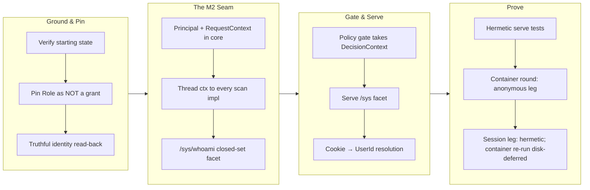

## 1. Overview

The mission delivered "who am I" as machine-readable data on the path a query actually takes. Every request now resolves explicitly to a named principal or the first-class not-signed-in answer: the Principal enum and RequestContext are threaded to `ReadDriver::scan` (the M2 seam, every driver updated), `/sys/whoami` answers from the request principal, session cookies resolve to a UserId on serve, and the policy gate evaluates the real actor instead of a hardwired anonymous context. Fail-closed is preserved and test-pinned. Version bumped to 0.0.88.

**Highlights:**

1. Principal enum (Anonymous | User) in qfs-core, secret-free by construction — user id only, never credential material
2. RequestContext threaded to `ReadDriver::scan` as an explicit argument — a hard M2 seam break across every driver, making principal receipt a compile-time fact
3. `/sys/whoami` added as a closed-set facet returning `{signed_in, user}` where the anonymous answer is first-class, never a silent fallback
4. HTTP policy gate refactored from always-anonymous `evaluate()` to `evaluate_with_context(actor)` receiving the real resolved actor
5. Session-cookie → UserId resolution wired on the serve path (fail-closed: absent/invalid/expired → anonymous)
6. identity::Role pinned as NOT a grant by an anti-regression test; the "what may I administer" decision stays deliberately open

## 2. Motivation

All the pieces existed — session machinery, a policy gate with a who-axis, two role models — but nothing connected them to the query path where a consumer asks "who is asking". Without that answer a consumer cannot derive signed-in vs signed-out state, and the policy gate, though wired, always evaluated the anonymous context (fail-closed but blind to real actors). This mission threads the explicit answer through the seam where every query is served, making it readable by policy and by consumers as data. It deliberately does not answer "what may I administer" — that is an open product decision left to the developer.

## 3. Changes

The work ran in seven deterministic seams: verify the measured starting state, pin the Role invariant, change the core read trait (every driver updated), add /sys/whoami as data (not a side-channel API), refactor the policy gate to context-aware evaluation, wire session resolution on serve, and prove the loop — the anonymous leg live in an isolated container, the session leg hermetically (its in-container re-run is deferred on host disk, not on code).

### 3-1. Identity read-back tells the truth ([358f957](https://github.com/qmu/qfs/commit/358f957))

Added `--json` to `qfs identity whoami` emitting a credential-free object (email+id or null+reason), and corrected the help text's retired sign-up/pending-t46 claims. Rendering is a pure function, pinned by unit tests without touching the database.

### 3-2. Thread the request principal to the scan seam ([a4384ca](https://github.com/qmu/qfs/commit/a4384ca))

Introduced `Principal` and `RequestContext` in qfs-core and changed `ReadDriver::scan(&self, scan, ctx)` — the M2 seam — updating every driver implementation, the executor, and the policy gate. Explicit argument, not thread-local, so fail-closed is a compile-time and test-pinned guarantee.

### 3-3. Role stays not a grant, and the open decision stays open ([9d5b989](https://github.com/qmu/qfs/commit/9d5b989))

Pinned `identity::Role` as a membership label, not an authorization grant, with an anti-regression test; the super-admin vs project-admin split and the t55-vs-t53 taxonomy remain explicitly open decisions.

### 3-4. One live round ([55030df](https://github.com/qmu/qfs/commit/55030df))

Ran the isolated-container round autonomously (owner directive 2026-07-22: the overnight run waits for nobody). The anonymous leg proved end to end (`signed_in=false` on the shipped query path). The round surfaced two un-shipped wiring gaps — which became ticket 20260723090000 — and its session-leg container re-run is deferred on host disk (~13G needed), not on code.

### 3-5. Serve /sys and session principal resolution ([b4f1997](https://github.com/qmu/qfs/commit/b4f1997))

Registered the credential-free /sys read facet on serve (an endpoint `AS /sys/whoami` resolves over HTTP) and implemented `resolve_request_principal`: the `qfs_session` cookie resolves through the session store to a UserId, falling back to anonymous fail-closed. Proven by four hermetic serve tests including the signed-in end-to-end whoami row.

## 4. Outcome

- Request principal threaded through the read seam: `ReadDriver::scan` carries `RequestContext` through all driver implementations, the executor, and the policy gate
- `/sys/whoami` closed-set facet with credential-free columns (`signed_in: Bool`, nullable `user: Text`), resolved from the request principal — the not-signed-in answer is first-class
- Policy gate evaluates the resolved actor both directions via `evaluate_with_context`, proven in hermetic tests
- Serve registers the /sys read facet; `resolve_request_principal` reads the `qfs_session` cookie and resolves to UserId or anonymous (fail-closed)
- identity read-back JSON support and corrected help text; Role-is-not-a-grant pinned by regression test
- Anonymous leg proven live in an isolated container; session leg proven hermetically (4 serve tests) with its in-container re-run deferred on host disk
- All acceptance items advanced; version bumped to 0.0.88

## 5. Historical Analysis

The mission threaded the *user* axis only, deliberately leaving the role/admin taxonomy open (t55 vs t53). Three architectural patterns carried it: (1) `RequestContext` lives in qfs-core — minimal, secret-free, vendor-free — so every read-path crate reaches it without server dependencies; (2) the explicit `ctx` argument (not thread-local) makes fail-closed a compile-time and test-pinned guarantee; (3) principal resolution reuses the OAuth mint's existing `qfs_session::authenticate` path, so the seam is drop-in wiring, not a new subsystem. When the live round proved the remaining gaps were missing wiring (not design), the work was replanned into a focused implementation ticket rather than extending the round — keeping proof and implementation cleanly separated.

## 6. Concerns

### Live proof of the session case deferred on host disk

- **Severity:** moderate
- **Description:** Mission acceptance item 8's in-container live proof of the session-carrying case shipped its code dependencies (see [b4f1997](https://github.com/qmu/qfs/commit/b4f1997)) and is proven hermetically, but the container re-run needs ~13G free on `/` and the shared host had ~6.9G; per the ticket's host-safety rule the round did not gamble on the disk (see the addendum in ticket 20260719101204).
- **How to Fix:** Re-run `containers/live-round/run.sh` once `/` has ~13G free, paste the fresh transcript into the ticket, and tick the live-round leg. Resource contention, not an implementation gap.
### (carried from PR #1) Append-era duplicate rows persist on disk but resolve correctly

- **Severity:** low
- **Description:** After [3bc2710](https://github.com/qmu/qfs/commit/3bc2710), newest-per-key reads heal the operator's 14 append-era duplicate rows without re-install, but the rows remain physically on disk. Compacting them needs an uninstall surface (a deliberate non-goal of this branch)
- **How to Fix:** Implement a bundle-aware uninstall surface that removes superseded rows

### (carried from PR #41) `cd` into a blob file is still admitted

- **Severity:** low
- **Description:** driver-local's pure describe still answers BlobNamespace for every path; the branch did not touch driver-local
- **How to Fix:** Add a describe-time gate to refuse namespace=BlobNamespace at cd time

### (carried from PR #11) /cf live (203090) unimplemented; /cf and /rest are placeholder mounts

- **Severity:** low
- **Description:** /cf and /rest remain placeholder mounts pending a richer connection declaration and owner CF token; untouched by this branch
- **How to Fix:** Implement /cf with a live Cloudflare account and a richer connection declaration grammar

### (carried from PR #18) Console bundle pin unset; live serve + release stamp pending the plgg bundle

- **Severity:** low
- **Description:** PINNED_BUNDLE is still unset pending the published plgg bundle; no console-delivery code changed here
- **How to Fix:** Set PINNED_BUNDLE once the plgg bundle is published

### (carried from PR #origin_pr_url:) CREATE ACCOUNT's SECRET reference form is unimplemented (no bind-time account credential resolution)

- **Severity:** low
- **Description:** > **Rescoped 2026-07-15** by the missions/tickets reframing, per the `the-carried-create-account-ships-the` > concern's recorded fix ("re-scope that concern's body to the `SECRET` edge alone, so its stale > blocker note stops misleading readers"). That carried concern is now resolved and archived; this > one stays `active` because the `SECRET` edge is genuinely untouched. The original body scoped out > **two** edges — the second is retired, see below. The in-language account surface (ticket 20260703040000) shipped the owner-approved core: `CREATE ACCOUNT <provider> '<label>'` records consent (gated on a signed-in operator, sharing the CLI `qfs account add` writer), `/sys/accounts` is a queryable selectors-only registry (no token column, Google's driver trio collapsed to one `google` row), and `REMOVE /sys/accounts/<provider>/<label>` deletes an account (token + consent). One edge from the ticket sketch remains deferred: **The `SECRET '<ref>'` clause is not implemented.** The sketch showed `CREATE ACCOUNT github 'work' SECRET 'vault:github/work'`. A service account resolves its credential from the vault (sealed out-of-band); there is **no bind-time external-reference (`env:`/`vault:`) resolution for accounts** today (unlike a mount's `CONNECT … SECRET`). Adding a parse-only clause would be a surface that cannot resolve at bind — against "docs true / no fake success" — so it is omitted. Verified still true against the **v0.0.71** binary on 2026-07-15: `create account github 'work' secret 'vault:github/work'` returns `parse_error` / `UNEXPECTED_TOKEN`, and `create_account_stmt` (`parser/src/grammar.rs:2364`) reads only provider + label + an optional `APP` clause. ### Retired edge (recorded, not silently dropped) The original sub-item 2 — *"a Google account whose label is an email cannot be removed by a `REMOVE` path"*, blocked on `EffectNode` carrying no filter — is **retired**. The effect-selector channel shipped and `driver-sys` resolves the filter off it. Verified against v0.0.71 on 2026-07-15: `remove /sys/accounts where account == '<an email>'` previews with `selector: ["account"]` and stops only at the standard destructive-set-wide commit gate, not at a capability error. `rotate`/`revoke` stay CLI-only by rule (they need a new secret value).
- **How to Fix:** **SECRET reference for accounts**: wire bind-time resolution of an account credential from an `env:`/`vault:` reference (a new capability), then accept the `SECRET` clause on `CREATE ACCOUNT` and store the reference where the cloud bind reads it. This is now an acceptance item of the `declared-drivers-are-the-normal-way-to-add-a-service` mission — it is the account half of the roadmap's 🧭 cloud-account-declaration gap, and the reason it is a *mission* item rather than a lone fix is that the missing capability (bind-time reference resolution for accounts) is the same one cloud account declarations need.

### (carried from PR #33) Declared-model and scheduling follow-ups

- **Severity:** low
- **Description:** Remaining live Chatwork-encoding verification, OAuth-app plumbing and Slack threading follow-ups are untouched; branch changed the declaration-row resolution, not these surfaces
- **How to Fix:** Complete live Chatwork-encoding verification, OAuth-app plumbing, and Slack threading

### (carried from PR #11) /local write materialization is narrow

- **Severity:** low
- **Description:** Multi-column /local payloads without a named blob column still error (intentional narrow fallback); commit/effect content-blob threading not touched here
- **How to Fix:** Extend /local write materialization to support multi-column payloads without explicit blob columns

### (carried from PR #18) Owner-attended live verification backlog

- **Severity:** moderate
- **Description:** The standing queue of live, owner-attended confirmations that hermetic tests cannot replace, gathered from eight concerns (2026-07-16 triage, owner-directed): the three-step vault-unlock check on the headless host; the six remaining live rounds (Slack post, Gmail reply, /ghdecl read, and siblings); the live /chatwork read confirming the newer view body after replace-on-install; the post-upgrade sanity read confirming the one-shot config-registry copy carried the live registry into the System DB; the bearer-gated non-loopback plan/apply round; the Cloudflare Artifacts beta create/clone/delete round-trip with the sealed repo token; the Cloudflare/Postgres/Drive live provider acceptance that needs owner credentials unavailable in-container; and the standing fact that live-only provider gates sit outside local proof by design. None of these is code work; each is an attended session on the operator's box.
- **How to Fix:** Run the rounds in owner-attended sessions, checking items off this backlog as evidence lands on the relevant archived tickets; split a member back out only if one grows its own code work.

### (carried from PR #35) Policy-less or denied job re-fires every sweep

- **Severity:** low
- **Description:** Sweeper denied/policy-less re-fire semantics remain as-is pending live operation; sweeper.rs was not modified on this branch
- **How to Fix:** Review and adjust sweeper re-fire semantics based on live operational experience

### (carried from PR #11) Postgres/MySQL declarations for the declared-registry path are partial

- **Severity:** low
- **Description:** sql/git still ride the declared-connection seam rather than path_binding, and column-type/comment coverage is unchanged; branch did not touch the SQL backends or connections parser body
- **How to Fix:** Complete Postgres/MySQL declarations with full column-type and comment coverage (ruled to wait behind the re-homing ticket)

### (carried from PR #32) qfs-runtime span-buffer test flakes under parallel workspace tests

- **Severity:** low
- **Description:** The qfs-runtime shared-span-buffer test-isolation flake is unaddressed; the runtime crate was not modified on this branch
- **How to Fix:** Add test isolation for the shared span buffer to prevent flakes in parallel test runs

### (carried from PR #33) Scope cuts and monitored items

- **Severity:** low
- **Description:** Deliberate switch/PDF/stripper scope cuts and watches persist as recorded; none of their prerequisites landed on this branch
- **How to Fix:** Revisit the scope cuts when their prerequisites are available

### (carried from PR #2) shared_connection and broker_connection homing is the same question, deferred

- **Severity:** low
- **Description:** The team-ownership registries (`shared_connection`, `broker_connection`) still live in the Project DB and are declarative by the same principle the re-homing established; the ticket records them as out of scope (M9 territory, own decision later) (see [ada28be](https://github.com/qmu/qfs/commit/ada28be))
- **How to Fix:** Decide their homing when the Managed Team work returns to them; the same migration + one-shot copy + reader-repoint pattern applies

### (carried from PR #39) Slack workspace-namespace still advertises Verb::Rm with no query grammar

- **Severity:** low
- **Description:** The Slack Files namespace still advertises the grammar-less Verb::Rm; driver-slack was not touched on this branch
- **How to Fix:** Add query grammar for the Slack Files Verb::Rm or stop advertising it

### (carried from PR #41) `/sys` and `/slack` do not describe their roots, so `cd` there fails before the gate

- **Severity:** low
- **Description:** /sys and /slack roots still are not describable catalog nodes, so cd there fails at describe; that new driver surface was not added on this branch
- **How to Fix:** Implement root-level describe for the /sys and /slack catalog nodes

### (carried from PR #30) The `api` policy row gates MCP, dashboard, and reconcile alike

- **Severity:** low
- **Description:** The single 'api' policy row still grants MCP, dashboard and reconcile alike; no per-client gate split was made on this branch
- **How to Fix:** Split the api policy row into per-client gates if the access-control review requires it

### (carried from PR #41) The branch-safety scanner false-positives on Rust `Token::Variant`, hard-blocking `/ship`

- **Severity:** moderate
- **Description:** The precision bug is in the workaholic plugin's secret-patterns.sh (a different repo) and cannot be fixed from qfs; unaddressed and still hard-blocks /ship on Rust Token::Variant tokens — this branch adds lexer Token:: usages in document.rs that may trip it
- **How to Fix:** Fix the false-positive pattern in the workaholic plugin's secret-patterns.sh (ticket already filed in qmu/workaholic)

### (carried from PR #2) The dead Project-DB config tables await their drop migration

- **Severity:** low
- **Description:** `path_binding` and `connection_consent` remain physically present (but dead) in the Project DB after [ada28be](https://github.com/qmu/qfs/commit/ada28be) — deliberately: the drop is a later Project-DB migration that must not be able to run before a release containing the boot copy has shipped (data-safety sequencing, not a compatibility period)
- **How to Fix:** After this release ships and the operator's live box has booted the copy, file the Project-DB migration that drops both dead tables

### (carried from PR #41) The interactive shell's `/local` reads from the cwd but writes to the filesystem root

- **Severity:** moderate
- **Description:** The REPL /local read mount (rooted at cwd) vs commit-side applier (rooted at /) mismatch is unfixed — a REPL cp/mv COMMIT still mis-targets and would write to the filesystem root as root; shell.rs/commit.rs were not touched on this branch
- **How to Fix:** Unify the /local root between REPL reads and applier writes

### (carried from PR #41) The `/type` catalog and the type resolver translate the stored key differently

- **Severity:** low
- **Description:** The path-form vs reference-name translation boundary for sys_drivers kind='type' rows still stands as a live encoding rule for any future surface; this branch only rewrote a stale comment in type_catalog.rs, it did not remove the divergence
- **How to Fix:** Unify path-form and reference-name translation for type catalog keys

## 7. Successful Development Patterns

- **Explicit context argument for fail-closed guarantees** — passing `RequestContext` explicitly (not thread-local) made the fail-closed contract testable at compile time and pinned by hermetic tests.
- **Pure functions decouple rendering from state** — `whoami_render` is pure, so JSON and prose outputs pin their behavior in unit tests without touching the database.
- **Collapse interdependent work into single tickets** — the eight acceptance items collapsed to four tickets because the principal-threading items are not independently shippable; they land as one unit at the seam.
- **Container isolation with transcript recording enables autonomous rounds** — read-only repo mount, no host credentials, verbatim transcripts: the round ran overnight without attendance, and the developer reviews the transcript in the morning (owner directive 2026-07-22).
- **Replan when live rounds prove missing wiring, not design** — the round's two wiring gaps became a focused implementation ticket (20260723090000) the round then depends on, instead of widening the round itself.
- **Marker placement is load-bearing** — the acceptance-item `(#ticket)` marker must sit on the checkbox line itself for `tick-acceptance.sh` to match it.

## 8. Release Preparation

**Verdict**: Ready for release

### 8-1. Concerns

- Branch-safety scan verdict is `block` but every finding is override-tier (size): too-many-files (168 > 100, inflated by the branch being 64 commits behind main — the branch's own three-dot diff is 81 files) and four too-large commits (a4384ca 801, 9af13bf 1493, 696fd8e 3662, 26feee2 1304 non-generated lines). No secret or leak findings.
- The in-container live proof of the session-carrying case is deferred on host disk (~13G needed vs ~6.9G free); the code is shipped and hermetically proven (4 serve tests).
- Mission scope note (expected, not a defect): "what may I administer" stayed parked and the session was not un-inerted as a data-path grant (M2) — Role stays not a grant, pinned by an anti-regression test.

### 8-2. Pre-release Instructions

- At /ship, consciously accept the size override (batch-approved by the developer for size-only findings, recorded via record-evidence).
- Merge current origin/main into the branch before shipping (it is ~64 commits behind) and re-run the branch gates on the merged state.

### 8-3. Post-release Instructions

- Re-run `containers/live-round/run.sh` to prove the session-carrying whoami case end to end once `/` has ~13G free, then paste the transcript into the archived ticket's addendum trail.

## 9. Notes

This story was generated at /report time after the overnight /monitor run and its follow-up; the PR body predating it is superseded. The live round was re-ruled autonomous-in-container by owner directive (2026-07-22): the overnight run waits for nobody, and the developer reviews the recorded transcript in the morning.
