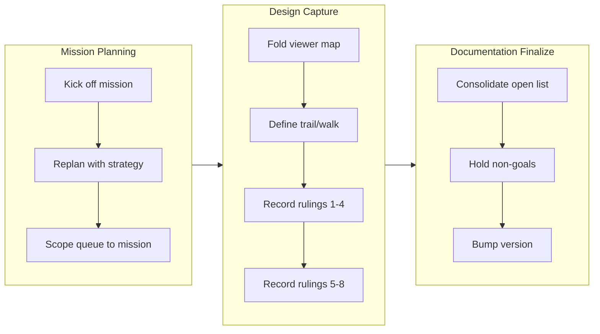

## 1. Overview

The branch established a mission to record the qfs-viewer design decisions and rulings into the blueprint before implementation begins. The work defined "trail" and "walk" as domain terms, captured eight rulings from the 2026-07-21 design conversation, and consolidated the remaining open questions. Version bumped to 0.0.84.

**Highlights:**

1. Established "trail" (static written path) and "walk" (dynamic act extending one column at a time) as core domain terms for the viewer
2. Recorded eight rulings capturing settled design decisions: column layout for post-execution semantics, path=query=set concept welding intension and extension, linear-only walks with confined DAGs, and AI-letter surface parity
3. Consolidated the viewer design space into structured blueprint sections with defined rulings (1-8) and an open list naming each downstream mission
4. Created and executed a mission-driven workflow to capture design decisions as durable documentation before implementation

## 2. Motivation

The 2026-07-21 design conversation converged on how qfs-viewer should work, producing many viewpoints and settled judgments. Rather than let this reasoning be lost during implementation, the owner chose to record the outcome—terminology, rulings, and open questions—as durable blueprint sections before any code is written. This approach preserves the design rationale and creates a stable foundation for downstream viewer development missions.

## 3. Changes

The branch established a mission to record the qfs-viewer design decisions into the blueprint before implementation. It defined "trail" (the static written path) and "walk" (the dynamic act of extending one column at a time) as domain terms, then captured eight rulings from the design conversation including how column layout handles post-execution semantics and how the path=query=set concept welds intension and extension. The mission consolidated the remaining open questions and settled the non-goals, creating a durable foundation for viewer development.

### 3-1. Fold the unmerged §14c map into the mission branch ([7776353](https://github.com/qmu/qfs/commit/7776353))

Cherry-picked the §14c design-space map (commit d0218aa from the parallel viewer-reconsideration worktree) into this mission branch, establishing the baseline text every later ticket edits.

### 3-2. Define trail and walk as domain terms in §14b ([7d2b985](https://github.com/qmu/qfs/commit/7d2b985))

Wrote the two domain-term definitions into blueprint §14b: *trail* (noun, static, result — one written path within the path concept) and *walk* (verb, dynamic, act — extending a column at a time), with one unified definition covering both reads and writes.

### 3-3. Rewrite §14c's settled points (rulings 1–4) from open to ruled ([9eed7ad](https://github.com/qmu/qfs/commit/9eed7ad))

Rewrote the points the 2026-07-21 conversation settled so they read as rulings, not open questions: column layout as a display pattern, linear-vs-graph dissolved by placement, path=query=set welding intension and extension, and parity deliberately not achieved.

### 3-4. Record the AI-letter rulings (5–8) in the blueprint ([e2dd274](https://github.com/qmu/qfs/commit/e2dd274))

Recorded rulings 5–8 as design rulings: the envelope carries context and interactivity, inward confinement mirrors declared-driver host-confinement, single typed egress (INSERT into the sender's inbox), and type-derived interactivity where form-filling is a walk serving human and agent alike.

### 3-5. Consolidate §14c's open list and hold the non-goals ([368270c](https://github.com/qmu/qfs/commit/368270c))

Consolidated §14c's open list — naming six downstream missions without creating them — and verified the mission non-goals: no grammar, no viewer code, no ASK/split implementation on this branch.

## 4. Outcome

- Folded the unmerged §14c design-space map into the mission branch via clean cherry-pick (commit d0218aa), establishing the baseline for subsequent rewrites
- Defined `trail` (noun, static, result — one written path within the path concept) and `walk` (verb, dynamic, act — extending a column at a time) as pinned domain terms, with one unified definition covering both reads (admitted relations/keys) and writes (type-dependent next input)
- Recorded four converged design rulings into §14c: column layout as a display pattern (stripped of over-abstraction); linear-vs-graph dissolved by placement (non-linearity confined to column interiors); path=query=set welding intension and extension; parity deliberately not achieved (fidelity is content's responsibility)
- Recorded four AI-letter rulings (5–8): envelope carries context and interactivity; inward confinement mirrors declared-driver host-confinement; single typed egress (INSERT into sender's inbox); type-derived interactivity with form-filling as a walk (effect only at terminal column), condition-split as linear-preserving, same surface serves human and agent
- Consolidated §14c's open list with six named-but-not-created downstream missions (ASK-grammar spellings, split primitive plus in-column DAG editor, request-principal seam, enumerate-root plumbing, per-viewport projections, intension/extension write edge)
- Verified mission non-goal: cumulative diff touches only `docs/blueprint.md` and `.workaholic/` bookkeeping — no grammar, no viewer code, no ASK/split implemented
- Bumped binary version to 0.0.84 per shipped-PR patch-increment rule

## 5. Historical Analysis

The branch captures the convergence of a 2026-07-21 design conversation that settled multiple open viewer questions through sustained discussion. Four patterns emerge: (1) **Design-first recording** — the owner chose to record the settled judgment before any implementation, ensuring the decision survives as durable mission architecture rather than drift into untracked oral history. (2) **Semantic unity under scrutiny** — the load-bearing insight path=query=set welding intension and extension emerged through iterative discussion and is now locked as ruling 3, with the write-edge caveat prudently retained as open. (3) **Graduated precision through discrete tickets** — breaking the converged design into five distinct recording tickets allowed each ticket to have a focused, verifiable acceptance gate. (4) **Same surface serves multiple actors** — ruling 8 ("who drives is not the design axis") synthesizes a repeated theme that the column UI should work identically for human navigation and agent-driven form-filling.

## 6. Concerns

### Branch-safety size finding on the queue-cleanup commit

- **Severity:** low
- **Description:** The branch-safety scan flags commit [7cd91ec](https://github.com/qmu/qfs/commit/7cd91ec) at 3621 non-generated changed lines (> 500 threshold). The bulk is deletion of ~20 stale archived qfs-viewer tickets plus new blueprint §14b/§14c prose and mission/strategy queue files; no code surface changed.
- **How to Fix:** Accept the size override consciously at /ship — the change is a legitimate docs + queue-cleanup batch.

### (carried from PR #1) Append-era duplicate rows persist on disk but resolve correctly

- **Severity:** low
- **Description:** After [3bc2710](https://github.com/qmu/qfs/commit/3bc2710), newest-per-key reads heal the operator's 14 append-era duplicate rows without re-install, but the rows remain physically on disk. Compacting them needs an uninstall surface (a deliberate non-goal of this branch)
- **How to Fix:** Implement a bundle-aware uninstall surface that removes superseded rows
### (carried from PR #41) `cd` into a blob file is still admitted

- **Severity:** low
- **Description:** driver-local's pure describe still answers BlobNamespace for every path; the branch did not touch driver-local
- **How to Fix:** Add a describe-time gate to refuse namespace=BlobNamespace at cd time

### (carried from PR #11) /cf live (203090) unimplemented; /cf and /rest are placeholder mounts

- **Severity:** low
- **Description:** /cf and /rest remain placeholder mounts pending a richer connection declaration and owner CF token; untouched by this branch
- **How to Fix:** Implement /cf with a live Cloudflare account and a richer connection declaration grammar

### (carried from PR #18) Console bundle pin unset; live serve + release stamp pending the plgg bundle

- **Severity:** low
- **Description:** PINNED_BUNDLE is still unset pending the published plgg bundle; no console-delivery code changed here
- **How to Fix:** Set PINNED_BUNDLE once the plgg bundle is published

### (carried from PR #origin_pr_url:) CREATE ACCOUNT's SECRET reference form is unimplemented (no bind-time account credential resolution)

- **Severity:** low
- **Description:** > **Rescoped 2026-07-15** by the missions/tickets reframing, per the `the-carried-create-account-ships-the` > concern's recorded fix ("re-scope that concern's body to the `SECRET` edge alone, so its stale > blocker note stops misleading readers"). That carried concern is now resolved and archived; this > one stays `active` because the `SECRET` edge is genuinely untouched. The original body scoped out > **two** edges — the second is retired, see below. The in-language account surface (ticket 20260703040000) shipped the owner-approved core: `CREATE ACCOUNT <provider> '<label>'` records consent (gated on a signed-in operator, sharing the CLI `qfs account add` writer), `/sys/accounts` is a queryable selectors-only registry (no token column, Google's driver trio collapsed to one `google` row), and `REMOVE /sys/accounts/<provider>/<label>` deletes an account (token + consent). One edge from the ticket sketch remains deferred: **The `SECRET '<ref>'` clause is not implemented.** The sketch showed `CREATE ACCOUNT github 'work' SECRET 'vault:github/work'`. A service account resolves its credential from the vault (sealed out-of-band); there is **no bind-time external-reference (`env:`/`vault:`) resolution for accounts** today (unlike a mount's `CONNECT … SECRET`). Adding a parse-only clause would be a surface that cannot resolve at bind — against "docs true / no fake success" — so it is omitted. Verified still true against the **v0.0.71** binary on 2026-07-15: `create account github 'work' secret 'vault:github/work'` returns `parse_error` / `UNEXPECTED_TOKEN`, and `create_account_stmt` (`parser/src/grammar.rs:2364`) reads only provider + label + an optional `APP` clause. ### Retired edge (recorded, not silently dropped) The original sub-item 2 — *"a Google account whose label is an email cannot be removed by a `REMOVE` path"*, blocked on `EffectNode` carrying no filter — is **retired**. The effect-selector channel shipped and `driver-sys` resolves the filter off it. Verified against v0.0.71 on 2026-07-15: `remove /sys/accounts where account == '<an email>'` previews with `selector: ["account"]` and stops only at the standard destructive-set-wide commit gate, not at a capability error. `rotate`/`revoke` stay CLI-only by rule (they need a new secret value).
- **How to Fix:** **SECRET reference for accounts**: wire bind-time resolution of an account credential from an `env:`/`vault:` reference (a new capability), then accept the `SECRET` clause on `CREATE ACCOUNT` and store the reference where the cloud bind reads it. This is now an acceptance item of the `declared-drivers-are-the-normal-way-to-add-a-service` mission — it is the account half of the roadmap's 🧭 cloud-account-declaration gap, and the reason it is a *mission* item rather than a lone fix is that the missing capability (bind-time reference resolution for accounts) is the same one cloud account declarations need.

### (carried from PR #33) Declared-model and scheduling follow-ups

- **Severity:** low
- **Description:** Remaining live Chatwork-encoding verification, OAuth-app plumbing and Slack threading follow-ups are untouched; branch changed the declaration-row resolution, not these surfaces
- **How to Fix:** Complete live Chatwork-encoding verification, OAuth-app plumbing, and Slack threading

### (carried from PR #11) /local write materialization is narrow

- **Severity:** low
- **Description:** Multi-column /local payloads without a named blob column still error (intentional narrow fallback); commit/effect content-blob threading not touched here
- **How to Fix:** Extend /local write materialization to support multi-column payloads without explicit blob columns

### (carried from PR #18) Owner-attended live verification backlog

- **Severity:** moderate
- **Description:** The standing queue of live, owner-attended confirmations that hermetic tests cannot replace, gathered from eight concerns (2026-07-16 triage, owner-directed): the three-step vault-unlock check on the headless host; the six remaining live rounds (Slack post, Gmail reply, /ghdecl read, and siblings); the live /chatwork read confirming the newer view body after replace-on-install; the post-upgrade sanity read confirming the one-shot config-registry copy carried the live registry into the System DB; the bearer-gated non-loopback plan/apply round; the Cloudflare Artifacts beta create/clone/delete round-trip with the sealed repo token; the Cloudflare/Postgres/Drive live provider acceptance that needs owner credentials unavailable in-container; and the standing fact that live-only provider gates sit outside local proof by design. None of these is code work; each is an attended session on the operator's box.
- **How to Fix:** Run the rounds in owner-attended sessions, checking items off this backlog as evidence lands on the relevant archived tickets; split a member back out only if one grows its own code work.

### (carried from PR #35) Policy-less or denied job re-fires every sweep

- **Severity:** low
- **Description:** Sweeper denied/policy-less re-fire semantics remain as-is pending live operation; sweeper.rs was not modified on this branch
- **How to Fix:** Review and adjust sweeper re-fire semantics based on live operational experience

### (carried from PR #11) Postgres/MySQL declarations for the declared-registry path are partial

- **Severity:** low
- **Description:** sql/git still ride the declared-connection seam rather than path_binding, and column-type/comment coverage is unchanged; branch did not touch the SQL backends or connections parser body
- **How to Fix:** Complete Postgres/MySQL declarations with full column-type and comment coverage (ruled to wait behind the re-homing ticket)

### (carried from PR #32) qfs-runtime span-buffer test flakes under parallel workspace tests

- **Severity:** low
- **Description:** The qfs-runtime shared-span-buffer test-isolation flake is unaddressed; the runtime crate was not modified on this branch
- **How to Fix:** Add test isolation for the shared span buffer to prevent flakes in parallel test runs

### (carried from PR #33) Scope cuts and monitored items

- **Severity:** low
- **Description:** Deliberate switch/PDF/stripper scope cuts and watches persist as recorded; none of their prerequisites landed on this branch
- **How to Fix:** Revisit the scope cuts when their prerequisites are available

### (carried from PR #2) shared_connection and broker_connection homing is the same question, deferred

- **Severity:** low
- **Description:** The team-ownership registries (`shared_connection`, `broker_connection`) still live in the Project DB and are declarative by the same principle the re-homing established; the ticket records them as out of scope (M9 territory, own decision later) (see [ada28be](https://github.com/qmu/qfs/commit/ada28be))
- **How to Fix:** Decide their homing when the Managed Team work returns to them; the same migration + one-shot copy + reader-repoint pattern applies

### (carried from PR #39) Slack workspace-namespace still advertises Verb::Rm with no query grammar

- **Severity:** low
- **Description:** The Slack Files namespace still advertises the grammar-less Verb::Rm; driver-slack was not touched on this branch
- **How to Fix:** Add query grammar for the Slack Files Verb::Rm or stop advertising it

### (carried from PR #41) `/sys` and `/slack` do not describe their roots, so `cd` there fails before the gate

- **Severity:** low
- **Description:** /sys and /slack roots still are not describable catalog nodes, so cd there fails at describe; that new driver surface was not added on this branch
- **How to Fix:** Implement root-level describe for the /sys and /slack catalog nodes

### (carried from PR #30) The `api` policy row gates MCP, dashboard, and reconcile alike

- **Severity:** low
- **Description:** The single 'api' policy row still grants MCP, dashboard and reconcile alike; no per-client gate split was made on this branch
- **How to Fix:** Split the api policy row into per-client gates if the access-control review requires it

### (carried from PR #41) The branch-safety scanner false-positives on Rust `Token::Variant`, hard-blocking `/ship`

- **Severity:** moderate
- **Description:** The precision bug is in the workaholic plugin's secret-patterns.sh (a different repo) and cannot be fixed from qfs; unaddressed and still hard-blocks /ship on Rust Token::Variant tokens — this branch adds lexer Token:: usages in document.rs that may trip it
- **How to Fix:** Fix the false-positive pattern in the workaholic plugin's secret-patterns.sh (ticket already filed in qmu/workaholic)

### (carried from PR #2) The dead Project-DB config tables await their drop migration

- **Severity:** low
- **Description:** `path_binding` and `connection_consent` remain physically present (but dead) in the Project DB after [ada28be](https://github.com/qmu/qfs/commit/ada28be) — deliberately: the drop is a later Project-DB migration that must not be able to run before a release containing the boot copy has shipped (data-safety sequencing, not a compatibility period)
- **How to Fix:** After this release ships and the operator's live box has booted the copy, file the Project-DB migration that drops both dead tables

### (carried from PR #41) The interactive shell's `/local` reads from the cwd but writes to the filesystem root

- **Severity:** moderate
- **Description:** The REPL /local read mount (rooted at cwd) vs commit-side applier (rooted at /) mismatch is unfixed — a REPL cp/mv COMMIT still mis-targets and would write to the filesystem root as root; shell.rs/commit.rs were not touched on this branch
- **How to Fix:** Unify the /local root between REPL reads and applier writes

### (carried from PR #41) The `/type` catalog and the type resolver translate the stored key differently

- **Severity:** low
- **Description:** The path-form vs reference-name translation boundary for sys_drivers kind='type' rows still stands as a live encoding rule for any future surface; this branch only rewrote a stale comment in type_catalog.rs, it did not remove the divergence
- **How to Fix:** Unify path-form and reference-name translation for type catalog keys

## 7. Successful Development Patterns

- **Clean cherry-pick of earlier design work** — the branch cherry-picked d0218aa (the §14c design-space map from the parallel viewer-reconsideration worktree) without conflict; one worktree per design thread plus periodic integration keeps large design documents coherent across concurrent discussions.
- **Discrete recording tickets with focused acceptance gates** — breaking the converged design into five tickets (fold base, define terms, rule 1–4, rule 5–8, consolidate open list) gave each a clear, independently verifiable acceptance criterion, reducing the risk of under-specification.
- **Semantic unity across paradigms** — "choose one of the steps the current trail admits, and extend" emerged as a single formulation covering both reads and writes; one definition for two use cases reduces future implementation divergence.
- **Explicit ruling-and-caveat discipline** — recording decisions as rulings while retaining specific caveats as open (e.g., the intension/extension write edge) avoids false closure while clarifying what is decided and what is not.
- **Non-goals as acceptance gates** — framing the mission's non-goals (no grammar, no viewer code, no ASK/split) as a verifiable acceptance item prevented scope creep and kept the mission focused on recording, not implementation.

## 8. Release Preparation

**Verdict**: Ready for release

### 8-1. Concerns

- Branch-safety scan flagged an override-tier size finding: commit 7cd91ec has 3621 non-generated changed lines (> 500 threshold). Legitimate for this docs-only branch — the bulk is deletion of ~20 stale archived qfs-viewer tickets plus new docs/blueprint.md §14b/§14c prose and mission/strategy queue files; no code surface changed.

### 8-2. Pre-release Instructions

- At /ship, consciously accept the size override for commit 7cd91ec (3621 changed lines) — the change is a legitimate docs + queue-cleanup batch, not an oversized code change.

### 8-3. Post-release Instructions

- None - no special post-release actions needed

## 9. Notes

This story was generated at /report time after the overnight /monitor run that drove the mission; the PR body predating this story was written directly by the monitor and is superseded by this document. The mission's design rationale lives in docs/blueprint.md §14b/§14c on this branch.

## Deployment Evidence

- **When:** 2026-07-23T23:53:28+09:00
- **By:** a@qmu.jp
- **Target:** release-scan
- **Method:** override
- **Status:** bypassed
- **Observed:** size finding overridden by developer: commit 7cd91ec, 3621 non-generated lines, docs-only (ticket cleanup + blueprint prose), no code surface
