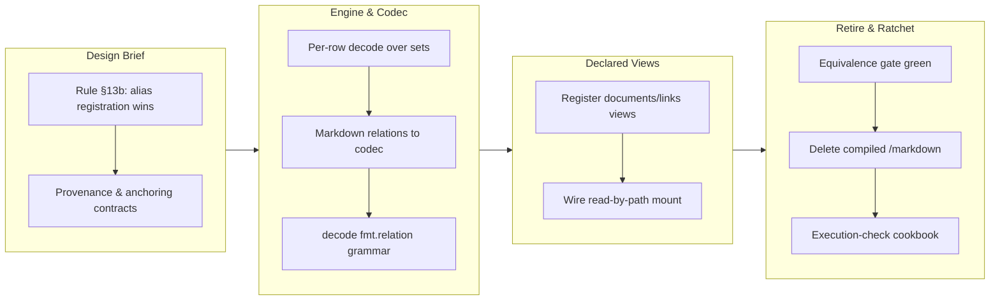

## 1. Overview

Per-file codec interpretation over collected sets replaces specialized drivers. Markdown documents and links now surface as declared views with the full section-path link graph preserved; row-equivalence was proven against the compiled /markdown oracle and the driver retired. DECODE runs per-row over multi-file collected sets with path provenance, and the cookbook's collection recipes are execution-checked. Version bumped to 0.0.87; plugin bumped 0.14.0 → 0.15.0 (minor, taught-surface break).

**Highlights:**

1. Per-row DECODE over collected sets: the codec contract applies to each row of a multi-row content-bearing set; the single-file case is the one-row instance; the single-blob refusal retired
2. Markdown relations rehomed to the codec layer: documents (frontmatter-as-columns) and links (full nested section_path graph) are codec outputs, not a compiled driver
3. Declared collection views registered through the existing definition layer — zero new grammar; /markdown demoted from builtin to one instance of the general collection shape
4. Read-by-path mount wired for registered views: the production path surface resolves declared views with root-relative normalization
5. Compiled /markdown driver retired on the twin-and-retire ratchet after the equivalence gate went green; plugin bumped 0.15.0
6. Cookbook collection recipes raised from parse-only to execution-checked against hermetic fixture trees

## 2. Motivation

The owner's direction (2026-07-20) settled file-collection before niche drivers multiply: a generic path — codec on any blob source, per-row — beats a specialized compiled driver for every file kind (EXIF, CSV, PDF, markdown). This mission answers blueprint §13b's open question with "alias registration wins", and restores docs-true teaching: the recipes agents are taught (local dir → decoded table → WHERE on frontmatter) must execute, not merely parse.

## 3. Changes

The overnight run (2026-07-22) drove the design brief, per-row decode, and the codec rehome, then stalled on shared-host disk limits (t3 partial, t4 blocked — the full binary build needed ~13G against 8.7G free). An attended follow-up (2026-07-23) completed the declared-view registration with a memory-capped tmpfs build, wired the read-by-path production mount, retired the compiled driver with the ratchet green, and blessed the final golden. Six tickets in total.

### 3-1. Design brief: codec relation surface and §13b ruling ([bb1220a](https://github.com/qmu/qfs/commit/bb1220a))

Closed blueprint §13b's open question — alias registration wins, /markdown demoted to one instance of the general collection shape — and fixed the contracts (per-row decode, provenance owned by decode, VFS-raw vs root-relative anchoring) the implementation tickets build against.

### 3-2. Per-row decode over collected sets ([0b5ceba](https://github.com/qmu/qfs/commit/0b5ceba))

DECODE now decodes each row of a collected content-bearing set with a schema-widening union across files; every decoded row carries its `path` provenance; the single-blob refusal is retired.

### 3-3. Documents/links as declared registrations ([c6d834d](https://github.com/qmu/qfs/commit/c6d834d))

Registered the markdown documents/links views through the existing definition layer (zero new grammar) and proved the registration-level equivalence and DESCRIBE gates green via the full qfs binary build.

### 3-4. Retire the compiled /markdown driver ([7bac20f](https://github.com/qmu/qfs/commit/7bac20f))

Deleted crates/driver-markdown and its registration after the equivalence gate went green; `CONNECT … TO markdown` retired with the driver (sanctioned hard break); docs/drivers.md regenerated; plugin bumped 0.14.1 → 0.15.0 (minor, taught-surface break).

### 3-5. Cookbook collection recipes execution-checked ([de7dbb1](https://github.com/qmu/qfs/commit/de7dbb1))

Raised the cookbook's multi-file collection recipes from parse-only to execution-checked: each recipe now runs against a hermetic fixture tree and asserts its result shape, closing a class of agent-teachability divergence.

### 3-6. Wire read-by-path mount for registered views ([dcfd0b6](https://github.com/qmu/qfs/commit/dcfd0b6))

Added the `/collections/<view>` mount to the live ServerState so registered views are a production path surface; the read facet applies root-relative stripping before decode so links normalize against documents paths; live query and DESCRIBE proven equivalent to the compiled driver.

## 4. Outcome

- Blueprint §13b ruled: alias registration wins; /markdown demoted to one instance of the general collection shape; zero new grammar needed
- Per-row DECODE over collected sets landed with schema-widening union and path provenance; single-blob refusal retired
- Markdown documents/links rehomed into the codec layer as named relations, row-equivalent to the compiled driver byte-for-byte (title, frontmatter, target_doc normalization, nested section_path)
- Declared views registered and DESCRIBEd through the definition layer; the read-by-path `/collections/<view>` mount is the wired production surface
- Compiled /markdown driver deleted on the twin-and-retire ratchet with the equivalence gate green; docs regenerated; plugin bumped to 0.15.0 across all four version fields
- Cookbook collection recipes execution-checked against hermetic fixtures; the final golden re-bless (183b9a9) fixed the one snapshot drift per-crate runs had missed
- Overnight disk blocker resolved via a memory-capped tmpfs build (systemd-run MemoryMax + tmpfs CARGO_TARGET_DIR), leaving `/` free space intact

## 5. Historical Analysis

The mission demonstrates the twin-and-retire ratchet working as designed: prove equivalence hermetically first, wire the production surface explicitly, and only then delete the compiled driver. The overnight leaf initially treated helper-level equivalence as sufficient for retirement; commit 20f22fe recorded the gap honestly and ticket 20260723100000 emerged as the explicit production-surface prerequisite. The design brief (bb1220a) prevented re-escalation of already-ruled points — when the overnight leaf re-raised provenance naming and path normalization, the in-ticket "decision is made, see Ruling 3" note closed the loop. The shared-host disk constraint proved solvable rather than fatal: a memory-capped tmpfs build container completed the full-binary gates without consuming `/` space.

## 6. Concerns

### Golden/anti-drift crate not exercised by per-crate runs

- **Severity:** moderate
- **Description:** A DECODE AST relation field drifted its qfs-test golden snapshot and only the final workspace/golden run caught it (fixed in [183b9a9](https://github.com/qmu/qfs/commit/183b9a9)); per-crate driver runs skip the golden crate.
- **How to Fix:** Future codec-grammar changes should run the full workspace or qfs-test explicitly before ship; the ship-time tmpfs full-workspace gate covers this at merge time.
### (carried from PR #1) Append-era duplicate rows persist on disk but resolve correctly

- **Severity:** low
- **Description:** After [3bc2710](https://github.com/qmu/qfs/commit/3bc2710), newest-per-key reads heal the operator's 14 append-era duplicate rows without re-install, but the rows remain physically on disk. Compacting them needs an uninstall surface (a deliberate non-goal of this branch)
- **How to Fix:** Implement a bundle-aware uninstall surface that removes superseded rows

### (carried from PR #41) `cd` into a blob file is still admitted

- **Severity:** low
- **Description:** driver-local's pure describe still answers BlobNamespace for every path; the branch did not touch driver-local
- **How to Fix:** Add a describe-time gate to refuse namespace=BlobNamespace at cd time

### (carried from PR #11) /cf live (203090) unimplemented; /cf and /rest are placeholder mounts

- **Severity:** low
- **Description:** /cf and /rest remain placeholder mounts pending a richer connection declaration and owner CF token; untouched by this branch
- **How to Fix:** Implement /cf with a live Cloudflare account and a richer connection declaration grammar

### (carried from PR #18) Console bundle pin unset; live serve + release stamp pending the plgg bundle

- **Severity:** low
- **Description:** PINNED_BUNDLE is still unset pending the published plgg bundle; no console-delivery code changed here
- **How to Fix:** Set PINNED_BUNDLE once the plgg bundle is published

### (carried from PR #origin_pr_url:) CREATE ACCOUNT's SECRET reference form is unimplemented (no bind-time account credential resolution)

- **Severity:** low
- **Description:** > **Rescoped 2026-07-15** by the missions/tickets reframing, per the `the-carried-create-account-ships-the` > concern's recorded fix ("re-scope that concern's body to the `SECRET` edge alone, so its stale > blocker note stops misleading readers"). That carried concern is now resolved and archived; this > one stays `active` because the `SECRET` edge is genuinely untouched. The original body scoped out > **two** edges — the second is retired, see below. The in-language account surface (ticket 20260703040000) shipped the owner-approved core: `CREATE ACCOUNT <provider> '<label>'` records consent (gated on a signed-in operator, sharing the CLI `qfs account add` writer), `/sys/accounts` is a queryable selectors-only registry (no token column, Google's driver trio collapsed to one `google` row), and `REMOVE /sys/accounts/<provider>/<label>` deletes an account (token + consent). One edge from the ticket sketch remains deferred: **The `SECRET '<ref>'` clause is not implemented.** The sketch showed `CREATE ACCOUNT github 'work' SECRET 'vault:github/work'`. A service account resolves its credential from the vault (sealed out-of-band); there is **no bind-time external-reference (`env:`/`vault:`) resolution for accounts** today (unlike a mount's `CONNECT … SECRET`). Adding a parse-only clause would be a surface that cannot resolve at bind — against "docs true / no fake success" — so it is omitted. Verified still true against the **v0.0.71** binary on 2026-07-15: `create account github 'work' secret 'vault:github/work'` returns `parse_error` / `UNEXPECTED_TOKEN`, and `create_account_stmt` (`parser/src/grammar.rs:2364`) reads only provider + label + an optional `APP` clause. ### Retired edge (recorded, not silently dropped) The original sub-item 2 — *"a Google account whose label is an email cannot be removed by a `REMOVE` path"*, blocked on `EffectNode` carrying no filter — is **retired**. The effect-selector channel shipped and `driver-sys` resolves the filter off it. Verified against v0.0.71 on 2026-07-15: `remove /sys/accounts where account == '<an email>'` previews with `selector: ["account"]` and stops only at the standard destructive-set-wide commit gate, not at a capability error. `rotate`/`revoke` stay CLI-only by rule (they need a new secret value).
- **How to Fix:** **SECRET reference for accounts**: wire bind-time resolution of an account credential from an `env:`/`vault:` reference (a new capability), then accept the `SECRET` clause on `CREATE ACCOUNT` and store the reference where the cloud bind reads it. This is now an acceptance item of the `declared-drivers-are-the-normal-way-to-add-a-service` mission — it is the account half of the roadmap's 🧭 cloud-account-declaration gap, and the reason it is a *mission* item rather than a lone fix is that the missing capability (bind-time reference resolution for accounts) is the same one cloud account declarations need.

### (carried from PR #33) Declared-model and scheduling follow-ups

- **Severity:** low
- **Description:** Remaining live Chatwork-encoding verification, OAuth-app plumbing and Slack threading follow-ups are untouched; branch changed the declaration-row resolution, not these surfaces
- **How to Fix:** Complete live Chatwork-encoding verification, OAuth-app plumbing, and Slack threading

### (carried from PR #11) /local write materialization is narrow

- **Severity:** low
- **Description:** Multi-column /local payloads without a named blob column still error (intentional narrow fallback); commit/effect content-blob threading not touched here
- **How to Fix:** Extend /local write materialization to support multi-column payloads without explicit blob columns

### (carried from PR #18) Owner-attended live verification backlog

- **Severity:** moderate
- **Description:** The standing queue of live, owner-attended confirmations that hermetic tests cannot replace, gathered from eight concerns (2026-07-16 triage, owner-directed): the three-step vault-unlock check on the headless host; the six remaining live rounds (Slack post, Gmail reply, /ghdecl read, and siblings); the live /chatwork read confirming the newer view body after replace-on-install; the post-upgrade sanity read confirming the one-shot config-registry copy carried the live registry into the System DB; the bearer-gated non-loopback plan/apply round; the Cloudflare Artifacts beta create/clone/delete round-trip with the sealed repo token; the Cloudflare/Postgres/Drive live provider acceptance that needs owner credentials unavailable in-container; and the standing fact that live-only provider gates sit outside local proof by design. None of these is code work; each is an attended session on the operator's box.
- **How to Fix:** Run the rounds in owner-attended sessions, checking items off this backlog as evidence lands on the relevant archived tickets; split a member back out only if one grows its own code work.

### (carried from PR #35) Policy-less or denied job re-fires every sweep

- **Severity:** low
- **Description:** Sweeper denied/policy-less re-fire semantics remain as-is pending live operation; sweeper.rs was not modified on this branch
- **How to Fix:** Review and adjust sweeper re-fire semantics based on live operational experience

### (carried from PR #11) Postgres/MySQL declarations for the declared-registry path are partial

- **Severity:** low
- **Description:** sql/git still ride the declared-connection seam rather than path_binding, and column-type/comment coverage is unchanged; branch did not touch the SQL backends or connections parser body
- **How to Fix:** Complete Postgres/MySQL declarations with full column-type and comment coverage (ruled to wait behind the re-homing ticket)

### (carried from PR #32) qfs-runtime span-buffer test flakes under parallel workspace tests

- **Severity:** low
- **Description:** The qfs-runtime shared-span-buffer test-isolation flake is unaddressed; the runtime crate was not modified on this branch
- **How to Fix:** Add test isolation for the shared span buffer to prevent flakes in parallel test runs

### (carried from PR #33) Scope cuts and monitored items

- **Severity:** low
- **Description:** Deliberate switch/PDF/stripper scope cuts and watches persist as recorded; none of their prerequisites landed on this branch
- **How to Fix:** Revisit the scope cuts when their prerequisites are available

### (carried from PR #2) shared_connection and broker_connection homing is the same question, deferred

- **Severity:** low
- **Description:** The team-ownership registries (`shared_connection`, `broker_connection`) still live in the Project DB and are declarative by the same principle the re-homing established; the ticket records them as out of scope (M9 territory, own decision later) (see [ada28be](https://github.com/qmu/qfs/commit/ada28be))
- **How to Fix:** Decide their homing when the Managed Team work returns to them; the same migration + one-shot copy + reader-repoint pattern applies

### (carried from PR #39) Slack workspace-namespace still advertises Verb::Rm with no query grammar

- **Severity:** low
- **Description:** The Slack Files namespace still advertises the grammar-less Verb::Rm; driver-slack was not touched on this branch
- **How to Fix:** Add query grammar for the Slack Files Verb::Rm or stop advertising it

### (carried from PR #41) `/sys` and `/slack` do not describe their roots, so `cd` there fails before the gate

- **Severity:** low
- **Description:** /sys and /slack roots still are not describable catalog nodes, so cd there fails at describe; that new driver surface was not added on this branch
- **How to Fix:** Implement root-level describe for the /sys and /slack catalog nodes

### (carried from PR #30) The `api` policy row gates MCP, dashboard, and reconcile alike

- **Severity:** low
- **Description:** The single 'api' policy row still grants MCP, dashboard and reconcile alike; no per-client gate split was made on this branch
- **How to Fix:** Split the api policy row into per-client gates if the access-control review requires it

### (carried from PR #41) The branch-safety scanner false-positives on Rust `Token::Variant`, hard-blocking `/ship`

- **Severity:** moderate
- **Description:** The precision bug is in the workaholic plugin's secret-patterns.sh (a different repo) and cannot be fixed from qfs; unaddressed and still hard-blocks /ship on Rust Token::Variant tokens — this branch adds lexer Token:: usages in document.rs that may trip it
- **How to Fix:** Fix the false-positive pattern in the workaholic plugin's secret-patterns.sh (ticket already filed in qmu/workaholic)

### (carried from PR #2) The dead Project-DB config tables await their drop migration

- **Severity:** low
- **Description:** `path_binding` and `connection_consent` remain physically present (but dead) in the Project DB after [ada28be](https://github.com/qmu/qfs/commit/ada28be) — deliberately: the drop is a later Project-DB migration that must not be able to run before a release containing the boot copy has shipped (data-safety sequencing, not a compatibility period)
- **How to Fix:** After this release ships and the operator's live box has booted the copy, file the Project-DB migration that drops both dead tables

### (carried from PR #41) The interactive shell's `/local` reads from the cwd but writes to the filesystem root

- **Severity:** moderate
- **Description:** The REPL /local read mount (rooted at cwd) vs commit-side applier (rooted at /) mismatch is unfixed — a REPL cp/mv COMMIT still mis-targets and would write to the filesystem root as root; shell.rs/commit.rs were not touched on this branch
- **How to Fix:** Unify the /local root between REPL reads and applier writes

### (carried from PR #41) The `/type` catalog and the type resolver translate the stored key differently

- **Severity:** low
- **Description:** The path-form vs reference-name translation boundary for sys_drivers kind='type' rows still stands as a live encoding rule for any future surface; this branch only rewrote a stale comment in type_catalog.rs, it did not remove the divergence
- **How to Fix:** Unify path-form and reference-name translation for type catalog keys

## 7. Successful Development Patterns

- **Ruled design brief before implementation** — the brief fixed per-row decode, provenance ownership, and anchoring contracts before five dependent tickets; when the overnight leaf re-escalated already-ruled points, the in-ticket "decision is made, see Ruling 3" note closed the loop without a re-debate.
- **Hermetic equivalence as the retirement oracle** — row-equivalence proven on fixture trees (no network, no credentials) before any production wiring; helper-level green was explicitly NOT treated as production green.
- **Explicit production-surface ticket before deletion** — the read-by-path mount got its own ticket when the gap between helper equivalence and a wired surface surfaced; the compiled driver was deleted only after the live surface proved equivalent.
- **Execution-checked ratchet over parse-only** — cookbook collection recipes now run against fixtures; the ratchet only tightens, closing agent-teachability divergence.
- **Memory-capped tmpfs as co-tenant-safe build container** — systemd-run --scope MemoryMax + tmpfs CARGO_TARGET_DIR completed full-binary gates on a disk-starved shared host without consuming `/` space.

## 8. Release Preparation

**Verdict**: Ready for release

### 8-1. Concerns

- Branch-safety scan verdict is `block` but ALL findings are override-tier (size): 5 too-large commits — 0266e27 (3621), 7bac20f (2054), dcfd0b6 (698), 0b5ceba (690), 0a894ef (633) non-generated changed lines. Legitimate for a driver-retirement + codec-rehome branch.
- The golden/anti-drift crate (qfs-test) is not exercised by per-crate driver runs — a DECODE AST snapshot drifted and only the final workspace run caught it (fixed in 183b9a9).

### 8-2. Pre-release Instructions

- At /ship, consciously accept the size override for the 5 large commits (batch-approved by the developer for size-only findings, recorded via record-evidence).
- Confirm the ship-time tmpfs full-workspace gate run reports green test/clippy/fmt/gen-docs/gen-skills before merging.

### 8-3. Post-release Instructions

- Cut the matching v0.0.87 tag on ship so the published release and `qfs --version` stay in sync.

## 9. Notes

This story was generated at /report time after the overnight /monitor run and its attended follow-up; the PR body predating it (which reported "partial 5/7, t4 blocked") is superseded — the follow-up completed t3/t4 and the mission's acceptance is fully ticked. Plugin bump 0.14.0 → 0.15.0 (minor) is the correct tier for the /markdown taught-surface retirement and agrees across all four version fields.
