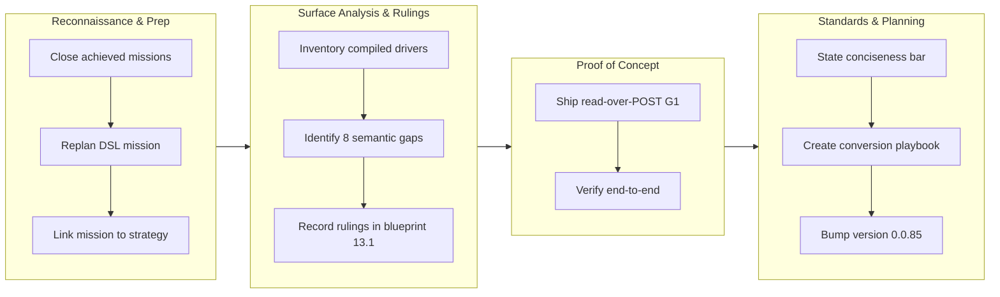

## 1. Overview

This branch established the declared driver DSL as the coverage model for compiled driver services by inventorying compiled surfaces across Slack/GitHub/Drive/Gmail, ruling 8 semantic gaps (G1-G8), shipping read-over-POST as proof-of-concept, and stating a conciseness bar to guide downstream conversions. Version bumped to 0.0.85.

**Highlights:**

1. Inventoried all compiled slack/github/gdrive/gmail surfaces with dispositions and parse-checked expressible-today examples
2. Recorded 8 rulings in blueprint §13.1 for cross-cutting semantic gaps (read-over-POST, PUSHDOWN params with honesty, MIME codec, row fan-out, typed CALL, ALIAS prelude, blob ergonomics parked, non-REST parked)
3. Shipped read-over-POST (PipeOp::Post) end-to-end through the tier-2 evaluator, proving ruled semantics work in the real system
4. Stated the conciseness bar: ~40 statement-lines per tier-1/2 REST service, with chatwork.qfs as the 32-line calibration and all projected twins below the bar
5. Added the conversion playbook naming four ordered missions (slack→github→drive→mail) with entry conditions, row-equivalence bars, and shared retirement steps

## 2. Motivation

The project faces a structural choice: either maintain multiple compiled copies of client libraries (Slack, GitHub, Drive, Gmail) or discover a declarative model that captures their surfaces concisely. This branch builds the coverage argument by systematically inventorying what compiled drivers expose, ruling the 8 semantic gaps where the declared language falls short, and establishing an evidence-based path forward. The conciseness bar—derived from chatwork.qfs at 32 lines—ensures declarative approaches remain economical. By shipping read-over-POST as proof-of-concept and codifying the conversion playbook, the branch unblocks the four planned twin migrations without re-litigating design decisions.

## 3. Changes

The mission moved from oversight (archiving completed missions and claiming the DSL mission) to systematic execution: inventorying all compiled driver surfaces, ruling the 8 semantic gaps in blueprint §13.1, shipping read-over-POST as end-to-end proof through the real tier-2 evaluator, calibrating the conciseness bar against chatwork.qfs, and codifying the conversion playbook that names the four ordered twin missions with entry conditions.

### 3-1. Coverage inventory of compiled driver surfaces ([9a64232](https://github.com/qmu/qfs/commit/9a64232))

Enumerated every node, verb, and CALL of the compiled slack/github/gdrive/gmail drivers with a disposition for each — expressible today, needs a ruled semantic (G1-G8), or a named park — with parse-checked expressible-today examples.

### 3-2. Rule the semantic gaps in blueprint §13 ([68caac6](https://github.com/qmu/qfs/commit/68caac6))

Recorded the eight rulings (G1-G8) in blueprint §13.1 as redefinitions with declaration-cost notes: read-over-POST, declared PUSHDOWN with honesty, ENCODE message MIME codec, row-level fan-out, typed CALL signatures, prelude ALIAS, blob-archetype parking (G7), and non-REST-arm parking (G8).

### 3-3. Ship read-over-POST hermetically ([e5cd1a3](https://github.com/qmu/qfs/commit/e5cd1a3))

Implemented G1 as a production `|> POST <body>` pipe stage (PipeOp::Post) through the real tier-2 evaluator, proved by a hermetic wire-fixture test (`read_over_post_pulls_rows_through_the_real_evaluator`) — no network, no credentials.

### 3-4. State and measure the conciseness bar ([9ba25f7](https://github.com/qmu/qfs/commit/9ba25f7))

Stated the bar — a tier-1/2 REST service's full declaration ≈ one screen (~40 statement-lines) — calibrated against chatwork.qfs (32 lines for a complete tier-1 service including file transfer), and projected all four downstream twins under the bar.

### 3-5. Conversion playbook and honest tiering ([fb83df5](https://github.com/qmu/qfs/commit/fb83df5))

Wrote blueprint §13.3: the four downstream twin missions in ascending quirk difficulty (slack→github→drive→mail) with per-mission entry conditions and row-equivalence bars, the shared 4-step retirement procedure, and the honest-tiering table restating every structural exception (/git, /claude, /cf queue-pull, Artifacts, blob primitives, /sql engines) with its reason.

## 4. Outcome

- Enumerated complete compiled driver surfaces from all four drivers (slack, github, gdrive, gmail) with 100% coverage disposition: every node, verb, and CALL marked as expressible-today, needs-a-ruled-semantic (G1-G8), or named park
- Recorded eight semantic rulings (G1-G8) in blueprint §13.1 as redefinitions with declaration-cost notes
- Implemented read-over-POST (G1) as a production pipe-op variant (PipeOp::Post) shipping through the real tier-2 evaluator with hermetic fixture-backed tests
- Established and measured the conciseness bar at ~40 statement-lines per tier-1/2 service, with chatwork.qfs (32 lines) as calibration; projected all four downstream twin conversions under the bar
- Documented the conversion playbook in blueprint §13.3 naming the four downstream missions (slack→github→drive→mail) with per-mission entry conditions and row-equivalence bars
- Restated structural exceptions (/git, /claude, /cf queue-pull, Artifacts, blob primitives, /sql engines) with explicit reasons for non-conversion

## 5. Historical Analysis

The mission benefited from established precedent in two key ways. First, the read-over-POST ruling reused the shipped CREATE SQL OVER POST-to-read pattern, generalizing it to any VIEW wire source; this anchored the semantic in proven infrastructure rather than breaking new ground. Second, the implementation adopted the tier-2 design idiom of quirks-as-pipe-ops, which minimized AST churn by adding one closed-core variant rather than restructuring the declaration model. The conciseness work drew on measurement from chatwork.qfs (32 statement-lines for a tier-1 service), allowing the bar to be calibrated against a real delivered artifact rather than speculated. The hermetic test strategy (wire fixtures, no network/credentials) proved effective for proving read-over-POST end-to-end, avoiding the false confidence of unit tests alone.

## 6. Concerns

### G1 read-over-POST spelling required refinement during implementation

- **Severity:** moderate
- **Description:** The initial ruling stated read-over-POST as a bare source clause; during implementation it was refined to a `|> POST { body }` pipe-op form (see [e5cd1a3](https://github.com/qmu/qfs/commit/e5cd1a3)). The ruling specification was incomplete at recording time and needed clarification during proof.
- **How to Fix:** Document in blueprint §13.1 the reason for the pipe-op form (tier-2 idiom for quirks minimizes AST churn) and ensure downstream rulings include similar implementation-detail precision to avoid surprises during proof.

### G7 and G8 parks create scoping risk for downstream conversions

- **Severity:** moderate
- **Description:** Blob-archetype ergonomics (G7) and non-REST-arm handling (G8) are recorded as named parks without trigger conditions (see [fb83df5](https://github.com/qmu/qfs/commit/fb83df5)). The conversion playbook depends on their status being clear to incoming sessions; deferred work risks being silently re-discovered or forgotten.
- **How to Fix:** Record concrete follow-up mission names and trigger conditions for G7 and G8 in blueprint §13.3 (not just "parked"), so a fresh session can detect their absence and either scope around them or escalate if they become load-bearing.

### Conciseness bar measured only on expressible-today fragments

- **Severity:** low
- **Description:** The four downstream conversions are projected under the 40 statement-line bar from per-family fragment counts and estimates, not proven against actual twin declarations (see [9ba25f7](https://github.com/qmu/qfs/commit/9ba25f7)).
- **How to Fix:** During each downstream conversion mission, measure the actual twin declaration against the bar and record it in the same inventory document; if any twin exceeds the bar, revisit the terseness devices.

### POST stage absent from the generated language reference

- **Severity:** low
- **Description:** The new user-visible `|> POST` pipe stage is documented in blueprint §13.1 but absent from docs/language.md (sourced from crates/lang/src/reference.rs), where its sibling FOLLOW stage IS listed. gen-docs stays green because reference.rs is unchanged — a documentation-completeness gap, not a gate failure.
- **How to Fix:** Add the POST stage to crates/lang/src/reference.rs (EBNF + stage table) and regenerate docs/language.md via `cargo run -p xtask -- gen-docs`.

### Overnight test verification used per-crate runs due to shared-host disk constraints

- **Severity:** low
- **Description:** During the overnight drive, full `cargo test --workspace` could not complete due to disk pressure on the shared host; per-crate testing was used (see [e5cd1a3](https://github.com/qmu/qfs/commit/e5cd1a3)). Full-workspace gates are re-run at ship time on a tmpfs target.
- **How to Fix:** Host-level operational issue; the ship-time full-workspace gate run covers the gap.
### (carried from PR #1) Append-era duplicate rows persist on disk but resolve correctly

- **Severity:** low
- **Description:** After [3bc2710](https://github.com/qmu/qfs/commit/3bc2710), newest-per-key reads heal the operator's 14 append-era duplicate rows without re-install, but the rows remain physically on disk. Compacting them needs an uninstall surface (a deliberate non-goal of this branch)
- **How to Fix:** Implement a bundle-aware uninstall surface that removes superseded rows

### (carried from PR #41) `cd` into a blob file is still admitted

- **Severity:** low
- **Description:** driver-local's pure describe still answers BlobNamespace for every path; the branch did not touch driver-local
- **How to Fix:** Add a describe-time gate to refuse namespace=BlobNamespace at cd time

### (carried from PR #11) /cf live (203090) unimplemented; /cf and /rest are placeholder mounts

- **Severity:** low
- **Description:** /cf and /rest remain placeholder mounts pending a richer connection declaration and owner CF token; untouched by this branch
- **How to Fix:** Implement /cf with a live Cloudflare account and a richer connection declaration grammar

### (carried from PR #18) Console bundle pin unset; live serve + release stamp pending the plgg bundle

- **Severity:** low
- **Description:** PINNED_BUNDLE is still unset pending the published plgg bundle; no console-delivery code changed here
- **How to Fix:** Set PINNED_BUNDLE once the plgg bundle is published

### (carried from PR #origin_pr_url:) CREATE ACCOUNT's SECRET reference form is unimplemented (no bind-time account credential resolution)

- **Severity:** low
- **Description:** > **Rescoped 2026-07-15** by the missions/tickets reframing, per the `the-carried-create-account-ships-the` > concern's recorded fix ("re-scope that concern's body to the `SECRET` edge alone, so its stale > blocker note stops misleading readers"). That carried concern is now resolved and archived; this > one stays `active` because the `SECRET` edge is genuinely untouched. The original body scoped out > **two** edges — the second is retired, see below. The in-language account surface (ticket 20260703040000) shipped the owner-approved core: `CREATE ACCOUNT <provider> '<label>'` records consent (gated on a signed-in operator, sharing the CLI `qfs account add` writer), `/sys/accounts` is a queryable selectors-only registry (no token column, Google's driver trio collapsed to one `google` row), and `REMOVE /sys/accounts/<provider>/<label>` deletes an account (token + consent). One edge from the ticket sketch remains deferred: **The `SECRET '<ref>'` clause is not implemented.** The sketch showed `CREATE ACCOUNT github 'work' SECRET 'vault:github/work'`. A service account resolves its credential from the vault (sealed out-of-band); there is **no bind-time external-reference (`env:`/`vault:`) resolution for accounts** today (unlike a mount's `CONNECT … SECRET`). Adding a parse-only clause would be a surface that cannot resolve at bind — against "docs true / no fake success" — so it is omitted. Verified still true against the **v0.0.71** binary on 2026-07-15: `create account github 'work' secret 'vault:github/work'` returns `parse_error` / `UNEXPECTED_TOKEN`, and `create_account_stmt` (`parser/src/grammar.rs:2364`) reads only provider + label + an optional `APP` clause. ### Retired edge (recorded, not silently dropped) The original sub-item 2 — *"a Google account whose label is an email cannot be removed by a `REMOVE` path"*, blocked on `EffectNode` carrying no filter — is **retired**. The effect-selector channel shipped and `driver-sys` resolves the filter off it. Verified against v0.0.71 on 2026-07-15: `remove /sys/accounts where account == '<an email>'` previews with `selector: ["account"]` and stops only at the standard destructive-set-wide commit gate, not at a capability error. `rotate`/`revoke` stay CLI-only by rule (they need a new secret value).
- **How to Fix:** **SECRET reference for accounts**: wire bind-time resolution of an account credential from an `env:`/`vault:` reference (a new capability), then accept the `SECRET` clause on `CREATE ACCOUNT` and store the reference where the cloud bind reads it. This is now an acceptance item of the `declared-drivers-are-the-normal-way-to-add-a-service` mission — it is the account half of the roadmap's 🧭 cloud-account-declaration gap, and the reason it is a *mission* item rather than a lone fix is that the missing capability (bind-time reference resolution for accounts) is the same one cloud account declarations need.

### (carried from PR #33) Declared-model and scheduling follow-ups

- **Severity:** low
- **Description:** Remaining live Chatwork-encoding verification, OAuth-app plumbing and Slack threading follow-ups are untouched; branch changed the declaration-row resolution, not these surfaces
- **How to Fix:** Complete live Chatwork-encoding verification, OAuth-app plumbing, and Slack threading

### (carried from PR #11) /local write materialization is narrow

- **Severity:** low
- **Description:** Multi-column /local payloads without a named blob column still error (intentional narrow fallback); commit/effect content-blob threading not touched here
- **How to Fix:** Extend /local write materialization to support multi-column payloads without explicit blob columns

### (carried from PR #18) Owner-attended live verification backlog

- **Severity:** moderate
- **Description:** The standing queue of live, owner-attended confirmations that hermetic tests cannot replace, gathered from eight concerns (2026-07-16 triage, owner-directed): the three-step vault-unlock check on the headless host; the six remaining live rounds (Slack post, Gmail reply, /ghdecl read, and siblings); the live /chatwork read confirming the newer view body after replace-on-install; the post-upgrade sanity read confirming the one-shot config-registry copy carried the live registry into the System DB; the bearer-gated non-loopback plan/apply round; the Cloudflare Artifacts beta create/clone/delete round-trip with the sealed repo token; the Cloudflare/Postgres/Drive live provider acceptance that needs owner credentials unavailable in-container; and the standing fact that live-only provider gates sit outside local proof by design. None of these is code work; each is an attended session on the operator's box.
- **How to Fix:** Run the rounds in owner-attended sessions, checking items off this backlog as evidence lands on the relevant archived tickets; split a member back out only if one grows its own code work.

### (carried from PR #35) Policy-less or denied job re-fires every sweep

- **Severity:** low
- **Description:** Sweeper denied/policy-less re-fire semantics remain as-is pending live operation; sweeper.rs was not modified on this branch
- **How to Fix:** Review and adjust sweeper re-fire semantics based on live operational experience

### (carried from PR #11) Postgres/MySQL declarations for the declared-registry path are partial

- **Severity:** low
- **Description:** sql/git still ride the declared-connection seam rather than path_binding, and column-type/comment coverage is unchanged; branch did not touch the SQL backends or connections parser body
- **How to Fix:** Complete Postgres/MySQL declarations with full column-type and comment coverage (ruled to wait behind the re-homing ticket)

### (carried from PR #32) qfs-runtime span-buffer test flakes under parallel workspace tests

- **Severity:** low
- **Description:** The qfs-runtime shared-span-buffer test-isolation flake is unaddressed; the runtime crate was not modified on this branch
- **How to Fix:** Add test isolation for the shared span buffer to prevent flakes in parallel test runs

### (carried from PR #33) Scope cuts and monitored items

- **Severity:** low
- **Description:** Deliberate switch/PDF/stripper scope cuts and watches persist as recorded; none of their prerequisites landed on this branch
- **How to Fix:** Revisit the scope cuts when their prerequisites are available

### (carried from PR #2) shared_connection and broker_connection homing is the same question, deferred

- **Severity:** low
- **Description:** The team-ownership registries (`shared_connection`, `broker_connection`) still live in the Project DB and are declarative by the same principle the re-homing established; the ticket records them as out of scope (M9 territory, own decision later) (see [ada28be](https://github.com/qmu/qfs/commit/ada28be))
- **How to Fix:** Decide their homing when the Managed Team work returns to them; the same migration + one-shot copy + reader-repoint pattern applies

### (carried from PR #39) Slack workspace-namespace still advertises Verb::Rm with no query grammar

- **Severity:** low
- **Description:** The Slack Files namespace still advertises the grammar-less Verb::Rm; driver-slack was not touched on this branch
- **How to Fix:** Add query grammar for the Slack Files Verb::Rm or stop advertising it

### (carried from PR #41) `/sys` and `/slack` do not describe their roots, so `cd` there fails before the gate

- **Severity:** low
- **Description:** /sys and /slack roots still are not describable catalog nodes, so cd there fails at describe; that new driver surface was not added on this branch
- **How to Fix:** Implement root-level describe for the /sys and /slack catalog nodes

### (carried from PR #30) The `api` policy row gates MCP, dashboard, and reconcile alike

- **Severity:** low
- **Description:** The single 'api' policy row still grants MCP, dashboard and reconcile alike; no per-client gate split was made on this branch
- **How to Fix:** Split the api policy row into per-client gates if the access-control review requires it

### (carried from PR #41) The branch-safety scanner false-positives on Rust `Token::Variant`, hard-blocking `/ship`

- **Severity:** moderate
- **Description:** The precision bug is in the workaholic plugin's secret-patterns.sh (a different repo) and cannot be fixed from qfs; unaddressed and still hard-blocks /ship on Rust Token::Variant tokens — this branch adds lexer Token:: usages in document.rs that may trip it
- **How to Fix:** Fix the false-positive pattern in the workaholic plugin's secret-patterns.sh (ticket already filed in qmu/workaholic)

### (carried from PR #2) The dead Project-DB config tables await their drop migration

- **Severity:** low
- **Description:** `path_binding` and `connection_consent` remain physically present (but dead) in the Project DB after [ada28be](https://github.com/qmu/qfs/commit/ada28be) — deliberately: the drop is a later Project-DB migration that must not be able to run before a release containing the boot copy has shipped (data-safety sequencing, not a compatibility period)
- **How to Fix:** After this release ships and the operator's live box has booted the copy, file the Project-DB migration that drops both dead tables

### (carried from PR #41) The interactive shell's `/local` reads from the cwd but writes to the filesystem root

- **Severity:** moderate
- **Description:** The REPL /local read mount (rooted at cwd) vs commit-side applier (rooted at /) mismatch is unfixed — a REPL cp/mv COMMIT still mis-targets and would write to the filesystem root as root; shell.rs/commit.rs were not touched on this branch
- **How to Fix:** Unify the /local root between REPL reads and applier writes

### (carried from PR #41) The `/type` catalog and the type resolver translate the stored key differently

- **Severity:** low
- **Description:** The path-form vs reference-name translation boundary for sys_drivers kind='type' rows still stands as a live encoding rule for any future surface; this branch only rewrote a stale comment in type_catalog.rs, it did not remove the divergence
- **How to Fix:** Unify path-form and reference-name translation for type catalog keys

## 7. Successful Development Patterns

- **Measurement-driven scoping** — the coverage inventory and conciseness bar were both grounded in compiled registry data and real examples (chatwork.qfs), allowing rulings to be justified with evidence rather than vibe; extend to future grammar changes — always measure before ruling.
- **Reuse of proven precedent over novel semantics** — the read-over-POST ruling generalized the existing CREATE SQL OVER POST pattern rather than inventing new infrastructure; downstream missions should sketch rulings as generalizations of shipped patterns first.
- **Hermetic proof strategy for new semantics** — the read-over-POST proof ran end-to-end through the real evaluator with wire fixtures, not just parser unit tests; this caught the pipe-op form refinement unit tests would have missed.
- **Tier-2 idiom minimization** — quirks-as-pipe-ops (not AST restructuring) kept the commit sequence narrow (one per ruling, one for proof, one for the bar) by anchoring to established patterns.
- **Named parks with reasons** — recording G7/G8 explicitly as non-candidates (rather than silently dropping them) kept the scope contract clear and prevented downstream surprise.

## 8. Release Preparation

**Verdict**: Ready for release

### 8-1. Concerns

- Branch-safety scan is `block` but the only finding is override-tier: commit 6a1a8ce has 3621 non-generated changed lines (> 500). Legitimate: ~3669 deletions are archived/closed mission-ticket housekeeping plus the hand-authored blueprint §13 rewrite (+295); the actual production code change is ~328 insertions across 14 crate files. No secret or leak findings.
- The new POST pipe stage is absent from the generated language reference (docs/language.md via crates/lang/src/reference.rs) — non-blocking documentation-completeness gap.

### 8-2. Pre-release Instructions

- At /ship, consciously accept the too-large-commit size override (3621 > 500 non-generated lines) — the volume is archived-ticket housekeeping plus the blueprint §13 rewrite.
- Optional (not required for this ship): add the POST stage to crates/lang/src/reference.rs and regenerate docs/language.md.

### 8-3. Post-release Instructions

- None - no special post-release actions needed

## 9. Notes

This story was generated at /report time after the overnight /monitor run; the PR body predating it was written directly by the monitor and is superseded by this document. No plugin version bump is required for this branch: the POST stage is a declared-driver-internal capability, not a change to any skill-taught surface.
