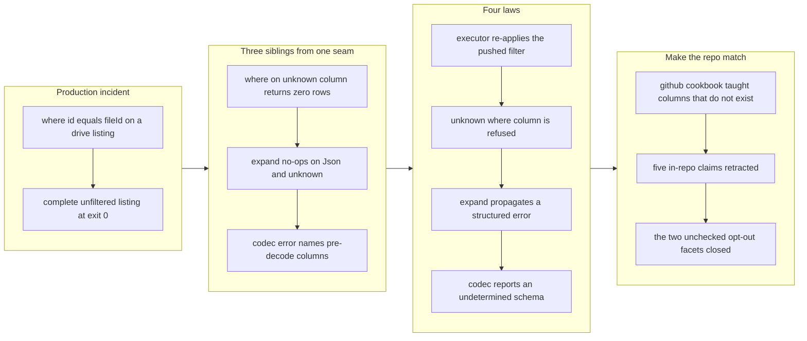

## 1. Overview

A query stage that cannot be honored must never be silently ignored. On 2026-07-23 the developer hit the sharpest form of that in production use: `where id == '<fileId>'` on a Google Drive folder listing returned the **complete unfiltered listing at exit 0**, so the predicate had no effect and the answer read as "these rows matched". This branch closes that seam and the three siblings it admitted — a `where` on an unknown column returning zero rows at exit 0, `expand` silently no-opping on Json and unknown columns, and a codec error naming the pre-decode columns instead of the real ones. A release-readiness pass then caught the branch teaching statements its own new laws refuse, and a genuine gap in the fix's own reach.

**Highlights:**

1. The read executor re-applies the pushed `where` over every batch a facet returns; facets opt out only by declaring `honors_pushed_filter` and applying their own truthful residual
2. An unknown column in a caller-written `where` is refused instead of matching nothing, so a typo and a legitimate empty result are finally distinguishable
3. `expand` propagates `NotExpandable` and `UnknownColumn` instead of passing the row through unchanged
4. A codec source reports an undetermined schema, so the error names the true post-decode columns rather than the pre-decode blob
5. The two facets that had opted out **unchecked** — `/s3` and `/r2`, and the `/cf` KV/queue/artifact branches — now check too, making acceptance item 1's "across all drivers" actually true

## 2. Motivation

In production use a wrong answer at exit 0 is consumed as a right one. A script branching on row count, or an agent inside the describe → preview → commit loop, cannot tell a typo from a legitimate empty result, nor an unfiltered listing from a filtered one. The declared-driver model routes ever more surfaces through one generic engine, so an engine that silently drops what a driver cannot push down poisons every declared driver at once — and conversely, making the pushdown seam honest fixes them all together. This is not a new feature; it is the engine keeping a promise it was already making.

## 3. Changes

The four laws landed first, one per ticket, each narrowing a place where a stage could mean nothing while the query still answered. A release-readiness pass then found that the branch had made the repository itself dishonest in two directions: shipped recipes now naming columns the binary refuses, and in-repo comments still asserting the exact rules the branch had reversed. The final three commits fix both, and close a gap in the reach of law 1 that the original ticket's facet inventory had missed.

### 3-1. Enforce the pushed WHERE at the read seam ([215d15c](https://github.com/qmu/qfs/commit/215d15c))

The read executor now re-applies `scan.pushed.filter` over every batch a facet returns, gated by a new `ReadDriver::honors_pushed_filter` that defaults to false. The five facets that opt out — because they narrow to a pushed projection or accept backend pseudo-columns — apply their own residual. Gmail and Drive had **computed** a residual and then discarded it, which is the reported defect; `/cf`'s KV and queue branches dropped the predicate outright.

### 3-2. Refuse a where on an unknown column ([96a4912](https://github.com/qmu/qfs/commit/96a4912))

The engine refuses an unknown column in a caller-written `where` against the schema the driver actually delivered. Empty and late-bound schemas stay lenient, and driver residuals stay lenient for search pseudo-columns. The SQL/D1 and GA compilers now validate `where` names against their catalogs the way they already validated `select` and `order by`.

### 3-3. Refuse an expand that cannot explode ([f133493](https://github.com/qmu/qfs/commit/f133493))

The engine `expand` kernel returns a `Result` instead of a `RowBatch`, propagating `NotExpandable` for a Json or scalar column and `UnknownColumn` for an absent one. Three swallow points are closed, and `Schema::expand`'s doc is corrected for the deliberate Unknown-column leniency that remains.

### 3-4. Report an undetermined schema after a codec ([be3a05c](https://github.com/qmu/qfs/commit/be3a05c))

`PlanSource::Codec` is split out of the schema-preserving arm and reports an always-empty (undetermined) schema. The expand, projection and transform folds stay late-bound over it, so the honest error now comes from the runtime over the decoded batch, carrying the true post-decode columns.

### 3-5. Teach only GitHub columns the driver has ([c8ae248](https://github.com/qmu/qfs/commit/c8ae248))

`docs/cookbook/github.md` documented a fabricated PR/issue column set — `author`, `merged_at`, `mergeable`, `review_decision`, `checks_status`, `requested_reviewers` and more, none of which exist in `driver-github/src/dto.rs`. Because `/github` declares `where=true` without `honors_pushed_filter`, law 1 turned six of those recipes from `rows: []` at exit 0 into hard exit-2 refusals — in an article mirrored verbatim into the installed `qfs-github` skill. The article is rewritten against the real schemas, a fabricated `review_requests` path and a collection-addressed `call github.merge` are removed, `CALL github.comment` becomes the real `INSERT INTO .../comments`, and all four plugin version fields take a minor bump so installed caches actually pick the correction up.

### 3-6. Retract the claims this branch falsified ([5abd89b](https://github.com/qmu/qfs/commit/5abd89b))

Five in-repo sites still asserted the pre-branch world: `codec/src/nested.rs` stated the language's `EXPAND` "never errors" and cited blueprint §4 for it; two codec tests were literally named for the passthrough contract; `concepts.md` and `getting-started.md` said a relational stage after a codec is rejected; three sites called codec stages schema-pass-through on an explicitly schema axis; and the blueprint claimed the schema is known at every seam. All corrected to describe what the code now does.

### 3-7. Check the two facets that opted out unchecked ([23bbf4b](https://github.com/qmu/qfs/commit/23bbf4b))

Acceptance item 1 claims the refusal holds across all drivers. It did not: `ObjReadDriver` (`/s3`, `/r2`) and the `/cf` KV-namespace, KV-key, queue, artifacts and artifact-repo branches declared `honors_pushed_filter` and then applied the predicate **unchecked**, so `where nosuchcol` there still answered `rows: []` at exit 0 — and the `/s3` object-download branch ignored the predicate entirely. All now call `refuse_unknown_where_column` first, with seven hermetic tests covering both directions per facet.

## 4. Outcome

All four acceptance items are met, and the fourth — the gdrive defect that started the mission — is gone in both directions. The engine now either honors a stage or refuses it with a structured error; the one remaining silent drop in the family, `select` on an unknown column, is a deliberate open decision with a ticket rather than an oversight.

The most valuable thing the branch produced beyond code is the discovery that its own repository had become a liar in two directions at once: shipped recipes teaching statements the binary refuses, and in-repo comments asserting the rules the branch had just reversed. Neither class is reachable by any test the repo runs.

## 5. Historical Analysis

- **The residual was computed and thrown away.** Gmail and Drive did not forget to filter — they built the correct residual predicate and then dropped it on the floor. A bug that looks like an omission was actually an unused value, which is why reading the driver rather than the symptom was what found it.
- **Opting out of a check must itself be checked.** `honors_pushed_filter` is a correct design, but the first cut treated "this facet applies its own residual" as equivalent to "this facet is safe". Two facets applied a residual that never validated its column names, and one applied none at all — the opt-out was trusted rather than verified.
- **The verified-true ratchet only proves recipes parse.** `crates/test/tests/cookbook_skills.rs` runs `parse_statement` over every cookbook recipe, which is exactly why six recipes naming non-existent columns shipped green for as long as they did. Parsing is not truth.
- **A behaviour change ages the prose that justified the old behaviour.** Five in-repo sites asserted the passthrough and pass-through-schema rules as documented law, one of them citing the blueprint as authority. Changing the law left them standing.

## 6. Concerns

### (carried from PR #1) Append-era duplicate rows persist on disk but resolve correctly

- **Severity:** low
- **Description:** Newest-per-key reads heal the append-era duplicates without re-install, but the rows remain physically on disk; `/sys/drivers` still offers only install/uninstall-by-name with no compaction (see [ddb419e](https://github.com/qmu/qfs/commit/ddb419e)).
- **How to Fix:** Implement a bundle-aware uninstall surface that removes superseded rows.

### (carried from PR #11) /local write materialization is narrow

- **Severity:** low
- **Description:** driver-local's applier still materializes a single blob under `CONTENT_COL`; this branch changed only the read path (see [3c6f995](https://github.com/qmu/qfs/commit/3c6f995)).
- **How to Fix:** Widen the local write surface to carry a multi-column payload.

### (carried from PR #11) Postgres/MySQL declarations for the declared-registry path are partial

- **Severity:** low
- **Description:** No `postgres.qfs` or `mysql.qfs` exists among the shipped declarations, and driver-sql has no comment coverage (see [3c6f995](https://github.com/qmu/qfs/commit/3c6f995)).
- **How to Fix:** Complete the Postgres/MySQL type and comment mappings on the declared-registry path.

### (carried from PR #18) Console bundle pin unset; live serve + release stamp pending the plgg bundle

- **Severity:** low
- **Description:** `PINNED_BUNDLE` remains a compile-time constant whose test still asserts `resolve_delivery` returns `Delivery::None` (see [72c8950](https://github.com/qmu/qfs/commit/72c8950)).
- **How to Fix:** Pin the console bundle once the plgg bundle carries a release stamp.

### (carried from PR #18) Owner-attended live verification backlog

- **Severity:** moderate
- **Description:** A standing queue of owner-attended live rounds that hermetic tests cannot replace (see [72c8950](https://github.com/qmu/qfs/commit/72c8950)). Notably the gdrive defect this branch fixes was itself only verified hermetically.
- **How to Fix:** Schedule the owner-attended rounds, starting with a live gdrive listing that reproduces the original report.

### (carried from PR #30) The `api` policy row gates MCP, dashboard, and reconcile alike

- **Severity:** low
- **Description:** The single `api` bridge policy row still gates the whole surface; `mcp.rs` and `provision.rs` both key off that one row and no per-client split exists (see [e7e44ee](https://github.com/qmu/qfs/commit/e7e44ee)).
- **How to Fix:** Split the `api` row into per-face gates.

### (carried from PR #32) qfs-runtime span-buffer test flakes under parallel workspace tests

- **Severity:** low
- **Description:** No test-isolation work landed on the shared span buffer; the runtime crate is absent from this branch's diff (see [22c61e4](https://github.com/qmu/qfs/commit/22c61e4)).
- **How to Fix:** Isolate the span buffer per test.

### (carried from PR #33) Declared-model and scheduling follow-ups

- **Severity:** low
- **Description:** Live Chatwork-encoding verification, OAuth-app plumbing and Slack threading are untouched (see [f1a3d21](https://github.com/qmu/qfs/commit/f1a3d21)).
- **How to Fix:** Execute the follow-up missions for the declared model and scheduling.

### (carried from PR #33) Scope cuts and monitored items

- **Severity:** low
- **Description:** Deliberate switch/PDF/stripper scope cuts with no recorded trigger condition (see [f1a3d21](https://github.com/qmu/qfs/commit/f1a3d21)).
- **How to Fix:** Record an explicit trigger for each cut so a fresh session can detect when it is due.

### (carried from PR #35) Policy-less or denied job re-fires every sweep

- **Severity:** low
- **Description:** `sweeper.rs` still resolves a policy-less or dangling reference to a deny and records `CronOutcome::Denied` per firing with no suppression of the next sweep (see [c30fa0a](https://github.com/qmu/qfs/commit/c30fa0a)).
- **How to Fix:** Add back-off or quarantine semantics for denied jobs.

### (carried from PR #39) Slack workspace-namespace still advertises Verb::Rm with no query grammar

- **Severity:** low
- **Description:** `SlackNode::Files` still lists `Verb::Rm` while the taught delete form is `Verb::Remove` on the single-file node (see [3dae249](https://github.com/qmu/qfs/commit/3dae249)).
- **How to Fix:** Drop the namespace-level advertisement, or give it a grammar.

### (carried from PR #41) `cd` into a blob file is still admitted

- **Severity:** low
- **Description:** driver-local's describe ignores its path argument entirely and returns `BlobNamespace` for every path, so no describe-time gate refuses a `cd` into a blob file (see [7752cb3](https://github.com/qmu/qfs/commit/7752cb3)).
- **How to Fix:** Refuse `namespace=BlobNamespace` at `cd` time in describe.

### (carried from PR #41) `/sys` and `/slack` do not describe their roots, so `cd` there fails before the gate

- **Severity:** low
- **Description:** `node_for_path` strips a required `/sys/` prefix so a bare `/sys` yields `None`, and `SlackPath::parse` likewise rejects the bare root (see [7752cb3](https://github.com/qmu/qfs/commit/7752cb3)).
- **How to Fix:** Add a root-level describe for both drivers so the cd gate is reachable.

### (carried from PR #41) The `/type` catalog and the type resolver translate the stored key differently

- **Severity:** low
- **Description:** `type_catalog.rs` reads registry rows by kind while driver-type resolves types by reference name; the divergence stands as an unwritten encoding rule (see [7752cb3](https://github.com/qmu/qfs/commit/7752cb3)).
- **How to Fix:** Write the encoding rule down and unify it across catalog and resolver.

### (carried from PR #2) shared_connection and broker_connection homing is the same question, deferred

- **Severity:** low
- **Description:** Both registries are still defined in the Project DB schema with no re-homing migration; M9 territory (see [974c72d](https://github.com/qmu/qfs/commit/974c72d)).
- **How to Fix:** Schedule the M9 work, or rule the homing strategy separately.

### (carried from PR #2) The dead Project-DB config tables await their drop migration

- **Severity:** low
- **Description:** `path_binding` and `connection_consent` are still physically created in the Project DB schema; only `project_drop_active_account.sql` exists (see [974c72d](https://github.com/qmu/qfs/commit/974c72d)).
- **How to Fix:** File the drop migration once a release containing the boot copy has booted live.

### (carried from PR #23) Live proof of the session case deferred on host disk

- **Severity:** moderate
- **Description:** Resource contention, not code; nothing on this branch frees host disk or re-runs the container round (see [9241270](https://github.com/qmu/qfs/commit/9241270)).
- **How to Fix:** Reclaim disk and re-run the containerised live round.

### (carried from PR #22) Golden/anti-drift crate not exercised by per-crate runs

- **Severity:** moderate
- **Description:** Nothing here changes the test-runner topology or adds a golden-crate trigger to per-crate runs (see [8bc902d](https://github.com/qmu/qfs/commit/8bc902d)).
- **How to Fix:** Make the golden crate part of any per-crate run's scope, or forbid per-crate substitution at the gate.

### (carried from PR #21) G1 read-over-POST spelling required refinement during implementation

- **Severity:** moderate
- **Description:** The ask is a blueprint §13.1 rationale note; no docs change on this branch addressed it (see [f52592b](https://github.com/qmu/qfs/commit/f52592b)).
- **How to Fix:** Record the AST-churn rationale in the blueprint and give the process directive a trigger.

### (carried from PR #21) G7 and G8 parks create scoping risk for downstream conversions

- **Severity:** moderate
- **Description:** G7 and G8 remain named parks with no follow-up mission names or trigger conditions (see [f52592b](https://github.com/qmu/qfs/commit/f52592b)).
- **How to Fix:** Name the follow-up mission for each park, or record the trigger that reopens it.

### The cookbook ratchet only parses, so it cannot catch a fabricated column

- **Severity:** moderate
- **Description:** `crates/test/tests/cookbook_skills.rs` asserts every cookbook recipe **parses** and nothing more, which is exactly why six `/github` recipes naming columns the driver does not carry shipped green — and why this branch's law 1 turned them into exit-2 refusals in an article mirrored verbatim into the installed skill (see [c8ae248](https://github.com/qmu/qfs/commit/c8ae248) in `docs/cookbook/github.md`). The ratchet's promise is that a skill can never teach a statement the binary rejects; today it only guarantees the statement is well-formed.
- **How to Fix:** Raise the ratchet from parse-only to a typecheck against the compiled describe registry, with an explicit skip report so a silent skip cannot read as green. Ticketed at `20260725143000-cookbook-ratchet-only-parses-it-must-typecheck.md`.

### `select` on an unknown column is still silently dropped

- **Severity:** moderate
- **Description:** `where` and `expand` now refuse an unknown column, and `/sql` already refused one in `select`, but the generic engine still drops an unknown `select` column silently — an only-unknown projection returns the row count with an empty schema (see [c6f531c](https://github.com/qmu/qfs/commit/c6f531c)). This is the last member of the defect family this mission set out to close, and the behaviour is already inconsistent between drivers today.
- **How to Fix:** Rule it — refuse, consistent with `where`/`expand` and with `/sql`, or keep the documented silent drop as deliberate leniency over heterogeneous and late-bound relations. The judgement, not the code, is the cost. Ticketed at `20260725113000-select-on-an-unknown-column-is-silently-dropped.md`.

### `of` compares against the empty codec schema

- **Severity:** low
- **Description:** `check_of_assertion` does column-name-set equality with no empty-schema leniency, unlike the `select`/`where`/`expand`/transform-input folds this branch deliberately made lenient — so `|> decode md |> of <type>` now compares against the undetermined schema law 4 introduces (see [be3a05c](https://github.com/qmu/qfs/commit/be3a05c) in `crates/core/src/eval.rs`).
- **How to Fix:** Decide between the same leniency and an explicit structured refusal, and implement it. Ticketed at `20260725143200-of-assertion-compares-against-the-empty-codec-schema.md`.

### The troubleshooting surface under-describes the new refusals

- **Severity:** low
- **Description:** `docs/cookbook/faq.md` describes exit 2 as "parse or CLI usage error (a relative path, a bad flag)" and its error table lists no `unknown_column` or `not_expandable` row, though both new refusals are `ErrorKind::Usage` and therefore exit 2 (see [96a4912](https://github.com/qmu/qfs/commit/96a4912)). The troubleshooting skill now under-describes the most likely error this branch produces.
- **How to Fix:** Add both rows and widen the exit-2 description. Ticketed at `20260725143100-faq-under-describes-exit-2-and-the-new-refusals.md`.

### A codec pipeline's missing column is now caught after PREVIEW rather than before it

- **Severity:** low
- **Description:** Because a codec source reports an undetermined schema, a post-decode stage naming a missing column is rejected when the codec tail evaluates rather than at plan time, so a transform-bearing pipeline fails after `PREVIEW` instead of before it (see [be3a05c](https://github.com/qmu/qfs/commit/be3a05c)). No effect is applied and the tail evaluates in order — an `expand` ahead of a `transform` still fails before any model call — so this is a timing change, not a safety one.
- **How to Fix:** Decide whether to teach the planner the decoded schema so the check moves back to plan time, accepting the coupling that introduces.

## 7. Successful Development Patterns

- **Read the driver, not the symptom.** The gdrive report looked like a missing filter; the driver was in fact computing the correct residual and discarding it. The distinction between "never built" and "built and dropped" is invisible from the outside and decided the shape of the fix.
- **Make the opt-out prove itself.** `honors_pushed_filter` is the right seam, but a facet asserting it applies its own residual is a claim, not a guarantee. Auditing every claimant found two applying an unvalidated residual and one applying none — the check on the checkers found more than the original defect.
- **Run the release-readiness pass against the branch's own claims, not just its diff.** Two of this branch's three follow-up commits fixed statements — shipped recipes and in-repo comments — that the code change had quietly falsified. No test in the repository can catch that class, and neither can a diff review that only looks at what changed.
- **A silent drop is worth a ticket even when you know the answer you prefer.** `select` on an unknown column was deliberately left open rather than settled in passing, because the inconsistency is already visible to users across drivers and the decision outlives this branch.

## 8. Release Preparation

**Verdict**: Ready for release

### 8-1. Concerns

- The branch-safety scan reports `verdict=block`, but every finding is size-only (`override` tier): `ac7a4c7` 1003 lines, `96a4912` 787, `215d15c` 594, against a 500 non-generated threshold. No `hard` (secret) or `confirm` (leak) findings, and the known `let token = source` false-positive class did not appear.
- This branch changes user-visible behaviour that was previously a silent success. That is the point, and qfs is pre-release, so the hard break is correct — but it means an operator upgrading will see previously-passing queries begin to refuse.
- `doc-drift.sh` returned zero structural candidates. Every documentation defect corrected here was found by judging the diff against the taught surface, not by the script.

### 8-2. Pre-release Instructions

- Accept the size override consciously at `/ship` for `ac7a4c7`, `96a4912` and `215d15c`. These are three coordinated behaviour changes with their test suites; splitting them would separate a law from its proof.
- The plugin is bumped minor (0.15.0 → 0.16.0) because `docs/cookbook/github.md` was rewritten and regenerates `qfs-github/SKILL.md`. Without that bump, installed caches keep teaching six recipes the binary now refuses.

### 8-3. Post-release Instructions

- Land the cookbook typecheck ratchet (`20260725143000`) before the next cookbook-touching branch — it is the guard that would have caught this branch's own worst defect.
- Rule the `select`-on-unknown-column decision (`20260725113000`); until it lands, the family this mission closed still has one silent member.
- Re-verify the original gdrive report live: `where id == '<fileId>'` on a folder listing should now return one row, and the fix has only ever been proven hermetically.

## 9. Notes

Generated by an unattended `/monitor` run (run-id `20260725-101714`). Commits `c8ae248`, `5abd89b`, `23bbf4b` and `97bf6db` were produced after the four mission tickets closed, in response to a release-readiness pass that returned `releasable: false`; `23bbf4b` in particular closes a gap that made acceptance item 1's "across all drivers" untrue when the run started.

The deferred-concern corpus stands at 20 active after four were judged resolved. The judge additionally proposed a compound — `cd-into-a-blob-file-is` + `sys-and-slack-do-not-describe`, suggested severity moderate, on the argument that `cd` is dishonest in both directions from one seam (a `cd` into a file is wrongly admitted while a `cd` into a genuine namespace is wrongly refused, both fixable by the same describe-time archetype gate, and both the same class of silent dishonesty this mission exists to eliminate). Compound merges are developer-decided, so it was **not** applied; it is recorded here and in the run report for a manual `/report` triage. The corpus is also over the triage threshold, which the same unattended constraint left for that pass.

A sibling branch in this run (`work-20260724-011032`, PR #25) re-graded `policy-less-or-denied-job-re` and `the-api-policy-row-gates-mcp` from low to moderate on its own evidence. This branch carries them at their original low, so those two concern files will conflict on merge; keep the moderate grade.
