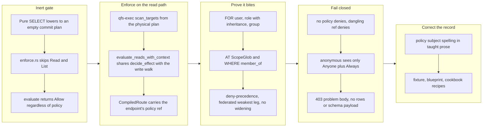

## 1. Overview

qfs's policy enforcement was inert on data reads: a pure `SELECT` lowered to an empty commit plan, the enforcer had nothing to adjudicate, and every readable path stayed readable by everyone regardless of policy. The principal the predecessor mission resolved was threaded to the executor but never consulted. This branch closes the authorization gap by making the serve read path evaluate `SELECT` against the endpoint's resolved policy under the real actor before any driver scan, proves every grant axis admits the matching actor and denies the non-matching one on reads, and proves fail-closed denial.

**Highlights:**

1. The policy gate now evaluates `SELECT` against the endpoint's policy on every serve read, before the driver scan
2. Every grant axis — `FOR` user/role/group, `AT` path scope, `WHERE member_of` — proven to bite on reads in both directions
3. Fail-closed matrix frozen: no-policy and dangling-policy-ref both deny; anonymous sees only `Anyone`+`Always` grants
4. A denied read returns a structured, secret-free 403 refusal rather than a silent empty relation
5. A release-readiness pass caught and corrected four things this branch itself falsified or mis-taught

## 2. Motivation

The predecessor mission delivered "who am I": every request resolves to a named principal or the first-class not-signed-in answer, on the path a query takes. This mission is the enforcement half — making "what can I see and do" derive from that principal rather than from whether the request happened to carry a write. The gate's inertness on reads was not a missing feature but a structural accident: `enforce.rs` classified only write/CALL effects, so a pure read lowered to an empty commit plan and `evaluate` returned `Allow` unconditionally. Any operator who attached a policy to a read endpoint got a document that described an intention the runtime never enforced.

## 3. Changes

The branch moved in three enforcement steps and then a correction pass. The gate landed first, over scan targets derived from the physical plan rather than the logical one — a pure read has no plan nodes to classify, so the adjudication had to hang off what actually executes. Proving it came next, both directions on every axis, at the enforcer level rather than the HTTP seam because the request principal carries only the user axis. Fail-closed behaviour was frozen as a decision matrix. Finally a release-readiness pass found four in-repo claims the branch had falsified, and corrected them.

### 3-1. Enforce policy on the serve read path ([be62a69](https://github.com/qmu/qfs/commit/be62a69))

The serve read path now evaluates `SELECT` against the endpoint's resolved policy with the real actor before any driver scan runs. Adds `evaluate_reads_with_context`/`ReadTarget` in qfs-server sharing `decide_effect` with the write walk, and `scan_targets` in qfs-exec. Along the way it fixes a real defect: the request-time gate resolved policy by endpoint **name**, while registration used the endpoint's policy **ref**, so a policy not named after its endpoint applied at registration and silently not at request time. The ratchet test `select_only_plan_is_allowed_even_under_empty_policy` is inverted to pin the new law.

### 3-2. Prove every grant axis bites on reads ([fa2ffcd](https://github.com/qmu/qfs/commit/fa2ffcd))

Eight hermetic read-side matrices: `FOR` user; `FOR` role including inherited `owner ⊃ member`; `FOR` group; `AT ScopeGlob`; `WHERE member_of` through the existing `MembershipResolver` seam; deny-precedence on reads; a federated multi-target read denying on its weakest leg; and the `ALLOW ALL` never-grants-`REMOVE`/`CALL` regression.

### 3-3. Prove fail-closed and structured denial on reads ([9623d6f](https://github.com/qmu/qfs/commit/9623d6f))

No-policy denies, dangling-policy-ref denies, and an anonymous caller sees only `Anyone`+`Always` grants — while an unscoped `ALLOW SELECT` still answers the signed-out request with 200. Freezes a nine-row write-side decision matrix pinning no-widening and classification totality, and asserts at the serve level that a denied read is a 403 problem body carrying no rows, no schema payload and no secret markers, contrasted against a granted 200 rows envelope.

### 3-4. Correct the policy prose, fixture, and blueprint ([50069b2](https://github.com/qmu/qfs/commit/50069b2))

Four corrections found by the release-readiness pass. The taught prose said `create policy … for user:alice`, but `policy_for_clause` parses the **space** form `FOR user alice` — the colon form is only the stored `/sys/policies` rule-string label (`Subject::from_label`), and the two are not interchangeable; the source prose and `render_server()` were fixed and the generated `docs/server.md` and `qfs-automation/SKILL.md` regenerated. The `watchtower.qfs` fixture still claimed a read-only endpoint "needs no POLICY" — now corrected the way its sibling `server_boot.qfs` was in this same branch, with an e2e assertion so the drift cannot recur silently. Two blueprint claims that this branch falsified were rewritten. And five policy-less endpoint recipes in `docs/query-cookbook.md` gained policy clauses.

## 4. Outcome

The policy gate is active on data reads. A request's `SELECT` is evaluated against the endpoint's attached policy with the resolved principal before any driver scan, closing the gap where knowing who was asking granted everything readable to everyone. Every grant axis is proven in both directions; fail-closed is proven across three resolution shapes; and a policy-denied read surfaces as a structured 403 refusal rather than an empty relation, so an authorization failure can never be misdiagnosed as data absence.

The mission's three acceptance items are complete. One follow-up was minted rather than fixed in place — the statement bridge's read leg is a second, wider serve read face that survives the endpoint gate — because closing it needs a product answer this mission's scope ruling forbids settling as a side effect.

## 5. Historical Analysis

- **A pure read produces an empty plan, not a plan of Read nodes.** The intuitive fix — classify `Read` as `SELECT` in the effect walk — would have gated every write's read dependencies while leaving pure reads ungated. The gate had to hang off scan targets derived from the physical plan.
- **Request-time policy lookup had diverged from registration-time.** The gate looked up policy by endpoint *name* while registration used the endpoint's policy *ref*. That divergence was invisible while reads were ungated; turning enforcement on exposed it.
- **`scan_targets` and the read execution path must stay adjacent.** Both deliberately reuse planning steps instead of re-deriving them. Drift between them silently opens a hole where the gate adjudicates different paths than the driver scans.
- **Fixture prose is specification.** The boot fixtures' comments are counted against by tests; correcting one moved several independent audit-entry-count assertions.
- **Read-side axis tests belong at the enforcer, not the HTTP seam.** The request principal seam carries only the user axis, so role/group/membership cases cannot inject identity at the HTTP level.
- **A federated read is only as granted as its weakest leg** — the gate denies on the first ungranted scan target, so a cross-service JOIN cannot route around a per-driver grant.

## 6. Concerns

### (carried from PR #1) Append-era duplicate rows persist on disk but resolve correctly

- **Severity:** low
- **Description:** Newest-per-key reads heal the operator's append-era duplicate rows without re-install, but the rows remain physically on disk (see [ddb419e](https://github.com/qmu/qfs/commit/ddb419e)). Untouched by this branch, which changed only the serve read path.
- **How to Fix:** Implement a bundle-aware uninstall surface that removes superseded rows.

### (carried from PR #11) /local write materialization is narrow

- **Severity:** low
- **Description:** driver-local's applier still materializes a single blob under `CONTENT_COL`; no multi-column payload path exists (see [3c6f995](https://github.com/qmu/qfs/commit/3c6f995) in `crates/driver-local/src/applier.rs`).
- **How to Fix:** Widen the local write surface to carry a multi-column payload.

### (carried from PR #11) Postgres/MySQL declarations for the declared-registry path are partial

- **Severity:** low
- **Description:** The re-homing ticket this waited behind shipped, but the work has not: sql and git still ride the declared-connection seam and column-type/comment coverage is unchanged (see [3c6f995](https://github.com/qmu/qfs/commit/3c6f995)).
- **How to Fix:** Complete the Postgres/MySQL type and comment mappings in the declared registry.

### (carried from PR #18) Console bundle pin unset; live serve + release stamp pending the plgg bundle

- **Severity:** low
- **Description:** `resolve_delivery` still returns `Delivery::None` on an empty `sha256_hex`, and `console.rs:320` asserts exactly that, so `PINNED_BUNDLE` remains unset (see [72c8950](https://github.com/qmu/qfs/commit/72c8950)).
- **How to Fix:** Pin the console bundle once the plgg bundle carries a release stamp.

### (carried from PR #18) Owner-attended live verification backlog

- **Severity:** moderate
- **Description:** A standing queue of owner-attended live rounds; none can be discharged by hermetic code work, and this branch is entirely hermetic (see [72c8950](https://github.com/qmu/qfs/commit/72c8950)).
- **How to Fix:** Schedule and execute the owner-attended live rounds for each remaining surface.

### (carried from PR #30) The `api` policy row gates MCP, dashboard, and reconcile alike

- **Severity:** moderate
- **Description:** Re-graded from low this run. `mcp.rs` still resolves ONE policy row named `api` as the statement-bridge handle, and `dashboard.rs` explicitly reuses the same default-deny gate — so an operator who grants it for one client grants it to all. Commit [4ce511e](https://github.com/qmu/qfs/commit/4ce511e) establishes that the bridge read leg resolves no policy at all under a hardcoded anonymous principal while the endpoint face is now fail-closed, so the per-face drift this concern names is demonstrated rather than suspected, and the asymmetry is easy to mistake for coverage.
- **How to Fix:** Split the `api` row into per-face gates so a grant for one client is not a grant for every non-endpoint face.

### (carried from PR #32) qfs-runtime span-buffer test flakes under parallel workspace tests

- **Severity:** low
- **Description:** No span-buffer isolation was added; the runtime crate is not in this branch's diffstat (see [22c61e4](https://github.com/qmu/qfs/commit/22c61e4)).
- **How to Fix:** Isolate the span buffer per test to stop the flake under parallel execution.

### (carried from PR #33) Declared-model and scheduling follow-ups

- **Severity:** low
- **Description:** Live Chatwork-encoding verification, OAuth-app plumbing and Slack threading are all untouched (see [f1a3d21](https://github.com/qmu/qfs/commit/f1a3d21)).
- **How to Fix:** Execute the follow-up missions for the declared model and scheduling.

### (carried from PR #33) Scope cuts and monitored items

- **Severity:** low
- **Description:** Deliberate switch/PDF/stripper scope cuts with no trigger condition recorded, and no prerequisite landed on this branch (see [f1a3d21](https://github.com/qmu/qfs/commit/f1a3d21)).
- **How to Fix:** Record an explicit trigger condition for each scope cut so a fresh session can detect when it is due.

### (carried from PR #35) Policy-less or denied job re-fires every sweep

- **Severity:** moderate
- **Description:** Re-graded from low this run. `sweeper.rs` still has no back-off for denied jobs (see [c30fa0a](https://github.com/qmu/qfs/commit/c30fa0a)). This branch materially raises the odds of hitting it: enabling `SELECT` enforcement is a declared hard break in which every previously-passing policy-less read now denies, so any scheduled job whose query is a pure read becomes a permanently-denied job that re-fires on every sweep after upgrade.
- **How to Fix:** Add back-off or quarantine semantics for denied jobs, and surface policy-less scheduled reads at upgrade so an operator can attach a policy before the first sweep.

### (carried from PR #39) Slack workspace-namespace still advertises Verb::Rm with no query grammar

- **Severity:** low
- **Description:** `SlackNode::Files` still advertises `Verb::Rm`, while the taught detach form resolves to `SlackNode::File` and `Verb::Remove` — a different node and verb — so the namespace-level `Rm` remains grammar-less (see [3dae249](https://github.com/qmu/qfs/commit/3dae249)).
- **How to Fix:** Drop the namespace-level `Verb::Rm` advertisement, or give it a grammar.

### (carried from PR #41) `cd` into a blob file is still admitted

- **Severity:** low
- **Description:** driver-local still returns `BlobNamespace` unconditionally from pure describe; no describe-time gate was added (see [7752cb3](https://github.com/qmu/qfs/commit/7752cb3)).
- **How to Fix:** Refuse `namespace=BlobNamespace` at `cd` time in describe.

### (carried from PR #41) `/sys` and `/slack` do not describe their roots, so `cd` there fails before the gate

- **Severity:** low
- **Description:** Bare `/slack` still errors in `SlackPath::parse` before any cd gate, and driver-sys describes only its named tables, not the root node (see [7752cb3](https://github.com/qmu/qfs/commit/7752cb3)).
- **How to Fix:** Add a root-level describe for both drivers so the cd gate is reachable.

### (carried from PR #41) The `/type` catalog and the type resolver translate the stored key differently

- **Severity:** low
- **Description:** The path-form vs reference-name divergence for `sys_drivers kind='type'` rows still stands as an unwritten encoding rule (see [7752cb3](https://github.com/qmu/qfs/commit/7752cb3) in `crates/qfs/src/type_catalog.rs`).
- **How to Fix:** Write the encoding rule down and unify it across catalog and resolver.

### (carried from PR #2) shared_connection and broker_connection homing is the same question, deferred

- **Severity:** low
- **Description:** Explicitly deferred to the Managed Team (M9) work, which has not returned (see [974c72d](https://github.com/qmu/qfs/commit/974c72d)).
- **How to Fix:** Schedule the M9 work, or rule the homing strategy separately.

### (carried from PR #2) The dead Project-DB config tables await their drop migration

- **Severity:** low
- **Description:** The schema still carries `project_path_bindings.sql`, and neither `path_binding` nor `connection_consent` is dropped (see [974c72d](https://github.com/qmu/qfs/commit/974c72d)). The sequencing precondition is a deployment event this branch does not supply.
- **How to Fix:** File the drop migration once a release containing the boot copy has booted live.

### (carried from PR #23) Live proof of the session case deferred on host disk

- **Severity:** moderate
- **Description:** Blocked on host disk, which no code change on this branch clears; the container re-run is still owed (see [9241270](https://github.com/qmu/qfs/commit/9241270)).
- **How to Fix:** Reclaim disk and re-run the containerised live round.

### (carried from PR #22) Golden/anti-drift crate not exercised by per-crate runs

- **Severity:** moderate
- **Description:** A standing process gap in how per-crate runs are scoped (see [8bc902d](https://github.com/qmu/qfs/commit/8bc902d)). This branch's own verification was a full `cargo test --workspace`, which is the mitigation the concern prescribes, but the underlying gap is untouched.
- **How to Fix:** Make the golden crate part of any per-crate run's scope, or forbid per-crate substitution at the gate.

### (carried from PR #21) G1 read-over-POST spelling required refinement during implementation

- **Severity:** moderate
- **Description:** The blueprint text recording the pipe-stage refinement predates the concern and does not spell out the AST-churn rationale the fix asks for; the larger process half has no trigger condition (see [f52592b](https://github.com/qmu/qfs/commit/f52592b)).
- **How to Fix:** Record the AST-churn rationale in the blueprint and give the process directive a trigger condition.

### (carried from PR #21) G7 and G8 parks create scoping risk for downstream conversions

- **Severity:** moderate
- **Description:** G7 and G8 are still parks in the blueprint with no follow-up mission names and no trigger conditions, so a fresh session cannot detect their absence (see [f52592b](https://github.com/qmu/qfs/commit/f52592b)).
- **How to Fix:** Name the follow-up mission for each park, or record the trigger that reopens it.

### The statement bridge's read leg is ungated

- **Severity:** moderate
- **Description:** `POST /api/run` with `{"mode":"read"}` parses a caller-supplied statement and runs it through `qfs_exec::block_on_read` with no policy resolution and a hardcoded `RequestContext::anonymous()` — strictly wider than the endpoint face this branch just closed, so a caller refused by an endpoint policy can read the same path through the bridge (see [4ce511e](https://github.com/qmu/qfs/commit/4ce511e) in `crates/qfs/src/dashboard.rs` and `mcp.rs`). Pre-existing and not a regression, mitigated only by the loopback-only default bind — which is a deployment posture, not an authorization control. Ticketed at `.workaholic/tickets/todo/a-qmu-jp/20260725110500-gate-the-statement-bridge-read-leg.md`.
- **How to Fix:** Decide which policy governs the bridge — a named bridge policy row, a setting, or the operator-local super-admin posture — then resolve and enforce it on the read leg the way the endpoint face now does.

### No driver narrows rows at the source

- **Severity:** low
- **Description:** The gate adjudicates whole scan targets ahead of the scan. `ReadDriver::scan` does receive a `&RequestContext` (the M2 principal seam, present on main as well), but no driver consults it to narrow rows at the source, so there is no row-level who-axis inside a driver (see [be62a69](https://github.com/qmu/qfs/commit/be62a69)).
- **How to Fix:** Design per-driver row-level narrowing, or record in the blueprint why it stays a non-goal.

## 7. Successful Development Patterns

- **Adjudicate what executes, not what parses.** A pure read's empty commit plan made the logical plan the wrong place to gate; hanging the gate off scan targets derived from the physical plan is what made whole-path enforcement possible. When a check has no work to do, check whether it is looking at the wrong structure.
- **Sharing one decision function across both walks prevents divergence.** `evaluate_reads_with_context` reuses `decide_effect` from the write walk rather than reimplementing grant matching, so read and write can never drift into two different notions of what a grant means.
- **Both-directions axis tests expose seam limits.** Testing only the admit case would have passed; testing the deny case too revealed that role, group and membership identity cannot be injected through the HTTP request principal, which relocated the whole matrix to the enforcer level where it belongs.
- **Freeze no-widening as a matrix, not as prose.** The nine-row `(policy, plan) → allowed?` table proves read enforcement did not leak into writes, and it stays true under revision in a way a paragraph does not.
- **A release-readiness pass is worth running against your own claims, not just your diff.** Four of this branch's defects were statements — a taught spelling, a fixture comment, two blueprint claims — that the code change had quietly falsified. None would have been caught by a test.

## 8. Release Preparation

**Verdict**: Ready for release

### 8-1. Concerns

- The branch-safety scan reports `verdict=block`, but the sole finding is size-only (severity `override`): commit `be62a69` carries 878 non-generated changed lines against a 500 threshold. No credential (`hard`) and no client-terminology (`confirm`) findings. It is one coherent enforcement change — the gate plus its hermetic proof suite — which is what the override tier exists for.
- The statement bridge's read leg ships ungated (section 6). Pre-existing and not a regression, but the asymmetry against the now-fail-closed endpoint face is the widest remaining serve-face read.
- `doc-drift.sh` returned zero structural candidates. The four doc corrections in `50069b2` were found by judging the diff, not by the script.

### 8-2. Pre-release Instructions

- Accept the size override consciously at `/ship`: `be62a69` is 878 non-generated lines, one coherent change, with no secret or leakage finding behind it.
- This is a **declared hard break**: an endpoint with no attached policy now returns 403 where it previously returned rows. The plugin version is bumped MINOR (0.15.0 → 0.16.0) rather than patch precisely because the shipped cookbook recipe `create endpoint … as …` with no policy now denies — a taught-surface break that needs to reach installed skill caches.

### 8-3. Post-release Instructions

- Keep `20260725110500-gate-the-statement-bridge-read-leg.md` at the head of the queue: the endpoint face is default-deny while the `POST /api/run` read leg is not.
- Verify after publish that `qfs --version` reports 0.0.90 and that the installed plugin cache picks up `qfs-automation` at 0.16.0 — the MINOR bump only helps if the regenerated skill, with the corrected `FOR user alice` spelling, is what ships.

## 9. Notes

Generated by an unattended `/monitor` run (run-id `20260725-101714`). The deferred-concern corpus stands at 20 active after this run archived 4 as resolved. Two carried concerns were re-graded low → moderate on this branch's own evidence, through `re-grade.sh` so the grade history stays auditable.

The concern judge additionally proposed a compound — `the-api-policy-row-gates-mcp` + `owner-attended-live-verification-backlog`, suggested severity **urgent**, on the argument that an unverified bearer gate is the sole control over an ungated statement-arbitrary read path whose sibling faces share one all-or-nothing policy row. Compound merges are developer-decided, so it was **not** applied; it is recorded here and in the run report for a manual `/report` triage. The corpus is also over the triage threshold (20 active), which the same unattended constraint left for that pass.
