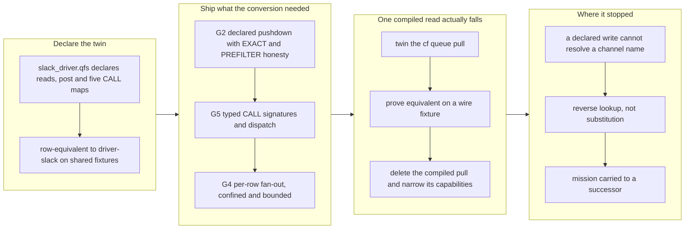

## 1. Overview

"Connect a new service by writing a declaration, not by compiling a Rust driver" stays a slogan until a compiled service driver actually falls. This branch was the first attempt at that fall, on Slack. It declared the whole Slack read surface and proved it row-equivalent to the compiled driver on hermetic fixtures, shipped the three blueprint capabilities the conversion needed, and **did** retire one compiled surface — the `/cf` queue-pull, twinned, proven equivalent on a wire fixture, then deleted. It did not retire `driver-slack`: a declared write cannot turn `#general` into a channel id, and the reason is structural rather than incidental.

**Highlights:**

1. `slack_driver.qfs` declares the whole Slack read surface plus post and five typed CALL maps, row-equivalent to `driver-slack` on shared fixtures — DM read over POST included
2. Blueprint §13.1 **G2** declared PUSHDOWN shipped end to end, with EXACT/PREFILTER residual honesty so a strict bound is re-excluded locally rather than silently loosened
3. **G5** typed CALL signatures plus declared-CALL dispatch — and a lexer fix for a bug that had left `slack.update` and `slack.delete` advertised but **uncallable since v0.0.89**
4. **G4** per-row fan-out `|> FOLLOW <field> INTO /http/<drv>/<template>`, confinement re-checked per row, capped at 50 and **refusing rather than truncating**
5. The compiled `/cf` queue-pull is gone — the first compiled read this project has actually retired, and its capability set correctly narrowed with it

## 2. Motivation

The declared-driver strategy's whole claim is that adding a service should not require shipping a new binary. Slack was the playbook's chosen first fall because its quirks are the mildest and its compiled driver had just been hardened, so the behaviour the twin must reproduce was freshly pinned. The `/cf` queue-pull rode along because §13.3's honest-tiering table listed it as the one exception whose reason was "not yet done" rather than "cannot be done" — G1 had already removed its wall, so leaving it listed would have made the table lie.

## 3. Changes

The order was deliberate: declare, prove, then delete. The compiled driver is the oracle an equivalence proof compares against, so retiring it before the proof would destroy the evidence. That ratchet held — `/cf`'s queue-pull passed and fell; Slack's did not pass, so `driver-slack` stayed.

### 3-1. Declare the slack twin with G2 pushdown ([ecc89b3](https://github.com/qmu/qfs/commit/ecc89b3))

`slack_driver.qfs` declares the Slack read surface — channels, message logs, replies, reactions, files, users, and the DM read that rides G1's read-over-POST because `conversations.open` is a POST that returns the channel. Five hermetic tests prove each declared read row-equivalent to the compiled driver, with `oldest`/`latest`/`limit` each asserted at the wire URL. Shipping it required implementing §13.1 **G2** declared PUSHDOWN end to end: the grammar on `CREATE VIEW` and `CREATE DRIVER`, a System DB migration adding `sys_drivers.pushdown`, and predicate lowering that tags each mapping EXACT or PREFILTER — Slack's bounds are inclusive, so `>=`/`<=` mean the predicate exactly while a strict `>`/`<` is pushed as a looser prefilter and the conjunct is **kept** so the engine re-excludes the boundary row locally.

### 3-2. Retire the compiled /cf queue pull ([0277d9f](https://github.com/qmu/qfs/commit/0277d9f))

The declared `/cloudflare` queue-pull twin was written as a read-over-POST view and proven row-equivalent to the compiled `HttpApiBackend::queue_pull` on a shared wire fixture **before** anything was deleted. Then the compiled pull went: the trait method, the HTTP implementation, the mock arm, the `QueueMsg` DTO, `CfDriver::queue_tail`, `RecordedCall::QueuePull` and the `/cf` queue read facet — and the compiled queue capability set narrowed from `{INSERT, SELECT}` to `{INSERT}`, so the advertisement fell with the capability. Blueprint §13.3 records the exception closed. The plugin took a minor bump because this changed the `qfs-cloudflare` taught surface.

### 3-3. Add typed CALL signatures to declared maps ([362c499](https://github.com/qmu/qfs/commit/362c499))

§13.1 **G5**: `CREATE MAP CALL <drv>.<action> ( <param> <type>, … )`, with the signature rendered into the stored verb label so no schema change was needed. Two lexer facts forced themselves out along the way, both structural rather than guessed: a `/` after `)` is ordinarily division, so a path following a signature did not lex as a path; and a procedure name may collide with a frozen keyword. A test asserts the declared `ProcSig` list equals the compiled `SlackDriver::procedures()` exactly — name, parameter names, types, irreversibility.

### 3-4. Dispatch declared CALL maps to the wire ([73fa5de](https://github.com/qmu/qfs/commit/73fa5de))

Declared-CALL dispatch wired in `apply_facets`, selecting the map by the action the call names and taking the wire verb from the map body. Five wire-equivalence tests drive each shipped CALL map through the full commit stack and its compiled twin through the real client over a recording transport, asserting equal method, endpoint and payload. Three negative cases cover the distinct signature shapes. This is also where the `slack.update` / `slack.delete` parse gap surfaced: the action name read as an identifier, so a keyword-shaped action never parsed — **the compiled driver had been advertising two procedures nobody could call since v0.0.89**.

### 3-5. Add per-row FOLLOW INTO fan-out ([365d521](https://github.com/qmu/qfs/commit/365d521))

§13.1 **G4**: `|> FOLLOW <field> INTO /http/<drv>/<template>` issues one templated detail request per delivered row and splices the result back. Confinement is re-checked **per row**, not once for the first fetch. The fan-out is bounded at 50 — the cursor pagination's budget — and **refuses rather than truncates**, because a silently shortened result is the quiet-wrong-answer class this codebase spends its missions removing. An unresolvable value is refused at read time, never guessed. Two precedence rules were decided and pinned by tests that fail if they flip: a template `{name}` resolves row-first then view params, and a spliced detail column replaces a colliding row stub.

### 3-6. Correct the two guide pages and the blueprint ([eac7284](https://github.com/qmu/qfs/commit/eac7284), [3ac4508](https://github.com/qmu/qfs/commit/3ac4508))

A release-readiness pass found seven places where in-repo prose still described the pre-branch world. The worst told a reader to reach for the `/cf` queue read this branch deleted — an operation the parse gate now rejects; the identical prose had been corrected in the cookbook and missed in the guide. The blueprint, the project's single living design doc, still read G2/G4/G5 as ruled-but-unshipped and still headed §13.3's playbook column "Mission (to be created later)". Both corrected, and §13.3 now records why the Slack ratchet stopped.

## 4. Outcome

Two acceptance items met: the declared Slack reads are row-equivalent to the compiled driver on shared fixtures, and the `/cf` compiled queue-pull is twinned, proven and deleted. Three blueprint capabilities that had been ruled but never built — G2, G4, G5 — are now shipped and annotated as such.

The mission was closed **carried** rather than abandoned or ground at, into successor `a-declared-write-resolves-a-name-the-way-a-query-does`. The remainder is worth doing and the reason it stalled is now precisely known, which is a better result than another pass would have produced.

**What the wall actually is.** Slack offers no name-addressed channel endpoint; the compiled driver GETs `conversations.list` and scans the returned array locally. That is a **reverse lookup against a collection**, not a substitution into an address — so G4, shipped on this very branch on the belief that per-row fan-out was the missing piece, runs the opposite direction and does not answer it. The language nevertheless already expresses the lookup: `let` binds a pipeline and a let-bound name is a legal source, so `let cid = /slack/{ws}/channels |> WHERE name == row.channel |> SELECT id` needs **zero new grammar**. It fails inside a declaration for one narrow reason — `create_map_stmt` parses its body with `inner_statement`, and `let_binding`'s sole call site is `program_seq`. A parser wiring decision, not a limit of the language.

## 5. Historical Analysis

- **Twin, prove, then delete — and the order is the whole safety property.** `/cf`'s queue-pull was deleted only after its declared twin matched on a recorded wire fixture. Slack's write path never matched, so `driver-slack` survives. The ratchet did its job in both directions, which is more informative than it passing twice.
- **An equivalence proof inherits the oracle's lies.** The compiled Slack driver advertised `slack.update` and `slack.delete` while the parser could not express a call to either. A twin measured against the described surface would have reproduced that advertisement faithfully. This is the second advertisement defect this conversion has surfaced.
- **Deleting a read must delete its advertisement.** The `/cf` queue capability set narrowed from `{INSERT, SELECT}` to `{INSERT}` in the same commit as the code. A capability list that outlives its implementation is exactly the failure the retirement step exists to prevent.
- **A ruled-but-unshipped blueprint item is not a schedule, it is a guess.** Two overnight runs each found the remainder one layer deeper than the plan, both because the plan named a capability without checking the shape the vendor's API actually offers. The playbook now carries that lesson: inventory the oracle's own client for lookups that are reverse rather than substitutional, before authorizing a twin.
- **A calibration table measured once decays.** §13.2's "statements" column had been counting semicolons including the prose semicolons inside each script's comment header, so every pre-existing row was wrong. Re-measuring against the real files also showed the first actual conversion landing **at** the ~40-line bar, not under it — making the remaining projections optimistic by roughly a third, with the CALL/write half the part that was under-counted.

## 6. Concerns

### (carried from PR #1) Append-era duplicate rows persist on disk but resolve correctly

- **Severity:** low
- **Description:** No `UNINSTALL`/`DROP DRIVER` grammar exists at HEAD, so superseded append-era rows still have no compaction path (see [ddb419e](https://github.com/qmu/qfs/commit/ddb419e)).
- **How to Fix:** Implement a bundle-aware uninstall surface that removes superseded rows.

### (carried from PR #11) /local write materialization is narrow

- **Severity:** low
- **Description:** driver-local was not modified here; this branch's write work was declared-CALL dispatch over `/http` (see [3c6f995](https://github.com/qmu/qfs/commit/3c6f995)).
- **How to Fix:** Widen the local write surface to carry a multi-column payload.

### (carried from PR #11) Postgres/MySQL declarations for the declared-registry path are partial

- **Severity:** low
- **Description:** The re-homing blocker cleared, but one `sql.qfs` example exists and no per-engine Postgres/MySQL declaration (see [3c6f995](https://github.com/qmu/qfs/commit/3c6f995)). Now actionable rather than parked.
- **How to Fix:** Complete the Postgres/MySQL type and comment mappings on the declared-registry path.

### (carried from PR #18) Console bundle pin unset; live serve + release stamp pending the plgg bundle

- **Severity:** low
- **Description:** `PINNED_BUNDLE` is still the empty coordinate, pinned by its own test (see [72c8950](https://github.com/qmu/qfs/commit/72c8950)).
- **How to Fix:** Pin the console bundle once the plgg bundle carries a release stamp.

### (carried from PR #18) Owner-attended live verification backlog

- **Severity:** moderate
- **Description:** A standing queue of attended rounds, none of which is code work (see [72c8950](https://github.com/qmu/qfs/commit/72c8950)). This branch **adds pressure to it**: the declared Slack twin and the `/cloudflare` queue-pull twin are both proven only on hermetic fixtures, and the `/cf` case now has no compiled counterpart left to compare against.
- **How to Fix:** Schedule the attended rounds; start with the two twins this branch proved only hermetically.

### (carried from PR #30) The `api` policy row gates MCP, dashboard, and reconcile alike

- **Severity:** low
- **Description:** The single `api` row is seeded once in `provision.rs` and bound as the bridge policy constant; no per-client split landed (see [e7e44ee](https://github.com/qmu/qfs/commit/e7e44ee)).
- **How to Fix:** Split the `api` row into per-face gates.

### (carried from PR #32) qfs-runtime span-buffer test flakes under parallel workspace tests

- **Severity:** low
- **Description:** The runtime still holds process-global mutable trace state with no per-test isolation harness (see [22c61e4](https://github.com/qmu/qfs/commit/22c61e4)).
- **How to Fix:** Isolate the span buffer per test.

### (carried from PR #33) Declared-model and scheduling follow-ups

- **Severity:** low
- **Description:** Live Chatwork encoding verification, OAuth-app plumbing and Slack threading are untouched; `slack_driver.qfs` declares no thread-reply surface (see [f1a3d21](https://github.com/qmu/qfs/commit/f1a3d21)).
- **How to Fix:** Execute the follow-up missions for the declared model and scheduling.

### (carried from PR #33) Scope cuts and monitored items

- **Severity:** low
- **Description:** None of the deferred prerequisites landed here (see [f1a3d21](https://github.com/qmu/qfs/commit/f1a3d21)).
- **How to Fix:** Record an explicit trigger for each cut.

### (carried from PR #35) Policy-less or denied job re-fires every sweep

- **Severity:** low
- **Description:** No sweeper source file appears in this branch's 49-file diff (see [c30fa0a](https://github.com/qmu/qfs/commit/c30fa0a)).
- **How to Fix:** Add back-off or quarantine semantics for denied jobs.

### (carried from PR #39) Slack workspace-namespace still advertises Verb::Rm with no query grammar

- **Severity:** low
- **Description:** `driver-slack` has **zero diff** versus `origin/main`, so the Files namespace still advertises `Verb::Rm` with no grammar behind it, pinned by a test (see [3dae249](https://github.com/qmu/qfs/commit/3dae249)). The compiled driver was deliberately not deleted, so the advertisement survives the branch. This branch's lexer fix addresses a *different* advertisement lie.
- **How to Fix:** Drop the namespace-level advertisement, or give it a grammar — ideally before the successor mission measures a twin against this surface.

### (carried from PR #41) `cd` into a blob file is still admitted

- **Severity:** low
- **Description:** driver-local's describe is still path-agnostic and returns `BlobNamespace` unconditionally (see [7752cb3](https://github.com/qmu/qfs/commit/7752cb3)).
- **How to Fix:** Refuse `namespace=BlobNamespace` at `cd` time in describe.

### (carried from PR #41) `/sys` and `/slack` do not describe their roots, so `cd` there fails before the gate

- **Severity:** low
- **Description:** `node_for_path` still requires a `/sys/` prefix and returns `None` for the bare root, so describe raises `UnsupportedVerb` (see [7752cb3](https://github.com/qmu/qfs/commit/7752cb3)). The branch touched that file only for the G2 pushdown column.
- **How to Fix:** Add a root-level describe for both drivers so the cd gate is reachable.

### (carried from PR #41) The `/type` catalog and the type resolver translate the stored key differently

- **Severity:** low
- **Description:** The path-form vs reference-name divergence stands; `type_catalog.rs` is not in this branch's changed-file set (see [7752cb3](https://github.com/qmu/qfs/commit/7752cb3)).
- **How to Fix:** Write the encoding rule down and unify it across catalog and resolver.

### (carried from PR #2) shared_connection and broker_connection homing is the same question, deferred

- **Severity:** low
- **Description:** Both registries are still in the Project DB; the only migration here is the System-DB pushdown column for G2 (see [974c72d](https://github.com/qmu/qfs/commit/974c72d)).
- **How to Fix:** Schedule the Managed Team work, or rule the homing strategy separately.

### (carried from PR #2) The dead Project-DB config tables await their drop migration

- **Severity:** low
- **Description:** Both dead tables are still in the schema with no drop migration (see [974c72d](https://github.com/qmu/qfs/commit/974c72d)).
- **How to Fix:** File the drop migration once a release containing the boot copy has booted live.

### (carried from PR #23) Live proof of the session case deferred on host disk

- **Severity:** moderate
- **Description:** Blocked on unreclaimed host disk, not code (see [9241270](https://github.com/qmu/qfs/commit/9241270)).
- **How to Fix:** Reclaim disk and re-run the containerised live round.

### (carried from PR #22) Golden/anti-drift crate not exercised by per-crate runs

- **Severity:** moderate
- **Description:** Nothing here changes the test topology; the full-workspace ship gate is a process compensation, not a structural fix (see [8bc902d](https://github.com/qmu/qfs/commit/8bc902d)).
- **How to Fix:** Make the golden crate part of any per-crate run's scope.

### (carried from PR #21) G1 read-over-POST spelling required refinement during implementation

- **Severity:** moderate
- **Description:** The second half of this concern — that downstream rulings carry the same implementation-detail precision — was **actively contradicted** during this branch: G2, G4 and G5 all shipped here and none carried a shipped-note until the release pass added them (see [3ac4508](https://github.com/qmu/qfs/commit/3ac4508)). The drift recurred exactly as the concern warned.
- **How to Fix:** Make the shipped-note part of the definition of done for any blueprint ruling a branch implements, rather than a release-pass cleanup.

### (carried from PR #21) G7 and G8 parks create scoping risk for downstream conversions

- **Severity:** moderate
- **Description:** G7 carries a reopen mechanism but no mission name, and G8 has no trigger at all; the §13.3 ledger references the parks but names no successor mission (see [f52592b](https://github.com/qmu/qfs/commit/f52592b)).
- **How to Fix:** Name the follow-up mission for each park, or record the trigger that reopens it.

### The §13.2 calibration table was mis-measured, and the first real conversion lands at the bar rather than under it

- **Severity:** moderate
- **Description:** §13.2's "statements" column counted semicolons including the prose semicolons inside each script's comment header, so **every** pre-existing row was wrong (github_account 11→5, chatwork 15→10, cloudflare 22→16). Re-measuring also showed `slack_driver.qfs` at exactly 40 statement-lines — **at** the ~40 bar with zero headroom, against a projection of ~25–30 — so §13.2's claim that every projected twin lands under the bar does not survive its first test, and the CALL/write half is what the projections under-counted (see [3ac4508](https://github.com/qmu/qfs/commit/3ac4508) in `docs/blueprint.md`).
- **How to Fix:** Re-measure the github/drive/mail projections before their missions are scoped, treating the slack figure as the calibration point rather than the estimate; and decide whether the bar itself should move now that a real conversion has tested it.

### The declared Slack twin ships embedded but is undiscoverable

- **Severity:** low
- **Description:** `packages/qfs/crates/skill/assets/examples/slack_driver.qfs` ships inside the binary but is referenced only from tests — deliberately absent from `EXAMPLES`, and unlike `cloudflare.qfs`/`chatwork.qfs` it has no cookbook article or install path any doc teaches (see [ecc89b3](https://github.com/qmu/qfs/commit/ecc89b3)). That is the right call while the write path is unresolved, since installing it today yields a read-only twin with unusable writes.
- **How to Fix:** Document and expose it the moment the successor mission lands the write path, so the shipped asset stops being invisible.

### The /cf queue-pull equivalence proof is now a recorded oracle, not a live one

- **Severity:** low
- **Description:** The row-equivalence assertion for the `/cf` queue pull can no longer be re-derived against live compiled code, because the compiled pull was deleted in the same commit (see [0277d9f](https://github.com/qmu/qfs/commit/0277d9f)). This is the twin-and-retire ratchet working as designed and is documented in place by an oracle note, but the regression bar is now the recorded rows rather than a live comparison.
- **How to Fix:** No action while the recorded rows stand; if the declared pull is ever reshaped, re-derive the fixture from the vendor's API rather than from the recording.

## 7. Successful Development Patterns

- **Prove before you delete, and let the ratchet say no.** The same discipline that let `/cf`'s queue-pull fall is what kept `driver-slack` standing. A retirement gate that only ever approves is not a gate.
- **Retire the advertisement with the implementation.** Narrowing the `/cf` queue capability set in the same commit as the deletion meant no window existed where the driver claimed a read it could not serve — which is precisely the defect this branch found *twice* in the surface it was measuring against.
- **Record why the ratchet stopped, in the playbook, not just the ticket.** §13.3 is what the next session reads. Leaving it saying "mission to be created later" after the mission ran and stalled would have made a fresh session re-derive two nights of findings.
- **Measure the calibration you are about to project from.** The table used to size the remaining conversions had been wrong since it was written, and nobody would have noticed until the third or fourth twin came in over budget.
- **When a shipped capability turns out not to answer the problem, say so in its own ruling.** G4's blueprint note now names the limit — it does not answer a reverse lookup — so the next reader does not repeat this branch's inference.

## 8. Release Preparation

**Verdict**: Ready for release

### 8-1. Concerns

- The branch-safety scan reports `verdict=block`, but all four findings are size-only (`override` tier): `ecc89b3` 1386 lines, `0277d9f` 767, `73fa5de` 653, `365d521` 554, against a 500 non-generated threshold. No `hard` (secret) or `confirm` (leak) findings, and the known `let token = source` false positive did not trigger.
- `driver-slack` ships unretired. That is the deliberate outcome, recorded in §13.3 and in the successor mission — not an oversight.
- **Version collision across three branches:** this branch, PR #25 and PR #26 all bumped the four plugin fields to `0.16.0`. Reconcile at merge; the binary's `0.0.90` needs no change from here.

### 8-2. Pre-release Instructions

- Accept the size override consciously at `/ship` for the four oversized commits — declared-driver bodies plus their equivalence fixtures, where splitting would separate a claim from its proof.
- Reconcile the `0.16.0` plugin version against PRs #25 and #26.
- The plugin bump is earned by the `/cf` queue-pull retirement changing the `qfs-cloudflare` taught surface; it is not speculative.

### 8-3. Post-release Instructions

- The successor mission `a-declared-write-resolves-a-name-the-way-a-query-does` is **not** drive-authorized: how the reverse lookup is spelled is an open design ruling, and three questions about the recommended option are unverified until a spike answers them.
- Before that successor measures a twin against `driver-slack`, resolve the two advertisement defects in the compiled surface it will use as its oracle (`slack-workspace-namespace-still-advertises-verb`, `sys-and-slack-do-not-describe`) — this branch has now found two cases of untrue Slack advertisements, and an equivalence proof reproduces them rather than catching them.
- Re-measure the github/drive/mail conversion projections against the slack figure before scoping their missions.

## 9. Notes

The mission `the-declared-slack-twin-retires-the-compiled-driver` was closed **carried** on 2026-07-27 at 2/4, into successor `a-declared-write-resolves-a-name-the-way-a-query-does`. Predecessor and successor mission records both ride this branch.

The deferred-concern corpus stands at 20 active after four were judged resolved. The judge proposed two compounds, **neither applied** because compound merges are developer-decided:

1. `slack-workspace-namespace-still-advertises-verb` + `sys-and-slack-do-not-describe` at **moderate** — the compiled `/slack` driver's introspective surface is untrue from both ends right as the successor prepares to measure a declared twin against it, and this branch has already found one instance of that shape being inherited rather than caught.
2. `live-proof-of-the-session-case` + `owner-attended-live-verification-backlog` at **moderate** — the same item at two granularities, where the real blocker is one unreclaimed disk plus one unscheduled attended session, not eight independent items.

The corpus is also over the triage threshold, which an unattended run cannot clear; both compounds and the triage want a manual `/report` pass.

## Deployment Evidence

- **When:** 2026-07-28T13:05:25+09:00
- **By:** a@qmu.jp
- **Target:** release-scan
- **Method:** override
- **Status:** bypassed
- **Observed:** size override accepted: commits ecc89b3 1386, 0277d9f 767, 73fa5de 653, 365d521 554 non-generated lines against the 500 threshold; zero secret and zero leak findings

## Deployment Evidence

- **When:** 2026-07-28T13:05:25+09:00
- **By:** a@qmu.jp
- **Target:** qfs GitHub Release (release-on-tag)
- **Method:** other (pre-merge readiness proof)
- **Status:** pass
- **Observed:** all six gate commands exited 0 after reconciling a real code conflict with main: the compiled cf queue read facet that PR 26 had added an unknown-column check to was retired by this branch, so the check went with the code and two moot tests were reconciled - one narrowed to artifacts, one inverted into a retirement assertion. 151 suites ok, zero failures; Cargo.toml 0.0.92 ahead of main 0.0.91, tag v0.0.92 unused
