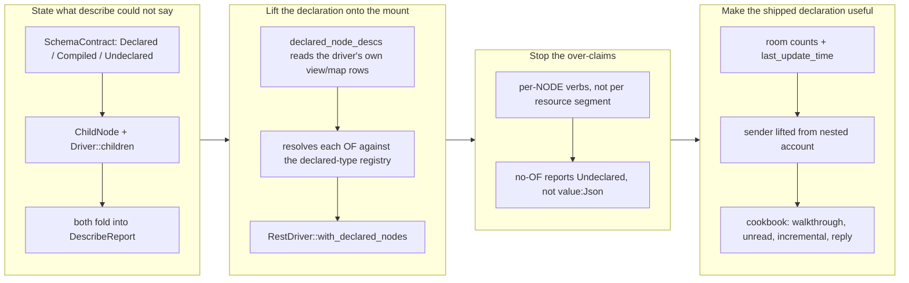

## 1. Overview

`SKILL.md` opens the agent loop with `describe` — *"learn the node's archetype, columns, supported verbs … **Always read this first**"* — and tells the agent to build its statement from the columns that step returns. Against a **declared** driver (blueprint §13, the integrations written in qfs's own query language rather than compiled Rust) that first step returned nothing usable, so the loop the product documents could not be entered against one at all.

This branch makes a declared driver answer `describe` from its own declaration. The declaration already held both answers — `CREATE VIEW /a/{x}/b OF t` states the parent/child shape *and* the row type — and `describe` simply was not reading them.

**Highlights:**

1. A declared node reports its **`OF` type's columns** — the same columns `run` shapes its rows to. A ratchet test pins the two together over the shipped `chatwork` **and** `cloudflare` declarations, rebuilt through the production desugar.
2. A declared mount is **walkable**: `describe /chatwork` names its children, `describe /chatwork/rooms` names `{room}` *as a parameter*, and following only those paths reaches a leaf.
3. A view with **no `OF`** says so — zero columns plus an explicit "no row type declared" — instead of the synthetic `value: Json` a caller read as the schema.
4. A declared node advertises **only its own verbs**: `/chatwork/rooms` no longer claims the `INSERT` that belongs to `/chatwork/rooms/{room}/messages`.
5. The shipped Chatwork types carry the fields a caller actually needs — unread/mention/message counts, and the sender lifted out of the endpoint's **nested** `account` object — which is what makes the reply recipe expressible at all.

## 2. Motivation

The reported symptom was two disagreements on the same node:

```
$ qfs describe /chatwork/rooms --json
{"columns":[{"name":"value","ty":"Json", …}], "child_address":{"kind":"none"}, "verbs":{…all false}}

$ qfs run "/chatwork/rooms |> limit 1" --json
{"schema":[{"name":"room_id",…},{"name":"name",…},{"name":"type",…},{"name":"role",…}], "rows":[…]}
```

`describe` and `run` answering differently about one path is not a cosmetic gap. It is the difference between a declared driver being a first-class way to add a service and being strictly worse to work with than a compiled one — the reporter's own route to the surface was reading the `.qfs` source and grepping `qfs dump`.

The cause was structural rather than incidental. A declared driver mounts as the stock generic `RestDriver`, whose `describe` is honest for *its* case (an arbitrary JSON API has no schema to state) and blind to the declaration wrapped around it:

```rust
// crates/driver-http/src/lib.rs, before
fn describe(&self, path: &Path) -> Result<NodeDesc, CfsError> {
    Ok(NodeDesc::new(Archetype::RelationalTable,
        Schema::new(vec![Column::new("value", ColumnType::Json, true)])))
}
```

The mount root's dead end had the same shape: `describe` had no concept of a *child location* at all, so "the driver is mounted" led nowhere.

## 3. Changes



### 3-1. Two things the describe contract could not state ([94d9994](https://github.com/qmu/qfs/commit/94d9994))

`ChildAddress` already drew the "declared answer, not an omission" distinction for *containment*. Two more were missing, and both are now typed rather than implied:

- **`SchemaContract`** — `Declared { of_type }` / `Compiled` / `Undeclared`. It answers *where a node's columns came from*, so an agent can tell a stated contract from "nobody has said" instead of reading a placeholder column as the schema.
- **`ChildNode`** — a child location's `segment`, its full `path`, and its `parameter` name when the segment is a `{param}`. `ChildNode::new` derives `parameter` from the `{name}` spelling, so the two can never disagree.

`Driver::children` is a new introspective method with an **empty default**, so no existing driver changed: empty is the honest answer for a driver whose child paths are data (a mail label, a bucket key) rather than declarations — those carry the address on their rows via `child_address`. `DescribeReport::from_driver` folds both in, and the fold stays pure — `children` is a declaration the driver already holds, never an enumeration of live rows.

`MountDriver` forwards `children` across the remap in **both** directions: the queried path goes in, and every child path comes back out onto the outer mount. Without that outbound leg a caller would be handed inner `/rest/<name>/…` paths it cannot address.

### 3-2. The lift ([94d9994](https://github.com/qmu/qfs/commit/94d9994))

`RestDriver::with_declared_nodes` is the same shape of lift `with_procs` already performed for `CREATE MAP CALL` signatures — a declared driver hands the stock REST engine what its declaration knows, and the engine stops guessing:

```rust
// A DECLARED node answers from its own declaration.
if let Some(node) = self.declared_node(path.as_str()) {
    let desc = match &node.of {
        Some(of) => NodeDesc::new(Archetype::RelationalTable, of.schema.clone())
            .schema_contract(SchemaContract::Declared { of_type: of.name.clone() })
            .child_key(of.key_columns.clone()),
        // No `OF`: state that, rather than a synthetic `value: Json`.
        None => NodeDesc::new(Archetype::RelationalTable, Schema::new(Vec::new()))
            .schema_contract(SchemaContract::Undeclared),
    };
    return Ok(desc.navigable(!children.is_empty()));
}
```

Template matching is segment-wise, so a `{room}` template segment matches a concrete `12345` — the walk works against a real address, which is the point of the feature.

Crucially, `declared_node_descs` resolves each view's `OF` against **the same declared-type registry the read path shapes rows with** (`declared_eval::view_specs`). Describe and run cannot disagree because they now read one source. A registry build reads the types **once** for all declared mounts rather than per mount.

### 3-3. Two over-claims removed ([94d9994](https://github.com/qmu/qfs/commit/94d9994))

Capabilities were keyed by the **resource segment** — `resources()` groups every declaration under the first segment after the driver name — so `/chatwork/rooms` (a view, `SELECT` only) advertised the `INSERT` belonging to `/chatwork/rooms/{room}/messages` (a map). Because `describe`'s `native_verbs` hint is derived from capabilities, the over-claim reached the agent-facing line the describe contract's own docs forbid over-claiming on. Capabilities are now per declared **node** when a mount declares any; a mount that declares none keeps the segment gate byte-for-byte.

The second over-claim was the placeholder column itself, now `Undeclared` with an empty column list, rendered as *"(none declared — this node states no row type; run it to see its columns)"*.

### 3-4. The shipped Chatwork declaration ([94d9994](https://github.com/qmu/qfs/commit/94d9994))

The room type gains `unread_num` / `mention_num` / `message_num` / `last_update_time`; without them "which conversations have something new" degraded into listing every room and reading names. The message type gains `update_time` and the **sender** — which the endpoint nests:

```sql
CREATE VIEW /chatwork/rooms/{room}/messages OF chatwork/message AS
  /http/chatwork/rooms/{room}/messages
  |> DECODE json
  |> SELECT message_id, body, send_time, update_time,
            account.account_id AS account_id, account.name AS account_name;
```

The `OF` projection runs *after* the body, so the body is where a nested field becomes a nameable column (§4 path access). This is the general recipe for any declared driver over an API with nested response objects.

`docs/cookbook/chatwork.md` gains a `describe` walkthrough, an unread-conversations query, an incremental-read recipe, and the **reply** recipe — a Chatwork reply is a body prefixed `[rp aid=<account_id> to=<room>-<message_id>]`, which is simply not expressible without the sender column. Every recipe is parse-checked by the cookbook ratchet, and `qfs-chatwork/SKILL.md` regenerated.

## 4. Outcome

The ticket's exact repro, re-run against the developer's **real installed** `chatwork` declaration (not only fixtures):

```
$ qfs describe /chatwork/rooms --json
"columns":[{"name":"room_id"},{"name":"name"},{"name":"type"},{"name":"role"}]
"schema_contract":{"kind":"declared","of_type":"/type/chatwork/room"}
"child_address":{"kind":"key","columns":["room_id"]}
"children":[{"segment":"{room}","path":"/chatwork/rooms/{room}","parameter":"room"}]
"verbs":{"select":true,"insert":false, …}
```

And the operator's view:

```
$ qfs describe /chatwork/rooms/12345/messages --format table
path:      /chatwork/rooms/12345/messages
archetype: relational (SELECT INSERT)
columns:   (declared OF /type/chatwork/message)
  | name       | type      | null
  | message_id | Text      | yes
  | body       | Text      | no
  | send_time  | Timestamp | yes
verbs:     SELECT INSERT
```

**Gates** — `cargo test --workspace` (2770 tests), `cargo clippy --workspace --all-targets -- -D warnings`, `cargo fmt --all --check`, `gen-docs --check`, `gen-skills --check`, `check-migrations`: all exit 0.

**Quality gate, item by item:**

| Ticket gate | Status |
| --- | --- |
| describe returns the same column set `run` returns, pinned over the shipped `chatwork.qfs` and one other declaration | ✅ `describe_of_a_declared_node_reports_the_columns_the_read_path_delivers` — every view in **both** shipped declarations, plus `the_shipped_messages_view_delivers_exactly_the_columns_describe_promises`, which evaluates the real view body over a real-shaped payload |
| describe on a mount root lists children; walking root→leaf using only describe output, exercised by a test | ✅ `a_declared_mount_is_walkable_from_its_root_down_to_a_leaf` |
| The Chatwork room/message types carry the added fields; the cookbook's worked examples use them | ✅ `the_shipped_chatwork_types_carry_the_fields_a_caller_needs` + four new cookbook recipes |
| `cargo test --workspace` green | ✅ |

The tests are a **ratchet, not a restatement**: `declared_from_script` rebuilds the declared model from the shipped `.qfs` bytes through the production desugar and the real `assemble` / `resolve_type_def`, so an edit to a shipped asset that breaks discoverability fails here.

## 5. Historical Analysis

The ticket arrived via `/request` from another repository — filed by someone who hit the gap while doing real work, and who reached the surface by reading the `.qfs` source. That provenance shaped the fix: the deliverable is not "describe emits more fields" but "the documented loop can be run", which is why the walkability test walks with *only* describe output rather than asserting a field exists.

The deeper pattern is one this repo has hit before. The declared-driver mission's own record notes that `DESCRIBE /claude/sessions` worked while the path was unreachable, because describe read a *separate* registry from the one that resolved reads — "true about the schema and false about reachability". This is the same class: describe and the read path answering from different sources. The fix here deliberately closes it by construction rather than by keeping two sources agreeing — `declared_node_descs` resolves `OF` against the identical registry `view_specs` reads.

The ticket also predates the `## Policies` section, so the policy set was derived from its `layer: [Domain]` per the drive skill's fallback mapping.

## 6. Concerns

- **Item 5 (incremental reads) is not pushed down, deliberately.** Chatwork's `GET /rooms/{room}/messages` accepts only `force` — there is no since-parameter. Declaring a §13.1 G2 `PUSHDOWN` map for `send_time >` would have produced a **silently wrong wire call**, which is the exact defect class this ticket exists to kill. What ships instead: `send_time` is a real column, so `|> where send_time > …` works as a local residual, `describe` reports `pushdown: limit` truthfully, and the cookbook says plainly that the filter runs locally and does not save the round trip. "Honest-but-chatty" is the correct answer when the endpoint lacks the parameter.

- **A declared view still cannot be removed** — the ticket's "Related" section, now filed as its own ticket (`20260729163000-a-declared-view-cannot-be-removed.md`). `DROP VIEW` does not parse (`RESERVED_AS_IDENTIFIER`) and `/sys/drivers` supports no `REMOVE`, so a mistaken declaration is permanent. **This change makes it visibly worse**: `describe /chatwork` now enumerates children, so three leftover scratch declarations in the developer's live config (`rooms_raw`, `messages_all`, `messages_form`) appear in the mount's advertised surface with no supported way to delete them. It was not fixed here because the storage semantics (tombstone row vs. real delete) are a genuine design choice, and an unqueued fix would have ridden into a commit whose message describes discoverability.

- **Branch-safety scan reports one `size` finding** (`override` tier): 1275 non-generated changed lines in `94d9994` against a 500 limit. Roughly 480 of those lines are the new tests in `declared_driver.rs` and 120 are the regenerated `SKILL.md`. No `secret` finding; nothing hard-blocking. This unit routes to a PR by policy regardless, so the finding is recorded rather than acted on.

- **Live-config side effect, made good.** While verifying the repro this run installed the *modified* `chatwork.qfs` into the developer's real System DB (`~/.config/qfs/system.db`) — `HOME` does not isolate it; `XDG_CONFIG_HOME` does. The original declaration was re-installed immediately, and because declaration rows resolve newest-per-key, the live surface is back to exactly its prior 4-column shape (verified: `describe /chatwork/rooms` returns `room_id/name/type/role`). The verification output quoted in §4 is from that restored, original declaration — which is why it shows four columns rather than the new ones.

- **The merge conflict is resolved; one ruling is left, not two.** The 2026-08-17 tick caught the branch up with `main` at `cd8be38`. The five conflicts were all version/lockstep manifests, exactly as recorded above, and were resolved the way this repository's CLAUDE.md prescribes — bumps redone on top of `main` (qfs `0.0.108 → 0.0.109`, all four plugin `version` fields `0.20.0 → 0.20.1`, patch because the regenerated `qfs-chatwork/SKILL.md` widens a taught surface without breaking it) and `Cargo.lock` regenerated by cargo rather than hand-merged. One **semantic** conflict came with it and is the only code change: `main`'s newer test `an_unperformable_declared_write_refuses_at_plan_time` called `declared_describe_mount`, which this branch renamed to `declared_describe_mount_with_types`; the call site was adapted the same way the earlier `/slack` collision test already was. All gates re-run green on the merged tree. **What is left for a human is the single `size` ruling above** — an `override`-tier finding that no unattended run may overrule.

- **Nine empty `Resume a PR-unit` commits, and the stamp that caused them.** The unit was originally claimed on `work-20260729-145625`; the re-land moved it to `claude/existing-prs-issues-naiqyz`, but the archived ticket kept `claim: work-20260729-145625`. The claim scan attributes artifacts by that stamp, so it reported this claim with `artifacts: []` — which made the drained unit look `resumable` to every tick (hence the empty Resume commits) *and* left the base-side `todo/` copy of the ticket in the unclaimed backlog with no `excluded[]` row, inviting a fresh runner to re-implement finished work. This tick corrected the stamp to name the branch that actually holds the claim, and filed the underlying defect as `.workaholic/feedbacks/20260817014809-a-re-landed-claim-branch-loses-its-artifact-attribution.md`.

- **A heartbeat ate the catch-up merge, and the repair is visible in the history.** With the resolution staged and `MERGE_HEAD` set, the routine heartbeat fired; `commit.sh --allow-empty` builds against a scratch index seeded from `HEAD`, so the beat committed the *pre-merge* tree with both merge parents — commit `0a66fbd`, subject `Refresh heartbeat`, an evil merge recording `main` as merged while carrying none of its content. It had already been pushed by the heartbeat's own push, and force-push is on the run's safety floor, so the history was not rewritten: the staged resolution survived in the index and lands as the following commit, leaving the branch content correct and the odd commit pair in the log. Filed as `.workaholic/feedbacks/20260817014653-heartbeat-sh-consumes-an-in-progress-merge-and-drops-its-resolution.md`.

## 7. Successful Development Patterns

- **Rebuild the fixture from the shipped bytes.** `declared_from_script` parses each statement of a shipped `.qfs` asset into the `INSERT INTO /sys/drivers` it desugars to, reads the row back out, and hands it to the production `assemble` / `resolve_type_def`. This turned the tests from a restatement into a ratchet — and immediately paid: it surfaced that the type registry keys types by their **`/type/`-prefixed** path (`/type/chatwork/message`), which a hand-built fixture would have hidden, and against which a bare-spelling lookup silently resolves nothing and degrades to `Undeclared` rather than failing.

- **Make "nobody said" a typed answer.** `ChildAddress::None` was already the precedent — "a declared answer, not an omission". `SchemaContract::Undeclared` extends it to the schema, and that framing is what turned a vague requirement ("say so explicitly") into a mechanical one. A placeholder column is worse than no column, because a caller reads it as the answer.

- **Verify against the real installed thing, not only fixtures.** Every hermetic test passed before the live check, and the live check is what confirmed the `/type/` prefix, the actual renderer output (which the cookbook's sample blocks were then corrected against), and that the mount root's `native_verbs` falls back to the archetype hint when a node has no verbs — all three would have shipped as small untruths in the docs otherwise.

- **Widen a contract with a default, not a breaking change.** `Driver::children` has an empty default impl and `NodeDesc` gained a field with a default, so twenty-odd driver implementations compiled untouched. The only fallout was two intentional wire-shape snapshots, which is exactly what those snapshots exist to catch.
