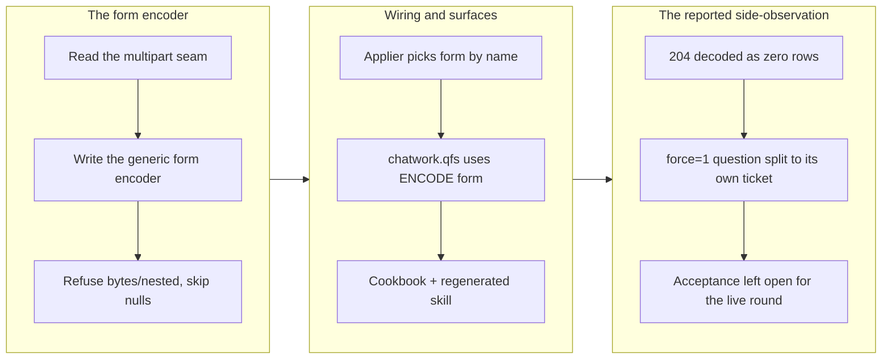

## 1. Overview

A declared driver could read a plain-REST API but could not write to one: `ENCODE` carried `json`,
`jsonl`, `yaml`, `toml`, `csv`, `md` and `multipart`, and no form codec, so the shipped
`INSERT INTO /chatwork/rooms/{room}/messages` sent a JSON body to an endpoint that accepts only
`application/x-www-form-urlencoded` and answered `400` every single time. This branch added the
generic form encoder at the applier seam, moved the shipped declaration and the cookbook article that
teaches it onto `ENCODE form`, and proved the whole path with an end-to-end test that drives the
exact documented statement through the commit stack. It also closed the misleading-error half of the
same report: a `204 No Content` read now decodes as zero rows instead of surfacing as
`invalid_path … http_decode`.

**Highlights:**

1. `ENCODE form` — a generic, service-agnostic `application/x-www-form-urlencoded` wire-body encoder,
   so a form-parameter REST API is writable through a declaration rather than only readable.
2. The shipped `chatwork.qfs` message map and `docs/cookbook/chatwork.md` now publish a statement
   that commits, instead of one that always answered `400`.
3. Unencodable fields are refused, not guessed: a bytes/array/nested-struct field is a structured
   error naming `ENCODE multipart` as the encoder that does take an upload, and a null field is an
   absent parameter rather than an empty one.
4. A `204 No Content` read is a successful empty result, one status wide — a malformed `200` body is
   still a decode error.
5. Confirmed on the wire in an attended round, not only on fixtures: the cookbook's `INSERT` commits
   against the live API and the message reads back byte-intact, while the same second read that
   errors on the released `0.0.80` returns zero rows on this branch.

## 2. Motivation

The report arrived from another repository through `/request`, with transcripts: every commit of the
statement the cookbook prints failed with `client error 400 for POST
https://api.chatwork.com/v2/rooms/<room>/messages`, while reads on the same connection worked — so
not auth, and not a path typo. The cause was structural rather than Chatwork-specific. A declared map
lowers to `INSERT INTO /http/<drv>/… VALUES (row)` and the HTTP driver serialises the row as a JSON
body; most plain-REST APIs of that generation take parameters only as a form body. That makes "a
plain-REST API is expressible as declarative config" — the blueprint §13 claim the whole
declared-driver strategy rests on — false for a large class of APIs, and it makes the shipped
declaration plus the article teaching it publish a statement the binary cannot commit. The reporter's
own workaround was to route the write through `ENCODE multipart`, which does deliver, but it sends a
multipart body for a request with no file part and relies on the server being lenient — the right
shape to prove the diagnosis, the wrong shape to ship.

## 3. Changes

The encoder was written against the shape `multipart` already established, so the applier gained one
match arm rather than a new mechanism. With the wire side working, the shipped declaration and the
cookbook article moved onto it and the skill was regenerated. The reported side-observation then
split honestly in two: the `204` decode was a defect on any reading and landed here, while the
`force=1` question — whether the shipped messages view should read *latest* rather than *unread-only*
— changes what a shipped view returns, so it became its own ticket rather than a silent decision.
Finally the mission's acceptance box, auto-ticked by the archive step, was put back to unchecked,
because the criterion also names a live commit that was deliberately not run.

### 3-1. Declared REST drivers cannot POST form-encoded bodies, so the shipped Chatwork message INSERT always fails with 400 ([f2ce5b5](https://github.com/qmu/qfs/commit/f2ce5b5))

Added `ENCODE form` as a wire-body encoding a declared map can name, taught the applier to select it,
and moved the shipped `chatwork.qfs` message map plus `docs/cookbook/chatwork.md` onto it, so the
documented `INSERT` is a statement that commits. The encoder is deliberately narrow — scalars
percent-encoded in declaration order (`%20` for a space, never `+`), nulls omitted, and bytes, arrays
and nested structs refused with a reason — because there is no interoperable flattening convention
and picking one silently would make the wire shape unpredictable across services. The same ticket's
related observation about a `204` read decoding as a failure landed alongside it
([9e1f38f](https://github.com/qmu/qfs/commit/9e1f38f)), and the encoder itself landed in
([8ca09f4](https://github.com/qmu/qfs/commit/8ca09f4)).

## 4. Outcome

A declaration can now express a form-parameter write, which is the general property the mission
carries: *a declared write can say what the target API actually demands*. Concretely, the cookbook's
`insert into /chatwork/rooms/123456/messages values (body) ('…')` is driven through the full commit
stack in a hermetic test that asserts the POST carries `application/x-www-form-urlencoded` and the
body `body=Deploy%20shipped%20%E2%9C%85` — the content type whose absence produced the 400, and the
multi-byte percent-encoding a naive encoder would get wrong. Ten unit tests pin the encoder's
contract (ordering, reserved-character escaping, UTF-8, key encoding, null skipping, the two
refusals, determinism, and the args/header shape), and two more pin the `204` reading in both
directions. `cargo test --workspace` is 2778 passed / 0 failed; clippy is clean at `-D warnings`;
`gen-docs --check` is in sync and `gen-skills` regenerated `qfs-chatwork`. The binary patch moved to
`0.0.93` and the plugin's four version fields to `0.18.1`, because the taught skill surface changed.

**The attended live round then ran, with the developer present, and both fixes hold on the wire.**
The updated declaration was installed locally, and the cookbook's own statement — posted to the
operator's My Chat, the one room nobody else can see — committed with `committed: true` and no `400`.
Reading the room back returned the body byte-intact: `qfs v0.0.93 ENCODE form 動作確認 ✅ a&b=c`, so
Japanese text, the emoji, the reserved `&` and `=`, and the spaces all survived the percent-encode →
server-decode round trip. The `204` fix was confirmed in the same round by an A/B against the released
binary: a second read of the same view answers **0 rows** on `0.0.93` and `invalid_path …
http_decode` on the shipped `0.0.80`. The mission's third acceptance criterion is therefore fully met,
and the blueprint §13 counter-example is closed on this axis — a form-parameter REST API is writable
through a declaration, proven against the live service rather than only against fixtures.

## 5. Historical Analysis

This is the second instance of one shape on the same mission. The predecessor
(`the-declared-slack-twin-retires-the-compiled-driver`) stopped because a declared **write** could not
turn `#general` into a channel id; this ticket stopped because a declared **write** could not put
parameters on the wire in the form the endpoint accepts. Both are "the declaration cannot say what the
wire demands", which is why the mission's Goal was widened on 2026-07-28 from name resolution to the
general property. The encoder also inherits directly from ticket `20260711121526`, which added
`ENCODE multipart` for the Chatwork file upload: that ticket established the applier seam — the map's
declared encoding names an encoder, the encoder returns body bytes plus a `Content-Type` override, and
the applier layers it over the config defaults — and this branch reused it unchanged. That is why the
form work cost one match arm and one module rather than a new mechanism, and it is the strongest
evidence so far that the §13 declared-driver seam generalises.

## 6. Concerns

### The shipped Chatwork messages view still reads unread-only

- **Severity:** moderate
- **Description:** The declared view calls `GET /v2/rooms/{room}/messages` without `force`, whose
  default is *unread messages only*, so a second read of the same room returns nothing while the
  cookbook describes the view as "the messages in a room" (see
  [9e1f38f](https://github.com/qmu/qfs/commit/9e1f38f) in
  `packages/qfs/crates/skill/assets/examples/chatwork.qfs`). The `204` half of this observation is
  fixed here; this half changes what a shipped view returns, which is a declaration-semantics ruling
  rather than a bug fix.
- **How to Fix:** Rule between the three shapes written up in
  `20260801061500-chatwork-messages-view-returns-unread-only.md` — force the view, split it into
  `messages` and `messages/unread`, or correct the article — then change the declaration and
  regenerate the skill.

### An archived ticket auto-ticks a criterion it only half meets

- **Severity:** low
- **Description:** `archive.sh` ticks the mission acceptance box for the ticket it archives, which is
  right when a criterion maps to one ticket's hermetic deliverable and wrong when the criterion also
  names an attended confirmation. Here it recorded a live commit that never happened, and the tick had
  to be undone by hand in a follow-up commit (see
  [631b406](https://github.com/qmu/qfs/commit/631b406) in
  `.workaholic/missions/active/a-declared-write-resolves-a-name-the-way-a-query-does/mission.md`).
- **How to Fix:** Either keep acceptance criteria single-deliverable when writing a mission, or teach
  the archive step to leave a criterion open when its ticket records an unmet Quality Gate item.

## 7. Successful Development Patterns

- Writing the new encoder as a **twin of the existing one** — same `Body { bytes, content_type }`
  shape, same `http_*_args` helper, same applier match arm — meant the wiring was a three-line change
  and the reviewer can diff the two modules side by side. A second instance of a seam is the moment to
  confirm the seam generalises, not the moment to invent a second seam.
- **Refusing rather than choosing a convention.** Form bodies have no interoperable encoding for
  nested or binary values; several exist (`a[b]=`, `a.0=`, repeated keys) and services disagree. The
  encoder refuses with a message that names the encoder which *does* take an upload, so the author is
  redirected instead of silently sending something a service may or may not parse.
- **Splitting a bundled report by decision type, not by size.** The ticket carried a bug (the 400), a
  defect-on-any-reading (the `204`), and a question (`force=1`). The first two landed; the third
  became its own ticket with the three candidate shapes written out. The observation is preserved
  either way, but no shipped view's meaning changed without a ruling.
- **Running the attended live round as an A/B against the released binary, in a self-only room.** The
  round posted to the operator's My Chat — the one Chatwork room no other person can see — so the
  live proof cost nobody an unexpected message, and it ran the *same* read on `0.0.93` and on the
  installed `0.0.80` back to back. That turns "it works now" into "here is the behaviour before and
  after", which is what a live confirmation is actually for; a single green run on the new binary
  would not have distinguished the fix from a service that had started tolerating the old request.
- **Reverting an automated tick rather than accepting it.** The tooling recorded a live confirmation
  that did not happen; correcting the mission by hand and saying why in its changelog keeps the
  mission's progress a computed fact rather than an artifact of which script ran.

## 8. Release Preparation

**Verdict**: Ready for release

### 8-1. Concerns

- The branch-safety scan reports one `override`-tier finding and nothing else: `too-large-commit`
  (1673 non-generated changed lines > 500) on `603bb6e`, the story commit — which is large only
  because the `/report` run absorbed the ~75-file `.workaholic/concerns/` → `.workaholic/feedbacks/`
  rename migration described in section 9. No `hard` (secret) or `confirm` (leak) finding exists, so
  this does not block the release; `/ship` will ask for a conscious size override. Documentation-drift
  analysis found no candidates.
- The attended live round is **done**: the write commits against the real API and the body round-trips
  intact, and the `204` reading was A/B-confirmed against the released `0.0.80`. Nothing about the
  change is unproven at release time.

### 8-2. Pre-release Instructions

- Accept the size override at `/ship` time: the oversized commit is the `.workaholic/` rename
  migration plus this story, not product code.
- Otherwise standard release process applies. The patch version (`0.0.93`) and the four plugin version
  fields (`0.18.1`) are already bumped on the branch.

### 8-3. Post-release Instructions

- None — no special post-release actions needed. This host's `/chatwork` declaration was already
  re-installed during the live round, and it is the only installation there is.

## 9. Notes

**The diff carries a mechanical `.workaholic/` migration that is not this branch's work.** Running
`/report` invokes `list-open-concerns.sh`, which runs the concern-corpus living migration on first
read: the legacy `.workaholic/concerns/` tree became timestamp-named records under
`.workaholic/feedbacks/`. That is ~75 pure renames with no content change, it is idempotent and by
design (whichever branch reports first absorbs it), and it is unrelated to the form encoder. Review it
as a rename batch, not as a change.

A declared driver's map body lives as a stored `/sys/drivers` row, so a new binary does not update an
already-installed declaration — the live round had to re-install `chatwork.qfs` first. Recorded here
as a property rather than as a concern: qfs is pre-release with a single operator, whose installation
was updated during that round, so the "operator upgrades and silently keeps the broken map" population
does not exist (developer ruling, 2026-08-01). It becomes a real question the moment there is a second
installation.

The remaining mission work is the Slack half: the five typed CALL maps proven effect-equivalent to the
compiled ones on fixtures, and the deletion of the compiled `driver-slack` crate. The design ruling
those depend on was made on 2026-08-01 and is recorded in the mission's
`design-brief-reverse-lookup.md`; this branch drove the other axis, which that ruling explicitly says
may proceed independently.

## Deployment Evidence

- **When:** 2026-08-02T22:44:07+09:00
- **By:** a@qmu.jp
- **Target:** release-scan
- **Method:** override
- **Status:** bypassed
- **Observed:** size/too-large-commit on 603bb6e (1673 non-generated lines > 500); the bulk is the concerns-to-feedbacks rename migration the report run absorbed, not product code; zero secret or leak findings

## Deployment Evidence

- **When:** 2026-08-03T20:57:53+09:00
- **By:** a@qmu.jp
- **Target:** qfs GitHub Release (release-on-tag)
- **Method:** other
- **Status:** pass
- **Observed:** Pre-merge readiness proof on the reconciled branch: cargo build --workspace exit 0; cargo test --workspace 2778 passed 0 failed; cargo clippy --workspace --all-targets -D warnings exit 0; cargo fmt --all --check exit 0; gen-docs --check docs are in sync; gen-skills --check skills are in sync; Cargo.toml version 0.0.93 ahead of main 0.0.92 with no existing v0.0.93 tag. Live production behaviour was additionally confirmed pre-merge in an attended round (declared INSERT committed with no 400, body read back byte-intact, 204 read A/B vs the released 0.0.80).

## Deployment Evidence

- **When:** 2026-08-03T21:08:26+09:00
- **By:** a@qmu.jp
- **Target:** qfs GitHub Release (release-on-tag)
- **Method:** other
- **Status:** pass
- **Observed:** Post-merge promotion check: gh release view v0.0.93 reports isDraft false with all four native tarballs published (aarch64/x86_64 apple-darwin and unknown-linux-musl) plus their sha256 files. Tag v0.0.93 points at 97c0134, whose tree is identical to merge commit cd4a3f0 on main.
