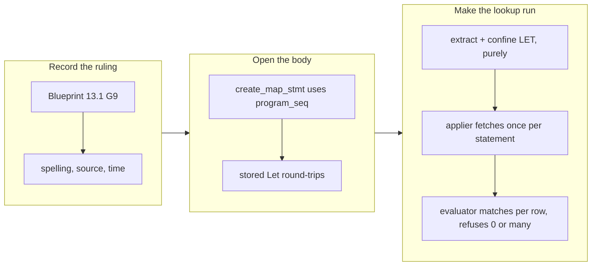

## 1. Overview

A declared write could not turn a human-readable name into the id the wire demands — the wall this
mission has stopped at twice. This branch closes it: a declared map body may now bind a reverse
lookup with `LET`, written with the same `|> WHERE … |> SELECT …` an author would type at the shell,
resolved at commit time inside the confined applier and refused rather than guessed. The mechanism
is general; the two Slack tickets it exists to unblock are **not** in this branch.

**Highlights:**

1. Blueprint §13.1 gains **G9** — the ruling recorded before the implementation, including what was
   deliberately not taken and why.
2. A map body parses `LET` (a one-word parser change: `create_map_stmt` uses `program_seq`, the
   grammar's only `let_binding` call site).
3. The lookup reads the driver's **own declared view**, so that view's cursor paging and `OF` contract
   carry it — the collection is fetched **once per statement** and matched **locally per row**.
4. Zero matches or several matches are structured refusals **before the effect leg fires**, asserted
   on the wire by the absence of the second request.
5. `eval_map_body` stays pure: the applier does the one fetch, the evaluator binds resolved values as
   additional columns.

## 2. Motivation

The compiled Slack driver resolves `#general` in three steps — GET `conversations.list`, scan the
returned array locally, use the matched row's `id` — because Slack's Web API has no name-addressed
channel endpoint. That is a **reverse lookup against a collection**, and G4, the per-row fan-out this
mission shipped earlier, substitutes a value *into* an address: the opposite direction. Two overnight
runs each found the remainder one layer deeper than their plan for exactly this reason. The spike the
mission required before ruling found the wall the earlier framing missed: opening the parser is not
enough, because **the map body is pure by contract and a name lookup is I/O**. A third run that
flipped the parser and stopped would have failed the same way, one layer deeper. So the ruling settles
two axes — how it is spelled, and where it runs — and this branch implements both.

## 3. Changes

The ruling landed first so it outlives the ticket. The parser change is one word, and two tests pin
both directions of it — a `LET` body rehydrates as `Statement::Let` wrapping the effect, and a
`LET`-free body is byte-identical to what every shipped declaration already stores. The runtime work
then split along the purity line the spike found: extraction and confinement are pure functions of the
stored body, the single collection fetch belongs to the confined applier, and the per-row match —
with its two refusals — belongs back in the pure evaluator.

### 3-1. A declared write can resolve a name against a collection endpoint ([b5e2bd9](https://github.com/qmu/qfs/commit/b5e2bd9))

Added `map_body_lookups` (pure extraction + §13 confinement), taught `eval_map_body` to walk past the
`LET` chain and bind resolved values as additional columns, and gave `RestApplyDriver` the driver's
declared views plus the confined applier so it can fetch each lookup's collection once, off the async
runtime, before the effect leg. Nine of the ticket's ten Quality Gate items are met here; the tenth
(item 9) names ticket `20260724014100` and is that ticket's work, not this one's.

## 4. Outcome

`LET cid = /slack/{ws}/channels |> WHERE name == row.channel |> SELECT id` is now a legal map body,
and an end-to-end test drives the exact statement through the full commit stack asserting **both**
wire requests in order: `GET conversations.list`, then `POST chat.delete` carrying `C_RND` — with an
explicit assertion that the unresolved name never appears on the wire. Its twin asserts that an
unknown name issues the lookup **and nothing else**, so the refusal is proven by the absence of the
second request rather than by an error string. Six more tests pin the pure half: extraction, foreign
source refused, unsupported shape refused, no-`LET` passthrough, per-row resolution from one
collection, unresolvable, and ambiguous.

`cargo test --workspace` is 2789 passed / 0 failed; clippy at `-D warnings`, `fmt --all --check`,
`gen-docs --check` and `gen-skills --check` are all clean. The patch version moved to `0.0.94`.

**The mission's two remaining acceptance criteria are untouched and remain unchecked** — see Handoff.

## 5. Historical Analysis

This is the third attempt at one wall, and the first to name it correctly. The predecessor mission
implemented G4 believing per-row fan-out was the missing piece; it was not. The ticket driven here
was minted from that run's residue rather than left as a note inside a blocked ticket, which is what
made it drivable at all. The design brief beside the mission then answered the three spike questions
by reading the source, and its load-bearing finding — the purity/I-O split — is what shaped the
implementation into three pieces instead of one. The pattern worth keeping: when a run finds the wall
is one layer deeper than the plan, the artifact that survives is a ticket naming the wall, not a
paragraph describing it.

## 6. Concerns

### The accepted `LET` shape is one narrow form

- **Severity:** low
- **Description:** `map_body_lookups` accepts exactly
  `<own-mount-path> |> WHERE <col> == row.<field> |> SELECT <col>` and refuses everything else (see
  [b5e2bd9](https://github.com/qmu/qfs/commit/b5e2bd9) in
  `packages/qfs/crates/exec/src/declared.rs`). That is deliberate — the alternative is a runtime whose
  behaviour depends on how much of a pipeline the resolver happens to implement — but it means a
  perfectly reasonable variant (a compound predicate, a second lookup keyed off the first) is a parse-
  time-legal, evaluation-time refusal.
- **How to Fix:** Widen the accepted shape when a real declaration needs it, additively, with the
  refusal message naming what was rejected. Do not widen speculatively; each accepted form is a
  contract the runtime then owes.

### The write facet now carries read machinery

- **Severity:** low
- **Description:** `RestApplyDriver` holds the driver's `ViewSpec`s and a `RestApplier` so a lookup
  can read the driver's own declared view at commit time (see
  [b5e2bd9](https://github.com/qmu/qfs/commit/b5e2bd9) in
  `packages/qfs/crates/qfs/src/apply_facets.rs`). The view-evaluation call is a near-duplicate of the
  read facet's, so a change to how a declared view is evaluated must now be made in two places.
- **How to Fix:** Factor the "evaluate this declared view through the confined applier" call into one
  helper both facets call, once a second commit-time read appears — one duplication is cheaper than
  the wrong abstraction, two is not.

## 7. Successful Development Patterns

- **Recording the ruling before the implementation.** Blueprint §13.1 G9 landed first, including the
  option that was declined and why. The implementation then had nothing left to re-decide, which is
  what let the parser change stay one word instead of growing a keyword.
- **Splitting the work along the purity line the spike found**, rather than along the file boundaries.
  Extraction is pure, the fetch is the applier's, the match is pure again — so the two refusals sit in
  a function with no I/O and are testable without a mock at all. Six of the eight tests need no HTTP.
- **Asserting a refusal by the absence of a request.** "An unresolvable name is refused" is checkable
  as an error string, which proves nothing about the wire. Asserting `recorded.len() == 1` proves the
  effect leg never fired, which is the property the ticket actually asked for.

## 8. Release Preparation

**Verdict**: Needs attention before release

### 8-1. Concerns

- The branch delivers a mechanism whose two consumers are not yet on it. Nothing is broken — every
  shipped declaration takes the no-`LET` path, pinned by a test — but the mission's two acceptance
  criteria remain open, so this is a PR to review, not a release to cut.

### 8-2. Pre-release Instructions

- Review the accepted `LET` shape (section 6) before it has declarations written against it.

### 8-3. Post-release Instructions

- None.

## 9. Handoff

**This unit is handed off, not finished.** Its queue is not drained: one ticket of the mission's
eleven is archived here, and the two that carry the mission's remaining acceptance criteria are still
in `todo/` on this branch. The work that exists is pushed and green.

**What is done:** `20260726190000` (the reverse lookup) — nine of ten Quality Gate items, the tenth
being the next ticket's by definition.

**What is next, in order, and why that order:**

1. **`20260724014100` — the five typed Slack CALL maps become effect-equivalent to the compiled ones.**
   This is the criterion the mission's `next` field names. The mechanism it was blocked on now exists:
   rewrite the five CALL maps in `crates/skill/assets/examples/slack_driver.qfs` to bind
   `LET cid = /slack/{ws}/channels |> WHERE name == row.channel |> SELECT id` and pass `cid` where they
   currently pass an already-resolved id, then prove each against `driver-slack` on the shared
   fixtures. **Note its QG2 was corrected by the 2026-08-01 ruling** from "unresolvable names fail at
   PREVIEW" to "before the effect leg fires" — held as written it was unprovable, because the compiled
   driver resolves at commit and PREVIEW prints the unresolved `#general`. The `Uxxxx` → `Dxxxx` DM arm
   is a pure G4 substitution and must **not** be routed through `LET` for symmetry; QG9 asks both arms
   be provable, not that both use one mechanism.
2. **`20260724014200` — delete the compiled `driver-slack` crate** per the shared retirement steps,
   regenerate docs and skills, and bump the plugin's four version fields (minor — a taught surface
   goes away). It depends on 1 and on nothing else.

**Also in this branch's queue, and not this mission's business:** nine further tickets name the
mission and were inherited into the claim. One of them, `20260725124400` (the G4 fan-out), is
**already implemented** — `commit_hash: 365d521`, `effort: 2h`, and `FOLLOW_FANOUT_MAX` is in the
shipped code — but was never archived, so it sits in `todo/` looking undriven. It belongs to the
closed predecessor mission. Archiving it is queue hygiene someone should do deliberately rather than
as a side effect of the next run.
