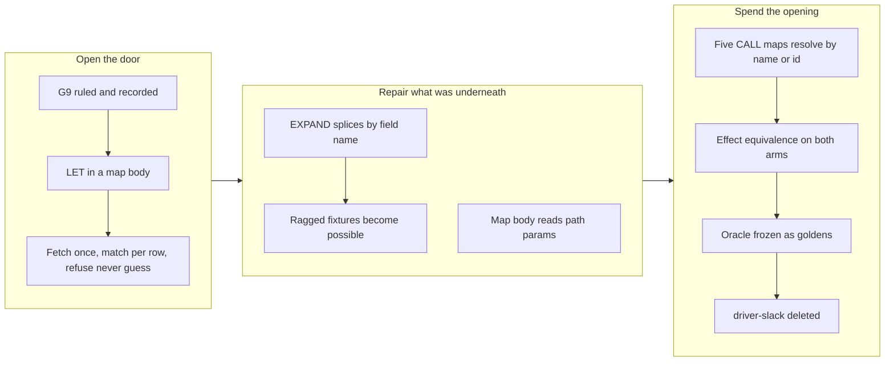

## 1. Overview

A declared write could not turn a human-readable name into the id the wire demands — the wall this
mission stopped at three times. The branch closes it and then spends the opening: a map body binds a
reverse lookup with `LET`, the five Slack CALL procedures resolve their channel through it, and the
compiled `driver-slack` crate is **deleted**. `/slack` is now served entirely by a declaration
written in qfs's own query language.

**Highlights:**

1. Blueprint §13.1 gains **G9** — a declared map body may bind a reverse lookup with the same
   `|> WHERE … |> SELECT …` an author would type at the shell, resolved at commit inside the confined
   applier and refused rather than guessed.
2. `EXPAND` splices a struct element by **field name** instead of by position, so an array whose
   elements carry different key sets stops silently shifting every later column.
3. A map body can read its own path's `{param}` segments as `path.<name>`, so a write addressed at a
   path stops asking the caller to repeat that address in the payload.
4. The five Slack CALL maps accept a channel given **either** as a name or as an already-resolved id,
   and are effect-equivalent to the compiled driver on both arms.
5. **`driver-slack` is deleted** (v0.0.95, plugin 0.19.0) with its answers frozen as recorded goldens,
   so the declared twin still regresses against the driver it replaced.

## 2. Motivation

The compiled Slack driver resolved `#general` in three steps — GET `conversations.list`, scan the
returned array locally, use the matched row's `id` — because Slack's Web API has no name-addressed
channel endpoint. That is a **reverse lookup against a collection**, and G4, the per-row fan-out an
earlier run shipped believing it was the missing piece, substitutes a value *into* an address: the
opposite direction. The spike the mission required before ruling found the wall the earlier framing
missed — **the map body is pure by contract and a name lookup is I/O** — so the ruling settles two
axes, how it is spelled and where it runs.

Opening that door turned out to require two repairs underneath it that had nothing to do with Slack.
`EXPAND` flattened each struct element by taking its values *in order*, so any array with optional
keys delivered scrambled columns with no diagnostic — a silent wrong-rows defect that every declared
driver was exposed to, because every declared driver reads through `DECODE json`. And a map body was
closed over the incoming row, so a declaration addressed at `{channel}` could not read `{channel}` and
had to take the destination from a column instead. Both were recorded as constraints by earlier runs
and both turned out to be smaller than their descriptions.

## 3. Changes

The arc is one mechanism, two repairs it exposed, and a retirement it authorized. The two repairs are
worth more than their size: the `EXPAND` fix removed a defect that silently mis-assigned columns for
every declared driver over any optional-field API, and it was invisible until a fixture was allowed to
be ragged. The retirement at the end is the first time this project has deleted a compiled driver that
a declaration replaced in full, reads and writes alike.

### 3-1. A declared write can resolve a name against a collection ([b5e2bd9](https://github.com/qmu/qfs/commit/b5e2bd9))

Blueprint §13.1 **G9**: a map body parses `LET`, the confined applier fetches each lookup's collection
once per statement, and the pure evaluator matches it per row. Zero matches or several are structured
refusals **before the effect leg fires**, asserted on the wire by the absence of the second request.

### 3-2. Splice an expanded struct by field name ([25dec37](https://github.com/qmu/qfs/commit/25dec37))

`EXPAND` now reads each element's fields by name, so a key an element omits is `Null` in that row
instead of pulling the next column's value into its place. Where the column has no declared element
type — which is what `DECODE json` produces, so it is the path declared views actually take — the
output columns are the union of the field names the rows carry, in first-seen order.

### 3-3. Bind a map body to its own path parameters ([c315f8d](https://github.com/qmu/qfs/commit/c315f8d))

A map body reads its own `{param}` segments as `path.<name>`. The collision question the ticket posed
was answered by keeping the namespaces separate rather than by ruling a precedence — `path.channel`
and `row.channel` are different expressions, so nothing is ever silently resolved to the one the
author did not mean.

### 3-4. Resolve a declared CALL channel against data ([dcc1506](https://github.com/qmu/qfs/commit/dcc1506))

The five CALL maps resolve their channel through a G9 lookup written as a **disjunction** —
`WHERE name == row.channel OR id == row.channel` — so a name matches the name column and an
already-resolved id matches the id column and resolves to itself. Both arms are exact matches against
rows the workspace itself returned, which reproduces the compiled driver's behavior without
reproducing its `C`/`G`/`D` prefix heuristic.

### 3-5. Retire the compiled slack driver ([b2ac31f](https://github.com/qmu/qfs/commit/b2ac31f))

`crates/driver-slack` and every registration are gone; docs and skills regenerated; plugin bumped
MINOR to 0.19.0 for the taught-surface break; binary to 0.0.95. The equivalence suite survived by
capturing the oracle's rows, wire requests and typed signatures as goldens **in the same commit that
deleted it** — the last one in which both implementations existed.

## 4. Outcome

All three of the mission's acceptance criteria are now checked, and the §13.3 playbook's entry #1 is
complete: the first compiled driver fully replaced by a declaration and deleted.

`cargo test --workspace`, `clippy --workspace --all-targets -D warnings`, `fmt --all --check`,
`gen-docs --check`, `gen-skills --check` and `check-migrations` all exit 0 with `driver-slack` gone.

## 5. Concerns

### A declared lookup cannot be shared across maps, so the §13.2 conciseness bar moved

- **Severity:** moderate
- **Description:** Wiring the channel lookup into the five CALL maps meant writing the identical
  binding five times — all five mount at the same path, resolve the same argument, against the same
  view, by the same rule — and `slack_driver.qfs` went from **40** statement-lines to **45**, moving a
  shipped ratchet (see [dcc1506](https://github.com/qmu/qfs/commit/dcc1506) in
  `packages/qfs/crates/skill/assets/examples/slack_driver.qfs`). §13.2's claim is that a declared twin
  is *more concise* than the compiled driver it replaces; that claim now rests on a declaration whose
  growth is duplication rather than content, and a service with more ID-requiring calls than Slack's
  five would degrade linearly.
- **How to Fix:** Ticketed as `20260804173000-a-declared-lookup-cannot-be-shared-across-maps.md` with
  three shapes weighed. It should be answered together with the open concern
  `the-13-2-calibration-table-was`, since "leave it and restate the bar" is one of the three shapes and
  should be chosen rather than defaulted into.

### The preview-time malformed-reference refusal was declined, not implemented

- **Severity:** moderate
- **Description:** The mission's 2026-08-01 ruling included "PREVIEW additionally refuses a malformed
  reference — one that is neither a legal name nor a legal id shape — with no I/O". That clause
  presupposes a shape rule, and this implementation deliberately resolves against **data** instead, so
  there is no malformed-versus-unknown line to draw without importing Slack's id convention into a
  generic engine (see [dcc1506](https://github.com/qmu/qfs/commit/dcc1506) in
  `packages/qfs/crates/qfs/src/declared_driver.rs`). What is asserted instead is that PREVIEW performs
  **zero** I/O for a name-addressed CALL.
- **How to Fix:** Confirm the deviation, or say what a generic engine should check at preview time
  without service-specific knowledge. This is a developer ruling, recorded rather than asked.

### The Slack webhook surface went with the crate

- **Severity:** low
- **Description:** `parse_event`/`verify_signature` verified `X-Slack-Signature` over HMAC-SHA256 and
  nothing outside the crate called them — confirmed by grep before deleting — so no wired feature was
  lost (see [b2ac31f](https://github.com/qmu/qfs/commit/b2ac31f)). But inbound Slack events are now
  *unimplemented* rather than merely unwired, and that code lives only in git history.
- **How to Fix:** If inbound events are ever wanted, recover the module from history rather than
  rewriting it; the declaration does not replace it.

### Two tests used Slack as an example of a general property

- **Severity:** low
- **Description:** `describe.rs`'s compiled-versus-declared shadowing test and `golden_corpus.rs`'s
  unsupported-verb test both used Slack as a convenient example, not because they tested Slack, so the
  deletion invalidated them and both had to be re-pointed (see
  [b2ac31f](https://github.com/qmu/qfs/commit/b2ac31f)).
- **How to Fix:** When a component is on a retirement path, prefer a stable example elsewhere; an
  example chosen from a doomed component silently couples an unrelated test to its deletion.

### Two commits exceed the branch-safety size threshold

- **Severity:** low
- **Description:** The branch-safety scan reports `too-large-commit` for `b5e2bd9` (959 added
  implementation lines) and `dcc1506` (511, against a 500 threshold). Both are override-severity, not
  secrets. `b5e2bd9` is the G9 mechanism landing with its eight tests; `dcc1506` is the CALL rewiring
  plus the test-harness additions the lookup path needed.
- **How to Fix:** Nothing to fix in the code — recorded here because the ship gate will demote rather
  than merge on it, and a reviewer should see the reason rather than the rule.

## 6. Successful Development Patterns

- **Capture the oracle before deleting it, by running it.** The equivalence tests were the reason the
  retirement was allowed, and deleting the compiled driver destroys that evidence unless its answers
  are frozen first — in the same commit, while both implementations still exist. Two of the goldens
  were first written by hand and both were wrong; the tests caught them. Every remaining twin-and-retire
  in the playbook (github, drive, mail) has this same step, and it belongs before the `rm`.
- **A test fixture whose comment explains what it cannot contain is a defect report.** The Slack
  equivalence fixture was homogeneous and fully populated because the positional `EXPAND` splice made
  anything else fail, and its own comment said so. Relaxing it was the real proof the fix worked —
  through the actual evaluator against the compiled driver — and it was worth more than the unit test.
- **Design an ambiguity out rather than adjudicating it.** Two tickets here posed "which of these two
  wins?" questions — a path param versus a row column, and a name versus an id. Both were answered by
  making the two cases *different expressions* (`path.x` versus `row.x`) or *different data matches*
  (the `name` column versus the `id` column), so no precedence rule exists to be learned or
  misremembered, and nothing silently resolves to the reading the author did not mean.
- **A recorded constraint phrased as a property of the language is worth re-reading against the
  specific function.** "A map body's `VALUES` expression is row-closed" read like a design boundary and
  was a missing two-line binding: `eval_map_body` already received the path parameters and rendered
  them into the wire target on the line above, then dropped them.

## 7. Release Preparation

**Verdict**: Ready for release

- **Concern:** This is a hard break. The compiled `/slack` driver is gone with no compat shim, so the
  release note must state plainly that `/slack` is served by the declaration and that an operator must
  have `slack_driver.qfs` installed. The plugin MINOR bump (0.19.0) is what stops a stale skill cache
  teaching the retired compiled path.
- **Before release:** Check the version collision. This branch takes binary `0.0.95` and plugin
  `0.19.0`; PR #32 (`work-20260803-221340`) is open at `0.0.94` and plugin `0.18.2`. They do not
  conflict as written, but whichever merges second should be re-checked rather than assumed.
- **After release:** Nothing. The retirement is complete in-tree; there is no migration for an operator
  beyond installing the declaration, which the cookbook already teaches.

## Deployment Evidence

- **When:** 2026-08-04T21:21:06+09:00
- **By:** a@qmu.jp
- **Target:** release-scan
- **Method:** override
- **Status:** bypassed
- **Observed:** size/too-large-commit on b5e2bd9 (959 added implementation lines) and dcc1506 (511); hard findings 0, no credential detected. Developer accepted the risk 2026-08-04: the only remedy is splitting commits on an already-reviewed branch, which changes the review unit without changing the diff.

## Deployment Evidence

- **When:** 2026-08-04T21:21:06+09:00
- **By:** a@qmu.jp
- **Target:** qfs GitHub Release (release-on-tag)
- **Method:** other (pre-merge readiness proof)
- **Status:** pass
- **Observed:** After reconciling with main (v0.0.94): build, test, clippy -D warnings, fmt --check, gen-docs --check and gen-skills --check all exit 0; Cargo.toml version 0.0.95 is ahead of main 0.0.94 and v0.0.95 is not an existing tag

## Deployment Evidence

- **When:** 2026-08-04T21:33:17+09:00
- **By:** a@qmu.jp
- **Target:** qfs GitHub Release (release-on-tag)
- **Method:** other (post-merge promotion check)
- **Status:** pass
- **Observed:** gh release view v0.0.95 reports isDraft false with 8 assets: the four native tarballs (aarch64/x86_64 apple-darwin and unknown-linux-musl) plus their sha256 files; release.yml completed success; tag v0.0.95 points at merge commit 6d505d1
