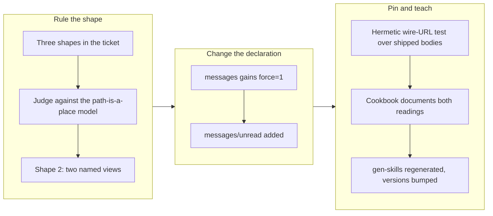

## 1. Overview

The shipped `/chatwork` declared driver exposed a `…/messages` view that quietly returned nothing on
a second read of the same room, because Chatwork's messages endpoint defaults to *unread only*. The
branch ruled the open design question the ticket posed and split the two readings into two named
paths: `…/messages` now forces the full listing, and a new `…/messages/unread` keeps the API's cheap
consuming default under a name that says so.

**Highlights:**

1. `/chatwork/rooms/{room}/messages` now passes `force=1`, so every read of a room answers the same
   question instead of only the first one.
2. A new `/chatwork/rooms/{room}/messages/unread` view keeps the unread-only reading addressable
   rather than deleting it.
3. Two hermetic tests pin the behavior at the wire level, one of them driving the **shipped**
   declaration bodies through the real read facet and asserting the built request URLs.

## 2. Motivation

`crates/skill/assets/examples/chatwork.qfs` declared `…/messages` over `GET /v2/rooms/{room}/messages`
with no `force` parameter. That endpoint's default is unread-only, so the first read of a room
returned rows and every later read returned nothing until someone posted again — while
`docs/cookbook/chatwork.md` presented the view as "the messages in a room". The ticket deliberately
did not prejudge the fix: it wrote up three shapes and asked for a ruling, because changing what a
shipped view returns is a declaration-semantics decision rather than a bug fix.

The ruling turns on what a path means in qfs. The product's claim is that every service is
filesystem-shaped, and a path names a *place* — so reading it twice has to answer the same question.
The old declaration made `…/messages` a consuming read dressed as a listing, which is the one thing a
path-shaped surface must not do silently. Shape 1 (force the view, drop the unread reading) fixes
that but leaves no spelling for "what is new since I last looked", and Chatwork documents the unread
call as the cheap path. Shape 3 (correct the article only) makes the documentation honest while
leaving the path name itself misleading. Shape 2 costs one extra `CREATE VIEW` line in a config
asset, and that asymmetry — one line against either a lost capability or a lying path name — decided
it.

## 3. Changes

The branch spent its judgment up front — the implementation followed from the ruling in a single
commit. The declaration change is two lines of qfs; the work that mattered was deciding which
question each path should ask, then making that decision checkable by a test that reads the shipped
asset rather than a copy of it, and teaching both readings in the article the installed skill is
generated from.

### 3-1. The shipped Chatwork messages view reads UNREAD-only, so a second read of the same room is empty ([fb4ed02](https://github.com/qmu/qfs/commit/fb4ed02))

Ruled shape 2 of the three the ticket wrote up. `/chatwork/rooms/{room}/messages` now requests
`…/messages?force=1` and returns the room's latest messages on every read; the unread-only reading
moved to `/chatwork/rooms/{room}/messages/unread`, where the name states that it consumes what it
returns. The cookbook article documents both and says which one consumes, `gen-skills` regenerated
the installed skill from it, and the plugin version was bumped so a stale skill cache picks the new
surface up.

## 4. Outcome

A caller reading `/chatwork/rooms/123456/messages` twice now gets the room's messages twice. The
unread reading did not disappear — it has its own path, and the article tells a reader which one to
reach for. The behavior is held by two hermetic tests: the shipped-asset test asserts the forced view
and the unread twin are both declared, and a new read-facet test drives both **shipped** view bodies
through the real applier and asserts the built URLs are `…/rooms/1/messages?force=1` and
`…/rooms/1/messages`. Full gates green: `cargo test --workspace`, `clippy -D warnings`,
`fmt --all --check`, `gen-docs --check`, `gen-skills --check`, and `check-migrations` all exit 0.

## 5. Concerns

### A declared driver has no upgrade path, so a shipped declaration fix does not reach a live mount

- **Severity:** moderate
- **Description:** The fix lives in a shipped asset, but an operator who already ran the install
  carries the old view row in `/sys/drivers`. The newest row per `(kind, name, verb)` wins, so
  re-installing `chatwork.qfs` does replace it — but nothing tells the operator that a re-install is
  needed, and nothing detects that their installed declaration is older than the shipped one (see
  [fb4ed02](https://github.com/qmu/qfs/commit/fb4ed02) in
  `packages/qfs/crates/skill/assets/examples/chatwork.qfs`). This generalizes past Chatwork: every
  declared driver the project ships will have the same gap the first time one of them needs a fix.
- **How to Fix:** Give installed declarations a version or content hash, and a way to ask whether a
  mount is running the current shipped declaration — then either warn on `describe` or offer an
  upgrade verb. Ruling whether upgrade is automatic or operator-initiated is the decision, not the
  code.

### The live confirmation this change is really about has not been run

- **Severity:** low
- **Description:** The ticket's quality gate names live confirmation — reading the same room twice
  and getting rows both times — as an **attended** step, because this environment holds a live
  Chatwork token and no unattended run may probe it. Everything verified here is hermetic: the tests
  prove the built URL carries `force=1`, not that Chatwork answers it the way its documentation says
  (see [fb4ed02](https://github.com/qmu/qfs/commit/fb4ed02) in
  `packages/qfs/crates/qfs/src/declared_driver.rs`). The same gap is already tracked more broadly by
  the `declared-model-and-scheduling-follow-ups` concern.
- **How to Fix:** In an attended session, install the updated declaration against the live token and
  read one room twice, confirming rows both times and confirming that `…/messages/unread` still
  narrows on a second read.

### The shipped-asset install-splitter is still copy-pasted across tests

- **Severity:** low
- **Description:** Three tests in `declared_driver.rs` each carried their own inline copy of the
  install-splitter (strip `--`/`#` comments, split on `;`). The two Chatwork tests now share a
  `shipped_statements` helper; the cloudflare and github_account copies remain (see
  [fb4ed02](https://github.com/qmu/qfs/commit/fb4ed02) in
  `packages/qfs/crates/qfs/src/declared_driver.rs`). The splitter has to stay identical to the config
  install path, and independent copies are independent places for it to drift away from that path.
- **How to Fix:** Fold the remaining two tests onto the shared helper. Mechanical, and nobody has
  been bitten by the drift yet.

## 6. Successful Development Patterns

- Pinning a shipped declaration's behavior by **extracting its body from the shipped asset** and
  driving it through the real read facet — rather than retyping the body into the test — is what
  makes the assertion a ratchet instead of a second copy that can drift. The test reads
  `qfs_skill::CHATWORK_DRIVER`, finds the `CREATE VIEW` statement by mount path, and parses the text
  after `AS`; if someone edits the asset the test follows them, and if they edit it wrongly the URL
  assertion fires.
- When a ticket poses a design question with enumerated options, deciding it against **one stated
  property of the product** — here "a path names a place, so reading it twice answers the same
  question" — makes the ruling reviewable. A reviewer can disagree with the property, which is a much
  more useful disagreement than arguing about the three options directly.

## 7. Release Preparation

**Verdict**: Ready for release

- **Concern:** The change alters what an already-taught path returns. It is additive rather than
  breaking (existing queries keep working and simply stop going empty), which is why the plugin got
  a patch bump rather than a minor one — but it is the kind of change a reader of the release notes
  should see stated in behavioral terms.
- **After release:** Operators with an existing `/chatwork` mount must re-install `chatwork.qfs` for
  the fix to reach them; the install is a local previewed write with no network. See the first
  concern above for why this is not automatic.
- **After release:** Run the attended live confirmation against the real Chatwork token (second
  concern above).

## Deployment Evidence

- **When:** 2026-08-04T20:48:50+09:00
- **By:** a@qmu.jp
- **Target:** qfs GitHub Release (release-on-tag)
- **Method:** other (pre-merge readiness proof)
- **Status:** pass
- **Observed:** build, test, clippy -D warnings, fmt --check, gen-docs --check and gen-skills --check all exit 0 on the caught-up branch; Cargo.toml version 0.0.94 is ahead of main 0.0.93 and v0.0.94 is not an existing tag
