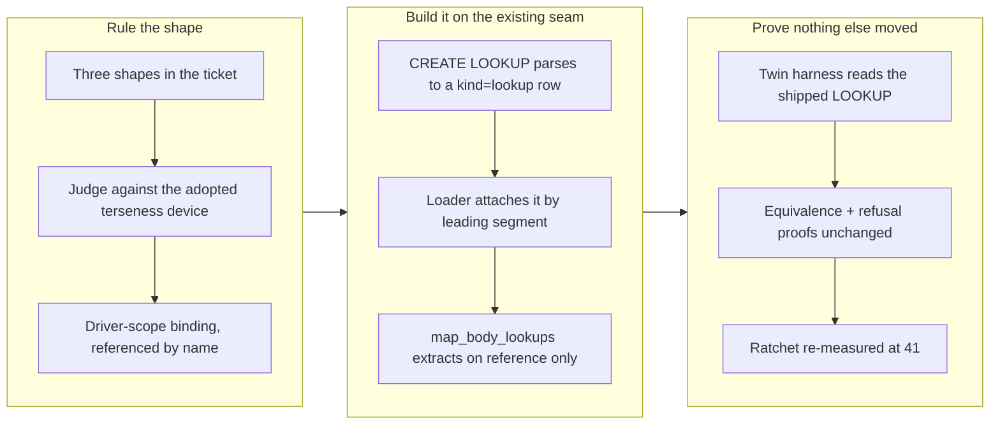

## 1. Overview

The declared Slack twin resolved a channel reference the same way in five different places, because
the declaration language had no way to say a lookup once. The branch ruled that gap and closed it
with the device the project had already adopted twice: a driver-level default with a per-map
override. `slack_driver.qfs` now states its channel lookup in one statement, and the five CALL maps
use it by naming it.

**Highlights:**

1. A new `CREATE LOOKUP <driver>/<name> AS <pipeline>` statement — one statement, one `/sys/drivers`
   row, no schema change.
2. A map body uses a shared binding by **referencing its name**; the binding is extracted only when
   the map actually spells it, and a map's own `LET` of that name shadows it.
3. `slack_driver.qfs` measures **41** statement-lines, down from 45 — and the twin's existing
   equivalence and refusal proofs pass **unchanged**, now driving the shared binding.

## 2. Motivation

Blueprint §13.1 **G9** gave a declared map body its reverse lookup, so a name-addressed write can
resolve `general` to `C0EQUIV` without the compiled driver's id-prefix heuristic. Wiring that into
Slack's five ID-requiring CALL maps (ticket 20260724014100) meant writing the identical binding five
times:

```qfs
let cid = /slack/{ws}/channels |> WHERE name == row.channel OR id == row.channel |> SELECT id
```

The cost was measured, not felt: `slack_driver.qfs` went from 40 statement-lines to 45, and the
§13.2 ratchet assertion had to move with it. §13.2's claim is that a declared twin is *more concise*
than the compiled driver it replaces; a declaration whose growth is duplication rather than content
is the weakest possible form of that claim. Worse, the term is **linear** — a service with more
ID-requiring calls than Slack's five degrades further, and github, drive and mail each have their
own name-to-id or path-to-id resolution waiting to be written once per call site.

The ticket deliberately did not prejudge the fix. It wrote up three shapes — a named binding at
declaration scope, binding inheritance from the shared mount path, or leaving it and restating the
bar — and asked for a ruling with the rejected ones recorded.

## 3. Changes



### 3-1. A declaration states its reverse lookup once ([32c9c4d](https://github.com/qmu/qfs/commit/32c9c4d))

**The ruling (blueprint §13.1 G10, recorded beside G9).** A shared lookup is a *declaration-scope
binding referenced by name* — the driver-level default-with-per-map-override shape §13.2 already
adopted for `PAGINATE` and extended for `PUSHDOWN`. Saving: **N−1 lines** for a driver with N
ID-requiring calls, which is the same arithmetic the pagination default earns.

Three properties keep it from being spooky action at a distance:

- **Demand-driven.** The binding is extracted only when the map's own wire-body expression
  references the name, so the post map issues no `conversations.list` it never asked for. A device
  that shortened the declaration by lengthening the request log would be the wrong device.
- **A local `LET` shadows.** A map that binds the name itself keeps its binding, and the shared one
  is not extracted alongside it — one binding per name, never an ordering-dependent collision.
- **Same seam, same gates.** A shared binding is validated where a local one is: the one accepted G9
  shape, and the §13 confinement that a lookup reads the declaring driver's own mount. A
  declaration-scope door is not a wider door.

**Rejected, in writing.** *Binding inheritance from the mount path* — the six shipped Slack maps
share `/slack/{ws}/{channel}/messages` by accident of dispatch-by-verb, so keying scope on the path
would build a language rule on a coincidence and make a map's bindings change when an unrelated map
moved. *An explicit per-map reference* (`LET cid = LOOKUP slack/cid`) — measures worse than the
problem: one line per map plus a declaration, so the file grows. *Leave it and restate the bar* —
accepts the linear term the next three twins would each pay.

**Spelling.** `CREATE LOOKUP slack/cid AS …`: a §5.5 definition **name**, not a path, because
nothing can read a lookup as a surface. It desugars to one `kind='lookup'` row in `sys_drivers`
using the existing columns — no migration — and the loader attaches it to the driver its key names,
the same leading-segment association `view` and `map` rows already use.

## 4. Outcome

`slack_driver.qfs` states the channel lookup once and measures **41** statement-lines (was 45; 40
before the CALL maps resolved names at all). The five CALL maps carry no binding of their own and
still issue exactly the wire traffic they did before: one `conversations.list`, then the effect leg
carrying the resolved id — asserted by the twin's existing effect-equivalence, dispatch and
unresolvable-name refusal tests, which pass unchanged against the shared binding.

Coverage added: the shared binding extracts byte-for-byte identically to the local one it replaces;
an unreferenced shared lookup is not extracted; a local `LET` shadows; an ill-shaped or foreign
shared binding is refused exactly as an inline one is; the parser stores the key as a name and
rejects the path form; and the whole path runs end to end through the commit stack.

Full gates green: `cargo test --workspace` (2711 passed, 0 failed), `clippy --workspace
--all-targets -D warnings`, `fmt --all --check`, `gen-docs --check`, `gen-skills --check`,
`check-migrations`.

## 5. Concerns

### The measured declaration is 41 lines against a bar that says ~40

- **Severity:** low
- **Description:** G10 removed the five duplicate lines and cost one, so the twin sits just above the
  §13.2 figure rather than under it (see [32c9c4d](https://github.com/qmu/qfs/commit/32c9c4d) in
  `packages/qfs/crates/qfs/src/declared_driver.rs`, the re-measured ratchet). What this change fixed
  is the **slope** — a twin no longer pays one line per ID-requiring call — not the intercept. That
  is recorded in the ratchet comment and in §13.2 rather than tuned away by moving the bar.
- **How to Fix:** Answer the open concern `the-13-2-calibration-table-was`, which already asks
  whether ~40 is the right claim for a *complete* twin now that one has been measured. Raising the
  bar is a decision to take deliberately, not a side effect of this branch.

### A shared binding is one indirection a reader of a single map must follow

- **Severity:** low
- **Description:** A CALL map body now says `{channel: cid, …}` with no binder in sight; `cid` is
  declared once, elsewhere in the same file (see
  [32c9c4d](https://github.com/qmu/qfs/commit/32c9c4d) in
  `packages/qfs/crates/skill/assets/examples/slack_driver.qfs`). That is the same trade the adopted
  driver-level `PAGINATE`/`PUSHDOWN` defaults already make, and the reference is greppable in one
  file — but it is a real readability cost, paid to remove a real duplication cost.
- **How to Fix:** Nothing yet. If it bites, `DESCRIBE` could report a declared driver's shared
  lookups alongside its views and procedures, so the binding is discoverable from the mount and not
  only from the declaration text.

### The branch scan blocks on commit size

- **Severity:** low
- **Description:** `scan-branch-safety.sh` reports `too-large-commit` (683 added implementation
  lines against a 500 limit) at severity `override` — no secret, no leak. The change is a language
  addition that lands in one piece: parser, loader, extraction, declaration and its proofs are not
  separately shippable, and roughly half the added lines are tests and the recorded ruling.
- **How to Fix:** Nothing to fix in the code. The unit routes to the PR path by policy anyway, so
  the size finding is reported for the reviewer rather than overridden.

## 6. Successful Development Patterns

- **Letting the codebase's own adopted device decide an open design question.** The ticket offered
  three shapes; the one that won is the one §13.2 had already adopted twice and measured (a
  driver-level default with a per-view override). Ruling by an existing, *measured* precedent rather
  than by taste made the rejected shapes easy to state — each fails a property the precedent
  already satisfies.
- **Making the test harness mirror a real install, so the proofs cannot pass vacuously.** The twin's
  equivalence tests build their driver from the shipped `slack_driver.qfs`. Moving the binding out
  of the map bodies meant the harness needed a `CREATE LOOKUP` extractor of its own — without it,
  the tests would have driven five CALL maps whose lookup was simply *absent* and still reported a
  pass. Four tests failing loudly for exactly that reason is what turned the existing proofs into
  this change's regression evidence.
- **Pricing a language addition before writing it.** Every §13.1 ruling states its
  declaration-cost, so "45 → 41, saving N−1" was a number to check the design against rather than a
  claim made after the fact. The device was adopted because the measurement held.

## 7. Release Preparation

**Verdict**: Ready for release

- **Concern:** `CREATE LOOKUP` is a new statement in the declared-driver DDL, additive: every
  existing declaration parses and behaves exactly as before, and no skill or cookbook article
  teaches a surface that changed (`gen-skills --check` is in sync). The binary patch is bumped to
  0.0.96; the plugin version is deliberately **not** bumped, because no taught surface moved.
- **After release:** An operator running the previously installed `slack_driver.qfs` keeps working —
  their stored map rows still carry their own `LET` bindings. Picking up the shorter declaration
  means re-installing the shipped script, the same re-install gap the Chatwork branch already
  recorded as a concern.
