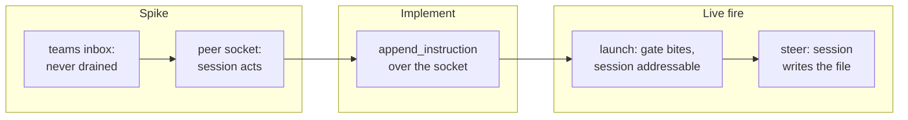

## 1. Overview

Steering a Claude Code session from a qfs query now works against real sessions. A spike put the
long-assumed teams-inbox medium to a live session and it failed; the medium that works — the
session's own peer-messaging socket — was already addressed inside the liveness record the reader
has been parsing since July. Both live-fire proofs the mission had been holding open ran and passed.

**Highlights:**

1. `append_instruction` steers a real session; a live INSERT made one write a file and say so.
2. A real qfs INSERT spawned a session through the irreversible gate, addressable on first query.
3. Four defects surfaced by running the real thing, each sent back as its own ticket.

## 2. Motivation

Acceptance items 5 and 6 had been stuck at their live halves for a month. Both tickets carried
"runs inside a container, never on the shared host" as non-negotiable, and neither had a container.
Meanwhile `SessionSource::append_instruction` failed closed for every write — deliberately, because
the retired append-log was read by nothing, and an honest refusal beats a write-only no-op. The
routine runs in an ephemeral cloud container holding no developer session, which satisfies that
constraint by construction and more strongly than it asks.

The order mattered. The previous transport was retired for being built against an assumption about
someone else's internals, and `teams_inbox.rs` was one schema capture away from repeating that —
which is exactly what the spike ticket existed to prevent, and did.

## 3. Changes

The spike replaced an assumption with an observation, the implementation followed the observation
rather than the ticket's title, and the two live rounds proved the result against real processes —
launching a session, then steering the session that launch produced.

### 3-1. Capture the real steering contract live ([6a8d084](https://github.com/qmu/qfs/commit/6a8d084))

Ten inbox files planted for a live solo session across every plausible team/member spelling sat
unread for 75 seconds, answering the spike's central question **no**. The same session then acted
within seconds on two JSON lines written to its peer socket. The record is `design-brief-steering-transport.md`.

### 3-2. Steer a live session over its peer socket ([36b7031](https://github.com/qmu/qfs/commit/36b7031))

`append_instruction` resolves a session id through the liveness record to `messagingSocketPath` plus
the sibling key file's `peerToken`, then writes the auth line and the user message. Five distinct
named refusals cover every way a target can be unreachable; no path is invented and no directory
created.

### 3-3. Prove steering reaches a real session ([85defd9](https://github.com/qmu/qfs/commit/85defd9))

A real `qfs run --commit` steered a real session, whose own job timeline shows it moving
`done → working → blocked` and narrating the work. Both fail-closed refusals were exercised live and
match the hermetic assertions word for word.

### 3-4. Prove a launch spawns an addressable session ([fdef281](https://github.com/qmu/qfs/commit/fdef281))

The irreversible gate refused the un-acknowledged commit and spawned nothing; acknowledged, it
started a real worker that appeared as a full row on the first query eight seconds later. Every
spawned process was torn down.

## 4. Outcome

Acceptance items 5 and 6 are met live, and the mission's read path was exercised end to end through
an HTTP endpoint over the real store. The mission's own `gate_assert` is **not** fully met: the
endpoint returns 200 with the driving session's row present, but `last_message` is null — measured,
not guessed, and ticketed below.

## 5. Concerns

### The mission gate's non-empty last_message clause does not hold

- **Severity:** moderate
- **Description:** The endpoint returns the driving session's row, but `last_message` is null: its
  transcript's 256 KiB tail holds 109 entries with zero visible text, while the full 1.6 MB file has
  4 (see [36b7031](https://github.com/qmu/qfs/commit/36b7031) in `packages/qfs/crates/qfs/src/claude.rs`)
- **How to Fix:** Ticket `20260816161144` — replace the fixed tail window with a bounded backward
  scan, keeping the tool-traffic redaction and a stated ceiling.

### A named launch captures the session name as its id

- **Severity:** moderate
- **Description:** Claude Code 2.1.233 prints `backgrounded · <id> · <name>`, and
  `parse_backgrounded_id` returns the line's last token (see
  [fdef281](https://github.com/qmu/qfs/commit/fdef281) in `packages/qfs/crates/qfs/src/claude.rs`).
  Latent only because the applier discards the launched id.
- **How to Fix:** Ticket `20260816161143` — anchor the parse on position, and fail closed on an
  unrecognised banner rather than returning a plausible wrong token.

### teams_inbox.rs is now dead code that must never be wired

- **Severity:** low
- **Description:** A complete, tested primitive built against the assumption the spike disproved; its
  doc comment now carries the disproof (see
  [36b7031](https://github.com/qmu/qfs/commit/36b7031) in `packages/qfs/crates/qfs/src/teams_inbox.rs`)
- **How to Fix:** Delete it, or keep it as recorded history — the developer's call, deliberately not
  taken by an unattended run.

## 6. Successful Development Patterns

- Running the real thing found what no fake could: both launcher defects live in the gap between the
  fake CLI and the real one — what it prints back, and what the query language can express going in.
- A vendor binary's own diagnostic strings documented its injection protocol verbatim, which was
  faster and safer than inferring it from minified code.
- Splitting the spike from the implementation paid for itself the moment the spike's answer was "no":
  the transport was never built against the guess.

## 7. Release Preparation

**Verdict**: Needs attention before release

- **Concern:** The mission's `gate_assert` is not fully met — `last_message` reads null for a
  tool-heavy session.
- **Before release:** Land `20260816161144` so the gate can be ticked honestly.
- **After release:** Re-run the endpoint check against a real store and record the result on the
  mission.

## 8. Notes

The branch-safety scan returns `block` on a `size` finding (513 added lines in the spike's design
brief). It is an override-tier finding, so this unit is demoted to the PR path: an unattended run
does not hold the override, and this PR waits for a human merge.
