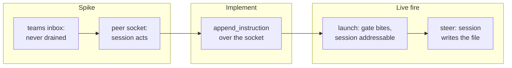

## 1. Overview

Steering a Claude Code session from a qfs query now works against real sessions. A spike put the
long-assumed teams-inbox medium to a live session and it failed; the medium that works — the
session's own peer-messaging socket — was already addressed inside the liveness record the reader
has been parsing since July. Both live-fire proofs the mission had been holding open ran and passed.

**Highlights:**

1. `append_instruction` steers a real session; a live INSERT made one write a file and say so.
2. A real qfs INSERT spawned a session through the irreversible gate, addressable on first query.
3. Four defects surfaced by running the real thing, each sent back as its own ticket.

## 2. Motivation

Acceptance items 5 and 6 had been stuck at their live halves for a month. Both tickets carried
"runs inside a container, never on the shared host" as non-negotiable, and neither had a container.
Meanwhile `SessionSource::append_instruction` failed closed for every write — deliberately, because
the retired append-log was read by nothing, and an honest refusal beats a write-only no-op. The
routine runs in an ephemeral cloud container holding no developer session, which satisfies that
constraint by construction and more strongly than it asks.

The order mattered. The previous transport was retired for being built against an assumption about
someone else's internals, and `teams_inbox.rs` was one schema capture away from repeating that —
which is exactly what the spike ticket existed to prevent, and did.

## 3. Changes



The spike replaced an assumption with an observation, the implementation followed the observation
rather than the ticket's title, and the two live rounds proved the result against real processes —
launching a session, then steering the session that launch produced.

### 3-1. Capture the real steering contract live ([6a8d084](https://github.com/qmu/qfs/commit/6a8d084))

Ten inbox files planted for a live solo session across every plausible team/member spelling sat
unread for 75 seconds, answering the spike's central question **no**. The same session then acted
within seconds on two JSON lines written to its peer socket. The record is `design-brief-steering-transport.md`.

### 3-2. Steer a live session over its peer socket ([36b7031](https://github.com/qmu/qfs/commit/36b7031))

`append_instruction` resolves a session id through the liveness record to `messagingSocketPath` plus
the sibling key file's `peerToken`, then writes the auth line and the user message. Five distinct
named refusals cover every way a target can be unreachable; no path is invented and no directory
created.

### 3-3. Prove steering reaches a real session ([85defd9](https://github.com/qmu/qfs/commit/85defd9))

A real `qfs run --commit` steered a real session, whose own job timeline shows it moving
`done → working → blocked` and narrating the work. Both fail-closed refusals were exercised live and
match the hermetic assertions word for word.

### 3-4. Prove a launch spawns an addressable session ([fdef281](https://github.com/qmu/qfs/commit/fdef281))

The irreversible gate refused the un-acknowledged commit and spawned nothing; acknowledged, it
started a real worker that appeared as a full row on the first query eight seconds later. Every
spawned process was torn down.

### 3-5. Read the session id by position, not last token ([192847d](https://github.com/qmu/qfs/commit/192847d))

Driven on a later resume of the same claim, from the ticket 3-4 minted. `parse_backgrounded_id`
reads the token **after the first separator** and states the two banner shapes it accepts; anything
else yields `None` so `launch` fails closed. The id is still deliberately dropped at the applier,
and that decision — the effect channel carries a count and no row — is now written where it happens
instead of being re-discovered.

### 3-6. Widen the transcript scan past tool traffic ([b57cea5](https://github.com/qmu/qfs/commit/b57cea5))

The single 256 KiB window became a stepped backward scan (256 KiB → 1 MiB → 4 MiB), so a recent
message still costs one small read and a message buried under tool traffic is found. The ceiling is
a stated property: text older than 4 MiB still reads null, because a listing surface may not scan an
unbounded file per session per query.

Writing the ceiling test found a second bug in the first attempt: `read_tail` returns `None` both
for an unreadable file *and* for a window holding no complete line — which a transcript of long
`tool_result` entries really produces — so propagating it with `?` aborted the widening at the first
narrow window. The absent-file case is now answered once, up front; inside the loop a `None` widens.

### 3-7. Let an unrecorded session status read null ([032600a](https://github.com/qmu/qfs/commit/032600a))

`status` is nullable, and the `"unknown"` sentinel is gone: null means the store recorded no state,
which is a different fact from any status string. Deriving a status from `kind` or process liveness
was rejected as the same sentinel with a better-chosen word. The schema, the reader, the module doc
and the filter examples moved together — and the documented `WHERE status='running'` turned out to
be wrong twice over, since `running` is not a value this store writes for a session of *either*
kind.

## 4. Outcome

Acceptance items 5 and 6 are met live, and the mission's read path was exercised end to end through
an HTTP endpoint over the real store. The two defects that held the mission's own `gate_assert`
open are now fixed, and the read was re-run live against this container's real `~/.claude`:

```
$ qfs run "/hosts/local/claude/sessions"        # QFS_CLAUDE_SESSIONS=/root/.claude
{"rows":[{"id":"29b97d96-…","cwd":"/home/user/qfs","name":"qfs-80",
          "status":null,"last_message":"Race confirmed: 1 of 3 local runs red, …"}], …}
```

**What that live run does and does not prove.** It proves 3-7 outright: the same query against the
pre-change binary on the same store returns `"status":"unknown"`, and against this branch's binary
returns `null`. It does **not** by itself prove 3-6, and saying so matters — both binaries return
the same non-empty `last_message` here, because this session's transcript (2.17 MB) happens to carry
visible text inside its final 256 KiB, so the defect's precondition is absent. 3-6's mechanism is
proven by fixture instead, on a transcript shaped like the one that was measured on 2026-08-16:
tool traffic in the first window, the real message behind it.

## 5. Concerns

### One qfs unit test still reads the shared config home, so the suite result is a race

- **Severity:** moderate
- **Description:** `provision::tests::offline_run_engine_does_not_mount_server` reaches the system
  DB through `shell::run_engine_and_reads` without a `HomeGuard`, so it trips the
  shared-home guard whenever no other test's guard happens to be alive. Measured here: 1 of 3 local
  full-suite runs red, the other 2 green; CI's `build + test (native)` green on the same tree. The
  test body is byte-identical on `origin/main` and reproduces there in isolation, so this is neither
  caused by nor confined to this branch.
- **How to Fix:** Ticket `20260818060942` — decide between giving the test its own guard and making
  `run_engine_and_reads` not open the store for an offline plan check, then sweep for the rest of
  the class and make the guard's own coverage non-racy.

### The two defects this branch's live-fire surfaced are now fixed, not deferred

- **Severity:** low
- **Description:** `20260816161143` (a named launch captured the session name as its id) and
  `20260816161144` (`last_message` null for a tool-heavy session) were carried here as concerns by
  the first pass. Both were driven on a later resume of this claim — see 3-5 and 3-6 — along with
  `20260816161145`. This entry stays so the concern's life is readable rather than silently deleted.
- **How to Fix:** Nothing outstanding.

### teams_inbox.rs is now dead code that must never be wired

- **Severity:** low
- **Description:** A complete, tested primitive built against the assumption the spike disproved; its
  doc comment now carries the disproof (see
  [36b7031](https://github.com/qmu/qfs/commit/36b7031) in `packages/qfs/crates/qfs/src/teams_inbox.rs`)
- **How to Fix:** Delete it, or keep it as recorded history — the developer's call, deliberately not
  taken by an unattended run.

## 6. Successful Development Patterns

- Running the real thing found what no fake could: both launcher defects live in the gap between the
  fake CLI and the real one — what it prints back, and what the query language can express going in.
- A vendor binary's own diagnostic strings documented its injection protocol verbatim, which was
  faster and safer than inferring it from minified code.
- Splitting the spike from the implementation paid for itself the moment the spike's answer was "no":
  the transport was never built against the guess.

## 7. Release Preparation

**Verdict**: Needs attention before release

- **Concern:** The `status` column of `/claude/sessions` widened from non-nullable to nullable. That
  is versioned surface under the README's SemVer policy; the direction is a widening, so no recorded
  value is reinterpreted, but a consumer that assumed a non-null cell now sees null.
- **Before release:** Nothing blocking. The two defects that held the mission's `gate_assert` open
  are fixed; the racy test above is pre-existing on `main` and green in CI.
- **After release:** Re-run `qfs run "/hosts/local/claude/sessions"` against a real store and record
  the result on the mission, including a session whose transcript tail is pure tool traffic — the
  one shape this container could not supply.

## 8. Notes

The branch-safety scan still returns `block` on the same `size` finding (513 added lines in the
spike's design brief, commit `6a8d084`). It is an override-tier finding, so this unit stays demoted
to the PR path: an unattended run does not hold the override, and this PR waits for a human merge.
Re-checked on the resume, 2026-08-18 — unchanged, because the offending commit is unchanged.

Two tickets were minted on the resume and left in `todo/`:

- `20260818060942-one-qfs-unit-test-still-reads-the-shared-config-home.md` — the racy suite result
  described under Concerns.
- `20260816161146-server-guide-config-example-does-not-parse.md` was minted by the first pass and
  names no mission, so it is **not** a member of this unit and was deliberately not driven here; it
  becomes claimable backlog when this branch merges.

## Deployment Evidence

- **When:** 2026-08-19T04:52:04+09:00
- **By:** a@qmu.jp
- **Target:** github-release
- **Method:** release-scan size override
- **Status:** bypassed
- **Observed:** release-scan reported one overridable size finding: rule too-large-commit on 6a8d084, 513 added lines of implementation against a 500 limit. No hard finding, no credential finding. Overridden by the developer as part of the 2026-08-19 batch clearing of the open pull request backlog; splitting the commit would require rewriting published history for a commit-granularity lint.
