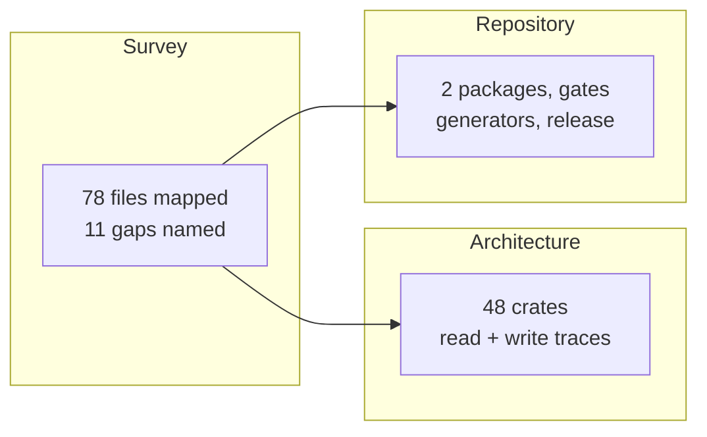

## 1. Overview

The documentation described qfs's intent and its usage well, and its current situation not at all.
Three pages now do, each read from the source and pinned to the commit and binary version it was
verified against.

**Highlights:**

1. Every documentation file in the repository is mapped — writer, claim, and what it does not reach.
2. All 48 crates, a read trace and a write trace with resolvable entry points, the two stores, the faces.
3. Both packages, every gate command with what it alone catches, the three generators, the release path.

## 2. Motivation

A reader arriving today — human or agent — had to read the source to learn what qfs is now.
`docs/blueprint.md` states intent with per-section status markers, the generated references state
the exact grammar and driver catalog, and the guide states usage; between them sat the gap the
mission names. The gap was not evenly distributed: `packages/qfs/ARCHITECTURE.md` mapped 20 crates
against 48 on disk and lived outside the site, and `packages/qfs-viewer/` — a whole TypeScript
project with its own gate runner — appeared nowhere a documentation reader would look.

The survey ticket ran first on purpose, so the two writing tickets covered what was actually
missing rather than what the proposal guessed. Three of its findings changed the other two pages.

## 3. Changes

The survey established the documentation surface and, independently, what ships today; the diff
between them produced eleven named gaps. Two of those gaps were the other two tickets' subject
matter, so each writing ticket started from a confirmed absence rather than an assumption. Three
further findings — a missing test the guidance names, a broken production docs build, and a gate
that cannot pass where bun is installed — became tickets rather than opportunistic fixes.

### 3-1. Map the documentation surface against what ships ([16f7e74](https://github.com/qmu/qfs/commit/16f7e74))

Adds `docs/documentation-map.md`: one row per documentation file with its writer, what it claims,
its last change, whether the site navigation reaches it, and what current state it does not reach,
plus what ships today read from the source and eleven specific gaps.

### 3-2. Document the architecture as built ([1af7bce](https://github.com/qmu/qfs/commit/1af7bce))

Adds `docs/guide/architecture.md`: the 48 crates by layer with the dependency spine and the tokio
confinement rule, a nine-stage read trace and a nine-stage write trace naming real entry points, the
two SQLite stores and the vault with their files on disk, and the seven faces.

### 3-3. Document the repository as it stands ([1474d3d](https://github.com/qmu/qfs/commit/1474d3d))

Adds `docs/guide/repository.md`: both packages and how the qfs-viewer snapshot relates to its
upstream, the one seam between them, each gate command with what it proves and what it alone
catches, the three anti-drift generators, and the path from a patch bump to an installable release.

## 4. Outcome

The mission's three acceptance criteria are met, and the docs site carries a new "The project as
built" section holding all three pages. Three defects found on the way are queued as tickets rather
than fixed here.

## 5. Concerns

### The anti-drift generators are unevenly enforced

- **Severity:** moderate
- **Description:** Of the three checks `CLAUDE.md` lists, only `gen-docs` drift fails automatically — via a unit test inside `qfs::docs`. `.github/workflows/ci.yml` never invokes `xtask`, so a stale `SKILL.md` or an edited shipped migration body reaches `main` unless a person runs the command (see [16f7e74](https://github.com/qmu/qfs/commit/16f7e74) in `.github/workflows/ci.yml`)
- **How to Fix:** Give `gen-skills --check` a unit test in a workspace crate the way `gen-docs` has, or add an `xtask` step to CI covering both it and `check-migrations`.

### The three new pages have no drift check

- **Severity:** low
- **Description:** All three are dated readings of the source; nothing verifies a crate count, a symbol, or a gate command after the day they landed (see [1af7bce](https://github.com/qmu/qfs/commit/1af7bce) in `docs/guide/architecture.md`)
- **How to Fix:** If the pages prove worth keeping current, mechanize the checkable half — the crate list against `cargo metadata`, and the cited symbols against the source — the way `gen-docs` checks the references.

## 6. Successful Development Patterns

- Establishing the shipped system from the binary and `cargo metadata` *before* reading any page made the diff real: reading both sides from the docs would have produced a vacuous survey.
- Verifying prose mechanically (crate rows against `cargo metadata`, 43 named symbols grepped, 60 cited paths resolved, pages driven in a real browser) caught three errors in the drafts that review would likely have missed.

## 7. Release Preparation

**Verdict**: Ready for release

- **Concern:** `npm run docs:build` fails on a pre-existing `docs/blueprint.md` markdown break, so the production site build is red on `main` today; the three new pages compile and serve.
- **Concern:** `packages/qfs-viewer/scripts/check-all.sh` exits 1 on a machine with bun installed, from a `plgg-md@0.0.3` dist bun rejects. CI installs Node only, so its viewer job is green.
- **Before release:** Nothing — this branch changes no shipped code path; the binary gate (`fmt`, `clippy`, `test`, `build`, all three `xtask` checks) is green at `0.0.109`.
- **After release:** Pick up the three tickets this run filed: the missing cookbook ratchet, the docs-build break, and the bun gate.

## 8. Notes

Three tickets were minted mid-run into `.workaholic/tickets/todo/`: `20260817105331-…-ratchet-…`,
`20260817110309-…-docs-site-production-build-…`, `20260817111530-…-bun-is-installed`.
