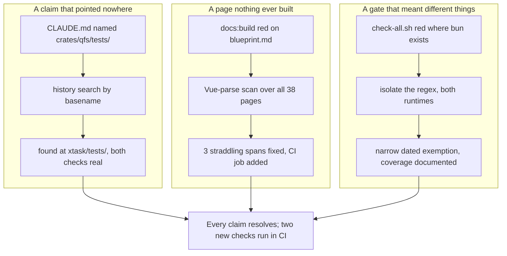

## 1. Overview

The documentation-mapping mission's three follow-up tickets each turned out to be a **checking** gap
rather than a writing gap: a claim pointing at a moved file, a page nothing ever built, and a gate whose
meaning depended on which runtimes the machine happened to carry. All three are closed with the check
made real, and two of the three are now defended by CI that previously ran neither.

**Highlights:**

1. The cookbook recipe ratchet was never missing — it moved to `xtask/tests/`, and `cargo test --workspace` has been enforcing it all along.
2. `npm run docs:build` was broken on three code spans and no gate ran it; a `docs-build` job now walks every page on every push.
3. The qfs-viewer gate passes on a bun machine again, and now states that a green run proves **node only**.

## 2. Motivation

Writing the mission's three dated pages turned up three defects the survey could name but not fix, each
filed as its own ticket and each looking like a documentation error from outside. None was. The ratchet
claim was stale by one directory move; the docs site had been unbuildable for an unknown length of time
because the documented workflow compiles pages on demand and nobody had opened that page; the viewer gate
was red wherever bun exists because a published dependency cannot be parsed by bun at all. Each time the
prose described a check that had moved, had never run, or had quietly narrowed — so the fix was to make
the check true and state what it covers, not to reword the claim.

That is the survey ticket's lesson from the other side: this repository's documentation drifts least
where a generator or a test owns it, most where a sentence describes machinery that has since moved.

## 3. Changes

Each ticket began with a claim in a document and ended at the machinery behind it. The first was a
false negative — the surveyor checked the two paths the repository named, found nothing, and concluded
the ratchet was absent while it sat at a third path fully implemented. The second and third were true
findings whose root causes were both "a check that does not run where you think it does": on-demand page
compilation, and a runtime loop whose coverage is a property of the host.

### 3-1. The cookbook recipe ratchet two places name does not exist ([c4b5e72](https://github.com/qmu/qfs/commit/c4b5e72))

A history search by filename showed the ratchet was renamed from `crates/test/tests/` to `xtask/tests/`
on 2026-08-16, and that the path `CLAUDE.md` gave has never existed at any commit. The references now
resolve, both places state what the ratchet does **not** cover, and the distinction between
`cargo test --workspace` (which runs it) and the `xtask --check` subcommands (which no CI job invokes)
is written down.

### 3-2. The docs site production build fails on blueprint.md ([84040bc](https://github.com/qmu/qfs/commit/84040bc))

VitePress does not form an inline code span whose backticks straddle a newline, so `<path>`/`<name>`
reached the Vue compiler as unclosed elements. Parsing every rendered page with the compiler the build
itself uses found **three** such spans rather than the one the build reported, all fixed with no wording
changed, and a `docs-build` CI job now walks the production build so the class cannot return unseen.

### 3-3. The qfs-viewer gate cannot pass where bun is installed ([1e987e6](https://github.com/qmu/qfs/commit/1e987e6))

bun 1.3.11 cannot parse `plgg-md`'s published dist — one regex class emitted with raw control bytes that
node accepts and bun rejects as "range out of order", present in both published versions. The gate now
carries a narrow, dated, tracked exemption that reports bun as **not covered** rather than passing, and
CI's node-only coverage is stated in the workflow, the viewer README and the repository guide.

## 4. Outcome

The mission's three follow-ups are closed and the claims those pages make are now true — in two cases
machine-defended by CI that previously ran neither check. Two tickets were minted for work deliberately
left out of scope: the remaining unformed code spans, and the upstream filing this environment cannot
perform.

## 5. Concerns

### The bun runtime is exempted, not fixed

- **Severity:** moderate
- **Description:** `npx qfs-viewer` genuinely does not run under bun — `plgg-md`'s published dist fails to parse in both 0.0.2 and 0.0.3, so the product's stated runtime matrix is not met (see [1e987e6](https://github.com/qmu/qfs/commit/1e987e6) in `packages/qfs-viewer/scripts/smoke-npx.sh`). The gate now passes by declaring bun uncovered.
- **How to Fix:** File and land the upstream fix in `qmu/plgg` (escape control characters in the bundler's regex output), then remove the exemption — tracked by ticket `20260817131540`, which this run could not do because its GitHub access is scoped to `qmu/qfs`.

### WITHDRAWN 2026-08-17 — "Seventy-seven code spans still render as literal backticks"

- **Severity:** low
- **Description:** **This concern was wrong and is withdrawn, not deferred** (ticket `20260817130410`, driven on `work-20260817-132305`). It rested on counting backticks in rendered HTML outside `<pre>`/`<code>`; that measure is invalid, because VitePress puts each heading's **raw markdown** into its permalink `aria-label`, and HTML comments are preserved verbatim — so every one of the 154 was a legitimate backtick in an attribute or a comment, not an unformed span. There are **zero** unformed code spans in `docs/`.
- **How to Fix:** Nothing to fix. The real class is narrower than this branch's story stated — see the corrected mechanism in ticket `20260817130410`'s Final Report — and it is fully closed by [84040bc](https://github.com/qmu/qfs/commit/84040bc) and defended by the `docs-build` job, since every instance of it breaks the Vue compiler by construction.

### deno's leg of the runtime matrix is unproven

- **Severity:** low
- **Description:** deno is absent from CI and from the container this was measured on, so the smoke skips it out loud and nothing anywhere demonstrates that `npx qfs-viewer` works under it (see [1e987e6](https://github.com/qmu/qfs/commit/1e987e6) in `docs/guide/repository.md`).
- **How to Fix:** Run the smoke once on a machine with deno installed and record the result; if it hits the same `plgg-md` parse path, the pending upstream fix covers it too.

## 6. Successful Development Patterns

- **Search history by basename, not by path, before concluding a file is gone** — a stale reference and a missing artifact look identical from the reader's side, and `git log --diff-filter=ADR --name-status -- '*name.rs'` distinguishes them in one command. This branch's first ticket was premised on the wrong one of the two.
- **Scan with the downstream compiler, not with an allow-list of what looks legitimate** — `<path>` is a real SVG element, so an allow-list scan hid two of three broken spans; parsing rendered output with the same Vue compiler the build uses needs no list and found all three at once.
- **When exempting a known failure, match the exact signature and prove the near-misses still fail** — the bun exemption was exercised against four inputs that resemble it (different error, different package, different failure mode, different runtime) and all four still fail the gate.

## 7. Notes

The mission's `## Acceptance` was already fully checked before this branch — these three tickets were
minted during its first pass, additional to the agreed plan. Two further tickets minted here
(`20260817130410`, `20260817131540`) mean the mission stays claimable after this merges.
