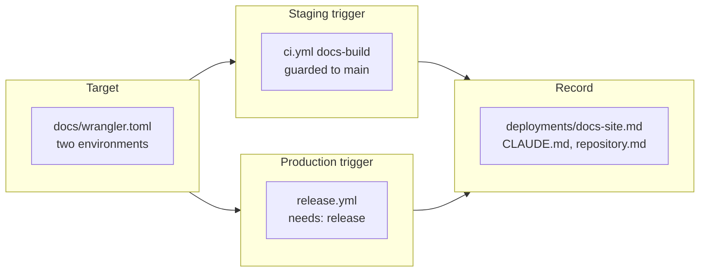

## Handoff

**This branch is complete but unverified here. Someone must verify it before it merges.**

- **Done:** All four tickets. `docs/wrangler.toml` declares both environments, `ci.yml` publishes
  staging on a merge to `main`, `release.yml` publishes production after the Release job, and
  `.workaholic/deployments/docs-site.md` records the procedure. Everything is pushed.
- **Not done:** "publishing to a Cloudflare account and creating the two qmu.co.jp hostnames needs
  credentials an unattended run does not hold"; "confirming the staging hostname serves the merged
  commit needs the live Cloudflare account and DNS"; "confirming the production hostname serves the
  released docs needs the live Cloudflare account and a real tag push".
- **Next step:** Create the two Workers projects and attach the custom domains
  (`npm run docs:build && npm run docs:deploy:staging`, then the production pair), set
  `CLOUDFLARE_API_TOKEN` and `CLOUDFLARE_ACCOUNT_ID` as repository secrets, then merge. See
  concern *Merging before the Cloudflare secrets exist turns `main` red* — the order matters.
- **Attempted:** Not attempted — declared unrunnable in an unattended environment at ticket
  creation (`verification_handoff:` on all three deploy tickets). The credential-free half was
  run: `npm run docs:deploy:dry-run` → `Read 142 files from the assets directory … --dry-run:
  exiting now.` for both environments.

## 1. Overview

The documentation site now publishes itself to two hostnames on the two events the repository
already distinguishes: a merge to `main` reaches staging, and a `v*` tag reaches production. No
deploy command is run by a person in either path, and both hostnames say which commit they carry.

**Highlights:**

1. One Workers target, two environments, neither of them reachable without an explicit `--env`.
2. Staging publishes from CI's existing `docs-build` job — one build, not a second one.
3. Production waits on the Release job, so a failed binary release advertises no version.

## 2. Motivation

The docs site was built by CI on every push and read by nobody but whoever ran
`docker compose up docs`. The build existed only to prove the pages compile — a gate added days
earlier after a page had been unbuildable for an unknown length of time — so the artifact was
produced and thrown away. Meanwhile the repository already distinguished two states worth
publishing separately: what is on `main`, and what a `v*` tag released. Each now reaches a
hostname of its own.

## 3. Changes

The target came first because the two triggers had nothing to publish to; the record came last
because, written before the workflows landed, it would have described an intention rather than a
deployment. Each trigger names its environment explicitly, so neither can reach the other's
hostname, and both call one shared stamp script so the two builds cannot drift in what they say
about themselves.

### 3-1. Add a Workers deploy target for the docs site ([e88802f](https://github.com/qmu/qfs/commit/e88802f))

Declared a Cloudflare Workers static-assets target for the VitePress build with `staging` and
`production` environments, and put the three `docs:deploy:*` commands in `package.json` so a human
and both workflows invoke one thing.

### 3-2. Publish the docs site to staging on merge ([d2be794](https://github.com/qmu/qfs/commit/d2be794))

Two guarded steps in the existing `docs-build` job publish `main` to staging-qfs.qmu.co.jp. The
ticket's open question — public or restricted — was resolved to public and non-indexable, with the
reasoning recorded in the ticket's Final Report.

### 3-3. Publish the docs site to production on release ([409fb5c](https://github.com/qmu/qfs/commit/409fb5c))

A `docs-deploy-production` job on the `v*` tag, `needs: [release]`, building from the tagged
checkout so what is served is the tag's documentation rather than `main`'s at deploy time.

### 3-4. Record the docs site deployment ([3af37e4](https://github.com/qmu/qfs/commit/3af37e4))

Wrote the second deployment record and corrected the three places that still asserted the
repository had only one — `CLAUDE.md`, `github-release.md`, and the contributor page's CI
paragraph.

## 4. Outcome

The mission's three acceptance criteria are met in code and unverified in the world: the mechanism
exists end to end and has never published a byte, because the Cloudflare account and the two
hostnames do not exist yet.

## 5. Concerns

### Merging before the Cloudflare secrets exist turns `main` red

- **Severity:** urgent
- **Description:** A failed deploy fails `docs-build` by design, so with `CLOUDFLARE_API_TOKEN`
  unset the first merge to `main` gives a red run on the base branch for a missing credential
  (see [d2be794](https://github.com/qmu/qfs/commit/d2be794) in `.github/workflows/ci.yml`).
- **How to Fix:** Set both repository secrets and publish once by hand before merging.

### One deployment record carries two environments

- **Severity:** low
- **Description:** `docs-site.md` carries one `environment: production` field and documents
  staging in its body, so `/ship` sees one target where there are two (see
  [3af37e4](https://github.com/qmu/qfs/commit/3af37e4) in `.workaholic/deployments/docs-site.md`).
- **How to Fix:** Split it if staging ever becomes something released *to*.

### `wrangler` is installed on every branch push

- **Severity:** low
- **Description:** `docs-build` runs `npm install` on every push and pull request, and the new
  devDependency adds 164 packages for a step that runs only on `main` (see
  [e88802f](https://github.com/qmu/qfs/commit/e88802f) in `package.json`).
- **How to Fix:** Give the publish its own `push: branches: [main]` job if the ~15s becomes visible.

## 6. Successful Development Patterns

- The open decision was resolved by separating the *harm* (unreleased docs outranking released
  ones) from the *mechanism* offered (access restriction): an indexing harm took an indexing fix.
- Both triggers call one `scripts/stamp-docs-deploy.sh`, so what a published build says about
  itself has one definition rather than two that drift.

## 7. Release Preparation

**Verdict**: Needs attention before release

- **Concern:** The publish path has never run; both hostnames and the Cloudflare project are still
  to be created.
- **Before release:** Set `CLOUDFLARE_API_TOKEN` and `CLOUDFLARE_ACCOUNT_ID`, publish both
  environments by hand, and attach the two custom domains with their DNS records.
- **After release:** `curl -sS https://staging-qfs.qmu.co.jp/version.json` after the merge, and
  `curl -sS https://qfs.qmu.co.jp/version.json` after the next `v0.0.111` tag; both should report
  the expected commit and environment.

## 8. Notes

One ticket was minted: `20260817164716-a-tag-can-publish-reference-docs-that-drifted-from-the-binary.md`.
No CI job runs `gen-docs --check`, so a tag can publish reference pages contradicting the binary
from that same tag — private until this branch made it public.
