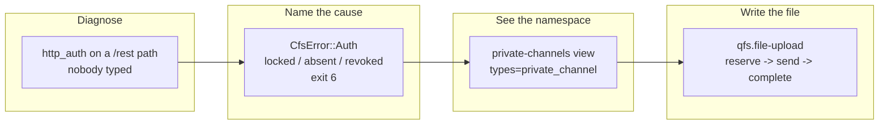

## 1. Overview

Slack was the one connected service qfs could read files from and not write files to, and the one
whose channel listing could see half its namespace. Both gaps are closed, and the error class that
hid them — a credential failure reported as an invalid path — now names its own cause.

**Highlights:**

1. `upsert into /slack/<ws>/<channel>/files/<name>` uploads a file through Slack's three-call flow, verified live end to end.
2. A `private-channels` view makes a channel miss mean something; the first read found a channel this repository had recorded as nonexistent.
3. A credential that cannot be resolved reports locked / absent / revoked and exits 6, not 2.

## 2. Motivation

The operator reported that reading and writing Slack attachments did not work. Reading was two
stale installs — a binary 21 commits behind, a declaration predating the file surface. Writing did
not exist: the declaration recorded the upload as inexpressible because a declared map is one
request and Slack's upload is three, while the download side had already disproved that premise
with a scoped transport primitive.

The discovery gap surfaced from the opposite direction: asked whether a channel existed, qfs said
no, and the honest answer was "not in the half I can see" — an answer this repository had already
recorded as settled and opened an operator decision on top of.

## 3. Changes

A masked error was the thread: it hid a locked vault, then a stale install, and following it to the
Slack file surface exposed one half-built write surface and one half-blind read surface. Each was
fixed at the seam that caused it — the error mapper, the declaration, the applier — and the last of
them was proved on the operator's own workspace rather than on a fixture.

### 3-1. Say which credential resolution failed instead of `http_auth` ([70bedfc](https://github.com/qmu/qfs/commit/70bedfc))

`read_http_error` collapsed the store's four secret-free codes into one label and reported them
against the wire path, as `kind: usage`. The failure now carries its cause and the action that
clears it, names the path the caller addressed, and lands in the auth class that already existed
and nothing reached.

### 3-2. Ship the `private-channels` view so a channel miss is evidence ([c07fd70](https://github.com/qmu/qfs/commit/c07fd70))

Slack's `conversations.list` defaults to public channels, so the single shipped discovery view was
structurally blind to private ones. A sibling view — not a widening — keeps a channel-scoped token's
public listing working when `groups:read` is absent.

### 3-3. Upload a file to Slack through a scoped three-call primitive ([c07fd70](https://github.com/qmu/qfs/commit/c07fd70))

`qfs.file-upload` performs reserve → send → complete with the mount's own account, admitting only
the `files.slack.com` URL Slack delivered and refusing every redirect. The declared map addresses
the file by name under its channel, so an upload is the ordinary blob write.

## 4. Outcome

Slack's file surface is symmetric: a file reads out and writes back, proved live into the private
channel `dev-qfs` with a byte-identical round trip. Discovery covers both halves of the namespace,
and the record that said otherwise is corrected in place.

## 5. Concerns

### The declared write path carries bytes as a JSON array

- **Severity:** moderate
- **Description:** `value_to_json` renders `Value::Bytes` as an array of numbers, so an upload costs roughly four times the file's size in memory in flight (see [c07fd70](https://github.com/qmu/qfs/commit/c07fd70) in `packages/qfs/crates/codec/src/convert.rs`)
- **How to Fix:** Add an `ENCODE bytes` wire encoding that posts a `Value::Bytes` body verbatim as `application/octet-stream`; the upload primitive consumes it unchanged

### A Slack channel resolves by id only, on every path

- **Severity:** moderate
- **Description:** Reads, posts and now uploads all substitute the path segment into a Slack method that takes an id, so a documented name-addressed example cannot work (see [b062f17](https://github.com/qmu/qfs/commit/b062f17) in `packages/qfs/crates/skill/assets/examples/slack_driver.qfs`)
- **How to Fix:** Land ticket `20260918044700`, which fixes reference resolution once for the whole surface rather than per map

### The `path.<param>` lookup key has no shipped consumer

- **Severity:** low
- **Description:** The declared-lookup widening is correct and tested, but the upload map that motivated it now passes the channel through instead (see [c07fd70](https://github.com/qmu/qfs/commit/c07fd70) in `packages/qfs/crates/exec/src/declared.rs`)
- **How to Fix:** Either consume it from the reference-resolution ticket above, or remove it if that ticket lands another way

### The §13.2 conciseness bar moved again

- **Severity:** low
- **Description:** The declared Slack twin is 50 statement lines against a ~40 claim, and the assertion was raised to 51 rather than the claim re-examined (see [c07fd70](https://github.com/qmu/qfs/commit/c07fd70) in `packages/qfs/crates/qfs/src/declared_driver.rs`)
- **How to Fix:** Answer the standing `the-13-2-calibration-table-was` concern now that one twin covers its service completely

## 6. Successful Development Patterns

- A negative result is only as wide as the instrument that produced it — "no such channel" was a listing that could not see private ones, and nothing in the output distinguished the two.
- Probing the stated impossibility first: the declaration's own comment said the upload could not be expressed, and the download side had already disproved the premise.
- A lookup is only as wide as the collection it searches; binding through a partial one does not fail loudly, it makes exactly the invisible rows unaddressable.

## 7. Release Preparation

**Verdict**: Ready for release

- **Concern:** The branch-safety scan reports one `override`-severity size finding — 814 added implementation lines in [c07fd70](https://github.com/qmu/qfs/commit/c07fd70), above the 500 threshold. No secret or leak finding.
- **Before release:** Acknowledge that size override consciously at `/ship`.

## 8. Notes

The operator's installed binary and Slack declaration were both refreshed during this work, which
is what made downloads start working before any code here landed.
