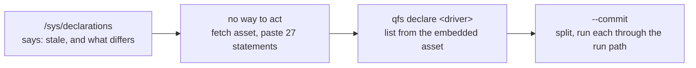

## 1. Overview

The binary embeds four declared-driver programs and gave an operator no way to install one from it.
`qfs declare` closes that: it lists what the artifact carries and installs or refreshes one through
the ordinary preview → commit gate, with no download and no copy-paste.

**Highlights:**

1. `qfs declare` lists the shipped declarations; `qfs declare <driver> --commit` installs one.
2. Statement splitting and execution reuse the shipped splitter and the one-shot run path.
3. The FAQ's currency answer now ends in an action instead of a manual procedure.

## 2. Motivation

`/sys/declarations` has been able to say "your `/slack` is stale, and here is every statement that
differs" since August. Acting on that answer meant fetching the asset from GitHub and pasting its
statements one at a time — so the answer was complete and unusable, and an operator who did not
know the procedure simply ran a current binary against a declaration older than it.

That is not hypothetical. On 2026-09-18 a v0.0.137 install — shipping the scoped Slack file read
since v0.0.136 — had a Slack mount that could list attachments and not read one, because the
installed declaration predated the read. Config and code move independently, so every service qfs
declares carries the same gap permanently.

## 3. Changes

The read half existed and the write half did not; this adds the write half against the same
embedded bytes the currency check already compares against, so one artifact answers both questions.

### 3-1. Install a shipped declaration from the binary that carries it ([bfc96ad](https://github.com/qmu/qfs/commit/bfc96ad))

`qfs declare [<driver>] [--commit]`, with the shipped set injected exactly as the skill is, the
driver name derived from the declaration's own `CREATE DRIVER`, and the first failing statement
stopping the run with its own exit code.

## 4. Outcome

An operator upgrading qfs can bring their declarations current from the binary in one command, and
the FAQ and the Slack cookbook now prescribe it where they prescribed a manual re-install.

## 5. Concerns

### `qfs declare` never removes a node

- **Severity:** low
- **Description:** The command adds and replaces; locally-added nodes the binary does not ship are left alone, so such a declaration still reads `stale` after a successful install (see [bfc96ad](https://github.com/qmu/qfs/commit/bfc96ad) in `packages/qfs/crates/cmd/src/lib.rs`)
- **How to Fix:** Nothing, unless a `--prune` is wanted later; the output says so explicitly and `REMOVE VIEW|MAP|TYPE` remains the way to drop one

### Each statement rebuilds the run context

- **Severity:** low
- **Description:** A 27-statement install builds the Engine and ReadRegistry 27 times, because it reuses `dispatch_run` per statement (see [bfc96ad](https://github.com/qmu/qfs/commit/bfc96ad) in `packages/qfs/crates/cmd/src/lib.rs`)
- **How to Fix:** Hoist the context if a declaration ever grows enough for it to matter; reusing the tested path was worth the cost at this size

## 6. Successful Development Patterns

- Reusing the one-shot run path per statement bought the preview/commit gate, the renderers and the exit codes for free, instead of a second implementation of each.
- Deriving the driver name from the declaration rather than storing it beside the asset keeps one fact in one place.

## 7. Release Preparation

**Verdict**: Ready for release

- **Before release:** None — the branch-safety scan is clean.
