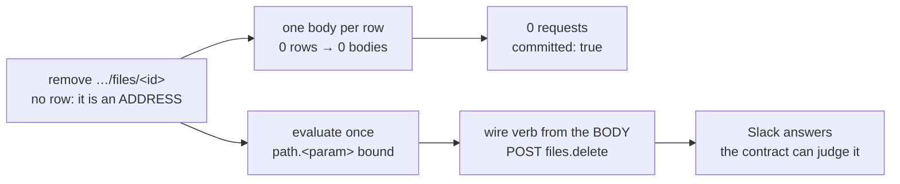

## 1. Overview

Deleting a Slack file passed the irreversible gate, reported `committed: true`, and deleted nothing.
Tracing found no wire request at all. Two stacked defects in the declared-map write path caused it,
and the second was unreachable until the first was fixed.

**Highlights:**

1. A write addressed at its target evaluates its body once instead of never.
2. A declared map's wire leg uses the verb its body declares, not the one the mount was addressed with.
3. A rowless write whose body needs a row is refused before the wire instead of sending nulls.

## 2. Motivation

The operator asked for the file they had uploaded to be removed. It was not, and the command said it
was — twice, on a freshly uploaded file, with the content still readable afterwards. An irreversible
verb reporting an effect it never performed is the worst shape a defect can take here: everything
downstream, including the operator, reads the success as the record.

The response contract that turns Slack's HTTP-200 refusal into a failed effect had been correct
since August. It was never handed a response to judge.

## 3. Changes

### 3-1. A declared write addressed at its target reports success and sends nothing ([fadcca7](https://github.com/qmu/qfs/commit/fadcca7))

`eval_map_body` evaluates a rowless write once with `path.<param>` bound, refuses one whose body
reads `row.<field>`, and `apply_facets` now takes the wire effect kind from the map body's declared
verb for every map kind rather than only for a `CALL`.

## 4. Outcome

`remove /slack/<ws>/files/<id>` issues one `POST https://slack.com/api/files.delete` and the file is
gone — verified live, including the listing afterwards. Every declared driver's address-only writes
gain the same correction; nothing about it is Slack-specific.

## 5. Concerns

### A rowless write that needs a row now fails where it used to be silent

- **Severity:** low
- **Description:** A declaration whose body reads `row.<field>` under an address-only write is now a structured refusal (see [fadcca7](https://github.com/qmu/qfs/commit/fadcca7) in `packages/qfs/crates/exec/src/declared.rs`)
- **How to Fix:** Nothing — the old behaviour sent nothing and said it had; a refusal is strictly more truthful. Listed so the change in behaviour is on the record.

## 6. Successful Development Patterns

- A gate downstream of a silent no-op cannot report anything: when a committed write changes nothing, look for the request that was never made before suspecting the validator.
- One temporary debug line at each seam (lazy bind, declared apply) located the stop in a single build, where reading the planner would have taken several.

## 7. Release Preparation

**Verdict**: Ready for release
