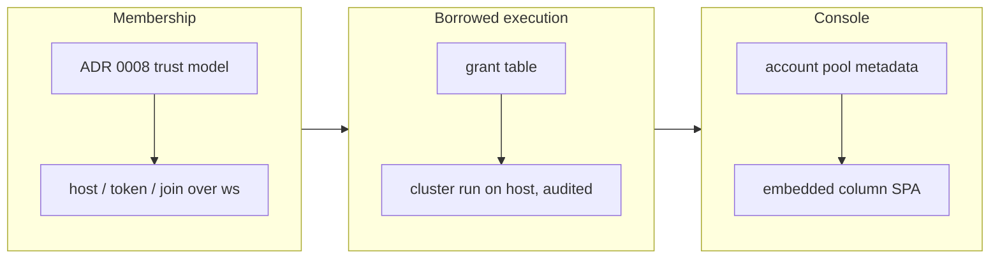

## 1. Overview

The branch added a qfs cluster. A host accepts members over a token-authenticated WebSocket, each member reports its resources and Claude Code sessions, and a member can run a statement against a mount the host has granted it. The statement runs on the host, so the credential never leaves the host. The host also serves an embedded column console over its server pool, account pool and session allocation.

**Highlights:**

1. Join cluster members to a host over an authenticated WebSocket (new `qfs-cluster` crate, ADR 0008 trust model)
2. Borrowed execution: `qfs cluster run` executes on the host against granted mounts only (default deny, audited)
3. A plgg/plgg-view column console embedded in the binary at `GET /` on the host listener

## 2. Motivation

A Slack account mount lived on one machine and could not be used from another. Copying the credential around would spread secrets, so the developer chose "lend the query, not the secret": qfs instances on one network form a cluster, and the host runs statements for members against mounts it has explicitly granted. The trust model was written as an ADR before any code relied on it. The console gives the operator one view of which machines, accounts and sessions the cluster holds.

## 3. Changes

Membership came first: an HMAC join token, a heartbeat, and a registry on the host. Borrowed execution was built on that link, with grants that deny by default and an audit record for every borrowed call. The console was last. It reads the host's loopback JSON API, and its built page is committed so that `cargo build` does not need Node.

### 3-1. Cluster members join a host over an authenticated WebSocket and report their resources ([a8ecfd6](https://github.com/qmu/qfs/commit/a8ecfd6))

Adds the `qfs-cluster` crate and `qfs cluster host|token|join|members|sessions`. Members authenticate with HMAC-SHA256 join tokens and send heartbeats with CPU, memory, disk and Claude sessions. The trust model is `docs/adr/0008-cluster-trust-model.md`.

### 3-2. A member runs a statement against a host mount without receiving the credential ([677fd2a](https://github.com/qmu/qfs/commit/677fd2a))

Adds `qfs cluster grant|revoke|grants` on the host and `qfs cluster run [--commit]` on a member. The host checks every path the statement touches against the member's grants and fails closed. It runs the statement through the normal engine, keeping the irreversible gate, and audits each call.

### 3-3. The host serves a column GUI over its server pool, account pool and sessions ([6b6ca4d](https://github.com/qmu/qfs/commit/6b6ca4d))

Adds a metadata-only account pool (`qfs cluster account add|list|remove|assign`) and a plgg/plgg-view column console (`packages/qfs-viewer/packages/cluster-console`). The console's built page is embedded into the binary and guarded by `build-cluster-console.sh --check`.

## 4. Outcome

- Two qfs instances can form a cluster, and a member can use a host-only mount with no credential in any frame (tested hermetically)
- The host shows members, accounts and sessions in a walkable column console, loopback-only by default
- The version was bumped to 0.0.143

## 5. Concerns

### Cluster transport is plain ws://

- **Severity:** moderate
- **Description:** Frames, including join tokens and borrowed statements, travel unencrypted. Per ADR 0008 this is fit only for a trusted LAN or behind an SSH/TLS tunnel (see [a8ecfd6](https://github.com/qmu/qfs/commit/a8ecfd6) in `docs/adr/0008-cluster-trust-model.md`)
- **How to Fix:** Add wss:// (TLS) on the host listener, or fold the listener into a TLS-terminated `qfs serve`

### Join tokens are reusable until expiry

- **Severity:** moderate
- **Description:** A leaked join token can be replayed by anyone until it expires. There is no one-time use and no revocation list (see [a8ecfd6](https://github.com/qmu/qfs/commit/a8ecfd6) in `packages/qfs/crates/cluster/src/token.rs`)
- **How to Fix:** Make tokens one-shot (a nonce recorded on first join) and add `qfs cluster token revoke`

### /cluster/* is not yet a qfs run driver path

- **Severity:** low
- **Description:** Members, sessions and accounts can be read only through `qfs cluster …` subcommands and the host's loopback JSON API, not through `qfs run "/cluster/..."` (see [a8ecfd6](https://github.com/qmu/qfs/commit/a8ecfd6) in `packages/qfs/crates/qfs/src/cluster.rs`)
- **How to Fix:** Add a thin `/cluster` read driver that fetches from the host's JSON API

### A grant covers both preview and commit

- **Severity:** low
- **Description:** Granting a mount lets the member commit writes as well as preview them. There is also no persistent control socket, so every `cluster run` is a one-shot connection (see [677fd2a](https://github.com/qmu/qfs/commit/677fd2a) in `packages/qfs/crates/cluster/src/grants.rs`)
- **How to Fix:** Add read-only and read-write grant levels, and a local control socket on the join daemon

### Real Slack thread reply through a host mount is unverified

- **Severity:** moderate
- **Description:** The borrowed commit was proven only against a SQLite mount. A real Slack thread reply through `/slack-cc-for-qmu` needs a person with the host's credentials (the commands are in the Final Report of ticket 3-2, see [677fd2a](https://github.com/qmu/qfs/commit/677fd2a))
- **How to Fix:** A person on the host grants the Slack mount, runs the documented `qfs cluster run --commit` from a member, and reads the reply back

### qfs-viewer check-all.sh unconfirmed on Node 24

- **Severity:** moderate
- **Description:** On this machine's Node 23.9, `check-all.sh` failed in two steps the branch did not change: plgg-bundle relocate (`ERR_FS_EISDIR`) and the npx smoke version comparison. Every step the branch touches passed on its own; a full pass on Node 24 was not run (see [6b6ca4d](https://github.com/qmu/qfs/commit/6b6ca4d) in `packages/qfs-viewer/scripts/check-all.sh`)
- **How to Fix:** Run `./scripts/check-all.sh` on Node 24 (or trust CI), and make the relocate step tolerate a leftover directory symlink

### Console walk state is not in the URL

- **Severity:** low
- **Description:** A reload loses the selected member, directory or session (see [6b6ca4d](https://github.com/qmu/qfs/commit/6b6ca4d) in `packages/qfs-viewer/packages/cluster-console/src/entrypoints/main.ts`)
- **How to Fix:** Encode the walk selection in the URL hash

## 6. Successful Development Patterns

- The borrowed statement's paths are listed by walking the serialized AST, and anything not recognised is refused, so new path-carrying grammar is covered without new code and unknown constructs fail closed.
- The built console page is committed and `--check` guards it against going stale, so `cargo build` needs no Node toolchain and the page cannot silently drift from its source.

## 7. Release Preparation

**Verdict**: Needs attention before release

- **Concern:** The branch-safety scan has 4 `hard` credential findings. On inspection, all are test fixtures or a file-name constant: `frame.rs:139` `"SECRET.TOKEN"` in a redaction test, `tests/borrow.rs:21` a fake `xoxb-…` credential, `cmd/src/lib.rs:2711` `token: "tok"` in a parse test, and `cluster.rs:27` `SECRET_FILE = "secret"`
- **Concern:** There are 4 `override`-tier size findings: the committed console bundle `cluster/ui/index.html` (4978 lines) and three implementation commits over 500 lines each
- **Before release:** Confirm the 4 hard findings are false positives. Consider renaming the `xoxb-`-shaped fixture so the scanner stops matching it
- **Before release:** `/ship` will ask for a conscious override of the size findings
- **Before release:** Run qfs-viewer `check-all.sh` on Node 24
- **After release:** Verify a real Slack thread reply through a granted host mount, using real credentials

🤖 Generated with [Claude Code](https://claude.com/claude-code)
