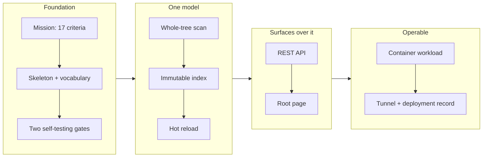

## 1. Overview

This branch took InsightBrowser from an empty git repository to a running markdown knowledge browser on the plgg family. It establishes the mission and its 17 acceptance criteria, the package skeleton with two machine-checked gates, the domain vocabulary as branded types, a whole-tree markdown scan feeding an immutable on-memory index that hot-reloads, a REST API and a root page over that one index, a container workload with its launcher, and six ADRs recording the reasoning.

**Highlights:**

1. **The product runs, and was judged live** — `insightbrowser serve` scans this repository's own 24 documents in ~4ms and serves them; hot reload tracks the working tree; verified in a container and through the qmu-dev tunnel, not only in tests.
2. **The dependency contract is machine-checked, not promised** — two self-testing gates (plgg-family-only runtime deps; third-party imports confined to `vendors/`/`entrypoints/`), each demonstrated red on a deliberate violation before being trusted.
3. **A supply-chain control was respected rather than removed** — `min-release-age=7` hides most of the plgg family, which blocks two tickets. It was not overridden; the gap is bridged by upstream's own remedy, time-boxed with retirement dates (ADR 0005).

## 2. Motivation

A repository writes knowledge constantly and reads it almost never. It accumulates in `.workaholic/`, `docs/`, `packages/`, and wherever else it lands, and the filesystem cannot express what the knowledge actually is: a ticket is *about* a package, *of* a kind, *from* a mission, and a tree holds only one of those. InsightBrowser's answer is one indexed model served three ways — SSR HTML for people, REST for programs, MCP for agents — so what a developer reads, a script fetches, and an agent queries are the same documents.

Nothing could be built on that claim until the repository itself existed: a layout, a vocabulary shared by all three surfaces, and a contract ("the plgg family from npm, and nothing else") enforced rather than stated. This branch is that foundation plus the first two surfaces over it — far enough to prove the model, and honest about where it stops.

## 3. Changes

The mission and its acceptance criteria came first, so every later step was judged against a pre-agreed target. The skeleton fixed the layout, the vocabulary, and the contract's gates before any application code. The scan and the immutable index followed — the one model everything reads. Two surfaces were then built over it, and the REST API needing **zero** domain changes is the evidence the separation held. Finally the product was made operable: a container workload, a launcher, and a tunnelled deployment with its confirmation method recorded.

### 3-1. Repository skeleton and the npm-only plgg-family dependency contract ([611f685](https://github.com/qmu/InsightBrowser/commit/611f685))

Created `packages/insightbrowser/` on the `domain/`+`vendors/`+`entrypoints/` layout with the strict tsconfig set, the vocabulary as plgg `refinedBrand` types, the `npx insightbrowser` launcher, and the two gates that make the dependency contract checkable. Six ADRs record the reasoning, and CI calls `check-all.sh` and nothing else.

### 3-2. Scan the corpus into an immutable, hot-reloadable index ([580a157](https://github.com/qmu/InsightBrowser/commit/580a157))

Built the multi-root scan, the skip-and-collect error rule, the immutable index, and the reload semantics — the ticket's hardest part, with no precedent anywhere in the plgg family. Left ticket 2 open because its front-matter half is blocked; the ticket records what remains and why.

### 3-3. REST API serving the indexed model ([f5c32d0](https://github.com/qmu/InsightBrowser/commit/f5c32d0))

Added `/api/health`, `/api/documents`, `/api/documents/*path`, `/api/errors` and the `serve` verb over the same index. Adding this second surface required no domain changes at all, which is the evidence `anti-corruption-structure` asks for.

### 3-4. Wire hot reload ([10e61f4](https://github.com/qmu/InsightBrowser/commit/10e61f4))

Wired `node:fs.watch` to the reload semantics the domain already carried, so the corpus follows the working tree. Judged live: a burst of five rapid writes coalesced into exactly one reload.

### 3-5. The development workload and its launcher ([b138ac5](https://github.com/qmu/InsightBrowser/commit/b138ac5))

Added `workloads/development/` and `scripts/serve-development.sh` per the directory-structure and command-scripts policies — the product running in a container over the bind-mounted repo, so a contributor can see it work without a toolchain.

### 3-6. Serve a root page instead of "Not Found" ([2b79bce](https://github.com/qmu/InsightBrowser/commit/2b79bce))

`GET /` answered `404` while the server worked perfectly, because only `/api/*` existed. The root now renders the corpus as semantic HTML and says plainly what is not built yet.

### 3-7. Scan the whole tree ([1fe03d2](https://github.com/qmu/InsightBrowser/commit/1fe03d2))

The scan hardcoded three roots and so omitted this repository's own `README.md` and `CLAUDE.md` — the mission's 「…**など**にも散らばる」 named examples, not a boundary. Inverted to the whole tree minus the prune list, which exposed and fixed a real reload-path bug.

## 4. Outcome

`insightbrowser serve` works. It scans a repository's markdown wherever it is scattered, holds it in an immutable on-memory index, hot-reloads as the tree changes, and serves it as a REST API and a root page. It runs on the host, in a container, and through the qmu-dev tunnel at `insight-browser.qmu.dev`.

- **The one model, three surfaces claim is now evidence, not assertion.** The CLI and the REST API start the same `scan`/`Index` procedures identically, and adding the second surface required zero domain changes.
- **Contracts are enforced**: `check-all.sh` runs the dependency-contract gate, the vendor-boundary gate, the dist build, an `npx` smoke (pack → install → run the real bin), typecheck, and 67 tests at >90% coverage on all four metrics. Both gates were demonstrated red on deliberate violations before being trusted.
- **The vocabulary is fixed** in types and in `.workaholic/terms/`, so the three surfaces cannot each rename the same concept.
- **The mission stands at 2/17.** The two remaining kickoff tickets are blocked on dated external dependencies, recorded in the tickets themselves rather than in a transcript.

Details: [`20260715004234`](../tickets/archive/work-20260715-003158/20260715004234-repository-skeleton-and-dependency-contract.md) and [`20260715014949`](../tickets/archive/work-20260715-003158/20260715014949-rest-api-over-the-index.md).

## 5. Historical Analysis

This repository has no history — it is the first branch. The precedent came from the siblings:

- **plggmatic's repo split** established the standalone-repo/npm-contract pattern this branch inherits, including the claim its `check-all.sh` makes: a clean run proves the *published* cross-repo contract resolves. That is why the npx smoke exists at the bin level too.
- **plgg's packages** supplied the real layout. The `coding-standards` policy's stated `<Domain>/{model,service,dependency}` is used by no package in either repo; the machine-checked gate enforces `domain/{model,usecase}` + `vendors/` + `entrypoints/`. The branch followed the gate and recorded the divergence (ADR 0004) rather than resolving it silently.
- **plgg-md and plggpress** were read as reference for the scan and the render seams — and reading the monorepo *source* rather than the published artifact is exactly what produced this branch's most expensive mistake (see §6).

## 6. Concerns

### The published plgg family is mostly unreachable, and it blocks the mission

- **Severity:** moderate
- **Description:** `~/.npmrc` sets `min-release-age=7`, so releases younger than seven days are invisible to the installer. The plgg family shipped a burst between 2026-07-09 and 2026-07-13, so today only `plgg 0.0.27`, `plgg-server 0.0.3`, `plgg-view 0.0.1`, `plgg-bundle 0.0.2`, and `plgg-test 0.0.3` are consumable — and `plgg-md 0.0.1` does not parse front matter at all. This blocks tag groups and document rendering, i.e. most of what the mission is about. The control was **not** overridden: disabling a supply-chain defence to make a build go green inverts its purpose ([8cb09fc](https://github.com/qmu/InsightBrowser/commit/8cb09fc)).
- **How to Fix:** `plgg-md 0.0.2` is consumable 2026-07-16 09:11. Before modelling anything on it, verify its `YamlMap` grammar accepts this repository's real front matter — `YValue` forbids nested maps and requires quoted dates, and this repo's own tickets carry unquoted `created_at`. If it rejects them, plgg-md needs extending upstream.

### The build tools are bridged, not fixed, and the bridge is dated

- **Severity:** moderate
- **Description:** `plgg-bundle 0.0.2` and `plgg-test 0.0.3` — the only consumable versions — do not run on Node 24 (`ERR_UNSUPPORTED_NODE_MODULES_TYPE_STRIPPING`). `scripts/plgg-tool.sh` applies upstream's own `relocate.mjs` remedy from the outside. It hides nothing: the build, typecheck, tests, coverage and npx smoke all really run and really pass. The risk is not that it is wrong today but that it outlives its reason ([ADR 0005](../../docs/adr/0005-pinned-toolchain-under-min-release-age.md)).
- **How to Fix:** Follow the schedule: 2026-07-16 bump `plgg-test` to `^0.0.5` and restore `npm run test`; 2026-07-20 bump `plgg-bundle` to `^0.0.6`, restore `npm run build`, and **delete the script**.

### `npx InsightBrowser` can never work

- **Severity:** low (resolved on this branch)
- **Description:** npm rejects uppercase package names outright, so the mission's headline invocation could not resolve. The package is `insightbrowser`; the README, CLAUDE.md, and the mission's acceptance wording were corrected ([611f685](https://github.com/qmu/InsightBrowser/commit/611f685)).
- **How to Fix:** Done. Worth deciding once: the tunnel hostname is `insight-browser.qmu.dev` (hyphenated) while the package is `insightbrowser`. Harmless, but `insight-browser` is still free on npm if they should match — cheap now, expensive after publish.

### The reference read was the monorepo source, not the published artifact

- **Severity:** moderate
- **Description:** Ticket 3's plan was written against `plgg-md`'s **source**, which is ahead of the registry. The published 0.0.1 exposes two render seams, not the four the ticket assumed, and its `parseFrontmatter` discards the front matter entirely. The plan was therefore partly fiction from the start, and the drive discovered it only on contact ([8cb09fc](https://github.com/qmu/InsightBrowser/commit/8cb09fc)).
- **How to Fix:** When the contract is "consume from the registry" (ADR 0001), read the **published** `.d.ts` when planning, not the sibling checkout. A ticket's Key Files should cite the artifact the code will actually import.

### Live probing keeps finding what the unit tests miss

- **Severity:** moderate
- **Description:** Three times, tests were green and the product was wrong. 404s carried no `cache-control` because the test asserted the header on a 200 — a cached miss hides a newly added document, exactly what ADR 0003 forbids. plgg-server's unmatched-route 404 bypasses global middleware entirely, so `/foo` was bare. And `GET /` answered "Not Found" to every human who opened the URL ([f5c32d0](https://github.com/qmu/InsightBrowser/commit/f5c32d0), [2b79bce](https://github.com/qmu/InsightBrowser/commit/2b79bce)).
- **How to Fix:** All three are fixed and pinned. The pattern is the lesson: an entrypoint ticket is not done until its surface has been driven live. A unit test asserting one path proves nothing about the others.

### The traversal test passes for the wrong reason

- **Severity:** low
- **Description:** The unencoded `../../etc/passwd.md` never reaches the handler — HTTP normalizes it into an unmatched path, so the 404 comes from dispatch rather than from the guard. The guard *is* real (the URL-encoded `%2E%2E` form proves it), but the original test would have passed even if it were not ([f5c32d0](https://github.com/qmu/InsightBrowser/commit/f5c32d0)).
- **How to Fix:** The encoded case is now covered. Any future path-guard test should use the encoded form, or it is testing the HTTP stack rather than the guard.

### A SIGHUP took ~34 tunnelled hostnames offline

- **Severity:** moderate
- **Description:** While adding the `insight-browser.qmu.dev` ingress rule, a SIGHUP intended as a config reload **terminated** cloudflared 2026.2.0 — it exits on HUP rather than re-reading — and the supervising `bash -c` wrapper exited with it. Every hostname on the shared tunnel was down for roughly ninety seconds. A first check reported the process alive, which was `pgrep` matching its own command line ([d0b3c86](https://github.com/qmu/InsightBrowser/commit/d0b3c86)).
- **How to Fix:** Recorded in [`.workaholic/deployments/index.md`](../deployments/index.md): restart, never HUP; validate and back up before touching the running tunnel. The broader lesson is that a signal's meaning is version-specific and a shared tunnel is production for 33 other things.

### The mission's no-cache rule has no policy behind it

- **Severity:** low
- **Description:** The corpus was searched: every `cache`/`stale` hit is an unrelated sense. The rule binds only because ADR 0003 writes it down. Without that, the first performance-minded contributor would add a cache header and violate nothing.
- **How to Fix:** If "a stale document is an incident" is a general company principle rather than an InsightBrowser one, it belongs in `workaholic:design` as a policy. Until then ADR 0003 is its only anchor.

### The corpus is a flat list of links to JSON

- **Severity:** low
- **Description:** The root page lists documents, but each link points at the document's JSON, and there are no tag facets — so the non-tree navigation the mission is actually about does not exist yet. Both wait on `plgg-md 0.0.2` ([2b79bce](https://github.com/qmu/InsightBrowser/commit/2b79bce)).
- **How to Fix:** Ticket 2 unblocks the facets at 2026-07-16 09:11; ticket 3 needs the developer's route decision before rendering can start.

## 7. Successful Development Patterns

- **Prove the gate fails before trusting it.** Both gates were demonstrated red on deliberate violations (a `chokidar` dep, a `plggmatic` dep, a `node:fs` import in `domain/`) and then reverted. A gate never observed failing is decoration, and the cost of proving it is two minutes.
- **Drive the surface live; the tests will lie to you.** Every one of this branch's three worst bugs was green in CI: bare 404s, middleware-bypassing 404s, and a root URL that said "Not Found". None were subtle — all three were invisible to unit tests that asserted the happy path.
- **Let the compiler carry the rule.** The first branding draft used the banned `as`; plgg's `refinedBrand` does it with no cast at all, and the compiler rejected the whole class instantly. `plgg-view` encodes the HTML content model in its types, so the first root-page draft — which widened everything to `Html<never>` — could not compile. Malformed HTML is not a bug class in this stack.
- **Test the fake against the real thing.** The scan runs against a fake `FileSystem` seam for speed *and* a real temp-dir tree for truth. A fake only ever agrees with your model; the real tree is what catches a wrong model. The same split covers the watcher, whose assumptions are entirely about a vendor's behaviour.
- **Delete speculative API rather than testing it.** `emptyIndex` and `withErrors` were exported, never called, never covered. Removing them was cheaper and more honest than writing tests to prop them up, and coverage went up as a result.
- **Add the second consumer early, while the design is a day old.** The REST API needed zero domain changes. Had it needed many, that would have been the finding — and far cheaper to act on now than after a month of accretion.
- **Write the blocker down with its date.** Both blocked tickets carry the exact version, the exact timestamp it becomes consumable, and what to check first. A blocker that lives in a session transcript is one the next drive rediscovers from scratch.
- **Record the reasoning, not the decision.** Six ADRs exist because the decisions they carry are ones a reasonable person would reverse without the context — especially the two born from real conflicts: the toolchain bridge, and observability's demand for OpenTelemetry against a contract forbidding the dependency.

## 8. Release Preparation

**Verdict**: Ready for release

### 8-1. Concerns

- `origin` has **zero branches** — `main` has never been pushed, so `gh pr create --base main` has no base ref. This is a remote-bootstrap gap, not a defect in the branch.
- `scripts/plgg-tool.sh` is a time-boxed bridge whose retirement begins 2026-07-16. It is honest, ADR-documented, and masks no red gate — but it is dated debt that becomes load-bearing if the schedule slips.
- The branch merges with the mission at 2/17 and two tickets blocked. That is not a release gate: the release unit is the branch, and the todo queue is informational. The bookkeeping is deliberately unflattering — the scanner acceptance item stays unchecked even though its hot-reload half is done and green, because its front-matter half is not.

### 8-2. Pre-release Instructions

- Push the base branch before opening the PR: `git push -u origin main` (the private repo `qmu/InsightBrowser` currently has no branches on the remote).

### 8-3. Post-release Instructions

- **2026-07-16** — bump `plgg-test` to `^0.0.5`, restore `scripts/test-insightbrowser.sh` to `npm run test`, confirm `check-all.sh` stays green (ADR 0005 retirement step 1).
- **2026-07-16 09:11** — `plgg-md 0.0.2` becomes consumable; unblock ticket `20260715004235`. **Verify the `YamlMap` grammar against the real corpus first.**
- **2026-07-20** — bump `plgg-bundle` to `^0.0.6`, restore `scripts/build.sh` to `npm run build`, **delete `scripts/plgg-tool.sh`**, confirm `check-all.sh` stays green (ADR 0005 retirement step 2).
- Ticket `20260715004236` (SSR + heading numbering) needs a **developer decision**, not a date: file the plgg-md heading seam upstream and accept the 7-day hide, or take the documented fallback of rendering over the public `parseBlocks` AST as a deliberate re-decision.

## 9. Notes

**This branch is the repository.** It is not an increment on an existing codebase — `main` carries a single bootstrap commit, created only so a worktree could branch from it. Reviewing it means reviewing the whole product.

**Where to start.** The reasoning is denser than the code and lives in [`docs/adr/`](../../docs/adr/index.md): [0001](../../docs/adr/0001-npm-only-plgg-family-contract.md) (why the registry rather than a sibling checkout — the decision everything else follows from), [0003](../../docs/adr/0003-no-caching.md) (why nothing is cached), and [0005](../../docs/adr/0005-pinned-toolchain-under-min-release-age.md) (the wall this mission hit and how long it lasts).

**Judge it by running it**, not by reading it: `./scripts/serve-development.sh`, then `curl localhost:4100/api/health`. Edit any markdown in the tree and watch the count move. That is the claim the whole branch rests on.

**Two things a reviewer should push back on if they disagree**: the layout diverges from `coding-standards`' stated wording (ADR 0004 — the gate won over the letter), and the observability policy's metrics half is deliberately unimplemented because it requires a dependency ADR 0001 forbids (ADR 0006). Both are recorded as decisions, not oversights, precisely so they can be argued with.
