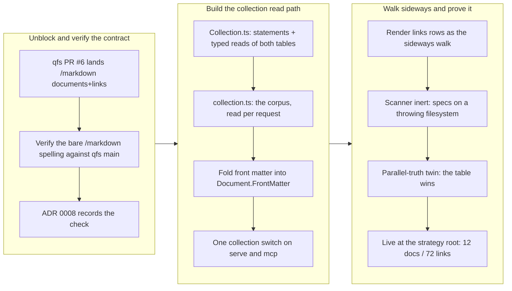

## 1. Overview

The viewer's corpus now comes from qfs's markdown collection path — `/markdown/<name>/documents` is both the enumeration and the front-matter interpretation, and `/markdown/<name>/links` is walked sideways to build the strip. The in-process markdown indexer (scanner, fence parser, watcher) retires *into* that path behind a single `collection` config switch honoured on both composition roots, rather than surviving beside it as a second source of truth. The retirement is structural, not nominal: on the collection arm those components are never constructed, and the specs prove it by construction rather than by inspection.

**Highlights:**

1. The corpus is read from qfs's `/markdown/<name>/documents|links` collection path behind one `collection` config key, honoured identically on both composition roots (`serve`, `mcp`).
2. The in-process indexer is never constructed on the collection arm — proven by construction, not inspection: the collection specs run against a filesystem whose `readDirectory`/`isDirectory` throw, so any walk explodes the test.
3. Front matter became folded plain data (`Document.FrontMatter`), the shape both producers share, so `YamlMap` no longer leaks into facets, filters, REST or MCP.
4. The strip walks sideways over `links` rows: `source_section_path` renders as each link's section context, an internal target as a next-column segment, an external one as a plain anchor, a root-escaping one as inert text.
5. The legacy scan arm is kept verbatim behind the switch with a **recorded deletion date of 2026-07-31** (ADR 0008) — a dated retirement, not a permanent fallback.

## 2. Motivation

The viewer had been collecting and interpreting the markdown corpus itself, in process, while qfs — the project's mandated collection layer — was growing a markdown path of its own. Two enumerators and two front-matter readers over the same tree is precisely the drift that the qfs-mandatory rule exists to kill: the day they disagree, the viewer's answer and qfs's answer are both defensible and neither is true. When the qfs side landed its collection path (PR #6), the ticket's "Blocked on" condition cleared and the honest move became available — not to teach the viewer a second way to read markdown, but to delete its reason to read markdown at all. The work arrives through the `ResourceRunner` seam that PR #5 established, so no markdown-specific transport appears; and because `npx qfs-viewer serve` must keep working at a repository with no qfs binding, the legacy arm was retained behind exactly one switch with a written end date rather than being cut on the spot.

## 3. Changes

The qfs side landing its collection path unblocked a ticket that had been deliberately parked, and the first move was to verify rather than assume the path contract — the same day's qfs PR #7 canonicalized the *hosts* realm, which could easily have been read as canonicalizing everything. With the spelling confirmed against qfs main, the read path was built through the existing `ResourceRunner` seam, front matter was folded into the one shape both producers share, and the indexer was retired behind a single dated switch. The closing move was proof: the scanner's inertness is demonstrated by a filesystem that throws, and the whole path was run live against a real repository root.

### 3-1. Markdown browsing over qfs's マークダウン収集パス, retiring the in-process indexer ([ff2b7f2](https://github.com/qmu/qfs-viewer/commit/ff2b7f2))

Points the corpus at qfs's markdown collection path behind the new `collection` config key, on both composition roots, and retires the in-process indexer into it with a recorded deletion date of 2026-07-31. Adds `domain/model/Collection.ts` (statements and typed reading of the `documents`/`links` tables) and `domain/usecase/collection.ts` (the corpus, read per request), both arriving through the PR #5 `ResourceRunner` seam; folds front matter into `Document.FrontMatter` so `YamlMap` stops leaking into facets, filters, REST and MCP; and renders the `links` table as the strip's sideways walk. Ticks mission `qfs-viewer-mvp` acceptance item 3 (demo leg 2).

## 4. Outcome

Markdown browsing reads from qfs's collection path as its single source of truth, and the in-process indexer no longer runs beside it. Pointed at a repository whose tree is bound into qfs, the viewer enumerates and facets documents from the `documents` table's `frontmatter` column, and each document column walks the `links` table sideways to the next column.

The retirement is verifiable rather than asserted. On the collection arm the scanner, fence parser and watcher are never constructed — the collection specs run against a filesystem whose `readDirectory`/`isDirectory` throw, so a walk cannot hide. Its twin spec settles which producer is authoritative: a file whose fence says `type: from-the-fence` while the table says `type: from-the-table` facets on the **table**. Bodies are still read off disk, but that is a point read of a path the *table* named, through the same `FileSystem` seam the editor writes through — no enumeration, no fence parse, no pruning rule, so nothing that could hold an opinion about what the corpus is.

Verification: `./scripts/check-all.sh` exits 0 (359 qfs-viewer + 311 plggmatic tests; `Collection.ts` and `collection.ts` at 100% coverage; the npx smoke resolves under node, bun and deno). Live at the qmu/strategy root on qfs 0.0.75 (isolated store, `--read-only`, port 4137 so the developer's 4100 was untouched): the tables answer **12 documents / 72 links**; the viewer boots `collection.attached` then `{"documents":12,"errors":0}`; `/api/health` returns `{"documentCount":12,"errorCount":0}`; `/resolve/CLAUDE.md` renders its Links section with the driver's section context and that address renders 3 columns; `/api/errors` is empty; and there are **zero `scan.*` events** — the scanner never walked.

## 5. Historical Analysis

This branch is the payoff of a seam laid two PRs earlier. PR #5 landed the `ResourceRunner` connection seam and described generic browsing; because that seam already existed, the `documents`/`links` tables arrive through it with no markdown-specific transport — the anti-corruption boundary held under a real second use, which is the only test that means anything for such a boundary. ADR 0003's read-per-request rule for everything qfs answers is honoured here too, and it pays an unplanned dividend: because the corpus is read per request, the editor's post-save index swap becomes a no-op by construction rather than by careful bookkeeping.

The dated-retirement shape also has precedent in this repository rather than being invented here: ADR 0005 pinned the toolchain under `min-release-age=7` as an explicitly time-boxed arrangement "with a retirement schedule", and ADR 0002's amendments record a dependency decision revisited twice as reality moved. The recurring pattern across all three is that a temporary arrangement is recorded *with its end*, in a document a later reader can find — which is exactly why the citation defect noted in section 6 matters more here than it would in a comment.

The parked-ticket discipline is worth noting as history too: this ticket carried an explicit "Blocked on" clause naming the qfs-side mission, and it was honoured — the interim was the honest describe-generic view, not a speculative half-implementation of a contract that did not exist yet.

## 6. Concerns

### The 2026-07-31 deletion is recorded in prose, but nothing in the queue will make it happen

- **Severity:** moderate
- **Description:** The legacy scan arm's deletion date lives only in narrative — `docs/adr/0008-corpus-from-the-qfs-collection-path.md`, `docs/adr/index.md`, and the mission changelog (see [ff2b7f2](https://github.com/qmu/qfs-viewer/commit/ff2b7f2)). Meanwhile mission `qfs-viewer-mvp` acceptance item 3 is now ticked, so the mission will not resurface it, and `.workaholic/tickets/todo/` holds no deletion ticket. The default outcome of doing nothing is therefore the exact failure the ticket set out to prevent: the walk, fence parser and watcher quietly become the permanent parallel enumerator that "qfs-mandatory exists to kill". A date in an ADR is a note; a ticket is what makes it happen.
- **How to Fix:** File a ticket in `.workaholic/tickets/todo/` dated for 2026-07-31 that deletes the scan arm — the scanner, the fence parser, the watcher, and the `collection`-absent branch in `packages/qfs-viewer/src/entrypoints/serve.ts` and `mcp.ts` — so the recorded date is carried by the working queue rather than by prose in a document whose mission item is already closed.

### ADR 0008 rests its rationale on a policy that does not exist

- **Severity:** moderate
- **Description:** `docs/adr/0008-corpus-from-the-qfs-collection-path.md:79` justifies the switch-plus-date shape by citing "the operation policy (`continuous-deployment`)" as demanding every commit keep `npx qfs-viewer serve` working and permitting coexistence only behind one switch with a recorded retirement date (see [ff2b7f2](https://github.com/qmu/qfs-viewer/commit/ff2b7f2)). No such policy exists: the `workaholic:operation` pillar holds only `ci-cd.md`, `no-customer-support-in-repo.md` and `ai-production-investigation.md`, and the phrase "retirement date" appears in no policy file. The archived ticket carries the same citation, and the mission changelog repeats it. The engineering decision is sound and has in-repo precedent (ADR 0005's time-boxed retirement schedule) — but an ADR is the artifact later decisions cite as authority, so a fabricated citation propagates. This is the `workaholic:implementation` objective-documentation practice (factual, verifiable language; docs reviewed like code).
- **How to Fix:** Correct the "Why a switch at all, and why dated" bullet in ADR 0008 to either cite a policy that exists (`operation/ci-cd.md` covers reproducible inspection and release, though not this specific allowance) or — more honestly — state the switch-plus-recorded-date rationale as this project's own engineering judgement, with ADR 0005 as the in-repo precedent. Leave the archived ticket as the historical record; do not let the ADR inherit the error.

### The `/markdown` path spelling is an upstream contract this package does not control

- **Severity:** low
- **Description:** The viewer speaks the bare `/markdown/<name>/…` spelling because qfs's generated `docs/drivers.md` teaches it; qfs PR #7 canonicalized the **hosts** realm only, and `/markdown` is not host-realm-only (see [ff2b7f2](https://github.com/qmu/qfs-viewer/commit/ff2b7f2) in `packages/qfs-viewer/src/domain/model/Collection.ts`). The check was verified against qfs main rather than assumed, and ADR 0008 records it. But if qfs later canonicalizes `/markdown` the way it canonicalized `/hosts`, both statements in `Collection.ts` break at once. This is correctly handled rather than ignored — qfs's structured `retired_path` error surfaces on the corpus column rather than failing silently — so it is recorded as a watch item, not a defect.
- **How to Fix:** When the qfs side next discusses realm canonicalization, confirm whether `/markdown` is in scope and coordinate ahead of the change. The two statements are already constants in one module, so the blast radius is contained to `Collection.ts` if it happens.

## 7. Successful Development Patterns

- **Proving inertness by construction rather than by inspection** — rather than grepping for unused indexer calls, the collection specs run against a filesystem whose `readDirectory`/`isDirectory` throw, so any walk explodes the test. Inspection proves a claim about today's code; a throwing seam proves it about every future edit too, and it fails loudly the moment someone reintroduces a walk "just in case". This is the pattern to reach for whenever a retirement must be structural rather than nominal.
- **The parallel-truth twin spec** — a fixture whose fence says `type: from-the-fence` while the table says `type: from-the-table` pins down *which producer is authoritative* in a single assertion. Two sources that agree cannot tell you which one you read; deliberately making them disagree is what turns "the table is the source of truth" from a comment into a test.
- **Verifying an upstream contract against upstream rather than assuming it** — qfs PR #7 canonicalized the hosts realm on the same day, and the plausible inference (that everything canonicalized) was wrong. Reading qfs main's generated `docs/drivers.md` cost minutes and prevented shipping against an invented spelling; recording the check in ADR 0008 means the next reader inherits the answer instead of redoing the inference.
- **Honouring a "Blocked on" clause instead of routing around it** — the ticket named the qfs-side mission as its blocker and the interim (the describe-generic view) as the honest fallback, and both were respected. The payoff is visible in this branch's shape: because nobody speculatively implemented a contract that did not exist, there was no half-built path to unwind when the real one landed.
- **Folding two producers into one shape at the read boundary** — `Document.FrontMatter` as folded plain data let the scan arm and the table arm converge without either learning about the other. The alternative (re-encoding qfs's answer back through plgg-md's YAML subset) would have re-introduced a dependency on a promise qfs never made.

## 8. Release Preparation

**Verdict**: Ready for release

### 8-1. Concerns

- The `2026-07-31` deletion of the legacy scan arm is recorded only in prose (ADR 0008, the ADR index, the mission changelog) while the mission item that would resurface it is already ticked — nothing in the working queue will cause the deletion to happen.
- ADR 0008 cites `workaholic:operation` / `continuous-deployment` as the authority for the switch-plus-date shape; that policy file does not exist. The decision is sound, its recorded justification is not.
- The bare `/markdown/<name>/…` spelling is an upstream qfs contract this package does not control (low — verified against qfs main and recorded in ADR 0008; a future canonicalization would break both statements in `Collection.ts` at once).

### 8-2. Pre-release Instructions

- Correct the policy citation in `docs/adr/0008-corpus-from-the-qfs-collection-path.md` (the "Why a switch at all, and why dated" bullet): cite a policy that exists, or state the rationale as this project's own engineering judgement with ADR 0005 as precedent. Leave the archived ticket as the historical record.
- Expect a trivial merge conflict with sibling branch `work-20260717-150001` (ticket 020106): both branches append a row to `docs/adr/index.md`. That branch renumbered its ADR to 0009, so only the index row conflicts — keep both rows, in numeric order.

### 8-3. Post-release Instructions

- File a ticket in `.workaholic/tickets/todo/` for the 2026-07-31 deletion of the legacy scan arm (scanner, fence parser, watcher, and the `collection`-absent branch in `serve.ts` / `mcp.ts`), so the date is carried by the queue rather than by an ADR whose mission item is closed.

## 9. Notes

**No production target.** Per this repository's `CLAUDE.md` `## Deploy`, there is no production target yet — a merge deploys nothing and the release is of source only. The one real target is the development surface on port 4100, which this branch's live verification deliberately avoided (it ran on port 4137 against an isolated qfs store with `--read-only`, and removed its temporary config on every exit path).

**Branch safety scan.** `scan-branch-safety.sh origin/main` → `{"verdict": "pass", "findings": []}`, exit 0. Doc-drift against `origin/main` returned no candidates — correct here, since neither `README.md` nor `CLAUDE.md` enumerates config keys, and the new `collection` key is documented where it belongs (the `Config` type and ADR 0008, with `docs/adr/index.md` updated in the same commit).

**A trap for anyone re-running this report.** The local `main` ref in this checkout is stale (`cbbdc9d`, 60 commits behind `origin/main` at `a22775d`) because `main` is checked out by the primary checkout. Every base-relative tool must be pointed at `origin/main`: run with the default base, `collect-commits.sh` narrates 60 commits of already-merged work as this branch's, and `scan-branch-safety.sh` reports a spurious `too-many-files` block on a 295-file phantom diff. The true diff is 22 files, one commit.

**Known merge conflict.** Sibling branch `work-20260717-150001` (ticket 020106, reported in parallel) also appends a row to `docs/adr/index.md`. It originally claimed number 0008 and has since renumbered to 0009, so the ADR files themselves do not collide — only the index row does. Resolution is to keep both rows in numeric order.
