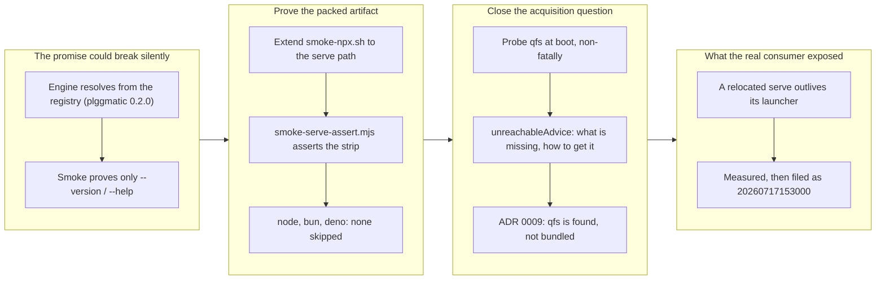

## 1. Overview

The branch kept the headline `npx qfs-viewer` promise true through the strip-UI
replacement by proving it where a real consumer stands: the packed tarball is
installed into a scratch tree and driven through the serve path under node, bun
and deno, rather than smoke-tested only for `--version`/`--help`. It closed the
ticket's open question — how the qfs binary is acquired — as ADR 0009 (qfs is
**found** on `PATH`, never bundled), and made a missing qfs a supported,
explained state instead of an unactionable crash. Reaching the packed artifact
also exposed a real product defect, which was measured and filed rather than
papered over.

**Highlights:**

1. `scripts/smoke-npx.sh` now asserts the **serve path** from the packed
   tarball under node, bun and deno with none skipped — previously it proved
   only `--version`/`--help`, so the UI replacement could have broken the
   headline promise while the gate stayed green.
2. A non-fatal boot probe (`probeQfs` / `unreachableAdvice`) lets the server
   start with no qfs reachable and say what is missing, how to install it, and
   that markdown browsing never needed it — replacing an OS `ENOENT` nobody
   could act on.
3. ADR 0009 records that qfs is **found, not bundled**: the package ships no
   binary and has no code path that can put one on a disk.
4. New `scripts/smoke-serve-assert.mjs` asserts the plggmatic engine strip
   actually renders and that an addressed `/resolve` column opens — and its
   teeth were verified *negatively*, not merely by passing.
5. A defect invisible from a source checkout — a relocated `serve` outliving
   its launcher — was reproduced with PIDs and filed as ticket
   `20260717153000`, with the smoke's workaround designed to be that ticket's
   own test.

## 2. Motivation

Mission acceptance item 6 (demo leg 1) rests on a promise the repository makes
in its first sentence: `npx qfs-viewer` at any repository root starts the
viewer. That promise had quietly become untested in the way that matters. The
bin was smoke-tested for `--version`/`--help` only, while the engine moved to
registry resolution (`plggmatic@^0.2.0`) — and the way a registry-resolved
engine dies is for a *real consumer*, where nothing but a packed-and-installed
run can see it. A green gate over the source tree was not evidence about the
artifact. The ticket also deliberately left the qfs-binary acquisition question
open and marked it ADR-sized, because the esbuild-style npm binary-distribution
route was a genuine alternative with genuine costs, and because
`workaholic:design` / `user-sovereignty` requires the issuance form
(local / on-demand / remote) to stay the user's choice rather than something the
artifact hard-wires. Both threads had to be closed before the demo leg could be
called met.

## 3. Changes

The branch began where the promise was weakest: the smoke reached the packed
bin but never the server it launches. Extending it to pack, install and drive
the real serve path immediately raised the qfs question the ticket had left
open, which was settled as ADR 0009 and implemented as a non-fatal boot probe
so a missing qfs explains itself. Standing the test where a real consumer
stands then exposed a defect invisible from a source checkout — a relocated
`serve` that outlives its launcher — which was reproduced, filed, and worked
around in the smoke rather than absorbed silently.

### 3-1. Distribution: `npx qfs-viewer` stays true through the UI replacement ([9caef19](https://github.com/qmu/qfs-viewer/commit/9caef19))

Proved `npx qfs-viewer serve` end to end from the packed tarball under node,
bun and deno: it serves the plggmatic engine strip and opens an addressed
`/resolve` column. Closed the ticket's open acquisition question as ADR 0009 —
qfs is found on `PATH`, never bundled and never fetched — and added a non-fatal
boot probe so that with no qfs reachable the server still starts and names what
is missing and how to get it. Filed the relocated-serve defect surfaced by
testing the real artifact as ticket `20260717153000`.

## 4. Outcome

The `npx qfs-viewer` distribution promise is now proven, not assumed, through
the strip-UI replacement — 12 files, +945/-50 against `origin/main`, in one
commit ([9caef19](https://github.com/qmu/qfs-viewer/commit/9caef19)).

- **The serve path is asserted from the packed tarball, under every runtime.**
  `scripts/smoke-npx.sh` previously proved only `--version`/`--help`; it now
  packs, installs into a scratch tree, and drives the real server under node,
  bun and deno — none skipped. The new `scripts/smoke-serve-assert.mjs` asserts
  the plggmatic engine strip actually renders and that an addressed `/resolve`
  column opens, so the headline promise is tested where a real consumer stands
  rather than from a source checkout.
- **A missing qfs is now a supported, explained state instead of a crash.** A
  non-fatal boot probe (`probeQfs`, `unreachableAdvice` in
  `packages/qfs-viewer/src/vendors/qfsRunner.ts`, wired through
  `entrypoints/serve.ts` and `domain/model/Connection.ts`) lets the server start
  with no qfs reachable and say what is missing, how to install it, and that
  markdown browsing never needed it — replacing an OS `ENOENT` nobody could act
  on. One advice source feeds both the boot log (`qfs.unreachable`) and any
  query that needed it; `qfsRunner.spec.ts` grew 136 lines of cover.
- **The qfs-acquisition question is closed and recorded.** ADR 0009
  `docs/adr/0009-qfs-is-found-not-bundled.md` decides that qfs is **found** on
  `PATH` (or named in config), never bundled and never fetched: the package
  ships no binary and has no code path that can put one on a disk. The ticket
  had left this open; it was ADR-sized because the esbuild-style
  binary-distribution route was a real alternative with real costs.
- **A real product defect was measured and filed rather than papered over.** New
  ticket `20260717153000` records that a relocated `serve` outlives its launcher
  and keeps the port — found only because the smoke reached the packed artifact.
- Gate: `./scripts/check-all.sh` exits 0 (raw, unmasked). Mission
  `qfs-viewer-mvp` acceptance item 6 (demo leg 1) is met.

## 5. Historical Analysis

The branch is a convergence point for several standing decisions rather than a
fresh start, and its central choice was settled by precedent already written
down.

- **The dependency contract had already pre-decided the mechanism.** ADR 0001's
  rule — every runtime dependency not named `plgg*` is `foreign` and fails the
  gate (`scripts/dependency-contract.mjs`) — forbids exactly the
  `optionalDependencies` on `@qfs/linux-x64`-shaped packages that the esbuild
  route requires. ADR 0009 explicitly declines to lean on this as *the* reason,
  treating it instead as "the reason written down twice": the rule and the
  decision agree because they descend from the same principle, which is what a
  coherent ADR trail is supposed to look like.
- **ADR 0005's postinstall/supply-chain stance carried forward intact.** The
  prior reasoning about install-time code execution survived scrutiny on this
  branch and is cited rather than re-litigated — evidence that the earlier ADR
  was load-bearing and correctly scoped.
- **The seam built by ticket 020101 constrained the answer.** `bin` as a config
  value keeps the plan's three issuance forms (local / on-demand / remote)
  peers, per `workaholic:design` / `user-sovereignty`. Bundling a binary would
  have hard-wired the local form into the artifact and made a remote-qfs
  deployment silently carry a local one it must not use — so the earlier seam is
  what made "do not bundle" the only move that does not undo prior work.
- **The recurring theme is that a process boundary must stay a boundary.** The
  mission's framing of qfs as a data-plane dependency across a process boundary
  (not a library) is what makes bundling wrong here and right for esbuild:
  esbuild's executable is stateless, so any copy of the right version is the
  same copy; qfs holds per-machine, user-owned encrypted credential state, so a
  second copy is a second claimant. `qfs.ready` logging the version it *found*
  (`qfs 0.0.71`) rather than one printed from a constant is the same principle
  expressed in code.
- **Smoke coverage has a history of drifting behind the promise.** The bin was
  smoke-tested for `--version`/`--help` while the engine moved to registry
  resolution (`plggmatic@^0.2.0`) — the gate stayed green across a change that
  could have broken the headline promise. `workaholic:operation` /
  `policies/ci-cd.md` already names the silent skip as the regression to watch;
  this branch is that policy being enforced rather than restated.

## 6. Concerns

### A relocated `serve` outlives its launcher

- **Severity:** urgent
- **Description:** `npx qfs-viewer serve` installed from the registry starts a
  server its caller cannot stop: `bin/qfs-viewer.mjs` relocates out of
  `node_modules` (Node 24 refuses to strip types there) and re-execs the real
  server as a **child** process, so signalling the launcher — the only PID the
  caller has — leaves the server alive, reparented to init, and still holding
  the port (see [9caef19](https://github.com/qmu/qfs-viewer/commit/9caef19)
  in `packages/qfs-viewer/bin/relocate.mjs`). This was measured, not feared:
  launcher PID 533296 spawned child 533304, and `/api/health` kept answering
  after `kill 533296`. It affects the ordinary case — a process manager, a CI
  step, a shell `trap`, systemd, or a developer's Ctrl-C. The defect
  **pre-exists this branch**, which measured and filed it rather than
  introducing it, and it is invisible from a source checkout: only a
  packed-and-installed run exposes it, which is why the previously green gate
  never saw it.
- **How to Fix:** Make the launcher own the server's lifetime instead of forking
  it away — either `exec` into the relocated entrypoint so the caller's PID *is*
  the server, or have the launcher forward signals to the child and reap it on
  exit. The work is already scoped as ticket `20260717153000`
  (`.workaholic/tickets/todo/20260717153000-a-relocated-serve-outlives-its-launcher.md`);
  `scripts/smoke-npx.sh` currently carries a `pkill -TERM -P` workaround that is
  a test's remedy for a product's problem, and removing that workaround is
  designed to be that ticket's own test.

### ADR index row will conflict at merge

- **Severity:** low
- **Description:** This branch numbered its ADR **0009** rather than 0008
  because the unmerged sibling branch `work-20260717-132501` (ticket 020105,
  commit ff2b7f2) already claims 0008 for
  `0008-corpus-from-the-qfs-collection-path.md` — two unmerged branches cannot
  both hold a number, and the later writer yields (see
  [9caef19](https://github.com/qmu/qfs-viewer/commit/9caef19) in
  `docs/adr/index.md`). Both branches append a row to the same index table, so
  `docs/adr/index.md` **will** conflict at merge.
- **How to Fix:** Resolve by keeping both rows, ordered 0008 then 0009; no
  content decision is involved and no renumbering is needed, since ADR 0009
  already documents its own numbering rationale in a note at the top of the
  file.

### Stale todo ticket promises "ADR 0008" for hosted SSR

- **Severity:** low
- **Description:** Ticket `20260716093913-hosted-ssr-on-lambda-efs-sqlite.md`
  still states that its questions will be answered in "ADR 0008" and that
  `docs/adr/` holds 0001-0006 — both already false **before** this branch, and
  now further off since 0009 exists and 0008 is claimed by ticket 020105 (see
  [9caef19](https://github.com/qmu/qfs-viewer/commit/9caef19) in
  `.workaholic/tickets/todo/a-qmu-jp/20260716093913-hosted-ssr-on-lambda-efs-sqlite.md`).
  A future reader following that pointer lands on the wrong ADR.
- **How to Fix:** Left alone deliberately: renumbering another ticket's ADR
  reservation from this branch would edit work in flight elsewhere, and the
  correct number is not knowable until the sibling branches land. It is that
  ticket's own to fix when it runs — it should take the next free number at that
  point and correct the `0001-0006` range claim to whatever `docs/adr/index.md`
  then holds.

### `archive.sh`'s `tick-acceptance.sh` failed silently

- **Severity:** moderate
- **Description:** The workaholic drive archive path invokes the mission mutator
  best-effort with all output discarded —
  `sh "${MISSION_SCRIPTS}/tick-acceptance.sh" "$MISSION_SLUG" "$TICKET_FILENAME" >/dev/null 2>&1 || true`
  at `skills/drive/scripts/archive.sh:73` — so when it failed during this drive
  nothing surfaced: the mission acceptance item was left **unticked** and only a
  bare changelog stub landed in
  `.workaholic/missions/active/qfs-viewer-mvp/mission.md`, both of which had to
  be repaired **by hand**. A best-effort call whose failure is invisible
  silently corrupts exactly the bookkeeping the mission model claims is
  *computed* rather than hand-set, which quietly converts the model's central
  guarantee into a fiction. Note this is **tooling in the workaholic plugin, not
  this repository** — no fix belongs on this branch.
- **How to Fix:** File it against the workaholic plugin: make the archive path
  surface the mutator's failure rather than swallow it — capture its output and
  emit a visible warning naming the mission and ticket on non-zero exit, or drop
  the `|| true` and fail loudly, since a mission whose acceptance silently did
  not tick is worse than an archive step that stops and says so. Preserving
  idempotence is compatible with either, as the mutators are already keyed on a
  stable event id.

## 7. Successful Development Patterns

- **Assert the packed-and-installed artifact, not the source checkout.** The bin
  was smoke-tested only for `--version`/`--help` while the engine moved to
  registry resolution (`plggmatic@^0.2.0`), so the headline promise could have
  broken with the gate still green. Extending `scripts/smoke-npx.sh` to pack,
  install into a scratch tree, and drive the real serve path is what surfaced
  the relocated-serve defect — a bug **structurally invisible** from a source
  checkout, because relocation out of `node_modules` only happens for a real
  consumer. The pattern: for anything shipped, the test must stand where the
  consumer stands; a green gate over the source tree is not evidence about the
  artifact.
- **Verify a new assertion negatively before trusting it.** The serve assertion
  was proved to have teeth by making it fail on purpose: a dead port fails, and
  a healthy server serving a non-strip page fails while *naming* the missing
  `pm-row`. An assertion that has only ever passed is indistinguishable from one
  that cannot fail — checking that it fails for the right reason, and says
  which, is what converts a passing test into evidence.
- **Check a decision's load-bearing premise before it hardens into an ADR.** The
  intuitive argument against bundling qfs — "a bundled binary would see an empty
  vault" — was **false**, and was caught and removed under scrutiny: `qfs init`
  readies *the machine* (once) into `~/.config/qfs`, so the store is
  **per-machine, not per-binary**. The true objection is worse than the
  intuitive one: a second binary at *our* pinned version reaching into the
  *same* encrypted credential store the user's own qfs owns — version skew
  against a credential store. The right decision was reached for the wrong
  reason first; auditing the premise, not just the conclusion, is what kept a
  false claim out of the permanent record. (The ADR 0005
  postinstall/supply-chain tie-in and the reversibility arguments were subjected
  to the same scrutiny and survived, and were kept.)
- **Let the domain own the words, and assert your own — never the OS's.** The
  spawn-failure text differs per runtime (bun says `posix_spawn`; node and deno
  say `spawnSync`), so an error surface or a test keyed to that text is keyed to
  something no one controls. `unreachableAdvice` speaks the domain's language —
  what is missing, how to get it, that markdown browsing never needed it — from
  a single source feeding both the boot log and the failing query, and the smoke
  asserts *that*. The general rule: assert on the contract you own, not on a
  third party's incidental phrasing.
- **File the real defect; design the workaround's removal as the fix's test.**
  The relocated-serve bug was measured (PIDs, a live port after `kill`) and
  filed as ticket `20260717153000` rather than absorbed silently, with
  `pkill -P` marked in the smoke as a test's remedy for a product's problem.
  Tying the workaround's removal to the ticket's acceptance means the
  scaffolding cannot quietly become permanent — the fix has a built-in proof,
  and the debt has an expiry rather than a comment.
- **Make the missing dependency a supported state, not a crash.** A non-fatal
  boot probe (`probeQfs`) lets the viewer start with no qfs reachable and
  explain the gap, instead of dying on an `ENOENT` nobody can act on. Degrading
  along the axis that actually depends on the absent thing — markdown browsing
  keeps working, qfs-backed queries explain themselves — keeps the product
  useful in the exact state a first-time `npx` user is most likely to be in.

## 8. Release Preparation

**Verdict**: Ready for release

### 8-1. Concerns

- The branch-safety scan returns verdict `block` on a single **override-tier**
  size finding (`too-many-files`, 293 files > 100). The count is a stale-base
  artifact, not a real oversized change: the scan bases off the local `main` ref
  (`cbbdc9d`, stuck at PR #1) rather than `origin/main` (`a22775d`). The branch
  is one commit ahead of `origin/main` and its true diff is 12 files / 945
  insertions. **No secret (`hard`) and no leak (`confirm`) findings** — per the
  scan's severity rules an override-tier finding does not force
  `releasable: false`.

### 8-2. Pre-release Instructions

- `/ship` re-runs the same scan engine and will block on the identical 293-file
  `too-many-files` override, asking the developer to consciously accept the size
  override. Accept it: the finding is a stale-`main` artifact, and the real
  change is 12 files / 945 insertions against `origin/main` (verify with
  `git diff --stat origin/main..HEAD`).
- Merge order with sibling branch `work-20260717-132501` (ticket 020105, commit
  ff2b7f2): whichever merges second must resolve a one-row append conflict in
  `docs/adr/index.md`. Keep both rows — this branch claims ADR 0009 and the
  sibling claims 0008, so the ADR files themselves do not collide.

### 8-3. Post-release Instructions

- Ticket `20260717153000`
  (`.workaholic/tickets/todo/20260717153000-a-relocated-serve-outlives-its-launcher.md`)
  stays open: the packed bin re-execs the server as a child, so
  `npx qfs-viewer serve` starts a server its caller cannot stop. This branch
  measured and filed the defect rather than introducing it; removing the
  `pkill -P` workaround in `scripts/smoke-npx.sh` is that ticket's test.
- Refresh the local `main` ref (`git fetch origin && git branch -f main
  origin/main`) so future scans and `git diff main..HEAD` stop reporting ~60
  unrelated commits and 293 files.

## 9. Notes

- **There is no production target.** Per CLAUDE.md's `## Deploy`, a merge
  deploys nothing — this release is of source only. The one real target is the
  development surface at `localhost:4100`, untouched by this branch.
- **Verification evidence.** `NPM_CONFIG_MIN_RELEASE_AGE=0
  ./scripts/npm-install.sh` exit 0; `./scripts/check-all.sh` exit 0 twice
  (pre-commit and again on the committed tree), raw and unmasked. The smoke
  serves the strip under node, bun and deno with none skipped. The new
  assertions were verified negatively as well as positively.
- **The stale local `main` ref is a reporting hazard, not a branch defect.** It
  is why this story's base is `origin/main` throughout; a reviewer diffing
  against local `main` will see ~60 unrelated commits and 293 files that are not
  this branch's work.
