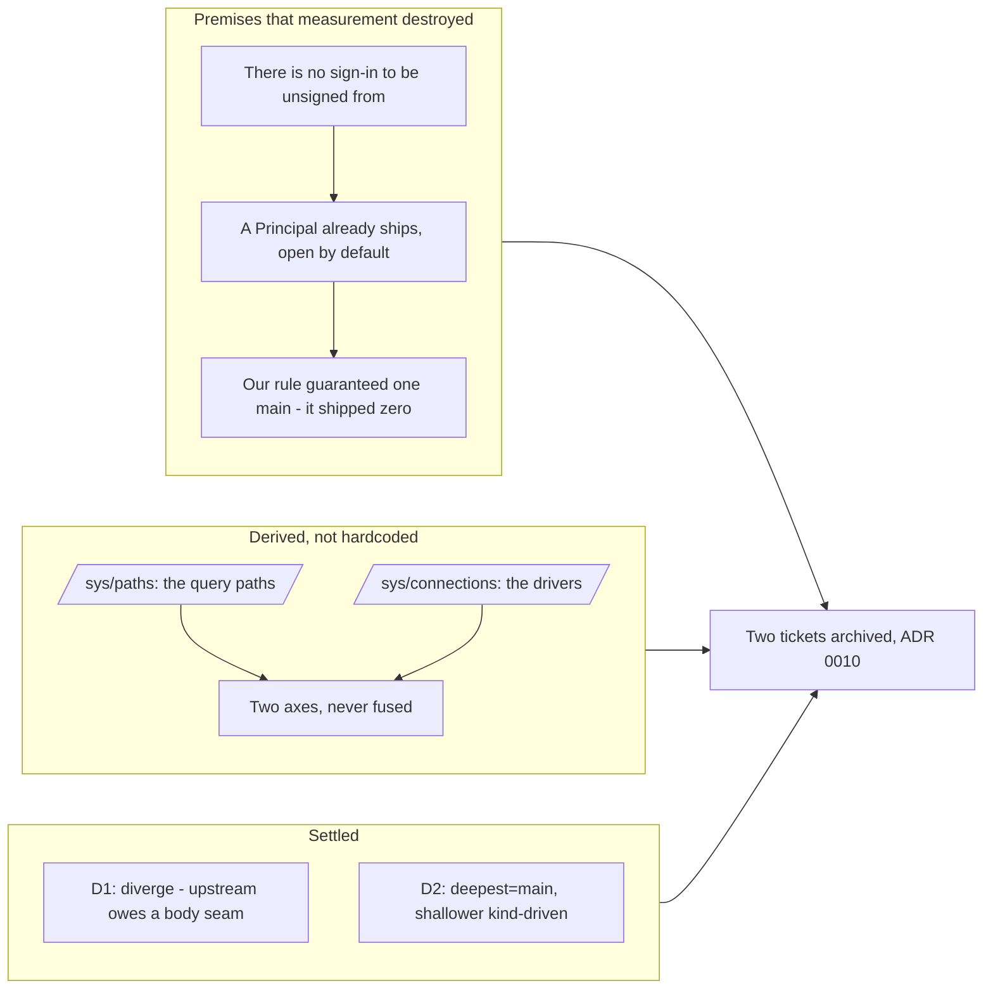

## 1. Overview

Two tickets from a design discussion, both of which arrived with a premise that measurement destroyed.

The first said the root column should derive from **who is signed in** — sign-in only when unsigned, an admin menu and a user menu after. There is no sign-in to be unsigned from: `qfs identity` exposes only `whoami`, sign-up is retired (ADR 0008), and `qfs init` states "no password — your OS login is the authentication". Worse, this viewer already ships a `Principal` — a config-declared bearer token, **open by default** by an argued decision ("demanding a token there would be security theatre") — which the ticket's acceptance would have inverted. The root column now derives from **what qfs declares**: `/sys/paths` for the query-path axis, `/sys/connections` for the driver axis.

The second asked whether to follow the reference implementation and make "follows it" machine-checked. The honest answer to its headline finding is **no** — and the tension it flagged as the reason to hesitate turned out not to exist. What does exist is a real gap in the engine, and a landmark bug of our own that the ticket's premise had exactly backwards.

**Highlights:**

1. Derived the root column from `/sys/paths` and `/sys/connections`, retiring the hardcoded corpus root
2. Proved the two axes cannot be fused: they do not share a driver vocabulary
3. Fixed the root page shipping **zero** `main` landmarks — the most-visited page
4. Settled D1: do not adopt the engine's `multiColumn`; the gap is a per-level body seam upstream
5. Restored the reference's kind-driven rule for shallower columns, with compile-time exhaustiveness
6. Recorded D3–D5 in ADR 0010 as deliberate divergences

## 2. Motivation

Both tickets were written from a source reading, and both readings were wrong in ways only running the code exposes.

The design discussion asked for a first column derived from the principal. That is a good instinct — a root menu that answers "what can I reach" should be a function of who is asking. But qfs cannot answer "who is asking" on the query path at all, and the developer ruled that the label it *does* carry (`Role`) remains **not a grant**. Rendering an admin menu anyway would invent a distinction qfs deliberately declined to make. The remaining question was whether anything honest could be built today — and it could, because qfs already declares both axes the developer named, over an interface this viewer already speaks.

The reference ticket's motivation was drift: the guide says multi-column layout is no longer a consumer's to assemble, and this viewer assembles it. The question was whether that is our defect or the engine's limit.

## 3. Changes

New `domain/model/Declaration.ts` asks each axis its own question. Axis 1 (paths) **navigates** via the existing `qfsStop` and joins the root `MenuLevel`'s entries; axis 2 (drivers) is a **view** with no links and no entries — so the axes stay apart in the Scene, not merely on screen. `Declared`/`Undeclared`/`Unanswerable` render distinguishably.

## 4. Outcome

**The two axes cannot be fused, and the proof is stronger than the argument.** They do not share a driver vocabulary: `/sys/paths` names `gmail`/`gdrive`/`ghdecl`; `/sys/connections` names `google`/`github`. One connection backs several query paths. There is no 1:1 map to fuse along — **fusing is not merely wrong, it is inexpressible.** qfs's own source already embodies the split: `catalog.rs:110` refuses to read operator config because the catalog is a pure function of the binary, while connections are a function of what the operator CONNECTed.

**D1 — do not adopt `multiColumn`. The tension the ticket flagged dissolves; the real blocker is deeper.**

Both halves of the stated tension were false:

- `multiColumn(scene)` takes *only* a scene and supplies `mapMsg` itself as identity (`multiColumn.ts:107-112`). The `mapMsg` requirement belongs to `multiColumnWith`.
- `renderToString: <Msg>(node: Html<Msg>) => SoftStr` is **generic in `Msg`** and drops handlers by contract. SSR renders `Html<SchedulerMsg>` fine. **The `<never>` is a viewer choice, not an SSR constraint.**

The actual blocker: `Scene` is presentation-neutral data **by design**, and `multiColumn` derives every column *body* from it (`rowList`, `detailFields`, `menuNav`). This viewer's bodies are rendered markdown, a links table, a resources section, a GET form — arbitrary HTML no `Level` can express. Calling it today renders `detailFields([])` → **"Not found" where every document belongs**. `extraColumns`/`afterMenu` append columns *beside* levels; neither supplies *a level's body*, and routing everything through them yields N `main`s and erases level kinds. **Upstream owes a per-level body seam.**

**D2 — both rules were wrong, and ours was wrong in the direction the ticket didn't suspect.** The ticket's premise was that our position-driven rule guarantees exactly one `main`. It does not: the corpus column bypassed `shellColumn` and hardcoded `navPane`, so **the root page shipped zero `main` landmarks**. Measured `main=0` before, `main=1` after. The branch implements a third rule: deepest column = `main` (our deliberate divergence, rule 1), shallower columns kind-driven via `match` on the closed union (the reference's own rule, restored with compile-time exhaustiveness, rule 2). Both belong upstream.

**No cross-tree probe was built, deliberately.** Its headline invariant — role per kind — is exactly what D2 settles *against*, so it would go red on a divergence chosen on purpose. It also cannot see D1 or D3 (call-structure facts, invisible to the DOM), and it would take an operational dependency on a retiring reference. The machine check is an in-suite landmark assertion instead, and **it went red first** (`✗ the root page has exactly one main landmark`, 122 passed / 1 failed with the implementation reverted) before going green.

## 5. Historical Analysis

The landmark bug and the sign-in premise are the same mistake at different altitudes: a claim about the code that nobody ran. The ticket asserted our rule guaranteed one `main`; the page shipped zero. The ticket asserted an unsigned state; there is no signed state. Both were written from reading, and reading is what produced them.

ADR 0002's 2026-07-17 amendment admitted `plggmatic` to the runtime dependency set, which is what makes D1 a *choice* rather than a packaging problem — `multiColumn`/`multiColumnWith` are in the already-depended-on published 0.2.0 (`dist/index.d.ts:26`). The branch declines the call on merit, not on availability, and records why in ADR 0010 so the next reader does not re-derive it.

## 6. Concerns

**The `admin-isolation` reasoning has an expiry date.** Axis 2 is satisfied *by construction*: it is `select`-only — every write verb is `false` — over the operator's own registry, where the OS login **is** the separate auth event. **That reasoning expires the moment the axis gains a write verb**, and nothing enforces the expiry.

**The landmark assertion needed the new shape to be worth anything.** The existing test only ever saw the emptiest version of the column it guards; the branch adds one under both-axes-declared. An assertion that only exercises the trivial case is the vacuous-green pattern this codebase keeps paying for.

**One judgment call worth review:** no `whoami` line was added to the axes. Identity is the axis just ruled out, so a "who you are" entry would be the same invention as a "Sign in" one — but that is a judgment, not a measurement.

**Two struck criteria, kept in place rather than deleted.** The falsification is the ticket's most useful content now: *"no path by which the corpus appears in an unsigned root"* contradicts the shipped open-by-default `Principal`; *"`SoleUser::None`/`Many` is a distinct handled state"* names a state that **does not exist in qfs**. The criterion's substance — the unanswerable is its own state, in a closed union, never collapsed into "none" — moved onto the axis answers, where the distinction is real.

## 7. Successful Development Patterns

**A vocabulary mismatch settled a design argument.** The case for keeping the axes separate was made from principle; the evidence that they name different things (`gmail`/`gdrive` vs `google`/`github`, many-to-one) made the alternative *inexpressible*. Measurement beat argument.

**Exhaustiveness was proven, not asserted.** Adding a fourth variant produced `TS2322: not assignable to type 'never'`, then it was restored. A closed union claimed in prose is a comment; one that fails the compiler is a check.

**Verifying against a live surface caught a lie a stale process was telling.** An orphaned `serve --port 4100` (PPID 1, started before this branch's first commit) holds the dev port and serves stale in-memory code — it reported **zero `main` landmarks**, which would have read as this branch regressing the landmark fix. The orphan is a known queued defect (`20260717153000`, a relocated serve outliving its launcher); it was left untouched and verification moved to a free port.
